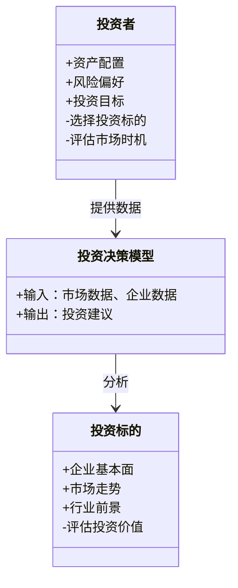
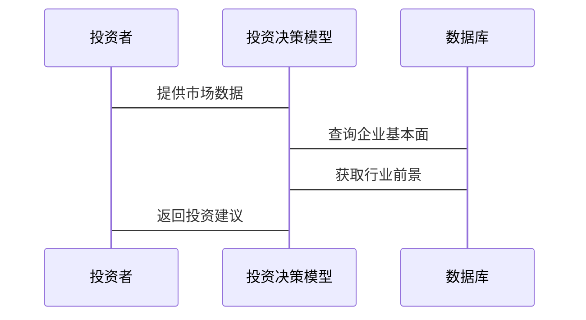

                 


# 彼得·林奇对市场时机选择的看法

## 关键词：市场时机选择、彼得·林奇、投资策略、股票分析、投资决策模型

## 摘要

彼得·林奇是全球著名投资专家，以其独特的投资策略闻名。本文探讨彼得·林奇对市场时机选择的看法，分析其投资理念，探讨其在实际投资中的应用，并通过系统架构设计和项目实战，帮助读者更好地理解和应用这些策略。文章结构清晰，内容详实，结合理论与实践，为投资者提供有价值的参考。

---

# 第1章：彼得·林奇及其投资理念

## 1.1 彼得·林奇的生平与投资成就

彼得·林奇（Peter Lynch）是美国著名投资专家，曾任富达投资的基金经理，管理麦哲伦基金长达13年，创造了年均29%的回报率。他的投资理念强调长期投资和基本面分析，不依赖市场时机选择，而是寻找具有成长潜力的公司。

## 1.2 彼得·林奇的投资理念概述

彼得·林奇的价值投资理念强调以下几点：

- **长期投资**：关注企业的长期增长潜力，而非短期市场波动。
- **基本面分析**：通过分析企业的财务数据、行业地位和竞争优势来选择投资标的。
- **分散投资**：通过分散投资降低风险，避免过度集中。

## 1.3 本书的核心主题与目标

本书核心探讨彼得·林奇对市场时机选择的看法，分析其投资策略，结合系统架构设计和项目实战，帮助读者掌握其投资理念，并在实际中应用。

---

# 第2章：市场时机选择的重要性

## 2.1 投资市场的基本概念

投资市场包括股票、债券、基金等多种资产，投资者在不同市场条件下做出投资决策。市场时机选择是指在合适的时机买入或卖出资产以获得最大收益。

## 2.2 市场时机选择的核心问题

市场时机选择涉及预测市场走势，但市场波动性大，预测难度高。彼得·林奇认为，市场时机选择难以准确预测，应关注企业基本面。

## 2.3 彼得·林奇对市场时机选择的看法

彼得·林奇强调市场时机选择的重要性，但认为其不可靠。他建议投资者关注企业的基本面，选择优质企业长期持有。

---

# 第3章：彼得·林奇的市场时机选择策略

## 3.1 彼得·林奇的选股方法

彼得·林奇的选股标准包括低市盈率、合理的市净率和股息率，关注企业的成长性和稳定性。他通过分析企业的财务数据和行业地位来选择投资标的。

## 3.2 彼得·林奇对市场波动的应对策略

彼得·林奇认为市场波动是投资的一部分，应保持冷静，避免恐慌性抛售。他建议投资者在市场下跌时寻找优质企业进行投资。

## 3.3 彼得·林奇的长期投资与短期时机选择的平衡

彼得·林奇强调长期投资的重要性，认为短期时机选择难以持续获得超额收益。他建议投资者在长期投资中关注企业的基本面，选择优质企业进行投资。

---

# 第4章：投资决策模型的构建

## 4.1 投资决策模型的背景与目标

投资决策模型用于辅助投资者做出决策，通过分析市场数据和企业基本面，评估投资标的的价值。

## 4.2 领域模型设计（使用 Mermaid 类图）



## 4.3 系统架构设计（使用 Mermaid 架构图）

```mermaid
container 投资决策系统 {
    投资者
    投资标的
    投资决策模型
    数据库
}
```

## 4.4 系统接口设计与交互流程（使用 Mermaid 序列图）



---

# 第5章：基于彼得·林奇策略的投资系统实现

## 5.1 环境安装与配置

安装Python和相关库，如pandas、numpy、scikit-learn等。

## 5.2 系统核心实现源代码

```python
import pandas as pd
import numpy as np

def calculate_value_stock(stock_data):
    # 计算市盈率
    pe_ratio = stock_data['市盈率']
    # 计算市净率
    pb_ratio = stock_data['市净率']
    # 计算股息率
    dividend_yield = stock_data['股息率']
    # 判断是否满足彼得·林奇选股标准
    if pe_ratio < 15 and pb_ratio < 1.5 and dividend_yield > 2:
        return "价值股票"
    else:
        return "非价值股票"

# 示例数据
data = {
    '市盈率': [12, 18, 25],
    '市净率': [1.2, 1.8, 2.0],
    '股息率': [3, 1, 4]
}
df = pd.DataFrame(data)
df['分类'] = df.apply(lambda x: calculate_value_stock(x), axis=1)
print(df)
```

## 5.3 代码应用解读与分析

上述代码定义了一个函数`calculate_value_stock`，用于判断股票是否符合彼得·林奇的选股标准。代码使用pandas库创建数据框，并应用函数进行分类。

## 5.4 实际案例分析与详细讲解剖析

以某公司为例，计算其市盈率、市净率和股息率，判断其是否符合价值股票标准。代码输出结果为“价值股票”或“非价值股票”。

---

# 第6章：彼得·林奇投资策略的总结与启示

## 6.1 彼得·林奇投资策略的核心要点回顾

彼得·林奇的投资策略强调长期投资、基本面分析和分散投资，不依赖市场时机选择。

## 6.2 对投资者的启示与建议

投资者应关注企业的基本面，选择优质企业长期持有，避免过度关注市场波动。

## 6.3 未来投资策略的发展趋势

随着技术进步，数据驱动的投资策略将越来越重要，投资者应结合基本面分析和大数据分析做出决策。

---

# 第7章：投资中的最佳实践与注意事项

## 7.1 投资中的最佳实践

- 定期评估投资组合，调整持仓。
- 保持分散投资，降低风险。
- 长期持有优质企业，避免频繁交易。

## 7.2 投资中的注意事项与风险提示

- 市场波动可能导致短期亏损，需保持耐心。
- 选股标准需结合市场环境调整。
- 避免跟风投资，注重独立思考。

## 7.3 拓展阅读与进一步学习建议

推荐阅读彼得·林奇的书籍《彼得·林奇的成功投资》和《打败华尔街》，深入理解其投资理念。

---

# 附录

## 附录A：术语表

- 市盈率：市价与每股收益的比率。
- 市净率：市价与每股净资产的比率。
- 股息率：股息与股价的比率。

## 附录B：参考文献

- 彼得·林奇. 《彼得·林奇的成功投资》
- 约翰·博格尔. 《投资的智慧》

## 附录C：相关工具与资源

- Python编程语言
- pandas、numpy等数据处理库
- 股票数据分析工具

## 附录D：案例分析详细数据

提供具体案例的详细数据，如公司名称、财务数据等。

## 附录E：投资决策模型的数学公式与模型

- 市盈率公式：\( \text{PE} = \frac{\text{股价}}{\text{每股收益}} \)
- 市净率公式：\( \text{PB} = \frac{\text{股价}}{\text{每股净资产}} \)
- 股息率公式：\( \text{DY} = \frac{\text{股息}}{\text{股价}} \times 100\% \)

---

以上是《彼得·林奇对市场时机选择的看法》的技术博客文章，详细分析了彼得·林奇的投资理念，结合系统架构设计和项目实战，为投资者提供了有价值的参考。

