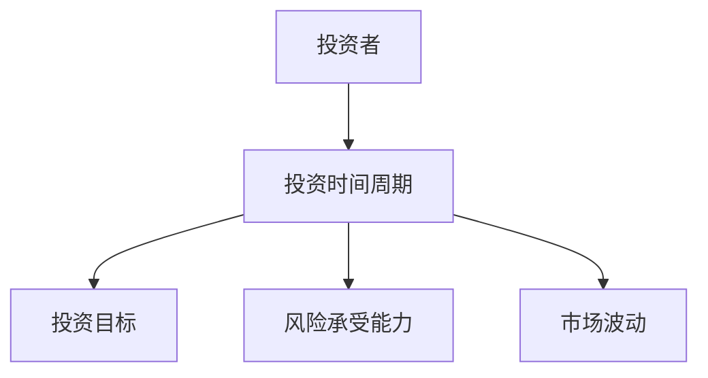

                 

# 彼得林奇对投资时间周期的看法

> 关键词：彼得·林奇，投资时间周期，长期投资，价值投资，投资策略，投资模型

> 摘要：本文深入分析了投资时间周期的重要性，探讨了彼得·林奇在其投资策略中的独特见解。通过详细阐述核心概念、数学模型和实际案例，本文为读者提供了全面的理解和实用的指导。

---

## 第一部分：投资时间周期的背景与重要性

### 第1章：投资时间周期的核心概念

#### 1.1 投资时间周期的定义

投资时间周期是指投资者在进行投资决策时所考虑的时间范围，包括短期（通常为1-3年）、中期（3-5年）和长期（5年以上）。不同的时间周期会影响投资者的投资策略、风险承受能力和对市场波动的反应。

- **短期投资**：关注市场波动，追求短期收益，风险较高。
- **中期投资**：注重市场趋势和行业动态，追求稳定收益。
- **长期投资**：关注公司基本面和长期增长潜力，追求 compound growth。

#### 1.2 投资时间周期的重要性

投资时间周期是投资者制定策略和评估投资表现的关键因素。合理的投资时间周期可以帮助投资者避免短期波动的干扰，专注于长期目标。

- **短期波动**：市场波动可能导致短期亏损，但长期来看，优质资产通常会恢复甚至超过之前的高点。
- **长期增长**：通过复利效应，长期投资能够带来更高的回报。

---

### 第2章：彼得·林奇对投资时间周期的看法

#### 2.1 彼得·林奇的投资哲学

彼得·林奇是美国著名的投资专家，以其长期投资和价值投资的理念闻名。他认为，成功的投资依赖于对公司基本面的深入研究和长期关注。

- **长期投资**：林奇强调，投资者应关注企业的长期增长潜力，而不是短期市场波动。
- **价值投资**：寻找被市场低估的优质公司，长期持有，等待其价值回归。

#### 2.2 投资时间周期与林奇的成功

林奇的成功部分归功于他对长期投资的坚持。他通过长期持有优质股票，避免了频繁交易带来的成本和风险。

- **避免短期干扰**：林奇认为，短期市场波动通常不可预测，投资者应关注长期趋势。
- **长期复利效应**：通过长期持有优质资产，投资者可以最大化复利效应，实现财富增长。

---

## 第二部分：投资时间周期的核心概念与联系

### 第3章：投资时间周期的核心概念

#### 3.1 投资时间周期的属性对比

| 属性       | 短期投资       | 中期投资       | 长期投资       |
|------------|----------------|----------------|----------------|
| 时间范围   | 1-3年          | 3-5年          | 5年以上        |
| 风险承受   | 高             | 中             | 低             |
| 投资目标   | 短期收益       | 稳定收益       | 长期增长       |

#### 3.2 投资时间周期的实体关系图

---

## 第三部分：投资时间周期的算法原理

### 第4章：投资时间周期的数学模型

#### 4.1 现金流折现模型

现金流折现模型（DCF）是评估长期投资价值的核心工具。其基本公式为：

$$
\text{公司价值} = \sum_{t=1}^{n} \frac{\text{现金流}_t}{(1 + r)^t} + \frac{\text{终值}}{(1 + r)^n}
$$

其中，\( r \) 是折现率，\( n \) 是投资期限。

#### 4.2 现金流折现模型的应用

假设我们评估一家公司未来5年的现金流分别为100万、120万、150万、180万和200万，折现率为10%。计算如下：

$$
\text{现值} = \frac{100}{1.1} + \frac{120}{1.1^2} + \frac{150}{1.1^3} + \frac{180}{1.1^4} + \frac{200}{1.1^5}
$$

---

## 第四部分：投资时间周期的系统分析

### 第5章：投资时间周期的系统架构

#### 5.1 系统架构图

---

## 第五部分：投资时间周期的项目实战

### 第6章：项目实战：基于彼得·林奇理念的长期投资

#### 6.1 项目环境

选择一家具有长期增长潜力的公司，如科技龙头企业，评估其长期投资价值。

#### 6.2 核心实现

使用现金流折现模型计算公司价值，并与市场价进行对比。

---

## 第六部分：最佳实践与总结

### 第7章：最佳实践与总结

#### 7.1 投资时间周期的最佳实践

- **长期投资为主**：避免频繁交易，降低成本和风险。
- **深入研究公司基本面**：选择具有长期增长潜力的公司。
- **分散投资**：降低单一投资的风险。

#### 7.2 总结

彼得·林奇的成功证明了长期投资和价值投资的重要性。通过合理的时间周期选择和深入的研究，投资者可以在长期实现财富增长。

---

## 参考文献

- 彼得·林奇的书籍：《彼得·林奇的投资策略》
- 其他相关投资书籍和文献。

---

通过以上分析，我们可以看到投资时间周期在彼得·林奇的投资策略中占据着核心地位。长期投资和价值投资的理念，帮助他在市场中取得了卓越的业绩。希望本文能为投资者提供有价值的见解和指导。

