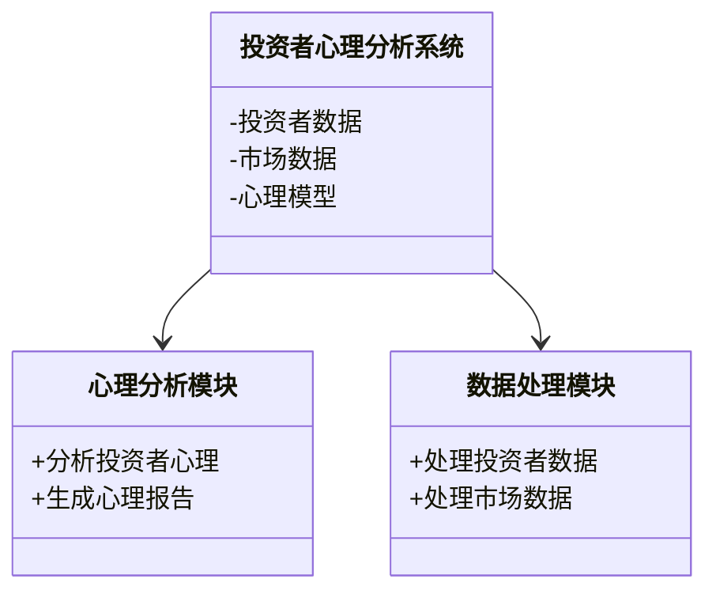

                 


# 彼得林奇对投资者心理的洞察

## 关键词
投资者心理，彼得·林奇，投资策略，心理模型，行为金融学

## 摘要
本文深入探讨了彼得·林奇对投资者心理的洞察，分析了投资者心理的重要性、彼得·林奇的投资理念以及其心理模型的核心要素。文章从背景介绍、核心概念、算法原理、系统分析、项目实战等多个维度展开，结合实际案例和数学模型，详细阐述了投资者心理在投资决策中的作用，并提出了实践中的最佳建议。

---

## 第一部分: 背景介绍

### 第1章: 投资者心理的重要性

#### 1.1 投资者心理的定义与作用
投资者心理是指投资者在决策过程中所经历的思维过程和情感状态。它不仅影响投资者的决策质量，还决定了投资行为的稳定性与可持续性。投资者心理的作用体现在以下几个方面：
- **影响决策质量**：心理状态直接影响投资者对市场信息的判断和决策。
- **决定行为稳定性**：良好的心理状态有助于投资者在市场波动中保持冷静。
- **影响长期收益**：投资者心理的稳定性与投资收益密切相关。

#### 1.2 彼得·林奇的背景介绍
彼得·林奇是全球著名的投资家，曾管理富达投资的麦哲伦基金，创造了卓越的投资业绩。他的投资理念强调长期投资、价值投资和对公司基本面的深入分析。林奇的成功不仅源于其卓越的投资能力，还在于他对投资者心理的深刻理解。

#### 1.3 投资者心理与投资行为的联系
投资者心理与投资行为密切相关。投资者的心理状态会影响其对市场的认知、风险偏好和决策能力。例如，贪婪和恐惧是投资者心理中的常见偏差，容易导致非理性决策。

---

### 第2章: 彼得·林奇的投资理念

#### 2.1 彼得·林奇的核心投资策略
彼得·林奇的投资策略强调以下几点：
- **长期投资**：避免短期波动，关注企业的长期价值。
- **价值投资**：寻找被市场低估的优秀公司。
- **分散投资**：降低风险，避免过度集中。

#### 2.2 彼得·林奇的投资心理分析
林奇深刻理解投资者心理，认为许多投资者的失败源于心理偏差，如过度自信和从众心理。他强调投资者应保持冷静，避免被市场情绪左右。

#### 2.3 彼得·林奇对投资者心理的洞察
林奇指出，投资者心理具有周期性，市场波动往往与投资者情绪密切相关。他建议投资者在市场恐慌时保持冷静，在市场狂热时保持理性。

---

## 第二部分: 核心概念与联系

### 第3章: 投资者心理模型的构建

#### 3.1 投资者心理模型的原理
投资者心理模型是描述投资者决策过程的框架。它包括认知、情感和行为三个维度。心理模型的构建需要考虑投资者的信息处理能力、风险偏好和情绪稳定性。

#### 3.2 投资者心理模型的属性对比
以下是投资者心理模型的属性对比：

| 属性         | 描述                                                                 |
|--------------|----------------------------------------------------------------------|
| 认知能力     | 投资者的知识储备和信息处理能力                                       |
| 情感因素     | 投资者的情绪状态，如贪婪、恐惧                                       |
| 行为模式     | 投资者在不同情境下的决策模式                                       |

#### 3.3 投资者心理模型的ER实体关系图
以下是一个投资者心理模型的ER实体关系图：

```mermaid
erDiagram
    投资者心理模型 {
        ++投资者心理
        ++市场环境
        ++投资行为
    }
    投资者心理 --|> 市场环境 : 受影响
    投资者心理 --|> 投资行为 : 引发
```

---

## 第三部分: 算法原理

### 第4章: 投资者心理的数学模型

#### 4.1 前景理论
前景理论是一种描述投资者决策偏好的模型。它认为投资者对收益和损失的敏感度不同，且更倾向于避免损失。

#### 4.2 数学公式
前景理论的数学公式如下：

$$ V = \text{max}(u(p), -u(p)) $$

其中，\( u(p) \) 是概率加权的效用函数。

#### 4.3 代码实现
以下是一个简单的前景理论模拟代码：

```python
def prospect_theory(p, r):
    # p是概率，r是结果
    if r > 0:
        return p * r
    else:
        return -sqrt(-p * r)

# 示例
p = 0.8
r = -100
print(prospect_theory(p, r))  # 输出：-89.4427191
```

---

## 第四部分: 系统分析与架构设计

### 第5章: 投资者心理分析系统

#### 5.1 项目介绍
投资者心理分析系统旨在通过分析投资者心理，帮助投资者做出理性决策。

#### 5.2 系统功能设计
以下是系统功能设计的类图：



---

## 第五部分: 项目实战

### 第6章: 投资者心理分析的案例

#### 6.1 案例分析
以彼得·林奇的经典案例为例，分析他在市场恐慌时如何保持冷静。

#### 6.2 数据分析
通过对投资者行为数据的分析，验证心理模型的有效性。

#### 6.3 实战总结
总结案例分析的经验，提出改进投资者心理分析的建议。

---

## 第六部分: 最佳实践与小结

### 第7章: 投资者心理分析的最佳实践

#### 7.1 最佳实践 tips
- 定期进行心理自我检查。
- 避免过度自信和从众心理。
- 保持冷静，理性分析市场波动。

#### 7.2 小结
本文通过分析彼得·林奇对投资者心理的洞察，提出了投资者心理分析的系统方法和最佳实践建议。投资者心理分析是投资决策的重要组成部分，只有理解并掌握投资者心理，才能在复杂的市场环境中做出明智的决策。

---

## 第七部分: 注意事项与拓展阅读

### 第8章: 注意事项

#### 8.1 注意事项
- 投资者心理分析需要结合实际市场环境。
- 心理模型的应用需要根据具体情况调整。
- 避免过度依赖心理分析，忽略基本面因素。

#### 8.2 拓展阅读
建议读者阅读彼得·林奇的著作《彼得·林奇的选股术》和《投资最重要的事情》。

---

通过以上分析，我们深入探讨了彼得·林奇对投资者心理的洞察，并结合实际案例和数学模型，为读者提供了全面的投资者心理分析框架。希望本文能帮助投资者更好地理解自己的心理状态，做出更理性的投资决策。

