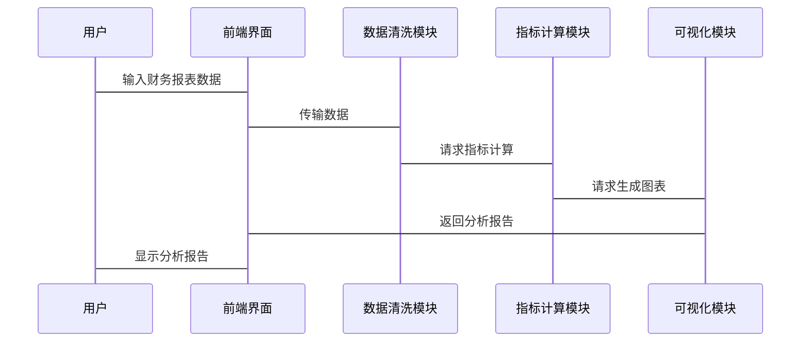

                 


# 彼得·林奇对财务报表分析的重视

---

## 关键词

- 彼得·林奇
- 财务报表分析
- 投资策略
- 财务指标
- 资产负债表
- 利润表
- 现金流量表

---

## 摘要

彼得·林奇是全球著名投资大师，他强调财务报表分析在投资决策中的核心作用。本文深入探讨了财务报表分析的基本概念、核心指标、分析方法，以及如何将这些分析结果应用于实际投资策略中。通过系统地讲解资产负债表、利润表和现金流量表的关键要素，本文揭示了彼得·林奇如何通过细致的财务分析发现投资机会并规避风险。此外，本文还结合实际案例，展示了如何利用财务指标评估企业财务健康状况，并为投资者提供了实用的分析工具和方法。

---

## 第一部分: 引言

### 第1章: 财务报表分析的重要性

#### 1.1 财务报表分析的基本概念

##### 1.1.1 财务报表的定义与作用
财务报表是企业财务状况、经营成果和现金流量的官方记录，主要包括资产负债表、利润表和现金流量表。财务报表分析是通过解读这些数据，评估企业的财务健康状况、盈利能力和发展潜力。

##### 1.1.2 财务报表分析的必要性
在投资决策中，财务报表分析是评估企业价值的关键工具。通过分析财务报表，投资者可以识别企业的财务风险、盈利能力和成长潜力。

##### 1.1.3 财务报表分析的核心目标
- 评估企业的财务健康状况
- 识别企业的盈利能力
- 发现潜在的投资机会
- 评估企业的风险水平

#### 1.2 彼得·林奇的投资理念

##### 1.2.1 彼得·林奇的生平简介
彼得·林奇是全球著名投资大师，曾任富达麦哲伦基金的经理。他以选股能力和长期投资业绩著称，强调通过深入研究和分析企业基本面进行投资。

##### 1.2.2 林奇对财务报表分析的重视
林奇认为，财务报表分析是评估企业价值的核心工具。他强调通过分析资产负债表、利润表和现金流量表，识别企业的财务状况和盈利能力。

##### 1.2.3 林奇的投资策略与财务报表分析的关系
林奇的投资策略以长期持有优质股票为特点。他通过财务报表分析，筛选出具有持续盈利能力和良好财务状况的企业进行投资。

---

### 第2章: 财务报表分析的基本方法

#### 2.1 财务报表的主要类型

##### 2.1.1 资产负债表
资产负债表反映了企业在某一特定时点的资产、负债和所有者权益的状况。它由以下三个部分组成：

- 资产：企业拥有的资源，分为流动资产和非流动资产。
- 负债：企业需要偿还的债务，分为流动负债和非流动负债。
- 所有者权益：企业资产减去负债后的剩余部分。

##### 2.1.2 利润表
利润表反映了企业在一定会计期间内的收入和支出情况，主要包括营业收入、营业成本、税后净利润等指标。

##### 2.1.3 现金流量表
现金流量表记录了企业在一定会计期间内的现金流入和流出情况，分为经营活动、投资活动和筹资活动的现金流。

#### 2.2 财务报表分析的主要指标

##### 2.2.1 盈利能力分析
- 净利润率（Net Profit Margin）：净利润与营业收入的比率，衡量企业的盈利效率。
- 毛利率（Gross Profit Margin）：毛利与营业收入的比率，反映企业产品或服务的盈利能力。

##### 2.2.2 偿债能力分析
- 资产负债率（Debt-to-Asset Ratio）：负债与资产的比率，衡量企业的债务风险。
- 速动比率（Quick Ratio）：速动资产与流动负债的比率，反映企业的短期偿债能力。

##### 2.2.3 运营能力分析
- 存货周转率（Inventory Turnover Ratio）：存货周转次数，衡量企业库存管理效率。
- 资产周转率（Asset Turnover Ratio）：营业收入与平均资产总额的比率，反映企业资产使用效率。

#### 2.3 财务报表分析的步骤

##### 2.3.1 收集数据
- 获取企业的财务报表，包括资产负债表、利润表和现金流量表。
- 确保数据的准确性和完整性。

##### 2.3.2 数据整理与初步分析
- 核对数据的一致性，确保资产负债表的平衡。
- 计算关键财务指标，初步评估企业的财务状况。

##### 2.3.3 深度分析与结论
- 结合行业背景和市场环境，分析企业的财务表现。
- 识别企业的财务风险和潜在投资机会。

---

## 第二部分: 核心概念与联系

### 第3章: 财务报表的核心概念

#### 3.1 资产负债表的核心要素

##### 3.1.1 资产的分类与特征
- 流动资产：易于变现，包括现金、应收账款和存货。
- 非流动资产：不易变现，包括固定资产、无形资产和长期投资。

##### 3.1.2 负债的分类与特征
- 流动负债：短期债务，包括应付账款、短期借款和应交税金。
- 非流动负债：长期债务，包括长期借款和应付债券。

##### 3.1.3 所有者权益的分类与特征
- 所有者权益包括股本、资本公积和留存收益，反映企业净资产的价值。

#### 3.2 利润表的核心要素

##### 3.2.1 收入的分类与特征
- 营业收入：主营业务收入和其他业务收入。
- 其他收入：投资收益和资产出售收益。

##### 3.2.2 成本与费用的分类与特征
- 营业成本：与营业收入直接相关的成本。
- 费用：销售费用、管理费用和研发费用。

##### 3.2.3 利润的计算与分析
- 净利润 = 营业收入 - 营业成本 - 费用 - 税费
- 利润是评估企业盈利能力的核心指标。

#### 3.3 现金流量表的核心要素

##### 3.3.1 经营活动现金流
- 经营活动现金流反映了企业日常经营中的现金流入和流出。

##### 3.3.2 投资活动现金流
- 投资活动现金流反映了企业投资活动中的现金流入和流出。

##### 3.3.3 筹资活动现金流
- 筹资活动现金流反映了企业筹资活动中的现金流入和流出。

#### 3.4 财务报表的核心要素关系

##### 3.4.1 资产负债表与利润表的关系
- 利润表反映了企业一定时期内的收入和支出，而资产负债表反映了企业在某一特定时点的资产、负债和所有者权益。

##### 3.4.2 利润表与现金流量表的关系
- 现金流量表反映了企业现金的流入和流出，与利润表中的净利润密切相关。

---

### 第4章: 财务报表核心概念的对比与联系

#### 4.1 财务报表核心概念的对比分析

| 概念       | 资产负债表         | 利润表           | 现金流量表       |
|------------|--------------------|------------------|------------------|
| 内容       | 资产、负债、所有者权益 | 收入、支出、利润 | 现金流入、流出   |
| 时间维度   | 静态               | 动态             | 动态             |
| 目标       | 描述财务状况       | 描述经营成果     | 描述现金流状况   |

#### 4.2 财务报表核心要素的联系

##### 4.2.1 资产负债表与利润表的联系
- 利润表的净利润是资产负债表中所有者权益变动的重要来源。

##### 4.2.2 利润表与现金流量表的联系
- 现金流量表的经营活动现金流与利润表中的净利润密切相关。

##### 4.2.3 资产负债表与现金流量表的联系
- 现金流量表反映了资产负债表中现金及现金等价物的变化。

---

### 第5章: 财务报表核心概念的 Mermaid 流程图

#### 5.1 资产负债表的结构


#### 5.2 利润表的结构


#### 5.3 现金流量表的结构


---

## 第三部分: 算法原理讲解

### 第6章: 财务报表分析的数学模型与公式

#### 6.1 财务比率分析

##### 6.1.1 净利润率公式
$$ \text{净利润率} = \frac{\text{净利润}}{\text{营业收入}} \times 100\% $$

##### 6.1.2 资产负债率公式
$$ \text{资产负债率} = \frac{\text{负债总额}}{\text{资产总额}} \times 100\% $$

##### 6.1.3 速动比率公式
$$ \text{速动比率} = \frac{\text{速动资产}}{\text{流动负债}} $$

#### 6.2 财务指标计算的 Python 实现

##### 6.2.1 净利润计算

```python
# 示例代码：计算净利润
revenue = 1000000  # 营业收入
cost_of_goods_sold = 500000  # 营业成本
operating Expenses = 200000  # 经营费用
taxes = 50000  # 税费

net_income = revenue - cost_of_goods_sold - operating Expenses - taxes
print("净利润:", net_income)
```

##### 6.2.2 净利润率计算

```python
# 示例代码：计算净利润率
net_income = 100000  # 净利润
revenue = 1000000  # 营业收入

net_profit_margin = net_income / revenue * 100
print("净利润率:", net_profit_margin, "%")
```

##### 6.2.3 资产负债率计算

```python
# 示例代码：计算资产负债率
total_liabilities = 500000  # 负债总额
total_assets = 1000000  # 资产总额

debt_to_assets_ratio = total_liabilities / total_assets * 100
print("资产负债率:", debt_to_assets_ratio, "%")
```

---

## 第四部分: 系统分析与架构设计方案

### 第7章: 财务分析系统的构建

#### 7.1 系统功能设计

##### 7.1.1 领域模型设计


##### 7.1.2 系统架构设计


#### 7.2 系统架构设计

##### 7.2.1 系统架构图


#### 7.3 系统接口设计

##### 7.3.1 数据接口
- 输入接口：接收财务报表数据。
- 输出接口：生成分析报告。

##### 7.3.2 用户接口
- 输入：用户输入财务报表数据。
- 输出：显示分析报告。

#### 7.4 系统交互设计

##### 7.4.1 交互流程



---

## 第五部分: 项目实战

### 第8章: 财务报表分析的实战应用

#### 8.1 环境安装与配置

##### 8.1.1 安装 Python 和必要的库
- 使用 pip 安装 `pandas`, `numpy`, `matplotlib` 等库。

##### 8.1.2 数据获取与预处理
- 使用 pandas 读取财务报表数据。
- 清洗数据，处理缺失值和异常值。

#### 8.2 核心实现

##### 8.2.1 数据清洗代码

```python
import pandas as pd

# 读取财务报表数据
df = pd.read_csv('financial_statement.csv')

# 处理缺失值
df.dropna(inplace=True)

# 处理异常值
df = df[df[' revenue'].astype(float) > 0]
```

##### 8.2.2 指标计算代码

```python
import pandas as pd

# 计算净利润率
df['net_income'] = df['净利润'] / df['营业收入']

# 计算资产负债率
df['debt_to_assets'] = df['负债总额'] / df['资产总额']

# 计算速动比率
df['quick_ratio'] = df['速动资产'] / df['流动负债']
```

##### 8.2.3 可视化代码

```python
import matplotlib.pyplot as plt

# 绘制净利润率柱状图
plt.figure(figsize=(10,6))
plt.bar(df['公司名称'], df['net_income'])
plt.title('净利润率')
plt.xlabel('公司名称')
plt.ylabel('净利润率')
plt.show()
```

#### 8.3 案例分析与解读

##### 8.3.1 案例分析
假设我们分析一家企业的财务报表，计算其净利润率、资产负债率和速动比率，评估其财务健康状况。

##### 8.3.2 分析结果解读
- 净利润率较高，说明企业盈利能力较强。
- 资产负债率较低，说明企业财务风险较小。
- 速动比率较高，说明企业短期偿债能力较强。

---

## 第六部分: 总结与注意事项

### 第9章: 总结与最佳实践

#### 9.1 总结

- 彼得·林奇通过深入分析财务报表，评估企业的财务状况和盈利能力。
- 财务报表分析是投资决策中的核心工具。
- 通过计算财务指标，识别投资机会和风险。

#### 9.2 投资注意事项

- 选择具有持续盈利能力的企业。
- 评估企业的财务健康状况。
- 关注企业的现金流情况。

#### 9.3 学习与提升

- 持续学习财务分析知识。
- 多实践，积累经验。
- 关注行业动态和市场环境。

---

## 结语

通过深入分析彼得·林奇的财务报表分析方法，我们学会了如何通过财务数据评估企业的价值和风险。希望本文能为投资者提供实用的工具和方法，帮助他们在投资决策中做出明智的选择。

---

**作者：[您的姓名]**

**联系方式：[您的联系方式]**

**博客地址：[您的博客地址]**

--- 

**感谢您的阅读！**

