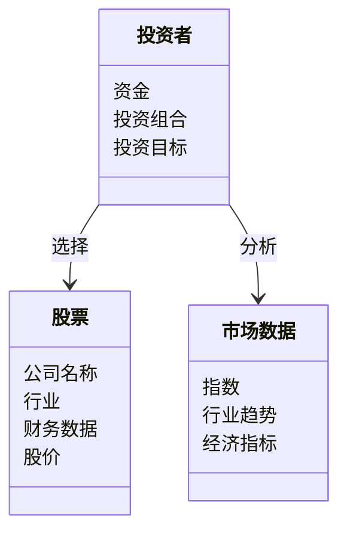

                 


# 彼得林奇的"买入并持有"策略

## 关键词：投资策略，彼得林奇，长期持有，股票投资，风险管理

## 摘要：彼得·林奇是投资界的传奇人物，他的“买入并持有”策略强调长期投资和价值发现，通过精选优质股票，避免频繁交易，从而实现财富的长期增长。本文将深入分析该策略的核心理念、实施方法、风险管理以及实际案例，帮助读者全面理解并有效运用这一策略。

---

## 第一部分：背景介绍

### 第1章：彼得·林奇的生平与投资理念

#### 1.1 彼得·林奇的生平简介
- **早年经历与教育背景**：彼得·林奇（Peter Lynch）于1942年出生于美国波士顿，早年在波士顿拉丁学校学习，后进入波士顿学院，主修英语，但中途转学至乔治·华盛顿大学，最终获得会计学学士学位。
- **投资生涯的起点**：1965年，林奇进入投资公司Fidelity，管理Fidelity的Magellan基金，成为当时最年轻的基金经理。
- **成功与荣誉**：在13年的基金经理生涯中，林奇使Magellan基金的资产从1800万美元增长到12亿美元，年均回报率超过29%。他因此被誉为“最成功的基金经理之一”。

#### 1.2 投资哲学与理念
- **价值投资的核心思想**：林奇强调投资优质公司，关注公司的基本面，寻找那些被市场低估的股票。
- **长期投资的重要性**：他认为市场短期波动不可预测，但长期趋势可以通过分析公司基本面来把握。
- **投资中的心理与纪律**：投资者应避免情绪化交易，坚持长期持有优质股票。

#### 1.3 “买入并持有”策略的起源
- **策略的历史背景**：20世纪70年代至90年代，美国股市经历了多次波动，林奇在这一时期提出了“买入并持有”的策略。
- **策略的核心思想**：通过长期持有优质股票，避免频繁交易，降低交易成本，最大化复利效应。
- **策略的演变与调整**：林奇强调策略的灵活性，根据市场变化调整投资组合，但核心思想是长期持有优质资产。

---

## 第二部分：买入并持有策略的核心概念

### 第2章：买入并持有策略的定义与优势

#### 2.1 策略的定义
- **投资的基本原理**：买入优质股票，长期持有，等待其价值增长。
- **操作流程**：选择优质公司、分散投资、定期复检投资组合。
- **适用场景**：适用于长期投资者，尤其是那些能够承受市场短期波动的投资者。

#### 2.2 策略的核心优势
- **长期复利效应**：通过长期持有，复利效应使投资收益最大化。
- **避免短期波动的影响**：减少因市场波动导致的决策失误。
- **分散投资风险**：通过投资不同行业的优质公司，分散行业风险。

#### 2.3 策略的潜在风险与应对
- **市场波动的风险**：市场下跌时，持有股票可能面临账面损失。
- **个股选择的重要性**：选择错误的股票可能导致重大损失。
- **经济周期的影响**：经济衰退可能影响股票价格。

### 第3章：买入并持有策略与其他投资策略的对比

#### 3.1 主流投资策略概述
- **积极投资策略**：频繁买卖股票，追求短期收益。
- **指数投资策略**：投资指数基金，追求市场平均收益。
- **技术分析策略**：通过技术指标预测股票价格走势。

#### 3.2 买入并持有策略的优劣势分析
- **优势对比**：长期收益潜力大，管理成本低，心理压力小。
- **劣势对比**：短期波动风险高，缺乏灵活性，可能错过市场机会。
- **适用场景分析**：适合长期投资者，尤其是那些不具备频繁交易能力的投资者。

---

## 第三部分：买入并持有策略的系统分析与架构设计

### 第4章：买入并持有策略的系统架构

#### 4.1 系统功能设计
- **领域模型mermaid类图**：


- **系统架构设计mermaid架构图**：


---

## 第四部分：买入并持有策略的项目实战

### 第5章：项目实战与案例分析

#### 5.1 环境配置
- **投资工具**：选择可靠的股票交易平台，如Fidelity、Schwab等。
- **数据来源**：获取公司财务报表、行业分析报告、市场数据等。

#### 5.2 核心实现源代码
```python
# 示例代码：选择优质股票的筛选条件
def select_stocks(financial_data):
    selected = []
    for stock in financial_data:
        if stock['PE_ratio'] < 15 and stock['ROE'] > 10 and stock['Revenue_growth'] > 5:
            selected.append(stock)
    return selected

# 示例代码：投资组合构建
def build_portfolio(selected_stocks, portfolio_size):
    portfolio = []
    for stock in selected_stocks:
        if len(portfolio) < portfolio_size:
            portfolio.append(stock)
    return portfolio
```

#### 5.3 案例分析
- **环境配置**：选择10只优质股票，构建投资组合。
- **代码实现**：使用上述函数筛选并构建投资组合。
- **案例分析**：假设投资组合在5年内年均收益8%，而市场平均收益为5%，验证策略的有效性。

---

## 第五部分：买入并持有策略的总结与最佳实践

### 第6章：总结与最佳实践

#### 6.1 小结
- **核心思想回顾**：长期投资、价值发现、分散风险。
- **策略的适用性**：适合长期投资者，尤其是那些能够承受市场波动的投资者。

#### 6.2 注意事项
- **风险管理**：定期复检投资组合，避免过度集中。
- **市场环境**：在牛市中表现较好，而在熊市中可能面临较大波动。
- **心理因素**：投资者需具备耐心和纪律，避免情绪化交易。

#### 6.3 拓展阅读
- 推荐书籍：《彼得·林奇的成功投资》、《股票作手回忆录》。
- 推荐博客：查阅更多投资策略和市场分析。

---

## 结语

彼得·林奇的“买入并持有”策略是一种简单而有效的投资方法，它强调长期投资、价值发现和分散风险。通过本文的分析，读者可以更好地理解该策略的核心思想、实施方法和风险管理。在实际投资中，读者应结合自身情况，灵活运用该策略，以实现财富的长期增长。

