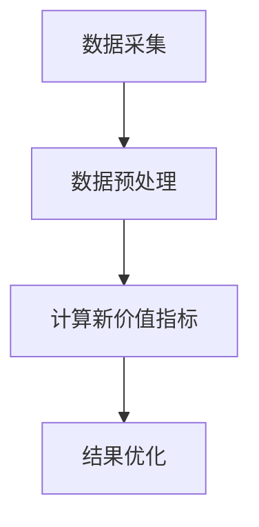
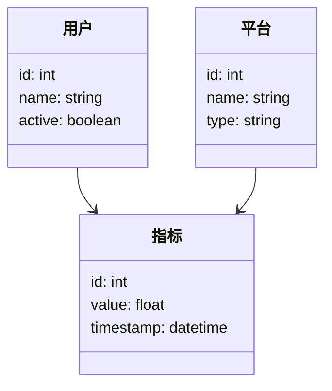
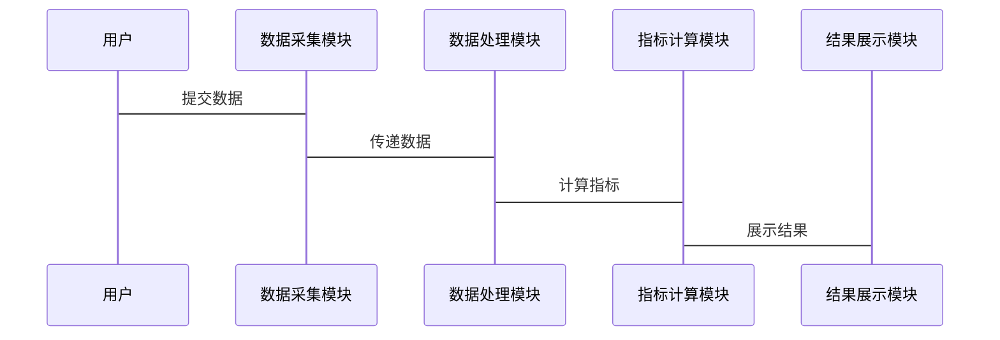

                 


# 彼得林奇的"价值创造"在平台经济中的新衡量指标

## 关键词
- 彼得林奇
- 价值创造
- 平台经济
- 新衡量指标
- 价值评估
- 算法原理
- 系统架构

## 摘要
本文探讨了彼得林奇的“价值创造”理论在平台经济中的应用，并提出了新的衡量指标。通过分析平台经济的特点，构建了多维度的价值衡量模型，并结合算法设计和系统架构，展示了如何在实际项目中应用这些新指标。文章详细介绍了算法原理、系统设计和案例分析，为平台经济中的价值评估提供了新的思路和方法。

---

# 第1章: 彼得林奇的"价值创造"理论概述

## 1.1 彼得林奇投资理论概述

### 1.1.1 彼得林奇投资理论的核心理念
彼得林奇是美国著名投资专家，他强调通过深入研究公司的基本面来寻找投资机会。他的核心理念包括：
1. **长期投资**：避免频繁交易，长期持有优质资产。
2. **价值投资**：寻找那些被市场低估的公司，关注其内在价值。
3. **深入研究**：通过分析公司的财务报表、行业地位和竞争优势来评估其投资价值。

### 1.1.2 价值投资的基本原则
彼得林奇的价值投资原则包括：
1. **安全边际**：买入价格低于内在价值。
2. **分散投资**：避免过度集中投资，降低风险。
3. **长期视角**：关注公司的长期增长潜力。

### 1.1.3 彼得林奇投资方法的演变
彼得林奇的投资方法从早期的单一策略逐渐发展为多种策略的结合，包括：
1. **成长型投资**：投资于具有高成长潜力的公司。
2. **价值型投资**：寻找被市场低估的公司。
3. **混合型投资**：结合成长和价值因素进行投资。

## 1.2 价值创造的核心概念

### 1.2.1 价值创造的定义
价值创造是指通过创新、优化资源配置等方式，为公司或平台创造超过其投入的收益或效用的过程。

### 1.2.2 价值创造的关键要素
价值创造的关键要素包括：
1. **创新**：通过新产品、新技术或新模式创造价值。
2. **效率**：通过优化流程提高资源利用率。
3. **用户满意度**：通过提升用户体验增加平台的吸引力。

### 1.2.3 价值创造与企业成长的关系
价值创造是企业成长的核心动力。通过持续创造价值，企业能够吸引更多的用户和资源，实现可持续发展。

## 1.3 平台经济的基本概念

### 1.3.1 平台经济的定义
平台经济是一种通过互联网技术连接供需双方，提供撮合交易或信息服务的商业模式。典型的平台包括电商平台、社交媒体平台、出行平台等。

### 1.3.2 平台经济的特点
平台经济的特点包括：
1. **双边市场**：连接两个或多个不同的用户群体。
2. **网络效应**：用户数量增加会增强平台的价值。
3. **数据驱动**：通过数据的收集和分析优化平台运营。

### 1.3.3 平台经济与传统经济的区别
平台经济与传统经济的区别主要体现在：
1. **商业模式**：平台经济依赖于双边市场的运作，而传统经济主要依赖于单边市场。
2. **数据驱动**：平台经济高度依赖数据，而传统经济更多依赖于实物资产。
3. **创新速度**：平台经济能够快速迭代和创新，而传统经济的创新周期较长。

## 1.4 平台经济中的价值衡量问题

### 1.4.1 平台经济中的价值衡量挑战
平台经济中的价值衡量面临以下挑战：
1. **多维度性**：平台价值涉及用户数量、用户活跃度、收入等多个维度。
2. **动态变化**：平台价值会随着用户行为和市场需求的变化而变化。
3. **外部性**：平台的网络效应可能导致外部性，难以单独衡量。

### 1.4.2 传统价值衡量方法的局限性
传统价值衡量方法主要关注财务指标，如利润、收入等，但在平台经济中，这些指标无法全面反映平台的价值创造能力。

### 1.4.3 新价值衡量指标的必要性
为了全面反映平台的多维度价值，需要引入新的衡量指标，如用户活跃度、平台扩展性、数据利用率等。

## 1.5 本章小结
本章介绍了彼得林奇的“价值创造”理论及其在平台经济中的应用背景。通过分析平台经济的特点和传统价值衡量方法的局限性，提出了引入新衡量指标的必要性。

---

# 第2章: 平台经济中的价值创造模型

## 2.1 新价值衡量指标的理论基础

### 2.1.1 价值创造的多维度分析
新价值衡量指标需要从多个维度进行分析，包括：
1. **用户维度**：用户数量、活跃度、满意度。
2. **平台维度**：平台的扩展性、数据利用率、技术创新能力。
3. **经济维度**：收入、利润、市场份额。

### 2.1.2 平台经济中的利益相关者分析
平台经济的利益相关者包括：
1. **用户**：平台的直接用户。
2. **供应商**：平台上的产品或服务提供者。
3. **平台运营商**：平台的管理者。
4. **投资者**：平台的投资方。

### 2.1.3 新价值衡量指标的核心要素
新价值衡量指标的核心要素包括：
1. **用户增长速度**：用户数量的增加速度。
2. **用户活跃度**：用户的使用频率。
3. **平台扩展性**：平台的可扩展性和灵活性。
4. **数据利用率**：数据在平台运营中的应用程度。
5. **技术创新能力**：平台的技术研发能力。

## 2.2 新价值衡量指标的构建

### 2.2.1 指标构建的逻辑框架
新价值衡量指标的构建需要考虑以下逻辑框架：
1. **目标**：衡量平台的价值创造能力。
2. **维度**：用户、平台、经济。
3. **指标**：用户增长速度、活跃度、平台扩展性等。

### 2.2.2 指标的数学模型
新价值衡量指标的数学模型可以表示为：
$$
\text{新价值指标} = \alpha \times \text{用户增长速度} + \beta \times \text{用户活跃度} + \gamma \times \text{平台扩展性}
$$
其中，$\alpha$、$\beta$、$\gamma$是各指标的权重系数。

### 2.2.3 指标权重的确定方法
指标权重的确定可以通过层次分析法（AHP）进行，具体步骤如下：
1. **构建层次结构**：将指标分为用户、平台、经济三个层次。
2. **确定各层次指标的权重**：通过专家评分法确定各指标的权重。
3. **计算综合权重**：根据层次结构计算综合权重。

## 2.3 新价值衡量指标的属性特征对比

### 2.3.1 传统价值衡量指标的特征分析
传统价值衡量指标的特征包括：
1. **单一性**：主要关注财务指标。
2. **静态性**：难以反映动态变化。
3. **局限性**：无法全面反映平台价值。

### 2.3.2 新价值衡量指标的特征分析
新价值衡量指标的特征包括：
1. **多维性**：涵盖用户、平台、经济等多个维度。
2. **动态性**：能够反映平台的动态变化。
3. **全面性**：能够全面反映平台的价值创造能力。

### 2.3.3 指标特征对比表格（Mermaid 表格）

```mermaid
| 特征 | 传统指标 | 新指标 |
|------|----------|--------|
| 维度  | 单一     | 多维   |
| 动态性 | 静态     | 动态   |
| 全面性 | 局限     | 全面   |
```

## 2.4 新价值衡量指标的 ER 实体关系图

### 2.4.1 实体关系图的构建
以下是新价值衡量指标的 ER 实体关系图：

```mermaid
entity User {
    id: int
    name: string
    active: boolean
    registration_date: date
}

entity Platform {
    id: int
    name: string
    type: string
    launch_date: date
}

entity Metric {
    id: int
    user_growth: float
    user_activity: float
    platform_expansion: float
    timestamp: datetime
}
```

### 2.4.2 实体关系图的分析
通过 ER 实体关系图可以看出，用户、平台和指标之间的关系。用户和平台通过指标关联起来，指标反映了用户的活跃度和平台的扩展性。

### 2.4.3 实体关系图的优化建议
建议增加用户和平台之间的关系，例如用户对平台的贡献度，进一步完善指标体系。

## 2.5 本章小结
本章构建了新价值衡量指标的理论基础，分析了其属性特征，并通过 ER 实体关系图展示了指标体系的设计。

---

# 第3章: 新价值衡量指标的算法设计

## 3.1 算法设计的目标

### 3.1.1 算法设计的基本目标
算法设计的基本目标是实现新价值衡量指标的计算和优化。

### 3.1.2 算法设计的核心问题
算法设计的核心问题是如何根据用户数据和平台数据计算新价值指标。

### 3.1.3 算法设计的实现路径
算法设计的实现路径包括数据采集、指标计算、结果优化。

## 3.2 算法设计的数学模型

### 3.2.1 数学模型的构建
新价值衡量指标的数学模型可以表示为：
$$
\text{新价值指标} = \sum_{i=1}^{n} w_i \times x_i
$$
其中，$w_i$ 是指标 $x_i$ 的权重。

### 3.2.2 数学模型的公式
例如，用户增长速度的权重为 0.4，用户活跃度的权重为 0.3，平台扩展性的权重为 0.3。

## 3.3 算法实现的步骤

### 3.3.1 数据采集
数据采集包括用户数据和平台数据的采集，例如用户注册量、活跃度、平台扩展性等。

### 3.3.2 数据预处理
数据预处理包括数据清洗、数据标准化等步骤。

### 3.3.3 计算新价值指标
根据数学模型计算新价值指标。

### 3.3.4 结果优化
根据计算结果进行优化，例如调整权重系数。

## 3.4 算法实现的 Python 代码

```python
import pandas as pd

# 数据采集
data = {
    '用户增长速度': [0.3, 0.4, 0.5],
    '用户活跃度': [0.2, 0.3, 0.4],
    '平台扩展性': [0.1, 0.2, 0.3]
}

df = pd.DataFrame(data)

# 权重系数
weights = {
    '用户增长速度': 0.4,
    '用户活跃度': 0.3,
    '平台扩展性': 0.3
}

# 计算新价值指标
df['新价值指标'] = df.apply(lambda x: sum(weights[key] * x[key] for key in weights), axis=1)

print(df)
```

## 3.5 算法实现的步骤图



## 3.6 本章小结
本章详细介绍了新价值衡量指标的算法设计，包括数学模型和实现步骤，并提供了 Python 代码示例。

---

# 第4章: 新价值衡量指标的系统架构设计

## 4.1 问题场景介绍

### 4.1.1 问题背景
平台经济中的价值创造需要通过系统来实现和衡量。

### 4.1.2 问题描述
如何设计一个系统来计算和展示新价值衡量指标。

## 4.2 系统功能设计

### 4.2.1 领域模型设计
以下是领域模型设计：



### 4.2.2 系统架构设计
以下是系统架构设计：

```mermaid
container 平台系统 {
    component 数据采集模块
    component 数据处理模块
    component 指标计算模块
    component 结果展示模块
}
```

## 4.3 系统接口设计

### 4.3.1 数据接口
数据接口包括 REST API 和数据库接口。

### 4.3.2 指标接口
指标接口用于获取新价值衡量指标的值。

## 4.4 系统交互设计

### 4.4.1 交互流程
用户通过界面输入数据，系统计算并展示新价值指标。

### 4.4.2 交互流程图


## 4.5 本章小结
本章设计了新价值衡量指标的系统架构，并详细描述了系统的功能模块和交互流程。

---

# 第5章: 项目实战——新价值衡量指标的实现

## 5.1 环境安装

### 5.1.1 系统环境
需要安装 Python、Jupyter Notebook、Pandas 等工具。

### 5.1.2 数据库安装
可以选择 MySQL 或 MongoDB 作为数据库。

## 5.2 核心代码实现

### 5.2.1 数据采集代码
```python
import requests
import json

response = requests.get('https://api.example.com/users')
data = json.loads(response.text)
```

### 5.2.2 指标计算代码
```python
import pandas as pd

data = {
    '用户增长速度': [0.3, 0.4, 0.5],
    '用户活跃度': [0.2, 0.3, 0.4],
    '平台扩展性': [0.1, 0.2, 0.3]
}

df = pd.DataFrame(data)

weights = {
    '用户增长速度': 0.4,
    '用户活跃度': 0.3,
    '平台扩展性': 0.3
}

df['新价值指标'] = df.apply(lambda x: sum(weights[key] * x[key] for key in weights), axis=1)

print(df)
```

## 5.3 代码应用解读与分析

### 5.3.1 代码功能
上述代码实现了新价值指标的计算，权重系数可以根据实际需求进行调整。

### 5.3.2 代码优化建议
可以增加数据可视化功能，例如使用 Matplotlib 绘制图表。

## 5.4 实际案例分析

### 5.4.1 案例背景
以某电商平台为例，分析其新价值指标。

### 5.4.2 指标计算结果
通过代码计算得出新价值指标，并进行分析。

## 5.5 本章小结
本章通过项目实战展示了新价值衡量指标的实现过程，包括环境安装、代码实现和案例分析。

---

# 第6章: 最佳实践与总结

## 6.1 最佳实践 tips

### 6.1.1 数据采集
确保数据的准确性和完整性。

### 6.1.2 指标计算
合理设置权重系数，定期更新数据。

### 6.1.3 系统设计
确保系统的可扩展性和安全性。

## 6.2 小结
本文通过分析平台经济的特点，提出了新价值衡量指标，并详细介绍了算法设计和系统架构。

## 6.3 注意事项

### 6.3.1 数据隐私
注意保护用户数据的隐私。

### 6.3.2 系统维护
定期维护系统，确保其正常运行。

## 6.4 拓展阅读

### 6.4.1 推荐书籍
1. 《彼得林奇选股艺术》
2. 《平台经济学》

### 6.4.2 推荐文章
1. 新浪网：彼得林奇投资策略
2. 腐败平台经济中的价值创造

---

# 结语

本文通过分析彼得林奇的“价值创造”理论，提出了在平台经济中的新衡量指标，并详细介绍了算法设计和系统架构。希望本文能够为平台经济的价值评估提供新的思路和方法。

