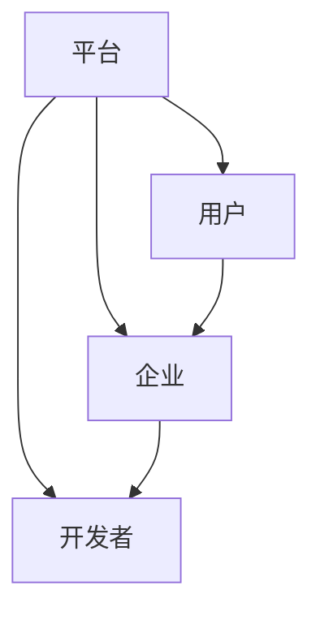
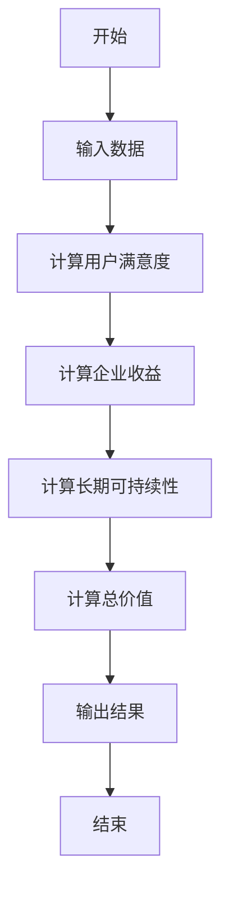
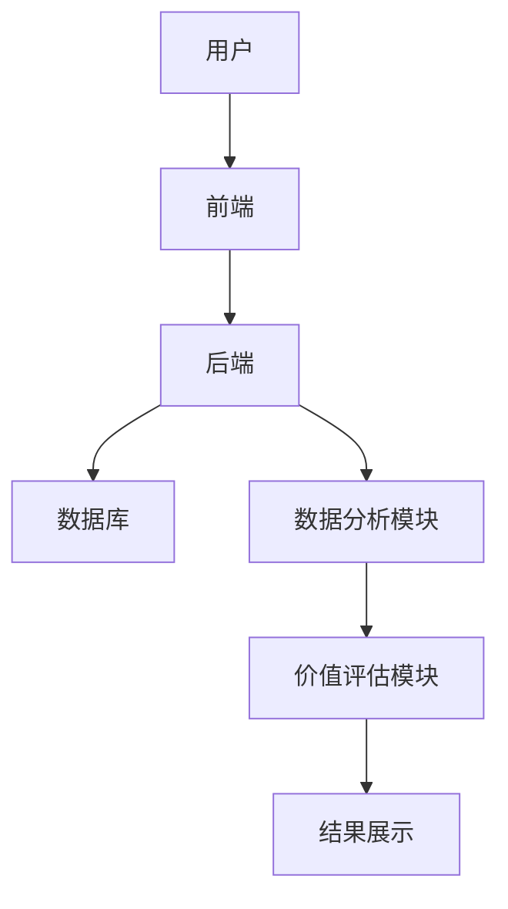

                 


# 彼得林奇的"价值创造"在平台经济中的新衡量标准

## 关键词
- 平台经济
- 价值创造
- 彼得林奇
- 数字平台
- 可衡量价值

## 摘要
本文探讨了彼得林奇的“价值创造”理论在平台经济中的应用与新衡量标准。通过分析平台经济的定义与发展、价值创造的核心概念、算法原理、系统架构设计及实际案例，文章提出了在平台经济中衡量价值创造的新方法，强调用户体验、网络效应和长期可持续性。

---

## 第一部分: 平台经济与价值创造的背景介绍

### 第1章: 平台经济的定义与发展现状

#### 1.1 平台经济的定义与核心特征
平台经济是指通过数字平台连接供需双方，提供撮合服务的商业模式。其核心特征包括双边市场、网络效应和数据驱动。

- **双边市场**：平台连接两个或多个用户群体，如消费者和商家。
- **网络效应**：平台价值随用户数量增加而提升。
- **数据驱动**：通过数据优化匹配和决策。

#### 1.2 平台经济的发展现状
近年来，平台经济迅速崛起，涵盖共享经济、在线服务等多个领域。传统衡量标准如利润、市场份额已无法全面反映平台价值。

### 第2章: 彼得林奇价值创造理论概述

#### 2.1 彼得林奇价值创造理论的核心观点
彼得林奇强调长期可持续的价值创造，认为企业应关注用户需求和长期利益。

- **长期价值**：关注企业长期发展，而非短期收益。
- **用户需求**：通过满足用户需求实现价值。

#### 2.2 传统价值衡量标准的局限性
传统标准如市盈率、ROE等无法全面反映平台经济中的价值创造。

---

## 第二部分: 平台经济中的价值创造核心概念与联系

### 第3章: 平台经济中的价值创造表现

#### 3.1 用户价值创造
- **定义**：通过优化用户体验，提升用户满意度和忠诚度。
- **实现方式**：通过数据分析优化服务，如个性化推荐。

#### 3.2 企业价值创造
- **定义**：企业通过平台获得收益和增长。
- **实现方式**：通过降低交易成本和提高效率。

#### 3.3 利益相关者价值创造
- **定义**：平台通过满足各方需求，实现共赢。
- **实现方式**：通过多方协作，优化资源配置。

### 第4章: 平台生态系统的核心要素

#### 4.1 平台生态系统的定义
平台生态系统包括用户、企业、开发者等多方参与者。

#### 4.2 核心要素对比
| 要素 | 描述 |
|------|------|
| 用户 | 平台的核心资源 |
| 企业 | 提供产品或服务的主体 |
| 开发者 | 提供技术支持 |

#### 4.3 平台生态系统架构（Mermaid图）


---

## 第三部分: 价值创造的算法原理

### 第5章: 价值创造的评估模型

#### 5.1 多因素评估模型
- **公式**：$$V = \alpha \cdot U + \beta \cdot E + \gamma \cdot L$$
  - V：总价值
  - U：用户满意度
  - E：企业收益
  - L：长期可持续性
  - α、β、γ：权重系数

#### 5.2 算法流程图（Mermaid）


#### 5.3 Python代码实现
```python
def calculate_value(U, E, L, alpha=0.5, beta=0.3, gamma=0.2):
    return alpha * U + beta * E + gamma * L

# 示例
U = 0.8  # 用户满意度
E = 0.7  # 企业收益
L = 0.6  # 长期可持续性
V = calculate_value(U, E, L)
print(f"总价值：{V}")
```

---

## 第四部分: 系统架构设计

### 第6章: 系统分析与架构设计方案

#### 6.1 问题场景介绍
- **问题场景**：如何通过平台优化用户和企业的价值创造。
- **项目介绍**：开发一个价值评估系统，帮助平台优化价值创造。

#### 6.2 系统功能设计

##### 6.2.1 用户模块
- 用户注册、登录、评价。
- 数据分析：用户行为分析、满意度计算。

##### 6.2.2 企业模块
- 企业入驻、产品上架、收益统计。
- 数据分析：企业绩效评估。

#### 6.3 系统架构设计（Mermaid图）


---

## 第五部分: 项目实战

### 第7章: 项目实战

#### 7.1 环境安装
- 安装Python和相关库（如Pandas、NumPy）。

#### 7.2 核心代码实现

##### 7.2.1 数据分析代码
```python
import pandas as pd

# 用户数据
data = {'用户ID': [1, 2, 3], '满意度': [0.8, 0.7, 0.9]}
df = pd.DataFrame(data)

# 计算平均满意度
avg_satisfaction = df['满意度'].mean()
print(f"平均满意度：{avg_satisfaction}")
```

##### 7.2.2 价值评估代码
```python
def calculate_total_value(avg_satisfaction, enterprise_profit, long_term_sustainability):
    alpha = 0.5
    beta = 0.3
    gamma = 0.2
    return alpha * avg_satisfaction + beta * enterprise_profit + gamma * long_term_sustainability

# 示例数据
avg_satisfaction = 0.8
enterprise_profit = 0.7
long_term_sustainability = 0.6

total_value = calculate_total_value(avg_satisfaction, enterprise_profit, long_term_sustainability)
print(f"总价值：{total_value}")
```

#### 7.3 实际案例分析
通过滴滴出行平台，分析用户满意度、司机收益和平台可持续性，计算总价值。

#### 7.4 项目小结
总结项目实现过程，强调算法和架构设计的重要性。

---

## 第六部分: 最佳实践与总结

### 第8章: 最佳实践

#### 8.1 小结
平台经济中的价值创造需要从用户、企业、利益相关者等多个角度考虑，新的衡量标准应综合考虑多方因素。

#### 8.2 注意事项
- 数据质量至关重要。
- 持续优化算法和架构。

#### 8.3 拓展阅读
推荐相关书籍和论文，进一步深入学习平台经济和价值创造理论。

---

通过以上分析和设计，本文系统地探讨了彼得林奇的“价值创造”理论在平台经济中的新衡量标准，并通过实际案例和系统设计展示了其应用。希望本文能为平台经济中的价值创造研究提供新的视角和方法。

