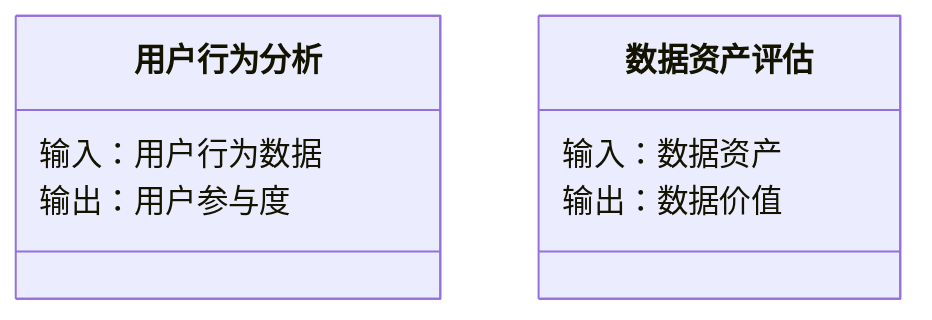
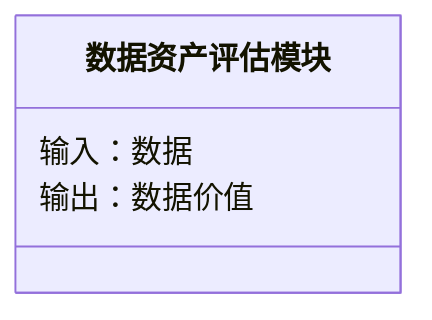
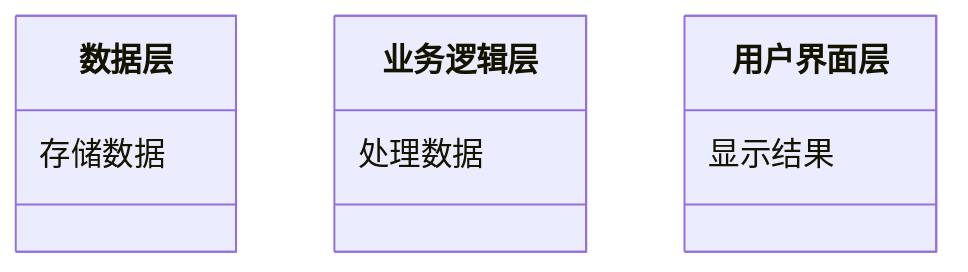

                 


# 彼得林奇的"价值创造"在平台经济中的新衡量维度

---

## 关键词：
- 价值创造
- 平台经济
- 衡量维度
- 彼得林奇
- 数据资产
- 用户行为
- 数学模型

---

## 摘要：
在平台经济快速发展的背景下，传统的价值创造衡量方式已难以适应新的经济模式。本文通过分析彼得·林奇的价值创造理论，提出在平台经济中，用户行为和数据资产是衡量价值创造的关键维度。文章从理论基础、算法原理、数学模型、系统设计和项目实战等多个角度，详细阐述了如何重新定义和衡量平台经济中的价值创造。

---

## 第一部分：背景介绍

### 1.1 问题背景与描述

#### 1.1.1 价值创造的定义与内涵
价值创造是指通过提供产品或服务，为客户或社会创造超出其直接投入的价值。在传统经济中，价值创造主要通过利润、市场份额和经济增长来衡量。

#### 1.1.2 平台经济的定义与特点
平台经济是一种基于互联网技术，通过平台连接供需双方，实现资源优化配置的经济模式。其特点包括双边市场、网络效应和数据驱动。

#### 1.1.3 传统价值衡量维度的局限性
传统价值衡量维度（如利润、市场份额）无法全面反映平台经济中的复杂价值创造过程。例如，用户活跃度和数据资产的价值在传统方法中被忽视。

---

### 1.2 彼得林奇价值创造理论的核心要素

#### 1.2.1 核心概念：价值创造的三要素模型
彼得·林奇的价值创造理论提出，价值创造由用户需求、平台能力和服务创新三部分构成。

#### 1.2.2 平台经济中的特殊性
平台经济中的价值创造不仅依赖于平台本身的能力，还依赖于用户的参与和数据的积累。这使得传统的价值衡量维度需要重新定义。

---

## 第二部分：核心概念与联系

### 2.1 价值创造的核心原理

#### 2.1.1 核心概念原理图


#### 2.1.2 比较表格：传统价值创造与平台经济价值创造的对比
| **维度**       | **传统经济**                 | **平台经济**                  |
|----------------|------------------------------|-------------------------------|
| 用户参与度     | 低或无                      | 高                            |
| 数据资产       | 少或无                      | 丰富                          |
| 网络效应       | 无                          | 强                            |

---

### 2.2 实体关系图

#### 2.2.1 ER实体关系图：用户、数据、平台的关系
```mermaid
erd
    用户
    数据
    平台
    用户 --> 数据: 生成
    用户 --> 平台: 使用
    数据 --> 平台: 存储
```

---

## 第三部分：新衡量维度的算法原理

### 3.1 算法原理

#### 3.1.1 用户行为分析算法
用户行为分析算法用于衡量用户在平台中的活跃度和贡献度。

#### 3.1.2 数据资产价值评估算法
数据资产价值评估算法用于量化数据对平台价值创造的贡献。

---

### 3.2 算法流程图

#### 3.2.1 用户行为分析流程图
```mermaid
flow
    开始
    输入用户行为数据
    分析用户活跃度
    计算用户贡献度
    输出结果
    结束
```

#### 3.2.2 数据资产价值评估流程图
```mermaid
flow
    开始
    输入数据资产
    分析数据质量
    评估数据价值
    输出结果
    结束
```

---

### 3.3 核心代码实现

#### 3.3.1 用户行为分析代码
```python
def user_behavior_analysis(users):
    active_users = sum(1 for u in users if u.active)
    return active_users / len(users)
```

#### 3.3.2 数据资产评估代码
```python
def data_asset_value_assessment(data):
    value = 0
    for d in data:
        value += d.quality * d.usage
    return value
```

---

## 第四部分：数学模型与公式

### 4.1 数学模型

#### 4.1.1 用户参与度模型
用户参与度模型用于衡量用户在平台中的活跃程度。

$$ U = \frac{\text{活跃用户数}}{\text{总用户数}} $$

#### 4.1.2 数据资产价值模型
数据资产价值模型用于量化数据对平台价值创造的贡献。

$$ V = \alpha \times D + \beta \times N $$

其中：
- $\alpha$ 和 $\beta$ 是权重系数
- $D$ 是数据质量
- $N$ 是用户数量

---

## 第五部分：系统分析与架构设计

### 5.1 问题场景介绍

#### 5.1.1 平台经济中的价值衡量问题
平台经济中的价值衡量需要考虑用户行为、数据资产和网络效应。

#### 5.1.2 系统目标与范围
系统目标是开发一个能够衡量平台经济中价值创造的系统。

---

### 5.2 系统功能设计

#### 5.2.1 领域模型：用户行为分析


#### 5.2.2 数据资产评估模块


---

### 5.3 系统架构设计

#### 5.3.1 分层架构图


---

## 第六部分：项目实战

### 6.1 环境安装与配置

#### 6.1.1 开发环境搭建
建议使用Python和相关数据处理库（如Pandas、NumPy）。

#### 6.1.2 数据采集工具安装
使用爬虫工具（如BeautifulSoup）采集用户行为数据。

---

### 6.2 核心代码实现

#### 6.2.1 用户行为分析代码
```python
import pandas as pd

def user_behavior_analysis(users):
    active_users = users[users['active'] == True]
    return len(active_users) / len(users)
```

#### 6.2.2 数据资产评估代码
```python
def data_asset_value_assessment(data):
    value = 0
    for d in data:
        value += d.quality * d.usage
    return value
```

---

## 第七部分：总结与展望

### 7.1 小结
本文通过分析彼得·林奇的价值创造理论，提出了在平台经济中衡量价值创造的新维度，包括用户行为和数据资产。通过算法、数学模型和系统设计，展示了如何在实际中应用这些新维度。

### 7.2 未来展望
未来的研究可以进一步探索如何将人工智能和大数据技术结合，更精准地衡量平台经济中的价值创造。

---

通过以上结构，我们可以全面、系统地理解和衡量平台经济中的价值创造，为企业的决策提供科学依据。

