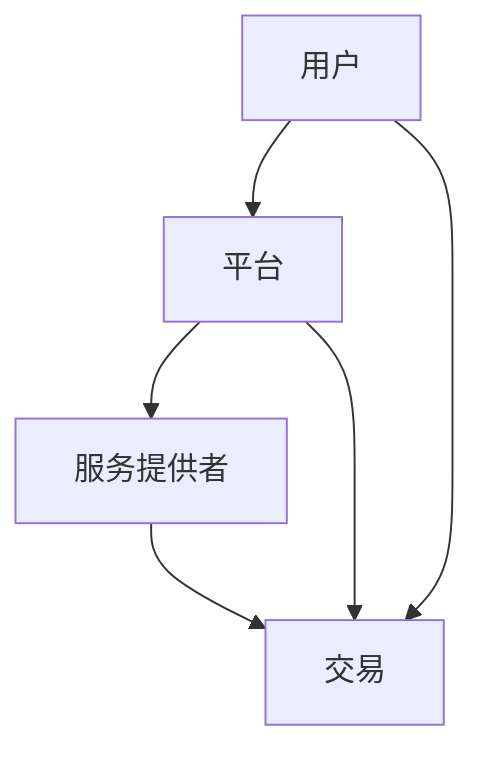
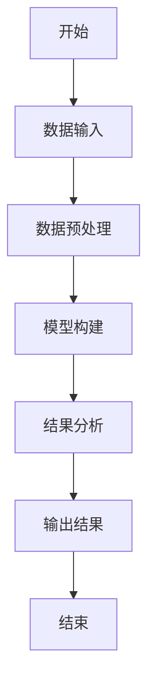
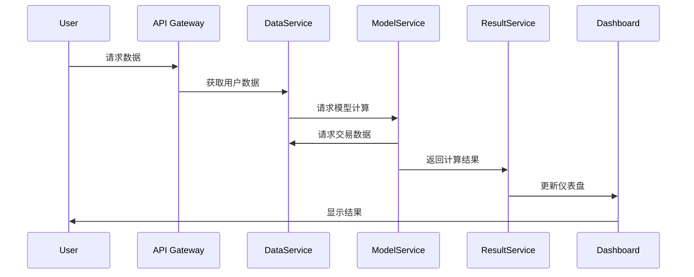

                 


# 彼得林奇的"价值创造"在平台经济中的衡量

## 关键词：平台经济，价值创造，彼得林奇，算法原理，系统架构

## 摘要：本文探讨了彼得林奇的价值创造理论在平台经济中的应用，通过系统分析和算法设计，提出了衡量平台经济中价值创造的方法。文章从背景介绍、核心概念、算法原理、系统架构、项目实战和最佳实践等多方面展开，结合数学模型和实际案例，详细分析了价值创造在平台经济中的实现路径和衡量方法。

---

## 第一部分：背景介绍

### 第1章：价值创造与平台经济概述

#### 1.1 价值创造的定义与特征
- **价值创造**是指通过某种方式为用户、企业或社会创造新的价值，使其在经济、社会或个人层面上获得收益。
- 价值创造的特征包括可持续性、创新性、可衡量性和互动性。

#### 1.2 平台经济的定义与特征
- **平台经济**是以互联网为基础，通过平台连接供需双方，提供撮合、交易、支付等服务的经济模式。
- 平台经济的特征包括双边市场、网络效应、数据驱动和生态化。

#### 1.3 彼得林奇的价值创造理论
- 彼得林奇认为，价值创造是企业长期发展的核心，企业应通过创新和优化运营为股东和社会创造价值。
- 在平台经济中，价值创造体现在用户增长、交易规模扩大和生态系统的完善。

#### 1.4 本书研究的问题与目标
- 研究问题：如何将彼得林奇的价值创造理论应用到平台经济中，并建立衡量价值创造的方法。
- 研究目标：提出一套适用于平台经济的价值创造衡量模型，为企业和投资者提供参考。

---

## 第二部分：核心概念与联系

### 第2章：平台经济中的价值衡量方法

#### 2.1 价值衡量的核心概念
- **价值衡量**是通过量化的方法评估价值创造的实现程度。
- 关键维度包括用户满意度、平台交易额、生态完善度和创新性。

#### 2.2 平台经济中的价值衡量模型
- 模型结构：数据输入 → 数据处理 → 模型构建 → 结果输出。
- 模型输入：用户行为数据、交易数据、平台运营数据。
- 模型输出：价值创造指数、价值增长潜力、价值实现程度。

#### 2.3 价值衡量的实现步骤
- 数据收集与处理：清洗、归一化、特征提取。
- 模型构建：基于机器学习的回归模型或聚类模型。
- 结果分析：通过可视化和对比分析，评估价值创造的效果。

### 第3章：价值创造与平台经济的关系

#### 3.1 核心概念原理
- 价值创造与平台经济是相互促进的关系，平台经济为价值创造提供基础，价值创造推动平台经济的发展。
- 价值创造的核心是用户的参与度和平台的生态完善度。

#### 3.2 核心概念属性特征对比
| 概念       | 属性       | 特征描述                                                                 |
|------------|------------|--------------------------------------------------------------------------|
| 价值创造   | 可持续性    | 长期性、稳定性                                                           |
|            | 创新性     | 创新性、独特性                                                           |
| 平台经济   | 双边市场    | 连接供需双方，形成网络效应                                             |
|            | 数据驱动   | 依赖数据进行决策和优化                                                   |

#### 3.3 实体关系图


---

## 第三部分：算法原理

### 第4章：价值衡量的算法原理

#### 4.1 算法原理概述
- 算法目标：通过数据挖掘和机器学习技术，量化平台经济中的价值创造。
- 算法输入：用户行为数据、交易数据、平台运营数据。
- 算法输出：价值创造指数、用户满意度评分、平台成长潜力评分。

#### 4.2 算法流程图


#### 4.3 算法实现代码
```python
def value_measurement(data):
    # 数据预处理
    processed_data = data.dropna().astype(float)
    # 模型构建
    from sklearn.linear_model import LinearRegression
    model = LinearRegression()
    model.fit(processed_data[['user_engagement', 'transaction_frequency']], processed_data['value_score'])
    # 结果分析
    predicted_value = model.predict(new_data)
    return predicted_value
```

#### 4.4 数学模型与公式
- 线性回归模型：
$$ \text{value\_score} = \beta_0 + \beta_1 \times \text{user\_engagement} + \beta_2 \times \text{transaction\_frequency} + \epsilon $$
- 用户参与度与价值创造的关系：
$$ \text{user\_engagement} = \alpha \times \text{user\_login\_frequency} + \beta \times \text{user\_interaction} $$

---

## 第四部分：系统分析与架构设计

### 第5章：系统架构设计

#### 5.1 问题场景介绍
- 系统目标：构建一个能够衡量平台经济中价值创造的系统。
- 问题分析：如何整合多源数据，建立有效的衡量模型。

#### 5.2 系统功能设计
- 用户行为分析模块：分析用户的登录频率、互动次数。
- 交易数据分析模块：分析交易额、交易频率、用户满意度。
- 价值衡量模块：计算价值创造指数，生成报告。

#### 5.3 系统架构图
```mermaid
graph TD
    User[用户] --> API Gateway[API网关]
    API Gateway --> DataService[数据服务]
    DataService --> ModelService[模型服务]
    ModelService --> ResultService[结果服务]
    ResultService --> Dashboard[仪表盘]
```

#### 5.4 系统交互图


---

## 第五部分：项目实战

### 第6章：项目实战与案例分析

#### 6.1 项目环境安装
- 安装Python、Jupyter Notebook、scikit-learn、Mermaid工具。

#### 6.2 核心代码实现
```python
import pandas as pd
from sklearn.metrics import mean_squared_error

# 加载数据
data = pd.read_csv('platform_data.csv')

# 数据预处理
data = data.dropna()
X = data[['user_engagement', 'transaction_frequency']]
y = data['value_score']

# 模型训练
from sklearn.linear_model import LinearRegression
model = LinearRegression()
model.fit(X, y)

# 模型评估
predicted = model.predict(X)
mse = mean_squared_error(y, predicted)
print(f"均方误差：{mse}")
```

#### 6.3 代码功能解读
- 数据加载：从CSV文件中加载平台经济数据。
- 数据预处理：删除缺失值，提取特征变量。
- 模型训练：使用线性回归模型训练价值衡量模型。
- 模型评估：计算均方误差，评估模型的准确性。

#### 6.4 实际案例分析
- 案例背景：假设一个电商平台，用户增长但交易额下降。
- 案例分析：通过模型计算价值创造指数，发现用户参与度下降，平台需要优化用户体验。
- 解决方案：通过优化推荐算法和用户激励措施，提升用户参与度和交易额。

#### 6.5 项目小结
- 项目目标：构建价值创造衡量模型。
- 项目成果：实现了一个能够量化平台经济中价值创造的系统。
- 项目意义：为企业提供了一个衡量价值创造的新方法。

---

## 第六部分：最佳实践

### 第7章：最佳实践与小结

#### 7.1 最佳实践
- 数据质量是关键：确保数据的完整性和准确性。
- 模型选择要合理：根据业务需求选择合适的算法。
- 结果可视化：通过图表和报告直观展示价值创造的成果。

#### 7.2 小结
- 本文通过理论分析、算法设计和项目实战，提出了衡量平台经济中价值创造的方法。
- 价值创造是平台经济的核心，通过系统的建设和优化，可以实现可持续的价值增长。

#### 7.3 注意事项
- 数据隐私保护：在处理用户数据时，需遵守相关法律法规。
- 模型优化：根据实际需求，不断优化模型，提升准确性和实用性。

#### 7.4 拓展阅读
- 推荐书籍：《平台经济：商业模式与创新》。
- 推荐博客：Tech Insights（技术见解）。

---

# 结语

通过本文的系统分析和实战案例，我们深入探讨了彼得林奇的价值创造理论在平台经济中的应用，并提出了衡量价值创造的方法。希望本文能够为平台经济的实践者和研究者提供有价值的参考和启发。

