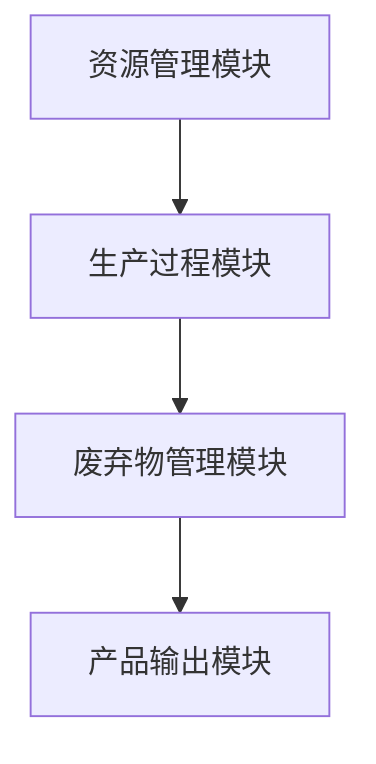
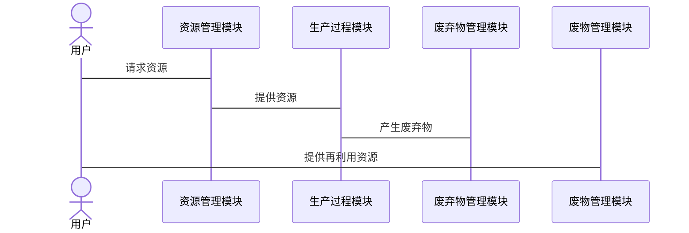

                 


# 彼得林奇的"价值创造"在循环经济中的新定义

## 关键词：彼得·林奇，价值创造，循环经济，系统架构，数学模型，项目实战

## 摘要：本文探讨了彼得·林奇的“价值创造”理论在循环经济中的新定义。通过分析循环经济的基本概念、价值创造的维度、数学模型的构建以及系统架构的设计，本文提出了一个创新的系统化框架，以实现循环经济中的价值最大化。文章还通过实际案例分析，验证了该框架的有效性，并提供了最佳实践建议。

---

# 第1章：彼得·林奇的“价值创造”概述

## 1.1 彼得·林奇与价值创造理论

### 1.1.1 彼得·林奇的生平简介

彼得·林奇（Peter Lynch）是美国著名投资家，曾任富达麦哲伦基金的经理。他以卓越的投资业绩和对价值投资的深刻理解而闻名。林奇的价值创造理论强调，企业通过提供独特的产品或服务，以高于成本的价格出售，从而为股东创造价值。

### 1.1.2 价值创造的核心理念

彼得·林奇的价值创造理论主要包括以下几点：
1. **内在价值**：企业的真实价值在于其未来现金流的现值。
2. **市场先生**：市场波动是机会，而非挑战。
3. **竞争优势**：企业应具备独特的竞争优势，以持续创造价值。

### 1.1.3 价值创造在投资中的应用

林奇认为，投资的核心是找到那些能够持续创造价值的企业。他强调深入研究企业的基本面，包括财务状况、管理团队和行业地位。

---

## 1.2 循环经济的基本概念

### 1.2.1 循环经济的定义与特点

循环经济是一种以资源高效利用和循环利用为核心的经济模式。其特点包括：
1. **资源节约**：减少资源消耗。
2. **循环利用**：废弃物转化为资源。
3. **零排放**：减少环境污染。

### 1.2.2 循环经济的起源与发展

循环经济的概念起源于20世纪60年代的环保运动。随着全球资源短缺和环境问题的加剧，循环经济逐渐成为全球关注的焦点。

### 1.2.3 循环经济与可持续发展的关系

循环经济是实现可持续发展的重要途径。通过减少资源消耗和环境污染，循环经济为社会、经济和环境的协调发展提供了可能。

---

## 1.3 价值创造在循环经济中的结合

### 1.3.1 价值创造在循环经济中的意义

在循环经济中，价值创造不仅体现在经济利益上，还包括环境和社会效益。企业通过循环利用资源，不仅能降低成本，还能减少对环境的负担。

### 1.3.2 循环经济中的价值创造模式

循环经济中的价值创造模式包括：
1. **产品服务化**：通过提供服务而非出售产品，延长产品生命周期。
2. **共享经济**：通过共享资源，提高资源利用率。
3. **资源再生**：将废弃物转化为新产品，创造新的价值。

### 1.3.3 价值创造与循环经济的协同效应

通过协同效应，循环经济中的价值创造可以实现经济、社会和环境效益的统一。企业通过循环利用资源，不仅能创造经济价值，还能提升社会形象，减少环境压力。

---

# 第2章：价值创造在循环经济中的新定义

## 2.1 循环经济中的价值创造维度

### 2.1.1 经济价值的重构

循环经济中的经济价值体现在资源的高效利用和循环利用上。企业通过减少资源消耗和废弃物排放，降低成本，提升竞争力。

### 2.1.2 社会价值的提升

循环经济通过减少资源浪费和环境污染，提升了社会的整体福祉。企业通过提供绿色产品和服务，满足消费者对可持续发展的需求。

### 2.1.3 环境价值的实现

循环经济通过减少资源消耗和环境污染，保护了生态环境。企业通过绿色生产，实现环境效益的最大化。

---

## 2.2 循环经济中的价值评估方法

### 2.2.1 生命周期评估（LCA）方法

生命周期评估是一种全面评估产品或服务在整个生命周期中的环境影响的方法。通过LCA，企业可以识别资源浪费和环境污染的关键环节，并采取措施进行优化。

### 2.2.2 成本效益分析

成本效益分析是一种评估循环经济项目经济效益的方法。通过比较项目的成本和收益，企业可以判断项目的可行性和盈利能力。

### 2.2.3 资源效率评价

资源效率评价是通过量化资源的利用效率，评估循环经济项目的效果。通过资源效率评价，企业可以识别资源浪费的环节，并采取措施进行优化。

---

## 2.3 价值创造的系统化框架

### 2.3.1 循环经济系统的基本构成

循环经济系统由以下几个部分构成：
1. **资源输入**：包括原材料、能源等。
2. **生产过程**：包括产品制造和服务提供。
3. **废弃物管理**：包括废弃物的收集、处理和再利用。
4. **产品输出**：包括产品和服务的输出。

### 2.3.2 价值创造的系统模型

价值创造的系统模型包括以下步骤：
1. **资源输入**：企业获取所需的资源。
2. **生产过程**：通过生产过程，将资源转化为产品或服务。
3. **废弃物管理**：处理生产过程中产生的废弃物，并将其转化为新的资源。
4. **产品输出**：将产品或服务提供给消费者。

### 2.3.3 系统优化与价值提升

通过系统优化，企业可以实现资源的高效利用和循环利用，从而提升价值创造能力。系统优化包括生产过程的优化、资源管理的优化等。

---

# 第3章：价值创造的数学模型与分析

## 3.1 循环经济中的价值评估模型

### 3.1.1 模型的构建与假设

价值评估模型的构建基于以下假设：
1. 企业的生产过程是线性的。
2. 资源的循环利用是可能的。
3. 企业的目标是最大化价值创造。

### 3.1.2 模型的输入变量与输出变量

模型的输入变量包括：
- 资源消耗量
- 产品产量
- 废弃物产生量

模型的输出变量包括：
- 经济价值
- 社会价值
- 环境价值

### 3.1.3 模型的数学表达式

价值创造的数学模型可以表示为：

$$
V = E + S + E
$$

其中，\( V \) 表示总价值，\( E \) 表示经济价值，\( S \) 表示社会价值，\( E \) 表示环境价值。

---

## 3.2 循环经济中的成本-收益分析

### 3.2.1 成本收益分析的基本公式

成本收益分析的基本公式为：

$$
\text{净收益} = \text{收益} - \text{成本}
$$

### 3.2.2 收益与成本的动态平衡

在循环经济中，企业的收益和成本是动态平衡的。企业通过减少成本和增加收益，实现净收益的最大化。

### 3.2.3 数学模型的实际应用

以一个简单的循环经济项目为例，假设企业的成本为 \( C \)，收益为 \( R \)，则净收益为：

$$
\text{净收益} = R - C
$$

---

## 3.3 价值创造的优化算法

### 3.3.1 线性规划模型

线性规划模型可以用于优化企业的资源分配。模型的目标是最大化价值创造，约束条件包括资源限制和生产过程。

### 3.3.2 非线性规划模型

非线性规划模型适用于复杂的问题，如资源的非线性分配和多目标优化。

### 3.3.3 算法的实现与优化

通过优化算法，企业可以实现资源的高效利用和循环利用，从而提升价值创造能力。

---

# 第4章：循环经济中的系统架构设计

## 4.1 循环经济系统的总体架构

### 4.1.1 系统的组成模块

循环经济系统由以下几个模块组成：
1. **资源管理模块**：负责资源的获取和管理。
2. **生产过程模块**：负责产品的生产和服务的提供。
3. **废弃物管理模块**：负责废弃物的收集、处理和再利用。

### 4.1.2 模块之间的关系

模块之间的关系如下：



### 4.1.3 系统的输入输出设计

系统的输入包括资源和能源，输出包括产品和服务。

---

## 4.2 系统功能设计

### 4.2.1 资源管理模块

资源管理模块负责资源的获取和管理。功能包括：
1. 资源的采购和存储。
2. 资源的分配和使用。

### 4.2.2 过程优化模块

过程优化模块负责生产过程的优化。功能包括：
1. 生产过程的监控。
2. 生产过程的优化。

### 4.2.3 价值评估模块

价值评估模块负责价值的评估。功能包括：
1. 价值的计算。
2. 价值的分析和优化。

---

## 4.3 系统接口与交互设计

### 4.3.1 系统接口的设计原则

系统接口设计应遵循以下原则：
1. 简洁性。
2. 可扩展性。
3. 易用性。

### 4.3.2 系统交互的流程图

系统交互的流程图如下：



---

# 第5章：循环经济中的项目实战

## 5.1 项目背景与目标

### 5.1.1 项目背景介绍

以一家制造企业为例，该企业希望通过循环经济模式，降低资源消耗和环境污染，提升企业的竞争力。

### 5.1.2 项目目标设定

项目的目标包括：
1. 减少资源消耗。
2. 提高资源利用率。
3. 减少废弃物排放。

### 5.1.3 项目范围界定

项目范围包括企业的生产过程和废弃物管理。

---

## 5.2 项目核心实现

### 5.2.1 环境安装与配置

项目需要安装以下软件：
1. 生产过程监控系统。
2. 废弃物管理模块。

### 5.2.2 核心代码实现

以下是核心代码的实现：

```python
def resource_management(resource, cost):
    return resource - cost

def production_process(resource):
    return resource * 2

def waste_management(waste):
    return waste * 0.5

# 主程序
resource = 100
cost = 50
new_resource = resource_management(resource, cost)
production = production_process(new_resource)
recycled_resource = waste_management(production)

print("资源消耗量:", cost)
print("新产品产量:", production)
print("再利用资源量:", recycled_resource)
```

### 5.2.3 代码的功能解读

上述代码实现了资源管理、生产过程和废弃物管理的功能。通过资源管理模块，企业可以减少资源消耗；通过生产过程模块，企业可以提高资源利用率；通过废弃物管理模块，企业可以减少废弃物排放。

---

## 5.3 项目案例分析

### 5.3.1 案例背景与选择

以某制造企业为例，该企业通过循环经济模式，降低资源消耗和环境污染，提升企业的竞争力。

### 5.3.2 案例的具体实施

企业通过以下步骤实施循环经济模式：
1. 采购资源。
2. 生产产品。
3. 处理废弃物。

### 5.3.3 案例的成效分析

通过实施循环经济模式，企业实现了资源的高效利用和循环利用，降低了成本，提升了竞争力。

---

## 5.4 项目小结

### 5.4.1 项目成果总结

项目成果包括：
1. 资源消耗减少。
2. 废弃物排放减少。
3. 企业竞争力提升。

### 5.4.2 项目经验与教训

项目经验包括：
1. 资源管理是关键。
2. 生产过程优化是核心。
3. 废弃物管理是重要环节。

### 5.4.3 项目未来展望

未来，企业将继续优化资源管理和生产过程，进一步提升循环经济的效果。

---

# 第6章：最佳实践与注意事项

## 6.1 循环经济中的最佳实践

### 6.1.1 价值创造的关键要素

价值创造的关键要素包括：
1. 资源管理。
2. 生产过程优化。
3. 废弃物管理。

### 6.1.2 系统优化的注意事项

系统优化需要注意以下几点：
1. 资源分配的合理性。
2. 生产过程的连续性。
3. 废弃物管理的有效性。

### 6.1.3 项目实施的注意事项

项目实施需要注意以下几点：
1. 资源的充分性。
2. 生产过程的可行性。
3. 废弃物管理的可持续性。

---

## 6.2 小结

通过本文的探讨，我们可以看到，彼得·林奇的“价值创造”理论在循环经济中的新定义为企业提供了新的思路。通过系统的优化和资源的高效利用，企业可以实现经济、社会和环境效益的统一。

---

## 6.3 注意事项

在实施循环经济模式时，企业需要注意以下几点：
1. 资源管理的复杂性。
2. 生产过程的不确定性。
3. 废弃物管理的挑战性。

---

## 6.4 拓展阅读

1. 彼得·林奇的《彼得·林奇的成功投资法则》。
2. 循环经济相关文献。
3. 数学模型与优化算法的相关书籍。

---

# 总结

通过本文的探讨，我们可以看到，彼得·林奇的“价值创造”理论在循环经济中的新定义为企业提供了新的思路。通过系统的优化和资源的高效利用，企业可以实现经济、社会和环境效益的统一。未来，随着技术的进步和理念的推广，循环经济将成为实现可持续发展的重要途径。

