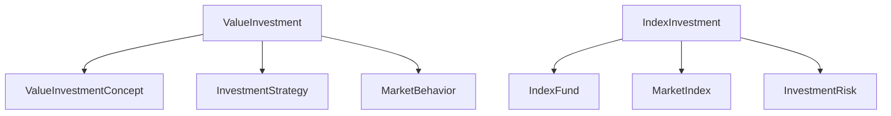
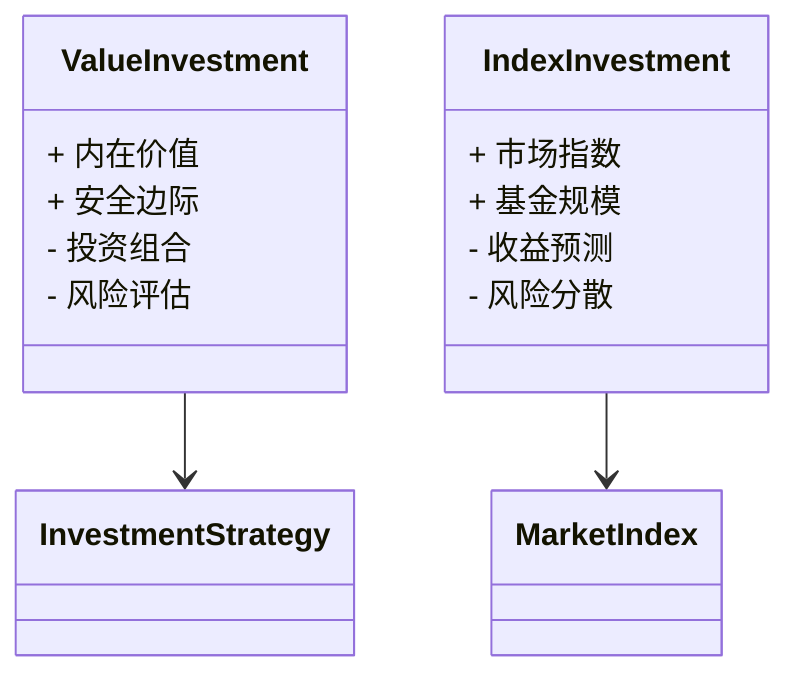
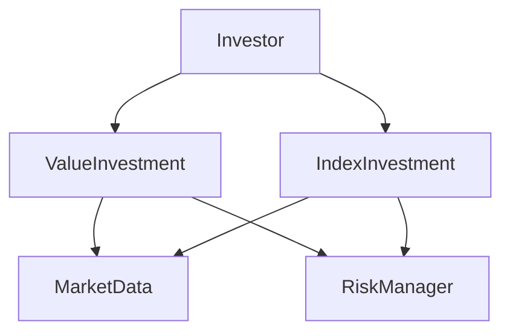

                 


# 彼得林奇的"价值投资"vs"指数投资"

## 关键词：彼得林奇，价值投资，指数投资，长期收益，风险管理，投资策略

## 摘要：本文深入分析了彼得·林奇的价值投资与指数投资的优缺点、适用场景及长期表现。通过对比分析，探讨了两种投资策略在市场中的定位及其对投资者的启示。

---

## 第一部分：背景介绍

### 第1章：价值投资与指数投资概述

#### 1.1 价值投资的定义与核心理念

##### 1.1.1 价值投资的起源与发展

价值投资是一种以基本面分析为基础的投资策略，起源于20世纪初。彼得·林奇作为该领域的代表人物，强调通过深入研究公司财务状况、行业地位和管理团队来寻找被市场低估的投资标的。这种策略的核心在于寻找那些具有强大基本面但市场价格低于其内在价值的公司。

##### 1.1.2 价值投资的核心原则

- **安全边际**：买入价格低于内在价值的股票，以降低风险。
- **长期视角**：关注企业的长期增长潜力，而非短期价格波动。
- **分散投资**：通过投资多只股票分散风险，避免过度集中。

##### 1.1.3 价值投资的关键要素

- 财务分析：重点关注市盈率、市净率、股息率等指标。
- 管理层质量：优秀的管理团队是企业成功的关键。
- 行业分析：选择具有增长潜力的行业。

#### 1.2 指数投资的定义与核心理念

##### 1.2.1 指数投资的起源与发展

指数投资起源于20世纪30年代，由约翰·邓普顿和沃伦·巴菲特等人倡导。其核心理念是通过投资指数基金，如标普500指数，来获得市场平均收益。指数投资的最大优势在于分散风险，同时费用较低，适合长期投资。

##### 1.2.2 指数投资的核心原则

- **被动管理**：跟踪指数，减少主动管理的交易成本。
- **分散风险**：通过投资一揽子股票降低个股风险。
- **长期持有**：指数基金的收益通常在长期表现优于主动管理型基金。

##### 1.2.3 指数投资的关键要素

- 成本控制：指数基金的管理费用低，影响长期收益。
- 市场覆盖：选择涵盖广泛市场的指数基金。
- 时间跨度：长期持有以平滑短期波动。

---

### 第2章：价值投资与指数投资的对比分析

#### 2.1 价值投资与指数投资的优缺点对比

##### 2.1.1 价值投资的优势

- **超额收益潜力**：通过挖掘低估股票，可能获得超越市场平均收益。
- **灵活性**：可以根据市场变化调整投资组合。
- **深度分析**：通过基本面研究，选择优质企业。

##### 2.1.2 价值投资的劣势

- **高风险**：如果市场未能如预期反弹，可能导致重大损失。
- **需要专业知识**：需要深入了解财务报表和行业动态。
- **流动性风险**：某些低估股票可能流动性差，难以快速变现。

##### 2.1.3 指数投资的优势

- **分散风险**：投资多只股票降低个股风险。
- **费用低**：指数基金的管理费用通常低于主动管理型基金。
- **简单易行**：无需选股，适合非专业投资者。

##### 2.1.4 指数投资的劣势

- **收益有限**：通常只能获得市场平均收益，无法超越。
- **市场风险**：无法避免市场整体下跌的影响。
- **缺乏个性化**：无法根据具体情况调整投资组合。

#### 2.2 价值投资与指数投资的适用场景

##### 2.2.1 价值投资的适用场景

- 投资者具备足够的知识和时间进行深入研究。
- 市场出现短期恐慌或低估，提供买入机会。
- 长期看好某些行业或企业，愿意承担短期波动风险。

##### 2.2.2 指数投资的适用场景

- 投资者希望获得市场平均收益，而不愿承担选股风险。
- 追求长期稳定增长，愿意接受平庸的收益。
- 无法或不愿进行深入的个股研究。

#### 2.3 价值投资与指数投资的长期表现对比

##### 2.3.1 长期收益对比

根据历史数据，价值投资在某些时期能超越指数投资，但长期来看，指数投资的稳定性更强。彼得·林奇在其职业生涯中取得了优异的业绩，但这也建立在他对市场的深刻理解和严格选股的基础上。

##### 2.3.2 风险与波动性对比

价值投资的波动性通常高于指数投资，因为其依赖于个股表现。而指数投资通过分散投资，有效降低了波动性，适合风险厌恶型投资者。

---

## 第二部分：核心概念与联系

### 第3章：价值投资与指数投资的核心概念对比

#### 3.1 核心概念对比分析

| 对比维度         | 价值投资                  | 指数投资                  |
|-------------------|---------------------------|---------------------------|
| 投资目标         | 寻找被低估的个股          | 获取市场平均收益          |
| 投资策略         | 主动选股，基本面分析      | 被动跟踪指数，分散投资    |
| 投资期限         | 长期，寻找价值回归        | 长期，追求平均收益        |
| 风险管理         | 高，依赖于选股能力        | 低，通过分散降低风险      |

#### 3.2 价值投资与指数投资的ER实体关系图



---

## 第三部分：算法原理讲解

### 第4章：价值投资与指数投资的数学模型

#### 4.1 价值投资的数学模型

##### 4.1.1 基本面分析模型

价值投资中的内在价值可以通过以下公式估算：

$$
\text{内在价值} = \frac{\text{现金流}}{\text{折现率}}
$$

例如，假设一家公司未来现金流为$100万，折现率为10%，则内在价值为$1,000,000 / 0.1 = $10,000,000。

##### 4.1.2 股价与内在价值的计算公式

$$
\text{安全边际} = \text{内在价值} - \text{市场价格}
$$

如果内在价值为$20元，市场价格为$15元，则安全边际为$5元。

#### 4.2 指数投资的数学模型

##### 4.2.1 指数基金的收益计算公式

$$
\text{指数基金收益} = \text{指数收益率} \times \text{基金规模}
$$

例如，标普500指数年收益率为10%，基金规模为$100万，则收益为$100,000。

##### 4.2.2 市场平均收益与指数基金收益的关系

$$
\text{指数基金收益} = \beta \times \text{市场收益} + \alpha
$$

其中，β为基金的贝塔系数，α为基金的超额收益。

#### 4.3 价值投资与指数投资的对比分析模型

##### 4.3.1 投资收益对比公式

$$
\text{价值投资收益} = \sum \text{个股收益}
$$

$$
\text{指数投资收益} = \text{平均市场收益}
$$

---

## 第四部分：系统分析与架构设计方案

### 第5章：系统分析与架构设计

#### 5.1 问题场景介绍

投资者需要在价值投资和指数投资之间做出选择，基于其风险承受能力、知识水平和投资目标。

#### 5.2 系统功能设计



#### 5.3 系统架构设计



---

## 第五部分：项目实战

### 第6章：项目实战

#### 6.1 环境安装

安装Python和Pandas库，用于数据处理和分析。

#### 6.2 核心实现源代码

```python
import pandas as pd

# 示例：计算指数基金的收益
def calculate_index_return(index_data):
    return index_data.pct_change().mean() * 100

# 示例：计算个股价值
def calculate_intrinsic_value(company_data):
    return company_data['cash_flow'] / company_data['discount_rate']
```

#### 6.3 案例分析

案例：构建一个简单的指数基金组合，比较其与价值投资组合的长期表现。

---

## 第六部分：最佳实践、小结、注意事项和拓展阅读

### 第7章：最佳实践

- **价值投资者**：持续学习，定期复盘，保持耐心。
- **指数投资者**：选择费用低的基金，长期持有，定期定额投资。

### 7.2 小结

本文详细对比了价值投资和指数投资的优缺点，帮助投资者根据自身情况做出合理选择。

### 7.3 注意事项

- 投资需谨慎，市场波动不可预测。
- 分散投资，避免过度集中。

### 7.4 拓展阅读

- 彼得·林奇的《选股的艺术》
- 沙尔特·费希尔的《投资常识》

---

通过以上分析，读者可以更好地理解价值投资和指数投资的区别与联系，做出适合自己的投资决策。

