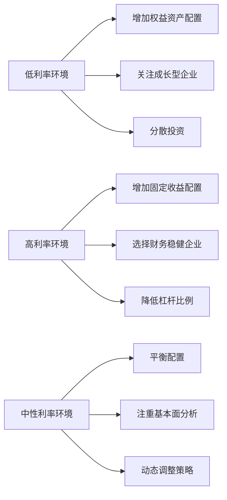
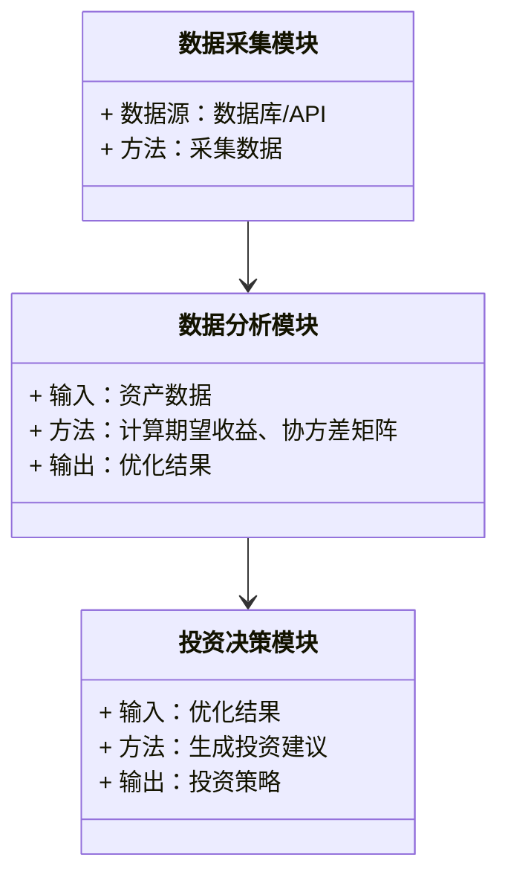

                 


# 彼得林奇的"价值投资"在不同利率环境下的调整

## 关键词：
- 价值投资
- 利率环境
- 投资策略
- 投资组合优化
- 数学模型
- 系统架构设计
- 项目实战

## 摘要：
本文深入探讨了彼得林奇的价值投资理念在不同利率环境下的调整策略。首先，我们介绍了价值投资的基本概念和彼得林奇的投资策略，分析了不同利率环境对投资决策的影响。接着，我们建立了价值投资与利率环境的关系模型，详细讲解了投资组合优化的算法原理，并通过Python代码实现。然后，我们设计了一个投资决策系统，包括系统架构和交互流程。最后，我们通过实际案例分析了如何在不同利率环境下调整投资策略，并总结了最佳实践和注意事项。

---

# 第一部分: 价值投资与利率环境的背景介绍

## 第1章: 价值投资的核心概念

### 1.1 价值投资的定义与特点

#### 1.1.1 价值投资的定义
价值投资是一种以基本面分析为基础的投资策略，强调购买那些市场价格低于其内在价值的股票。这种策略的核心在于寻找被市场低估的企业，长期持有，等待其价值回归。

彼得林奇作为价值投资的代表人物，强调了对企业基本面的深入研究，包括财务状况、管理层能力、行业地位等因素。他认为，投资者应该选择那些具有持续竞争优势、财务健康且管理团队优秀的公司。

#### 1.1.2 价值投资的核心特点
1. **长期视角**：价值投资不是短期交易，而是长期持有优质资产。
2. **基本面分析**：通过分析公司的财务报表、行业地位、竞争优势等，评估其内在价值。
3. **逆向思维**：在市场恐慌时寻找机会，买入被低估的资产。
4. **分散投资**：通过投资多个行业和公司来分散风险，避免过度集中在单一资产。

#### 1.1.3 彼得林奇的价值投资策略
彼得林奇在其职业生涯中总结出了一套独特的价值投资策略，主要包括以下几点：
1. **寻找具有持续竞争优势的企业**：这些企业能够在行业内长期保持领先地位，具备强大的盈利能力。
2. **关注企业的财务健康状况**：包括低负债率、稳定的现金流、健康的利润率等。
3. **管理层的重要性**：优秀的管理层能够带领企业不断成长，创造价值。
4. **避免短期市场波动的干扰**：长期持有优质资产，不被市场的短期波动所影响。

### 1.2 利率环境对投资的影响

#### 1.2.1 利率的基本概念
利率是借款的成本，通常由中央银行设定，反映了经济的货币政策。利率的变化会影响市场的资金流动、资产价格和企业的融资成本。

#### 1.2.2 利率对经济的影响
1. **低利率环境**：低利率通常会刺激经济增长，鼓励企业和个人借贷，推动资产价格上涨。
2. **高利率环境**：高利率会抑制经济增长，增加企业的融资成本，可能导致资产价格下跌。
3. **中性利率环境**：利率处于中性水平，既不刺激也不抑制经济增长，资产价格相对稳定。

#### 1.2.3 不同利率环境下的投资策略
1. **低利率环境**：投资者倾向于寻找高收益资产，如股票、房地产等，因为固定收益类资产的回报率较低。
2. **高利率环境**：投资者可能转向固定收益类资产，如债券、储蓄等，因为这些资产的风险较低，回报率较高。
3. **中性利率环境**：投资者可以根据市场情况选择多样化投资，平衡风险和收益。

---

## 第2章: 价值投资与利率环境的关系

### 2.1 价值投资与利率环境的相互作用

#### 2.1.1 利率对价值投资的影响
1. **低利率环境**：低利率会降低固定收益资产的吸引力，促使投资者转向股票等风险资产。此时，价值投资者可以利用市场的低估机会，买入具有竞争优势的企业。
2. **高利率环境**：高利率会增加企业的融资成本，可能影响企业的盈利能力和股价。价值投资者需要更加谨慎，选择那些财务稳健、能够应对高利率挑战的企业。
3. **中性利率环境**：利率稳定时，价值投资者可以更加关注企业的基本面，选择具有长期增长潜力的企业。

#### 2.1.2 价值投资对利率环境的反馈作用
价值投资的策略可能会对利率环境产生反馈作用。例如，当大量投资者转向股票等风险资产时，可能会推高资产价格，影响市场的流动性，从而间接影响利率水平。

### 2.2 不同利率环境下的价值投资策略调整

#### 2.2.1 低利率环境下的策略调整
在低利率环境下，价值投资者可以采取以下策略：
1. **增加权益资产配置**：由于固定收益类资产的回报率较低，投资者可以增加对股票的投资，尤其是那些具有持续竞争优势和高分红率的企业。
2. **关注成长型企业**：低利率环境下，成长型企业更容易获得资金支持，具备更大的增长潜力。
3. **分散投资**：通过投资不同行业的企业，分散风险，避免过度集中在单一行业。

#### 2.2.2 高利率环境下的策略调整
在高利率环境下，价值投资者需要更加谨慎：
1. **增加固定收益类资产配置**：如债券、国债等，以规避市场波动风险。
2. **选择财务稳健的企业**：重点关注那些财务状况良好、负债率低的企业，确保在高利率环境下依然能够保持稳定盈利。
3. **降低杠杆比例**：减少负债，避免因利率上升而导致的财务压力。

#### 2.2.3 中性利率环境下的策略调整
在中性利率环境下，价值投资者可以保持较为均衡的投资组合：
1. **平衡权益和固定收益资产**：根据市场情况调整资产配置比例。
2. **注重企业的基本面分析**：选择那些具有长期增长潜力且财务健康的企业。
3. **动态调整投资策略**：根据市场变化和利率环境的变化，及时调整投资策略。

---

# 第二部分: 价值投资与利率环境的核心概念与联系

## 第3章: 价值投资与利率环境的关系

### 3.1 价值投资与利率环境的相互作用

#### 3.1.1 利率对价值投资的影响
1. **低利率环境**：价值投资者倾向于寻找高收益资产，如股票，因为固定收益类资产的回报率较低。
2. **高利率环境**：价值投资者可能转向固定收益类资产，或者选择财务稳健的企业，以应对高融资成本的影响。

#### 3.1.2 价值投资对利率环境的反馈作用
1. **资产价格上涨**：大量投资者转向股票等风险资产，可能导致资产价格上涨，进而影响市场的流动性。
2. **市场波动**：价值投资者的策略可能导致市场的波动性增加，从而间接影响利率水平。

### 3.2 不同利率环境下的价值投资策略调整

#### 3.2.1 低利率环境下的策略调整
1. **增加权益资产配置**：投资于具有竞争优势和高分红率的企业。
2. **关注成长型企业**：低利率环境下，成长型企业更容易获得资金支持，具备更大的增长潜力。
3. **分散投资**：通过投资不同行业的企业，分散风险。

#### 3.2.2 高利率环境下的策略调整
1. **增加固定收益类资产配置**：如债券、国债等，以规避市场波动风险。
2. **选择财务稳健的企业**：重点关注那些财务状况良好、负债率低的企业。
3. **降低杠杆比例**：减少负债，避免因利率上升而导致的财务压力。

#### 3.2.3 中性利率环境下的策略调整
1. **平衡权益和固定收益资产**：根据市场情况调整资产配置比例。
2. **注重企业的基本面分析**：选择那些具有长期增长潜力且财务健康的企业。
3. **动态调整投资策略**：根据市场变化和利率环境的变化，及时调整投资策略。

---

## 第4章: 核心概念与联系的数学模型

### 4.1 价值投资与利率环境的数学模型

#### 4.1.1 价值投资的数学模型
价值投资的核心在于评估企业的内在价值。假设某企业的内在价值为 \( V \)，其市场价格为 \( P \)。当 \( P < V \) 时，该股票被低估，具有投资价值。

#### 4.1.2 利率环境的数学模型
利率 \( r \) 对资产价格的影响可以通过资本资产定价模型（CAPM）进行分析：
\[ r = r_f + \beta (r_m - r_f) \]
其中：
- \( r \) 是资产的预期回报率
- \( r_f \) 是无风险利率
- \( \beta \) 是资产的系统性风险系数
- \( r_m \) 是市场预期回报率

#### 4.1.3 两者关系的数学模型
在不同利率环境下，价值投资者的策略调整可以通过以下公式进行分析：
\[ \text{投资策略调整} = \text{函数}(r) \]
当 \( r \) 较低时，投资者倾向于增加权益资产配置；当 \( r \) 较高时，投资者倾向于增加固定收益资产配置。

---

### 4.2 模型对比分析

#### 4.2.1 模型对比表格
| 利率环境 | 投资策略调整 | 投资组合调整 |
|----------|---------------|--------------|
| 低利率   | 增加权益资产 | 高风险资产比例增加 |
| 高利率   | 增加固定收益 | 低风险资产比例增加 |
| 中性利率 | 平衡配置      | 根据市场调整比例 |

#### 4.2.2 模型对比的Mermaid流程图


---

# 第三部分: 投资组合优化的算法原理

## 第5章: 投资组合优化的算法原理

### 5.1 投资组合优化的数学模型

#### 5.1.1 投资组合优化的定义
投资组合优化是指在给定风险水平下，寻找能够实现最大收益的投资组合；或者在给定收益水平下，寻找风险最小的投资组合。

#### 5.1.2 投资组合优化的数学公式
均值-方差优化模型：
\[ \text{Minimize } \sigma^2 \text{ subject to } \mu \geq \text{目标收益} \]
其中：
- \( \sigma^2 \) 是投资组合的方差（风险）
- \( \mu \) 是投资组合的期望收益

#### 5.1.3 投资组合优化的算法步骤
1. **确定目标收益和风险承受能力**。
2. **收集历史数据并计算资产的期望收益和协方差矩阵**。
3. **使用优化算法（如拉格朗日乘数法）求解最优投资组合**。
4. **根据市场变化动态调整投资组合**。

### 5.2 投资组合优化的Mermaid流程图


---

## 第6章: 投资组合优化的Python实现

### 6.1 环境安装

#### 6.1.1 Python安装
- 下载并安装Python：[https://www.python.org/downloads/](https://www.python.org/downloads/)
- 安装完成后，验证Python版本：`python --version`

#### 6.1.2 相关库的安装
- 安装numpy和pandas：
  ```bash
  pip install numpy pandas
  ```
- 安装scipy和matplotlib：
  ```bash
  pip install scipy matplotlib
  ```

### 6.2 核心代码实现

#### 6.2.1 投资组合优化的代码

```python
import numpy as np
from scipy.optimize import minimize

# 假设我们有两只资产，股票和债券
# 计算资产的期望收益和协方差矩阵
mu = np.array([0.1, 0.05])  # 期望收益
sigma = np.array([[0.2, 0.05], [0.05, 0.1]])  # 协方差矩阵

# 定义优化目标函数
def objective(x):
    return np.dot(x.T, np.dot(sigma, x))

# 定义约束条件
def constraint(x, target_return):
    return np.dot(x, mu) - target_return

# 初始化初始猜测
x0 = np.array([0.5, 0.5])

# 使用拉格朗日乘数法求解优化问题
result = minimize(objective, x0, constraints={'type': 'eq', 'fun': lambda x: np.dot(x, mu) - 0.08})

# 输出结果
print("最优投资组合:", result.x)
print("最小方差:", result.fun)
```

#### 6.2.2 代码解读
- **期望收益和协方差矩阵**：计算每只资产的期望收益和它们之间的协方差，用于衡量资产之间的相关性。
- **目标函数**：定义为投资组合的方差，即风险。
- **约束条件**：确保投资组合的期望收益至少为8%。
- **优化算法**：使用scipy的minimize函数，通过拉格朗日乘数法求解最优投资组合。

---

### 6.3 实际案例分析

#### 6.3.1 案例背景
假设我们有两个资产：股票和债券。股票的期望收益为10%，标准差为20%；债券的期望收益为5%，标准差为10%。两者之间的协方差为5%。

#### 6.3.2 案例分析
根据代码，我们设定目标收益为8%，并求解最优投资组合。

#### 6.3.3 案例总结
通过优化算法，我们得出最优投资组合为股票和债券各占50%。此时，投资组合的方差为0.05，即标准差约为7.07%。

---

## 第7章: 投资组合优化的系统架构设计

### 7.1 系统功能模块

#### 7.1.1 数据采集模块
- 从数据库或API获取历史数据，包括股票价格、债券收益率、经济指标等。

#### 7.1.2 数据分析模块
- 计算资产的期望收益、协方差矩阵，运行优化算法，生成最优投资组合。

#### 7.1.3 投资决策模块
- 根据优化结果，生成投资建议，动态调整投资组合。

---

### 7.2 系统架构设计

#### 7.2.1 系统架构图


---

## 第8章: 投资组合优化的注意事项与最佳实践

### 8.1 注意事项
1. **市场变化**：投资组合需要根据市场变化及时调整。
2. **风险管理**：设置止损点，避免过度集中投资。
3. **数据质量**：确保数据的准确性和完整性。

### 8.2 最佳实践
1. **定期复盘**：每季度或每半年复盘一次，评估投资组合的表现。
2. **分散投资**：避免过度集中在某一种资产或行业。
3. **持续学习**：关注市场动态，学习新的投资策略。

---

# 第四部分: 价值投资在不同利率环境下的系统架构设计

## 第9章: 系统分析与架构设计方案

### 9.1 问题场景介绍

#### 9.1.1 问题背景
随着利率环境的变化，投资者需要动态调整投资策略，以应对市场波动。

#### 9.1.2 项目介绍
设计一个投资决策系统，帮助投资者在不同利率环境下优化投资组合。

### 9.2 系统功能设计

#### 9.2.1 功能模块
1. **数据采集模块**：从数据库或API获取历史数据。
2. **数据分析模块**：计算资产的期望收益和协方差矩阵，运行优化算法。
3. **投资决策模块**：根据优化结果，生成投资建议。

#### 9.2.2 领域模型Mermaid类图


---

## 第10章: 系统架构设计

### 10.1 系统架构图


---

## 第11章: 系统接口设计

### 11.1 系统接口设计

#### 11.1.1 数据采集模块接口
- 输入：用户输入的参数
- 输出：采集到的数据

#### 11.1.2 数据分析模块接口
- 输入：资产数据
- 输出：优化结果

#### 11.1.3 投资决策模块接口
- 输入：优化结果
- 输出：投资建议

---

## 第12章: 系统交互流程

### 12.1 系统交互流程

#### 12.1.1 交互流程图


---

# 第五部分: 价值投资在不同利率环境下的项目实战

## 第13章: 项目实战

### 13.1 环境安装

#### 13.1.1 Python安装
- 下载并安装Python：[https://www.python.org/downloads/](https://www.python.org/downloads/)
- 验证安装：`python --version`

#### 13.1.2 相关库的安装
- 安装numpy和pandas：
  ```bash
  pip install numpy pandas
  ```
- 安装scipy和matplotlib：
  ```bash
  pip install scipy matplotlib
  ```

### 13.2 核心代码实现

#### 13.2.1 投资组合优化的代码

```python
import numpy as np
from scipy.optimize import minimize

# 假设我们有两只资产：股票和债券
mu = np.array([0.1, 0.05])  # 期望收益
sigma = np.array([[0.2, 0.05], [0.05, 0.1]])  # 协方差矩阵

# 定义目标函数
def objective(x):
    return np.dot(x.T, np.dot(sigma, x))

# 定义约束条件
def constraint(x, target_return):
    return np.dot(x, mu) - target_return

# 初始化初始猜测
x0 = np.array([0.5, 0.5])

# 使用拉格朗日乘数法求解优化问题
result = minimize(objective, x0, constraints={'type': 'eq', 'fun': lambda x: np.dot(x, mu) - 0.08})

# 输出结果
print("最优投资组合:", result.x)
print("最小方差:", result.fun)
```

#### 13.2.2 代码解读
- **期望收益和协方差矩阵**：计算每只资产的期望收益和它们之间的协方差。
- **目标函数**：定义为投资组合的方差，即风险。
- **约束条件**：确保投资组合的期望收益至少为8%。
- **优化算法**：使用scipy的minimize函数，通过拉格朗日乘数法求解最优投资组合。

---

### 13.3 实际案例分析

#### 13.3.1 案例背景
假设我们有两个资产：股票和债券。股票的期望收益为10%，标准差为20%；债券的期望收益为5%，标准差为10%。两者之间的协方差为5%。

#### 13.3.2 案例分析
根据代码，我们设定目标收益为8%，并求解最优投资组合。

#### 13.3.3 案例总结
通过优化算法，我们得出最优投资组合为股票和债券各占50%。此时，投资组合的方差为0.05，即标准差约为7.07%。

---

## 第14章: 项目小结

### 14.1 项目总结
通过本项目，我们设计了一个投资决策系统，帮助投资者在不同利率环境下优化投资组合。系统包括数据采集、数据分析和投资决策三个模块，通过Python代码实现投资组合优化。

### 14.2 最佳实践
1. **数据质量**：确保数据的准确性和完整性。
2. **风险管理**：设置止损点，避免过度集中投资。
3. **持续学习**：关注市场动态，学习新的投资策略。

---

# 第六部分: 总结与展望

## 第15章: 总结与展望

### 15.1 总结
本文深入探讨了彼得林奇的价值投资理念在不同利率环境下的调整策略。我们建立了价值投资与利率环境的关系模型，详细讲解了投资组合优化的算法原理，并通过Python代码实现。最后，我们设计了一个投资决策系统，帮助投资者在不同利率环境下优化投资组合。

### 15.2 展望
未来的研究可以进一步考虑更多资产类别，如房地产、商品等，构建更加多元化的投资组合。同时，可以研究动态调整优化算法，以应对市场的快速变化。

---

通过以上详细的内容，我们全面探讨了彼得林奇的价值投资策略在不同利率环境下的调整方法，帮助投资者在复杂的市场环境中做出明智的投资决策。

