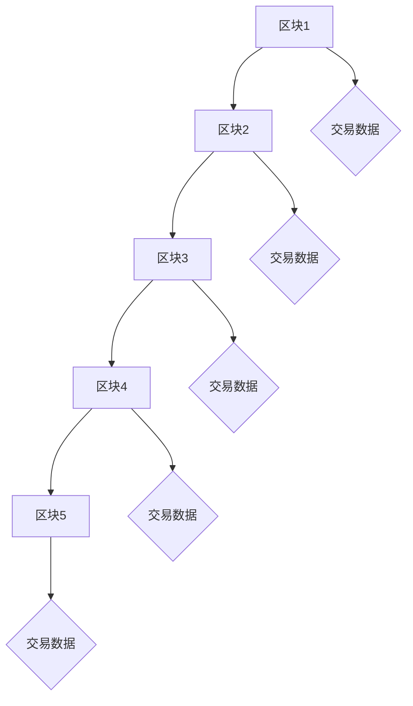
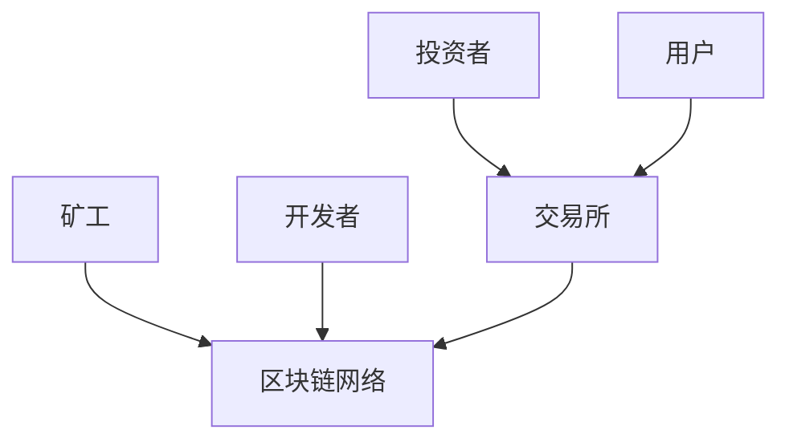
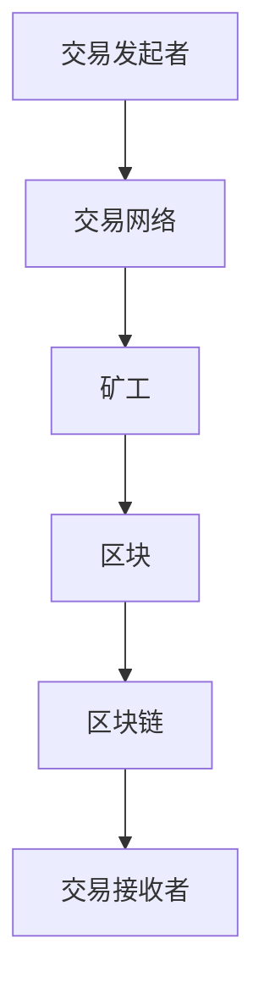

                 

# 彼得林奇的"价值投资"在加密货币时代的新思考

---

## 关键词：价值投资、彼得·林奇、加密货币、区块链、数字货币投资、投资策略

---

## 摘要：  
随着加密货币市场的迅速崛起，传统的价值投资理念在这一新兴领域面临新的挑战和机遇。本文将深入探讨彼得·林奇的价值投资理论在加密货币时代的演变，分析如何将这一经典投资策略应用于区块链和数字货币领域。通过结合技术分析、市场周期和项目基本面评估，本文为投资者提供了新的视角和策略，以在加密货币市场中实现长期稳定的收益。

---

## 第一章：价值投资的定义与核心理念

### 1.1 价值投资的起源与发展  
价值投资是一种以基本面分析为核心的长期投资策略，起源于20世纪初的美国。其核心理念是寻找市场中被低估的资产，通过长期持有实现价值回归。彼得·林奇作为该领域的代表人物，强调了深入研究和长期持有的重要性。  

**价值投资的核心原则：**  
1. **深入研究**：分析公司的财务状况、行业地位和竞争优势。  
2. **长期持有**：避免频繁交易，降低交易成本和情绪干扰。  
3. **安全边际**：以低于内在价值的价格买入资产。  

### 1.2 加密货币的兴起与特点  
加密货币是一种基于区块链技术的数字货币，具有去中心化、匿名性和不可篡改等特点。自比特币诞生以来，加密货币市场迅速发展，成为金融领域的重要组成部分。  

**加密货币市场的特点：**  
1. **高波动性**：价格波动剧烈，市场情绪影响显著。  
2. **去中心化**：交易和结算无需依赖传统金融机构。  
3. **技术创新**：区块链技术不断进化，应用场景广泛。  

### 1.3 价值投资与加密货币的结合  
传统价值投资主要应用于股票市场，而加密货币市场的特点使得其与传统市场存在显著差异。然而，价值投资的核心理念——寻找被低估的资产——仍然适用。本文将探讨如何将这一理念应用于加密货币投资。

---

## 第二章：加密货币市场的价值驱动因素

### 2.1 加密货币市场的供需关系  
市场的供需关系是价格形成的基础。加密货币的供给受到区块链协议的严格限制，而需求则取决于市场参与者对货币价值的认可。  

**供需关系分析：**  
- 供给：加密货币的发行量通常由区块链协议预先设定，具有较强的刚性。  
- 需求：市场需求受多种因素影响，包括技术发展、政策监管和市场情绪等。  

### 2.2 区块链技术的核心要素  
区块链技术是加密货币的基础，其核心要素包括数据结构、共识机制和智能合约等。  

**区块链的核心要素：**  
1. **数据结构**：区块通过链式结构连接，确保数据不可篡改。  
2. **共识机制**：如比特币的POW和以太坊的POS，用于验证交易的有效性。  
3. **智能合约**：通过预设的代码自动执行合同条款，简化信任中介。  

**Mermaid图：区块链结构与功能**

### 2.3 加密货币的经济模型  
加密货币的经济模型决定了其发行、分配和流通的规则，直接影响其价值和市场表现。  

**经济模型分析：**  
1. **通货膨胀与通货紧缩机制**：部分加密货币采用通货紧缩机制，如比特币的总量上限为2100万枚。  
2. **激励机制**：通过区块奖励和交易费用激励矿工或验证节点参与共识机制。  
3. **代币分配**：代币的分配方式影响市场流通性和集中度。  

---

## 第三章：价值投资在加密货币中的新策略

### 3.1 项目基本面的评估指标  
在加密货币领域，基本面分析需要考虑项目的技术实现、团队背景和市场需求。  

**基本面评估指标：**  
1. **团队背景**：创始人和核心成员的经验与声誉。  
2. **技术实现**：区块链技术的创新性和可行性。  
3. **市场需求**：应用场景的广泛性和用户接受度。  

### 3.2 市场定位与竞争分析  
加密货币市场的竞争日益激烈，准确的市场定位是成功的关键。  

**市场定位分析：**  
1. **目标用户群体**：明确项目的目标用户和应用场景。  
2. **竞争对手分析**：评估竞争对手的优势和劣势。  
3. **市场占有率**：通过市场份额分析项目的潜力。  

### 3.3 项目可持续性与风险评估  
加密货币项目的可持续性取决于其技术、经济和社区支持的稳定性。  

**风险评估：**  
1. **技术风险**：技术实现的可行性和安全性。  
2. **市场风险**：市场需求的变化和政策监管的影响。  
3. **团队风险**：项目团队的稳定性与透明度。  

---

## 第四章：加密货币市场的技术分析

### 4.1 技术分析的基本原理  
技术分析是通过对价格和成交量的研究，预测未来市场走势的方法。  

**技术分析的核心方法：**  
1. **K线图**：展示某一时间段内的价格波动。  
2. **技术指标**：如MACD、RSI等，用于判断市场超买超卖状态。  
3. **价格走势分析**：识别趋势和趋势反转的信号。  

### 4.2 加密货币市场的周期性规律  
加密货币市场具有明显的周期性，投资者可以通过分析周期规律制定投资策略。  

**市场周期分析：**  
1. **牛市**：市场整体上涨，投资者信心高涨。  
2. **熊市**：市场整体下跌，投资者信心低落。  
3. **震荡市**：市场波动加剧，价格难以形成趋势。  

---

## 第五章：系统分析与架构设计

### 5.1 加密货币市场的生态系统  
加密货币市场由多个参与者构成，包括矿工、交易所、投资者和开发者。  

**生态系统构成：**  
1. **矿工/验证节点**：负责维护区块链网络的安全性。  
2. **交易所**：提供加密货币的交易和结算服务。  
3. **投资者**：参与市场交易，推动价格波动。  
4. **开发者**：推动区块链技术的创新和应用。  

**Mermaid图：加密货币市场生态系统**

### 5.2 项目介绍与系统功能设计  
以比特币为例，分析其系统功能设计。  

**比特币系统功能：**  
1. **交易记录**：所有交易记录在区块链上，确保数据不可篡改。  
2. **共识机制**：通过POW机制确保交易的有效性。  
3. **智能合约**：支持简单的脚本操作，如时间锁定期权。  

**Mermaid图：比特币系统架构**

---

## 第六章：项目实战与案例分析

### 6.1 项目选择与核心实现  
以以太坊为例，分析其项目背景和核心实现。  

**以太坊项目背景：**  
- 创始人：Vitalik Buterin  
- 核心目标：构建去中心化的应用平台  

**技术实现：**  
- 区块链结构：支持智能合约的以太坊虚拟机（EVM）。  
- 共识机制：从POW转向POS的以太坊2.0。  

### 6.2 投资策略与实际案例  
通过分析以太坊的投资策略，展示如何将价值投资理念应用于加密货币市场。  

**投资策略：**  
1. **长期持有**：基于以太坊的技术创新和生态完善性，长期持有其代币。  
2. **风险控制**：分散投资，避免过度集中风险。  
3. **持续学习**：关注市场动态和技术发展，及时调整投资策略。  

---

## 第七章：总结与展望

### 7.1 总结  
本文探讨了彼得·林奇的价值投资理念在加密货币时代的应用，分析了加密货币市场的特点、技术原理和投资策略。通过结合基本面分析和技术分析，为投资者提供了新的视角和方法。

### 7.2 展望  
随着区块链技术的不断发展，加密货币市场的潜力将逐步释放。未来，价值投资的理念将在这一领域继续演变，投资者需要结合技术创新和市场变化，制定更具前瞻性的投资策略。

---

## 小结  
通过本文的分析，读者可以更好地理解价值投资在加密货币时代的新思考，掌握如何在新兴市场中实现稳健投资。加密货币市场的复杂性和不确定性要求投资者具备更强的分析能力和风险意识，但其巨大的潜力也为投资者提供了广阔的机会。

