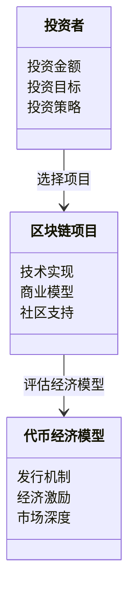

                 


# 彼得林奇的"价值投资"在区块链项目中的调整思路

## 关键词：区块链，价值投资，彼得·林奇，项目评估，投资策略

## 摘要：本文探讨了如何将彼得·林奇的价值投资理念应用于区块链项目中的调整思路。文章首先介绍了区块链和价值投资的基本概念，然后分析了区块链项目的独特特点和价值评估的核心要素。接着，详细阐述了传统价值投资策略在区块链环境中的调整方向，并提出了适用于区块链项目的估值指标和评估框架。最后，通过实际案例和系统架构设计，展示了如何在区块链项目中实践调整后的价值投资策略。

---

## 第一部分：区块链与价值投资概述

### 第1章：区块链的基本概念与特点

#### 1.1 区块链的定义与核心原理
区块链是一种分布式账本技术，通过去中心化、去信任化和不可篡改的特性，实现了数据的安全存储和价值传递。其核心原理包括：链式结构、哈希函数、共识机制和智能合约。

#### 1.2 区块链的核心特点与优势
区块链的特点包括：
- **去中心化**：无须依赖中心机构，数据由网络节点共同维护。
- **不可篡改**：通过链式结构和哈希函数，确保数据的完整性和真实性。
- **透明性**：所有交易记录在链上公开透明。
- **可扩展性**：通过技术优化可以支持更多的应用场景。

#### 1.3 区块链的潜在应用场景
区块链技术在金融、供应链管理、医疗、版权保护等领域有广泛的应用潜力，尤其在去中心化金融（DeFi）、数字身份验证和智能合约领域表现突出。

---

### 第2章：价值投资的基本概念与特点

#### 2.1 价值投资的定义与核心原理
价值投资是一种以基本面分析为核心的长期投资策略，强调以低于内在价值的价格买入优质资产。其核心在于寻找那些被市场低估、具备长期竞争优势的企业。

#### 2.2 彼得·林奇的价值投资策略
彼得·林奇是价值投资的代表人物，他强调：
- **深入研究**：对投资标的进行深入的行业研究和财务分析。
- **长期持有**：避免短期波动，关注企业的长期发展。
- **分散投资**：通过分散投资降低风险。

#### 2.3 价值投资的核心要素与优势
价值投资的核心要素包括：
- **企业基本面**：盈利能力、财务状况、竞争优势。
- **市场估值**：市盈率、市净率等指标。
- **长期增长潜力**：企业的市场地位和未来增长空间。

---

## 第二部分：区块链项目的特点与价值评估

### 第3章：区块链项目的生命周期与特点

#### 3.1 区块链项目的生命周期
区块链项目的生命周期包括：
1. **概念阶段**：团队构思项目目标和愿景。
2. **开发阶段**：技术开发和测试。
3. **上线阶段**：部署主网并启动代币发行。
4. **运营阶段**：社区建设、生态发展和持续优化。

#### 3.2 区块链项目的独特特点
区块链项目的独特特点包括：
- **技术驱动**：技术实现是项目成功的关键。
- **社区依赖**：依赖社区支持和参与。
- **高波动性**：市场波动大，价格波动剧烈。

#### 3.3 区块链项目的成功关键因素
成功的区块链项目需要具备：
- **强大的技术团队**：技术实现能力和创新能力。
- **清晰的商业模型**：明确的市场需求和盈利模式。
- **活跃的社区支持**：社区参与度和生态系统建设。

---

### 第4章：价值投资在区块链中的核心要素

#### 4.1 项目团队背景与经验
团队的背景和经验是区块链项目成功的重要因素。投资者需要关注团队成员的行业经验、技术能力和过往成就。

#### 4.2 技术创新与可行性
技术创新是区块链项目的核心竞争力。投资者需要评估技术的可行性和创新性，包括专利数量、技术实现难度和行业认可度。

#### 4.3 市场需求与商业模型
市场需求和商业模型是区块链项目成功的关键。投资者需要分析项目的市场定位、目标用户和盈利模式。

#### 4.4 社区支持与生态建设
社区支持和生态建设是区块链项目的重要组成部分。活跃的社区和完善的生态能够为项目提供持续的发展动力。

---

## 第三部分：彼得·林奇价值投资策略的调整思路

### 第5章：传统价值投资策略的局限性

#### 5.1 传统价值投资的适用场景
传统价值投资在股票市场中表现优异，但在区块链领域存在以下问题：
- **技术评估难度**：传统价值投资更关注财务指标，而区块链项目的技术实现和创新性需要额外评估。
- **市场波动性**：区块链市场的波动性远高于传统金融市场。
- **生态系统依赖**：区块链项目依赖于社区和生态系统的支持，而传统价值投资更注重企业的独立性。

#### 5.2 传统价值投资在区块链中的挑战
- **技术复杂性**：区块链技术的复杂性增加了评估的难度。
- **市场不确定性**：区块链市场的不确定性和政策风险较高。
- **生态系统的动态性**：区块链生态系统的动态性要求投资者具备更高的敏感性和适应能力。

#### 5.3 传统价值投资策略的调整方向
- **技术评估的引入**：将技术评估作为投资决策的重要组成部分。
- **生态系统评估**：关注项目的生态系统和社区支持。
- **动态调整**：根据市场变化和项目进展动态调整投资策略。

---

### 第6章：区块链项目价值评估的特殊性

#### 6.1 区块链项目的估值方法
区块链项目的估值方法包括：
- **技术估值**：评估技术的创新性和可行性。
- **市场估值**：参考市场可比交易和代币价格。
- **生态系统估值**：评估生态系统的完整性和活跃度。

#### 6.2 区块链项目的市场波动性
区块链市场的波动性较高，投资者需要具备较强的风险承受能力和心理素质。

#### 6.3 区块链项目的长期可持续性
区块链项目的长期可持续性依赖于技术创新、市场需求和社区支持。

---

### 第7章：彼得·林奇策略在区块链中的调整

#### 7.1 调整后的价值投资框架
- **技术评估**：将技术评估作为投资决策的重要组成部分。
- **生态系统评估**：关注项目的生态系统和社区支持。
- **动态调整**：根据市场变化和项目进展动态调整投资策略。

#### 7.2 项目选择的标准与权重
- **技术实现能力**：权重40%
- **市场需求**：权重30%
- **社区支持**：权重20%
- **商业模型**：权重10%

#### 7.3 投资组合的优化策略
- **分散投资**：避免过度集中于单一项目或领域。
- **长期持有**：关注项目的长期增长潜力，避免短期波动。
- **动态调整**：根据市场变化和项目进展动态调整投资组合。

---

## 第四部分：区块链项目价值评估的核心指标

### 第8章：区块链项目的技术指标

#### 8.1 区块链技术的核心指标
- **网络性能**：包括交易速度、延迟和吞吐量。
- **安全性**：包括抗攻击能力、共识机制和加密算法。
- **可扩展性**：包括智能合约的可扩展性和技术实现的灵活性。

#### 8.2 网络性能与安全性
- **交易速度**：衡量区块链的处理能力。
- **延迟**：衡量区块链的响应速度。
- **吞吐量**：衡量区块链的处理能力。

#### 8.3 智能合约的可扩展性
- **智能合约功能**：包括智能合约的复杂性和灵活性。
- **智能合约安全**：包括智能合约的漏洞和风险管理。

---

### 第9章：区块链项目的经济指标

#### 9.1 代币经济模型
- **代币发行机制**：包括总量、发行方式和分配方式。
- **代币经济激励**：包括代币的用途、奖励机制和经济循环。

#### 9.2 通货膨胀与通货紧缩机制
- **通货膨胀机制**：包括通胀率和通胀周期。
- **通货紧缩机制**：包括销毁机制和紧缩周期。

#### 9.3 代币的流动性与市场深度
- **市场深度**：包括订单簿深度和交易深度。
- **市场流动性**：包括交易活跃度和市场深度。

---

## 第五部分：系统分析与架构设计方案

### 第10章：系统功能设计

#### 10.1 领域模型类图


#### 10.2 系统架构设计


#### 10.3 系统接口设计
- **投资者接口**：包括项目选择、投资决策和投资组合管理。
- **区块链项目接口**：包括技术实现、商业模型和社区支持。
- **代币经济模型接口**：包括代币发行机制、经济激励和市场深度。

#### 10.4 系统交互流程
```mermaid
sequenceDiagram
    participant 投资者
    participant 区块链项目
    participant 代币经济模型
   投资者 -> 区块链项目: 选择项目
    区块链项目 -> 代币经济模型: 评估经济模型
    区块链项目 ->抽屉 技术实现: 评估技术实现
    区块链项目 -> 社区支持: 评估社区支持
    投资者 <-- 区块链项目: 评估结果
```

---

## 第六部分：项目实战

### 第11章：环境安装与核心代码实现

#### 11.1 环境安装
- **Python环境**：安装Python 3.8及以上版本。
- **依赖库安装**：安装`pandas`, `numpy`, `matplotlib`等库。

#### 11.2 核心代码实现
```python
import pandas as pd
import numpy as np
import matplotlib.pyplot as plt

def calculate_valuation_metric(project_data):
    # 计算技术指标
    technical_score = project_data['技术指标'].mean()
    # 计算经济指标
    economic_score = project_data['经济指标'].mean()
    # 计算社区指标
    community_score = project_data['社区指标'].mean()
    # 综合评分
    total_score = technical_score * 0.4 + economic_score * 0.3 + community_score * 0.2
    return total_score

# 示例数据
project_data = {
    '技术指标': [0.8, 0.9, 0.7],
    '经济指标': [0.6, 0.8, 0.7],
    '社区指标': [0.7, 0.6, 0.8]
}
valuation = calculate_valuation_metric(project_data)
print(f"项目估值综合得分：{valuation}")
```

---

### 第12章：实际案例分析与项目小结

#### 12.1 实际案例分析
以某区块链项目为例，分析其技术实现、经济模型和社区支持，并计算其综合评分。

#### 12.2 项目小结
总结项目分析过程和得出的结论，提出改进建议和未来研究方向。

---

## 第七部分：最佳实践与总结

### 第13章：投资建议与注意事项

#### 13.1 投资建议
- **分散投资**：避免过度集中于单一项目或领域。
- **长期持有**：关注项目的长期增长潜力，避免短期波动。
- **动态调整**：根据市场变化和项目进展动态调整投资策略。

#### 13.2 注意事项
- **技术风险**：区块链技术的复杂性增加了投资的难度。
- **市场风险**：区块链市场的波动性较高，需谨慎操作。
- **政策风险**：政策变化可能对项目产生重大影响。

---

### 第14章：总结与展望

#### 14.1 总结
本文探讨了如何将彼得·林奇的价值投资理念应用于区块链项目中的调整思路，提出了适用于区块链项目的估值指标和评估框架，并通过实际案例展示了如何在区块链项目中实践调整后的价值投资策略。

#### 14.2 展望
未来的研究可以进一步探讨区块链项目的长期可持续性、生态系统建设以及如何在不同区块链应用场景中调整投资策略。

---

## 参考文献
1. 彼得·林奇著，《彼得·林奇的投资智慧》
2. 《区块链技术与应用》
3. 《价值投资实战指南》

---

通过本文的分析，投资者可以更好地理解如何将传统价值投资策略应用于区块链项目，并在实践中取得更好的投资效果。

