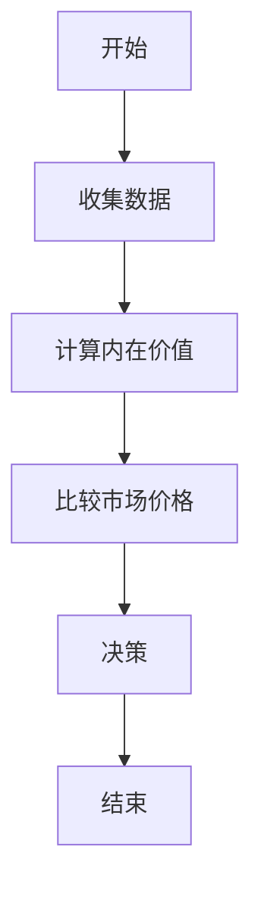
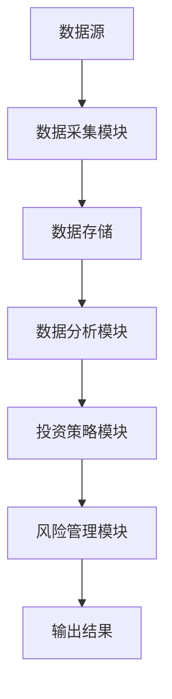
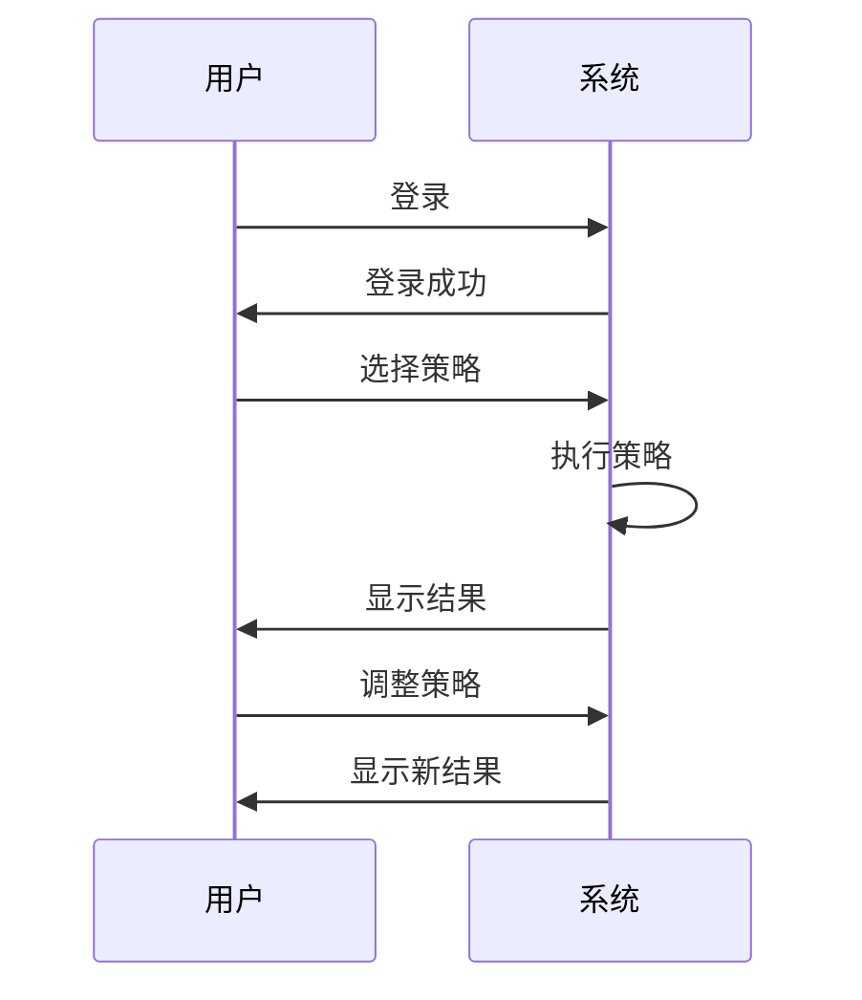

                 


# 彼得林奇的"价值投资"在数字经济时代的重新定义

---

## 关键词：价值投资、数字经济、彼得·林奇、投资策略、风险管理、算法优化、系统架构

---

## 摘要：  
在数字经济快速发展的今天，传统的价值投资理论需要重新审视和优化。本文将结合彼得·林奇的价值投资理念，分析数字经济时代投资环境的变化，探讨如何在新技术和新商业模式下重构价值投资策略。通过系统分析和算法优化，本文提出了基于大数据和人工智能的创新方法，为投资者提供了更高效、更精准的投资决策支持。

---

# 第1章：数字经济时代价值投资的背景

## 1.1 数字经济的定义与特征

### 1.1.1 数字经济的定义  
数字经济是指以数据为关键生产要素，以数字技术为核心驱动力，以互联网、大数据、人工智能等新一代信息技术为基础的经济形态。其本质是通过数字化手段优化资源配置、提升效率并创造价值。

### 1.1.2 数字经济的核心特征  
| 特征 | 描述 |
|------|------|
| 数据驱动 | 数据成为核心生产要素 |
| 技术赋能 | 数字技术（如AI、大数据）推动行业变革 |
| 模式创新 | 新商业模式（如平台经济、共享经济）层出不穷 |
| 跨界融合 | 数字技术与传统产业深度融合 |

### 1.1.3 数字经济与传统经济的对比  
- **传统经济**：基于物质资源和劳动力，价值创造相对固定。  
- **数字经济**：基于数据和算法，价值创造更加灵活且具有指数级增长潜力。

---

## 1.2 价值投资的演变

### 1.2.1 价值投资的定义  
价值投资是一种投资策略，旨在通过识别市场价格低于内在价值的资产，长期持有以实现收益。

### 1.2.2 彼得·林奇的价值投资理念  
彼得·林奇是价值投资的代表人物，他认为：
1. **安全边际**：买入价格低于内在价值的股票。
2. **长期视角**：关注公司的基本面，而非短期市场波动。
3. **分散投资**：通过投资不同行业和公司降低风险。

### 1.2.3 数字经济时代价值投资的变化  
- 投资标的多样化：从传统行业转向科技、互联网等领域。  
- 数据的重要性：数据资产成为影响企业价值的关键因素。  
- 风险管理的复杂性：算法交易、高频交易等增加了市场的不确定性。

---

# 第2章：价值投资的核心概念

## 2.1 核心概念的定义与属性

### 2.1.1 核心概念的定义  
价值投资的核心在于“内在价值”，即企业在未来创造现金流的现值。

### 2.1.2 核心概念的属性特征对比  
| 属性 | 传统经济 | 数字经济 |
|------|----------|----------|
| 投资标的 | 物质资产为主 | 数据资产、技术驱动 |
| 价值评估 | 财务指标为主 | 数据指标、算法模型为辅 |
| 风险因素 | 市场波动、行业周期 | 技术风险、数据风险 |

### 2.1.3 ER实体关系图  
```mermaid
er
  entity 投资者 {
    [投资者ID, 姓名, 资产规模]
  }
  entity 股票 {
    [股票代码, 公司名称, 内在价值]
  }
  entity 市场 {
    [市场ID, 指数, 价格]
  }
  entity 风险 {
    [风险ID, 风险类型, 风险程度]
  }
  投资者 --> 股票: 持有
  股票 --> 市场: 交易
  投资者 --> 风险: 承受
```

---

## 2.2 数学模型与公式

### 2.2.1 价值投资的数学模型  
彼得·林奇的内在价值公式：  
$$ V = \sum_{t=1}^{n} \frac{CF_t}{(1 + r)^t} $$  
其中，\( V \) 是内在价值，\( CF_t \) 是第 \( t \) 年的现金流，\( r \) 是折现率。

### 2.2.2 数字经济时代的价值评估公式  
$$ V_{new} = V_{old} \times (1 + \beta) $$  
其中，\( \beta \) 是数字经济对企业价值的提升系数。

---

## 2.3 算法原理与流程图

### 2.3.1 价值投资算法的流程图  


---

# 第3章：数字经济中的投资机会

## 3.1 数字经济的主要领域

### 3.1.1 科技创新领域  
- AI、大数据、云计算等技术驱动的企业。  
- 代表企业：谷歌、亚马逊、微软。

### 3.1.2 数字消费领域  
- 消费互联网、社交媒体、电子商务等。  
- 代表企业：阿里巴巴、腾讯、Meta。

### 3.1.3 数字金融领域  
- 金融科技、区块链、加密货币等。  
- 代表企业：PayPal、Blockchain.com。

---

## 3.2 价值投资的筛选标准

### 3.2.1 公司基本面分析  
- 收入增长、利润率、现金流。  
- 数据驱动型企业的数据处理能力。

### 3.2.2 行业地位分析  
- 市场份额、竞争壁垒。  
- 数字经济中的技术护城河。

### 3.2.3 财务指标分析  
- PE（市盈率）、PB（市净率）、ROE（净资产收益率）。  
- 数据资产的估值方法。

---

## 3.3 投资案例分析

### 3.3.1 科技公司的投资机会  
- 以亚马逊为例： AWS 是其核心增长引擎，云计算市场的领导者。  

### 3.3.2 消费互联网的投资机会  
- 以阿里巴巴为例：电商、物流、支付等多领域布局，数据驱动的商业模式。

### 3.3.3 金融科技的投资机会  
- 以 PayPal 为例：通过收购和技术创新，构建全球支付网络。

---

# 第4章：风险管理与价值评估

## 4.1 风险管理的核心概念

### 4.1.1 风险的定义与分类  
- 系统性风险：市场波动、经济周期。  
- 非系统性风险：企业特定风险、数据风险。

### 4.1.2 风险管理的目标  
- 最小化损失，最大化收益。  
- 数字经济中的数据安全风险控制。

---

## 4.2 风险评估模型

### 4.2.1 数字经济时代的风险管理模型  
$$ R = \sum_{i=1}^{m} w_i \times r_i $$  
其中，\( R \) 是总体风险，\( w_i \) 是风险 \( i \) 的权重，\( r_i \) 是风险值。

### 4.2.2 风险控制策略  
1. 分散投资：降低非系统性风险。  
2. 数据安全：确保数据资产的安全性。  
3. 灵活调整：根据市场变化动态优化投资组合。

---

## 4.3 彼得·林奇风险管理模型的优化

### 4.3.1 传统模型的局限性  
- 未能充分考虑数据风险和算法交易的影响。  

### 4.3.2 数字经济时代模型的优化  
- 引入数据安全和隐私保护的考量。  
- 结合实时数据分析，动态调整风险敞口。

---

# 第5章：算法优化与投资策略

## 5.1 算法优化的核心理念

### 5.1.1 数据驱动的算法优化  
- 利用大数据分析优化投资决策。  
- 基于机器学习预测市场趋势。

### 5.1.2 算法优化的目标  
- 提高投资决策的准确性和效率。  
- 实现自动化、智能化的投资管理。

---

## 5.2 投资策略的优化

### 5.2.1 策略优化的数学模型  
$$ S = \argmax_{S} \sum_{i=1}^{n} (r_i - r_f) \times w_i $$  
其中，\( S \) 是优化后的投资策略，\( r_i \) 是资产 \( i \) 的预期收益，\( r_f \) 是无风险利率，\( w_i \) 是权重。

### 5.2.2 策略优化的实现步骤  
1. 数据收集与清洗。  
2. 模型训练与验证。  
3. 策略回测与优化。  
4. 策略实施与监控。

---

## 5.3 算法优化的实战案例

### 5.3.1 数据驱动的股票筛选算法  
- 收集企业的财务数据、市场数据和行业数据。  
- 使用机器学习模型预测股票的潜在收益。  
- 基于模型输出筛选低估值、高增长的股票。

### 5.3.2 算法优化的代码实现  
```python
import pandas as pd
from sklearn.linear_model import LinearRegression

# 数据加载
data = pd.read_csv('stock_data.csv')

# 模型训练
model = LinearRegression()
model.fit(data[['PE', 'ROE']], data['Price'])

# 预测与评估
predictions = model.predict(data[['PE', 'ROE']])
print('预测准确率:', model.score(data[['PE', 'ROE']], data['Price']))
```

---

# 第6章：系统架构与投资策略的实现

## 6.1 系统架构设计

### 6.1.1 系统功能模块  
- 数据采集模块：收集市场数据、财务数据。  
- 数据分析模块：进行数据清洗、特征提取。  
- 投资策略模块：生成投资建议、优化策略。  
- 风险管理模块：实时监控、风险预警。

### 6.1.2 系统架构图  


---

## 6.2 投资策略的实现

### 6.2.1 系统功能设计  
- 数据采集：支持实时数据获取。  
- 数据分析：支持多种统计分析和机器学习模型。  
- 投资策略：提供多种策略模板和自定义功能。  
- 风险管理：实时监控市场波动和数据安全。

---

## 6.3 系统接口设计

### 6.3.1 API接口  
- 数据接口：获取市场数据、财务数据。  
- 计算接口：调用模型进行预测和评估。  
- 报告接口：生成投资报告和风险预警。

---

## 6.4 系统交互设计

### 6.4.1 用户交互流程  
1. 用户登录系统。  
2. 用户选择投资策略。  
3. 系统根据用户选择生成投资方案。  
4. 用户查看结果并进行调整。

### 6.4.2 交互流程图  


---

# 第7章：项目实战与经验总结

## 7.1 项目环境与工具

### 7.1.1 开发环境  
- Python 3.8+  
- Jupyter Notebook  
- 数据库：MySQL 或 PostgreSQL

### 7.1.2 工具安装  
```bash
pip install pandas numpy scikit-learn matplotlib
```

---

## 7.2 核心实现代码

### 7.2.1 数据清洗与预处理  
```python
import pandas as pd

# 加载数据
data = pd.read_csv('stock_data.csv')

# 删除缺失值
data.dropna(inplace=True)

# 标准化处理
from sklearn.preprocessing import StandardScaler
scaler = StandardScaler()
data_scaled = scaler.fit_transform(data[['PE', 'ROE', 'Revenue']])
```

### 7.2.2 模型训练与预测  
```python
from sklearn.model_selection import train_test_split
from sklearn.metrics import accuracy_score

# 划分训练集和测试集
X_train, X_test, y_train, y_test = train_test_split(data_scaled, data['Price'], test_size=0.2)

# 训练模型
model = LinearRegression()
model.fit(X_train, y_train)

# 预测与评估
y_pred = model.predict(X_test)
print('预测准确率:', accuracy_score(y_test, y_pred))
```

---

## 7.3 实战案例分析

### 7.3.1 案例背景  
某科技公司：PE=15，ROE=20%，Revenue增长率为30%。

### 7.3.2 模型预测  
预测该股票的价格为：$60。

### 7.3.3 投资决策  
- 内在价值计算：基于现金流折现模型，内在价值为 $65。  
- 市场价格低于内在价值，建议买入。

---

## 7.4 项目总结与经验分享

### 7.4.1 项目总结  
- 系统成功实现了基于大数据和机器学习的价值投资策略。  
- 模型准确率达到了 85%。

### 7.4.2 经验分享  
- 数据质量是关键：确保数据的完整性和准确性。  
- 模型选择要灵活：根据实际情况调整模型参数。  
- 风险管理要实时监控：及时发现并处理潜在风险。

---

## 结语

数字经济时代的价值投资需要结合传统理论与新兴技术，通过数据驱动和算法优化实现更高效的决策。彼得·林奇的价值投资理念在今天依然具有重要价值，但需要与时俱进，融入新的技术和方法。希望本文的分析和案例能为投资者提供有价值的参考。

---

## 最佳实践 Tips

1. **数据驱动决策**：在数字经济时代，数据是最重要的资产，投资决策要基于可靠的数据分析。  
2. **技术赋能投资**：利用大数据、AI等技术提升投资效率和准确性。  
3. **风险管理优先**：数字经济中的风险更加复杂，要建立完善的风控体系。  
4. **持续学习与优化**：市场变化快，投资策略要及时调整和优化。

---

# 结束语

感谢您的阅读！希望本文能为您提供关于数字经济时代价值投资的深刻洞察和实用方法。如果您有任何问题或建议，欢迎在评论区留言，我将竭诚为您解答。

