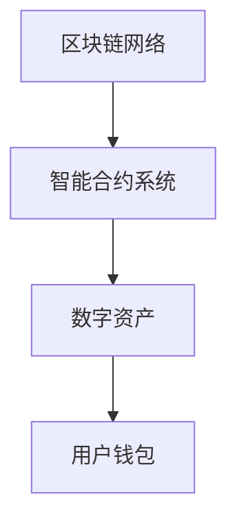

                 

# 彼得林奇的"价值投资"在数字资产时代的框架重构

> **关键词**：价值投资，数字资产，区块链，投资框架，数字市场，风险管理  
> **摘要**：本文探讨了彼得·林奇的价值投资理念在数字资产时代面临的挑战，并提出了重构传统价值投资框架的新思路。通过分析数字资产的特点，重构了价值评估的核心要素，并结合实际案例，提出了适应数字资产市场的投资策略。

---

## 第一章：引言

在传统金融领域，彼得·林奇的价值投资理念以其独特的方法论和长期的实践成果闻名。然而，随着数字资产的崛起，传统价值投资框架面临新的挑战。数字资产市场的高波动性、去中心化特性以及技术驱动的创新，使得传统的估值方法难以直接适用。本文将探讨如何重构彼得·林奇的价值投资框架，以适应数字资产时代的投资需求。

---

## 第二章：价值投资与数字资产的背景

### 2.1 价值投资的核心概念

#### 2.1.1 投资的定义与分类
- **投资**：通过购买资产以期在未来获得收益的行为。
- **分类**：包括股票、债券、房地产、数字资产等多种形式。

#### 2.1.2 价值投资的核心原则
- 以合理价格购买具有持续盈利能力的优秀企业。
- 长期投资，避免频繁交易。

#### 2.1.3 彼得·林奇的价值投资框架
- 以公司基本面分析为核心，注重企业的盈利能力、成长性和行业地位。

### 2.2 数字资产的定义与特点

#### 2.2.1 数字资产的定义
- 数字资产：基于区块链技术的数字化资产，具有去中心化、可分割性和透明性等特点。

#### 2.2.2 数字资产与传统金融资产的对比
| 特性       | 传统金融资产         | 数字资产             |
|------------|----------------------|----------------------|
| 所有权     | 中心化               | 去中心化             |
| 交易效率   | 较低                 | 高                   |
| 资产类别   | 股票、债券等         | 加密货币、NFT等      |
| 监管       | 严格                 | 相对宽松             |

#### 2.2.3 数字资产市场的特点
- 高波动性：价格受市场情绪影响较大。
- 技术驱动：区块链技术是数字资产的核心支撑。
- 去中心化：减少对传统金融机构的依赖。

### 2.3 传统价值投资框架在数字资产时代的挑战

#### 2.3.1 数字资产的去中心化特性
- 传统价值投资依赖于企业的信用和管理层，而去中心化的数字资产减少了对“人”的依赖。

#### 2.3.2 数字资产市场的高波动性
- 传统投资框架假设市场趋于理性，但数字资产市场的非理性波动使其难以套用。

#### 2.3.3 数字资产的透明度与信任问题
- 传统投资依赖于企业信息披露，而数字资产的透明度可能因技术复杂性而降低信任。

---

## 第三章：重构价值投资框架的核心要素

### 3.1 数字资产价值评估的核心要素

#### 3.1.1 技术分析
- 区块链技术的评估：链上数据的完整性、安全性。
- 智能合约的可靠性：代码的透明性和可执行性。

#### 3.1.2 市场分析
- 供需关系：数字资产的总量和市场需求。
- 市场参与者：机构投资者、散户、矿工等的行为模式。

#### 3.1.3 项目团队与治理
- 团队背景：开发团队的经验和声誉。
- 治理机制：决策的透明性和效率。

### 3.2 数字资产投资框架的重构

#### 3.2.1 新框架的核心要素
- **技术可行性**：评估数字资产的技术实现是否可靠。
- **经济模型**：分析数字资产的经济机制是否可持续。
- **市场接受度**：判断数字资产是否被广泛认可。

#### 3.2.2 重构后的投资策略
- 从“企业分析”转向“技术分析”：关注区块链的技术实现。
- 从“长期持有”转向“动态调整”：适应市场的快速变化。

---

## 第四章：数字资产市场的系统分析与架构设计

### 4.1 数字资产市场的功能模块

#### 4.1.1 区块链网络
- **功能**：记录交易、存储数据。
- **技术特点**：去中心化、不可篡改。

#### 4.1.2 智能合约系统
- **功能**：自动化执行交易。
- **技术特点**：无需信任第三方。

### 4.2 数字资产市场的架构设计

#### 4.2.1 系统功能设计
- 链上数据查询：实时查看交易记录。
- 资产转移：通过智能合约完成。

#### 4.2.2 系统架构设计

---

## 第五章：数字资产投资策略与风险管理

### 5.1 投资策略

#### 5.1.1 分散投资
- 将资金分配到不同类型的数字资产，降低风险。

#### 5.1.2 风险管理
- 设置止损点，避免重大损失。

### 5.2 风险管理框架

#### 5.2.1 风险评估模型
- 使用波动率、市场流动性等指标评估风险。

#### 5.2.2 风险控制措施
- 定期评估资产组合，及时调整。

---

## 第六章：案例分析与实际应用

### 6.1 案例分析

#### 6.1.1 某加密货币的价值评估
- 技术分析：区块链的安全性。
- 市场分析：市场需求和竞争情况。

#### 6.1.2 投资策略的应用
- 分散投资于不同类型的数字资产，定期评估。

---

## 第七章：总结与展望

### 7.1 总结
- 重构彼得·林奇的价值投资框架，适应数字资产市场的特点。
- 强调技术分析和市场动态的重要性。

### 7.2 展望
- 数字资产市场的进一步发展将推动投资框架的持续优化。
- 技术创新将继续影响数字资产的投资策略。

---

## 结语

数字资产时代，价值投资需要重构，但其核心理念依然适用。通过技术分析、市场动态和风险管理的结合，投资者可以在数字资产市场中找到新的机会。

--- 

**关键词**：价值投资，数字资产，区块链，投资框架，数字市场，风险管理  
**摘要**：本文探讨了彼得·林奇的价值投资理念在数字资产时代面临的挑战，并提出了重构传统价值投资框架的新思路。通过分析数字资产的特点，重构了价值评估的核心要素，并结合实际案例，提出了适应数字资产市场的投资策略。

