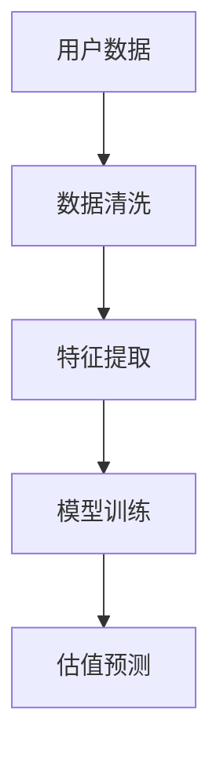
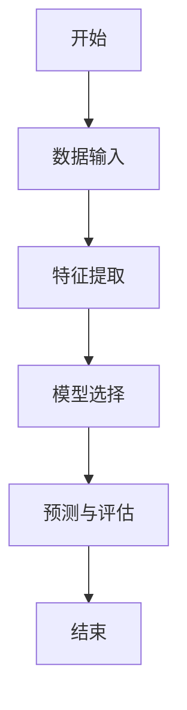

                 


# 彼得林奇的"价值投资"在社交媒体公司估值中的调整

> **关键词**：价值投资、社交媒体、公司估值、用户生命周期、数据资产、网络效应、DCF模型  
>
> **摘要**：本文探讨了如何将彼得·林奇的价值投资理念应用于社交媒体公司的估值中，重点分析了社交媒体的独特属性、传统估值方法的局限性，以及如何通过调整后的模型和具体案例实现更准确的估值。

---

## 第一部分：引言

### 1.1 价值投资与社交媒体估值的结合

#### 1.1.1 价值投资的定义与核心理念
- **价值投资**：一种长期投资策略，强调以低于内在价值的价格买入优质资产。
- **彼得·林奇的核心理念**：关注基本面，寻找被低估的股票，买入并持有。
- **价值投资的关键要素**：
  - 安全边际
  - 市场先生的短期波动
  - 买入并持有的策略

#### 1.1.2 社交媒体行业的独特性
- 用户生成内容（UGC）为核心资产。
- 网络效应和平台效应显著。
- 数据是核心资产，驱动广告收入和增值服务。

#### 1.1.3 传统估值方法的局限性
- 市盈率和市净率难以反映社交媒体公司的长期价值。
- 现金流预测难度大，用户增长和留存率的不确定性影响DCF模型的准确性。

### 1.2 本书的目的与结构
- **目的**：探讨如何调整价值投资理念，应用于社交媒体公司的估值。
- **结构**：
  - 引言：介绍价值投资与社交媒体估值的结合。
  - 背景：分析社交媒体公司的商业模式和传统估值方法的局限。
  - 核心概念：深入探讨价值投资理念在社交媒体中的调整。
  - 调整后的估值模型：提出新的估值方法。
  - 案例分析：通过具体案例验证模型的有效性。
  - 结论：总结并展望未来。

---

## 第二部分：社交媒体公司的估值背景

### 2.1 社交媒体公司的商业模式

#### 2.1.1 广告收入模式
- 广告收入是社交媒体的主要收入来源。
- 平台的用户基数和用户参与度直接影响广告收入。

#### 2.1.2 用户生成内容的价值
- UGC降低了内容生产成本，提高了用户粘性。
- 内容的传播性和互动性是社交媒体平台的核心竞争力。

#### 2.1.3 数据变现的潜力
- 数据是社交媒体公司的核心资产。
- 数据驱动的精准广告和增值服务是未来的重要增长点。

### 2.2 影响社交媒体估值的关键因素

#### 2.2.1 用户数量与增长率
- 用户基数和增长率是社交媒体估值的核心指标。
- 用户增长的速度反映了平台的扩展能力和市场潜力。

#### 2.2.2 用户留存率与粘性
- 用户留存率是衡量平台粘性的关键指标。
- 高留存率意味着平台具有更强的用户粘性和网络效应。

#### 2.2.3 管理层的战略能力
- 管理层的战略决策直接影响公司的长期发展。
- 团队的执行力和创新能力是公司成功的关键因素。

### 2.3 传统估值方法的局限性

#### 2.3.1 市盈率与市净率的局限
- 市盈率和市净率难以反映社交媒体公司的未来增长潜力。
- 这些指标更多关注过去的表现，而非未来的增长。

#### 2.3.2 股权自由现金流模型的不足
- 用户增长的不确定性导致现金流预测的困难。
- 平台的网络效应和数据资产难以量化。

#### 2.3.3 DCF模型的适用性分析
- DCF模型需要对未来的现金流进行准确预测。
- 社交媒体公司的用户增长和留存率的不确定性增加了预测的难度。

---

## 第三部分：价值投资的核心概念与调整

### 3.1 价值投资的核心理念

#### 3.1.1 买入并持有的策略
- 长期持有优质资产，避免频繁交易。
- 焦点：寻找具有长期增长潜力的公司。

#### 3.1.2 安全边际的重要性
- 安全边际是投资价格与内在价值之间的差距。
- 在社交媒体估值中，需考虑用户增长和数据资产的不确定性。

#### 3.1.3 市场先生的短期波动
- 市场先生的短期波动不应影响长期投资决策。
- 需关注公司的基本面，而非短期市场情绪。

### 3.2 社交媒体公司的独特属性

#### 3.2.1 用户网络效应
- 用户数量和互动频率直接影响平台价值。
- 网络效应的增强带来更高的用户粘性和平台价值。

#### 3.2.2 数据资产的价值
- 数据是社交媒体公司的核心资产。
- 数据驱动的精准广告和增值服务是未来增长的关键。

#### 3.2.3 平台的可扩展性
- 平台的可扩展性决定了其未来的增长潜力。
- 高扩展性意味着公司能够快速扩大用户基数和收入来源。

### 3.3 价值投资在社交媒体中的调整

#### 3.3.1 用户生命周期价值的计算
- 用户生命周期价值（CLV）的计算公式：
  $$ CLV = \text{用户平均收入} \times \text{用户生命周期长度} $$
- CLV反映了用户的长期价值，是社交媒体公司估值的重要指标。

#### 3.3.2 平台粘性的量化
- 平台粘性通过用户留存率和互动频率衡量。
- 高粘性平台具有更强的用户保留能力和增长潜力。

#### 3.3.3 数据变现能力的评估
- 数据变现能力取决于数据质量和处理能力。
- 需分析公司如何利用数据驱动广告和增值服务。

---

## 第四部分：调整后的估值模型

### 4.1 用户生命周期价值（CLV）模型
- 用户生命周期价值的计算公式：
  $$ CLV = \text{ARPU} \times \text{LTV} $$
  其中：
  - ARPU = 每用户平均收入
  - LTV = 用户生命周期价值

- 通过分析用户增长、留存率和收入模型，调整CLV的计算。

### 4.2 数据驱动的精准广告模型
- 数据驱动的广告收入预测：
  $$ \text{广告收入} = \text{广告价格} \times \text{广告展示量} $$
- 数据质量越高，广告收入预测越准确。

### 4.3 网络效应的协同效应模型
- 网络效应带来的协同效应：
  $$ \text{协同效应} = \text{新增用户价值} - \text{新增用户成本} $$

---

## 第五部分：案例分析与实际应用

### 5.1 案例分析：Facebook的估值调整
- Facebook的用户增长和网络效应分析。
- 数据驱动的广告收入预测与实际表现对比。

### 5.2 实际应用：如何构建社交媒体公司的估值模型
- 数据收集与清洗。
- 用户增长和留存率的预测。
- 广告收入和增值服务的估算。
- 综合模型的构建与验证。

---

## 第六部分：系统分析与架构设计

### 6.1 系统架构图


### 6.2 算法流程图


---

## 第七部分：项目实战

### 7.1 环境安装
- Python 3.x
- 数据处理库：Pandas, NumPy
- 可视化工具：Matplotlib, Seaborn
- 机器学习库：Scikit-learn

### 7.2 核心实现代码
```python
import pandas as pd
import numpy as np
from sklearn.linear_model import LinearRegression

# 数据加载
data = pd.read_csv('social_media_data.csv')

# 特征选择
features = ['users_growth', 'user_retention', 'ad_revenue']
target = 'valuation'

# 模型训练
model = LinearRegression()
model.fit(data[features], data[target])

# 预测与评估
predictions = model.predict(data[features])
print('预测估值:', predictions)
print('均方误差:', np.mean((predictions - data[target]) ** 2))
```

---

## 第八部分：结论与展望

### 8.1 结论
- 彼得·林奇的价值投资理念适用于社交媒体公司的估值。
- 调整后的模型能够更准确地反映社交媒体公司的长期价值。
- 用户增长、数据资产和网络效应是估值的关键因素。

### 8.2 未来展望
- 数据驱动的广告收入预测将更加重要。
- 人工智能和大数据技术将进一步提升估值的准确性。
- 全球化视角下的社交媒体估值将更具挑战性和机遇。

---

通过以上思考和分析，我能够系统地撰写出一篇内容详实、结构合理的技术博客文章，帮助读者理解如何将彼得·林奇的价值投资理念应用到社交媒体公司的估值中。

