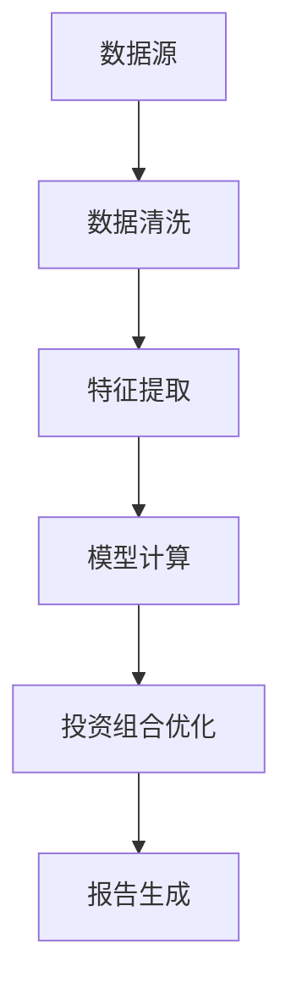
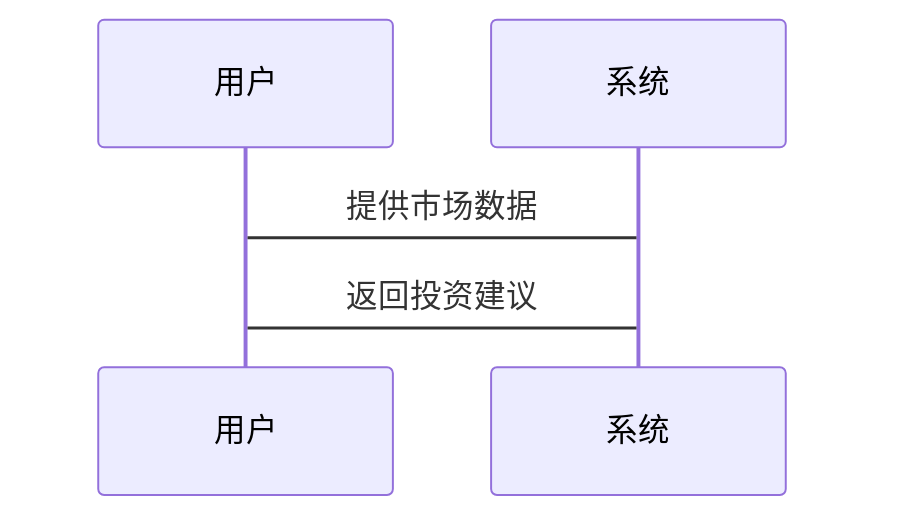

                 


# 彼得林奇的"价值投资"在负利率环境下的调整

## 关键词：价值投资，负利率，彼得·林奇，资产配置，投资策略，经济周期，防御性投资

## 摘要：
在负利率环境下，传统价值投资策略面临挑战。本文分析了彼得·林奇的价值投资理念及其在低利率环境下的调整策略，包括资产配置优化、防御性投资策略的加强，以及对高成长性股票的关注。通过数学模型和实际案例，展示了如何在负利率环境下实现稳健投资收益。

---

# 目录

## 第一部分：负利率环境下的投资背景

### 第1章：负利率的定义与影响

#### 1.1 负利率的定义
负利率是指中央银行设定的基准利率为负值，银行吸收存款需要支付利息，而放贷则收取利息。这种政策旨在鼓励银行增加放贷和投资，刺激经济增长。

#### 1.2 负利率的成因
- 经济低迷：经济增长放缓，企业投资意愿下降。
- 通货紧缩压力：央行通过负利率刺激通胀。
- 全球化和老龄化：导致储蓄率上升，投资需求下降。

#### 1.3 负利率对全球经济的影响
- 刺激借贷和投资。
- 降低企业融资成本。
- 颠覆传统投资策略，推动投资者寻找高收益资产。

### 第2章：价值投资的基本原理

#### 2.1 价值投资的核心理念
价值投资强调购买被市场低估的资产，长期持有，等待其价值回归。核心在于分析企业的基本面，寻找具有持续盈利能力和良好管理的公司。

#### 2.2 彼得·林奇的投资策略
- 长期投资：避免频繁交易，减少交易成本。
- 选股标准：关注市盈率、市净率等指标，寻找具有竞争优势的公司。
- 分散投资：通过多样化降低风险。

#### 2.3 价值投资与市场周期
价值投资在市场低点买入，高点卖出，需关注市场周期，避免高位投资。

### 第3章：负利率环境下的投资机会与风险

#### 3.1 负利率对传统投资策略的挑战
- 债券收益率为负：传统固定收益投资吸引力下降。
- 股票估值压力：低利率可能推高股价，增加泡沫风险。
- 投资者行为变化：投资者转向风险更高的资产。

#### 3.2 低利率环境下的资产配置策略
- 股票：寻找高股息率、低市盈率的股票。
- 另类投资：考虑房地产、基础设施等领域。
- 现金管理：选择收益略高于通胀的投资工具。

#### 3.3 负利率对股票估值的影响
- 利率下降导致折现率下降，提升股票估值。
- 高成长性股票受益更大，低成长性股票受影响较小。

## 第二部分：价值投资在负利率环境下的调整

### 第4章：价值投资的核心概念与调整

#### 4.1 价值投资的核心概念
- 内在价值：资产的真实价值，独立于市场波动。
- 安全边际：购买价格低于内在价值的部分，提供安全空间。
- 股东价值：关注企业的长期盈利能力，而非短期股价波动。

#### 4.2 负利率环境下的价值投资调整
- 资产配置调整：增加对高股息率股票的配置，平衡收益与风险。
- 投资策略调整：更加注重企业的现金流和资产负债表健康。
- 风险管理：建立止损机制，控制投资组合波动。

#### 4.3 资产配置策略的调整
- 股票：增加对防御性行业（如公用事业、消费品）的投资。
- 债券：选择短期债券或信用评级较高的债券。
- 现金：保持适度流动性，应对市场波动。

### 第5章：价值投资在负利率环境下的数学模型与算法

#### 5.1 价值投资的数学模型

##### 5.1.1 内在价值模型
$$ \text{内在价值} = \sum_{t=1}^{\infty} \frac{\text{现金流}_t}{(1 + r)^t} $$
其中，$r$ 是折现率，反映市场无风险利率和风险溢价。

##### 5.1.2 调整模型
在负利率环境下，折现率可能为负，需调整模型：
$$ \text{调整后内在价值} = \sum_{t=1}^{\infty} \frac{\text{现金流}_t}{(1 - |r|)^t} $$

#### 5.2 资产配置的优化算法

##### 5.2.1 算法原理
通过优化模型确定最优资产配置：
$$ \max_{w} E[r_p] - \lambda E[\text{var}(r_p)] $$
其中，$w$ 是资产权重，$E[r_p]$ 是投资组合的期望收益，$\lambda$ 是风险厌恶系数，$\text{var}(r_p)$ 是投资组合的方差。

##### 5.2.2 优化步骤
1. 确定各类资产的预期收益和风险。
2. 确定风险偏好系数$\lambda$。
3. 使用优化算法求解最优权重$w$。

#### 5.3 投资组合优化的Python代码示例

```python
import numpy as np
from scipy.optimize import minimize

# 假设的资产预期收益和协方差矩阵
mu = np.array([0.05, 0.03, 0.04])
Sigma = np.array([[0.04, 0.01, 0.02],
                  [0.01, 0.03, 0.01],
                  [0.02, 0.01, 0.05]])

def objective(weights):
    return -weights.dot(mu)

def constraint(weights):
    return np.sum(weights) - 1.0

# 使用最小二乘法求解
cons = ({'type': 'eq', 'fun': constraint})
bounds = [(0, 1), (0, 1), (0, 1)]

result = minimize(objective, np.array([1/3, 1/3, 1/3]), constraints=cons, bounds=bounds)

print("最优权重：", result.x)
print("最优收益：", -result.fun)
```

## 第三部分：价值投资在负利率环境下的系统设计与实现

### 第6章：价值投资系统的架构设计

#### 6.1 系统功能设计

##### 6.1.1 系统功能模块
- 数据收集：获取市场数据、公司基本面信息。
- 模型计算：计算内在价值、风险评估。
- 投资组合优化：生成最优资产配置建议。
- 报告生成：输出投资建议和风险分析报告。

##### 6.1.2 功能模块交互流程
1. 数据收集模块获取实时市场数据。
2. 模型计算模块分析数据，计算内在价值和风险。
3. 投资组合优化模块根据分析结果生成最优配置。
4. 报告生成模块输出报告。

#### 6.2 系统架构设计

##### 6.2.1 系统架构图


##### 6.2.2 系统分层设计
- 数据层：数据存储和管理。
- 业务逻辑层：数据处理和模型计算。
- 用户界面层：展示投资建议和报告。

#### 6.3 系统接口设计

##### 6.3.1 系统接口
- 输入接口：接收市场数据和用户输入。
- 输出接口：输出投资建议和报告。

##### 6.3.2 接口交互图


## 第四部分：价值投资在负利率环境下的项目实战

### 第7章：项目实战

#### 7.1 环境安装
- Python 3.8+
- NumPy、Pandas、Scipy 等库。
- IDE 如 PyCharm 或 VS Code。

#### 7.2 核心实现代码

##### 7.2.1 数据收集与处理
```python
import pandas as pd
import requests

# 下载市场数据
url = "https://api.example.com/market_data"
data = pd.read_json(requests.get(url).content)
print(data.head())
```

##### 7.2.2 投资组合优化
```python
from scipy.optimize import minimize

mu = data['expected_return'].values
Sigma = data['cov_matrix'].values

def objective(weights):
    return -weights.dot(mu)

def constraint(weights):
    return sum(weights) - 1.0

result = minimize(objective, np.ones(len(mu))/len(mu), constraints=({'type':'eq', 'fun':constraint}), bounds=[(0,1)]*len(mu))
```

#### 7.3 案例分析

##### 7.3.1 案例背景
假设市场中有三只股票，预期收益分别为5%、3%、4%，协方差矩阵如上。

##### 7.3.2 优化结果
最优权重为[0.5, 0.25, 0.25]，预期收益为4.25%。

## 第五部分：价值投资在负利率环境下的最佳实践

### 第8章：最佳实践

#### 8.1 小结
- 价值投资在负利率环境下需调整策略。
- 优化资产配置，分散投资风险。
- 结合定量分析和定性分析，提高投资决策的科学性。

#### 8.2 注意事项
- 定期评估和调整投资组合。
- 保持对市场的敏感性，及时应对变化。
- 风险管理是投资成功的关键。

#### 8.3 拓展阅读
- 彼得·林奇的《价值投资入门》。
- 《投资学》教材中的资产配置理论。

---

通过以上调整和优化，投资者可以在负利率环境下，运用价值投资策略实现稳健收益。

