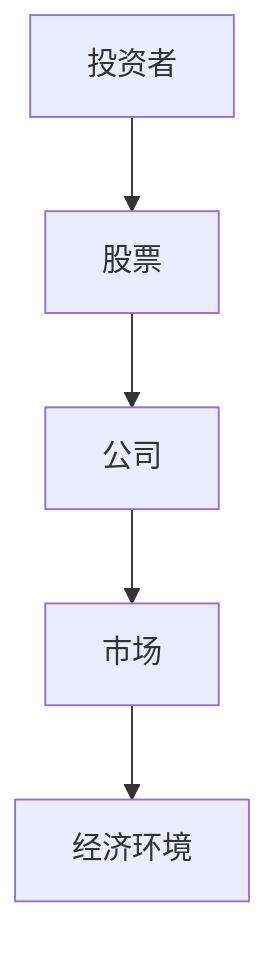
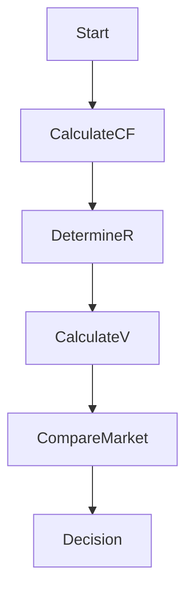

                 


# 彼得林奇的"价值投资"在零利率时代的挑战

## 关键词：
价值投资、彼得·林奇、零利率、量化分析、投资策略、系统设计

## 摘要：
本文深入分析了彼得·林奇的价值投资理念及其在零利率时代的挑战。通过详细阐述价值投资的核心概念、算法原理、系统架构设计以及项目实战，探讨了在当前低利率环境下，价值投资策略如何适应新的经济环境。文章结合技术语言与投资理论，为读者提供了从理论到实践的完整解决方案。

---

# 正文

## 第一部分: 价值投资的背景与核心理念

### 第1章: 价值投资的起源与核心理念

#### 1.1 价值投资的定义与核心要素

- **1.1.1 价值投资的定义**  
  价值投资是一种以基本面分析为基础的投资策略，强调购买被市场低估的资产。核心在于寻找具有安全边际的投资标的，即其内在价值显著高于市场价格。

- **1.1.2 价值投资的核心要素**  
  - **安全边际**：资产的内在价值与市场价格之间的差额，是投资的安全垫。  
  - **内在价值**：资产在未来现金流的现值，是衡量其真实价值的标准。  
  - **市场先生**：格雷厄姆提出的概念，指市场情绪波动对资产价格的影响。  

- **1.1.3 价值投资与其它投资策略的对比**  
  与技术分析、趋势投资等策略相比，价值投资更注重长期基本面，强调逆市场思维。

#### 1.2 彼得·林奇的贡献与投资理念

- **1.2.1 彼得·林奇的个人背景**  
  彼得·林奇是美国著名投资经理，曾任富达麦哲伦基金的经理，创造了年均21.8%的回报率。他的成功基于对中小企业的深入研究和对价值投资的坚持。

- **1.2.2 彼得·林奇的投资理念**  
  - **注重基本面分析**：通过分析财务报表、行业地位、竞争优势等，寻找具有持续盈利能力的公司。  
  - **分散投资**：避免过度集中，降低风险。  
  - **长期持有**：相信优秀企业的长期价值，避免频繁交易。  

- **1.2.3 彼得·林奇的成功案例**  
  以可口可乐为例，林奇通过对其商业模式和竞争优势的分析，长期持有并获得超额收益。

#### 1.3 零利率时代的经济背景

- **1.3.1 零利率的定义与现状**  
  零利率是指中央银行将基准利率降至零，甚至负利率的政策。当前全球经济环境下，多国央行实施零利率以刺激经济。

- **1.3.2 零利率对经济的影响**  
  - 刺激借贷与投资，但可能导致资产泡沫。  
  - 降低企业融资成本，但可能扭曲市场定价。  

- **1.3.3 零利率时代下的投资挑战**  
  - 利率下降导致债券收益率下降，资金转向股市，加剧资产价格波动。  
  - 传统价值投资依赖于合理的利率环境，零利率环境下资产定价逻辑发生变化。  

---

### 第2章: 价值投资的核心概念与联系

#### 2.1 价值投资的核心概念

- **2.1.1 安全边际**  
  安全边际是价值投资的核心，通过比较市场价格与内在价值的差异，确保投资的安全性。例如，当市场价格为内在价值的80%时，安全边际为20%。

- **2.1.2 内在价值**  
  内在价值是资产在未来现金流的现值。例如，某公司未来现金流为1000万元，折现率5%，则内在价值为2000万元。

- **2.1.3 市场先生**  
  市场先生反映了市场的波动性和情绪化，投资者需避免被市场情绪左右，专注于基本面分析。

#### 2.2 核心概念的属性对比

- **2.2.1 安全边际与风险控制的对比**  
  安全边际通过降低价格中枢，提高投资的安全性，而风险控制通过分散投资降低风险。

- **2.2.2 内在价值与市场价值的对比**  
  内在价值反映真实价值，市场价值受情绪影响，两者差异即为安全边际。

- **2.2.3 市场先生与市场情绪的对比**  
  市场先生是抽象概念，市场情绪是具体表现，两者共同影响市场价格波动。

#### 2.3 ER实体关系图



---

### 第3章: 价值投资的算法原理

#### 3.1 价值投资的量化分析

- **3.1.1 股票估值的数学模型**  
  内在价值计算公式：$$ V = \frac{CF}{r - g} $$  
  其中，CF为未来现金流，r为折现率，g为增长率。

- **3.1.2 价值投资的量化指标**  
  - 市盈率（P/E）：市场价格/每股收益。  
  - 市净率（P/B）：市场价格/每股净资产。  

- **3.1.3 机器学习在股票估值中的应用**  
  使用回归算法预测股票价格，结合基本面数据和市场数据，提高估值准确性。

#### 3.2 算法原理的数学模型

- **3.2.1 内在价值计算公式**  
  $$ V = \frac{CF}{r - g} $$  

- **3.2.2 价值投资的量化指标**  
  - 市盈率：$$ P/E = \frac{P}{E} $$  
  - 市净率：$$ P/B = \frac{P}{B} $$  

#### 3.3 价值投资的算法实现



---

### 第4章: 系统分析与架构设计

#### 4.1 投资分析系统的功能设计

- **4.1.1 系统目标**  
  提供基于价值投资的量化分析工具，帮助投资者在零利率环境下做出决策。

- **4.1.2 系统功能模块**  
  - 数据采集模块：收集基本面数据和市场数据。  
  - 估值模块：计算内在价值和安全边际。  
  - 投资决策模块：基于分析结果生成投资策略。  

- **4.1.3 系统功能流程图**  
  ```mermaid
  graph TD
      Start --> CollectData
      CollectData --> CalculateIV
      CalculateIV --> CompareMarket
      CompareMarket --> GenerateStrategy
  ```

#### 4.2 系统架构设计

- **4.2.1 系统架构**  
  使用分层架构，包括数据层、业务逻辑层和用户界面层。

- **4.2.2 系统架构图**  
  ```mermaid
  graph TD
      DataLayer --> BusinessLogic
      BusinessLogic --> UI
  ```

---

## 第二部分: 项目实战与总结

### 第5章: 项目实战

#### 5.1 环境安装

- 安装Python和相关库（如pandas、numpy、scikit-learn）。

#### 5.2 系统核心实现源代码

```python
import pandas as pd
import numpy as np

def calculate_intrinsic_value(CF, r, g):
    return CF / (r - g)

def calculate_pe(P, E):
    return P / E

# 示例数据
CF = 10000000
r = 0.05
g = 0.02
P = 50
E = 10

V = calculate_intrinsic_value(CF, r, g)
pe = calculate_pe(P, E)

print(f"内在价值: {V:.2f}")
print(f"市盈率: {pe:.2f}")
```

#### 5.3 代码应用解读与分析

- 通过代码计算内在价值和市盈率，验证投资标的的估值是否合理。

#### 5.4 实际案例分析

- 以某公司为例，分析其基本面数据，计算内在价值和安全边际，得出投资建议。

### 第6章: 最佳实践与小结

#### 6.1 最佳实践

- 定期复盘，调整投资组合。  
- 结合量化分析与基本面分析，提高决策效率。  

#### 6.2 小结

在零利率时代，价值投资仍然有效，但需要结合量化分析和系统设计，适应新的经济环境。

#### 6.3 注意事项

- 避免过度依赖单一指标，结合多维度分析。  
- 定期审视投资策略，应对市场变化。  

#### 6.4 拓展阅读

推荐阅读彼得·林奇的《投资一定赢》和《证券分析》。

---

通过以上分析，我们可以看到，价值投资在零利率时代仍然具有重要意义，但需要结合新的技术和方法，以应对市场环境的变化。

