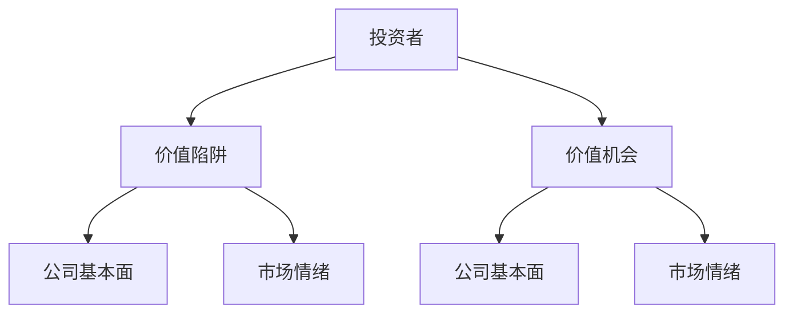

                 

# 彼得林奇的"价值陷阱"vs"价值机会"

## 关键词：彼得林奇，价值陷阱，价值机会，投资策略，案例分析，风险管理

## 摘要：本文深入分析了彼得·林奇提出的“价值陷阱”和“价值机会”概念，探讨了它们的定义、识别方法、区别与联系，并通过实际案例分析了如何在投资中避免价值陷阱，抓住价值机会。文章结合投资策略和风险管理，为读者提供了实用的指导和建议。

---

## 第一部分：引言

### 第1章：彼得林奇与价值投资概述

#### 1.1 彼得林奇的背景与投资理念

彼得·林奇是全球著名的价值投资者，曾任富达麦哲伦基金的经理。他以严谨的投资风格和卓越的投资业绩闻名。林奇的投资理念强调深入研究公司基本面，寻找具有长期增长潜力的股票。他的成功在于对市场的深刻理解以及对价值投资原则的坚持。

#### 1.2 价值陷阱与价值机会的概念

在投资领域，价值陷阱和价值机会是两个看似矛盾但又密切相关的概念。价值陷阱指的是表面上看似便宜，但实际上存在严重问题的股票或资产。而价值机会则是指那些被市场低估，但具有长期增长潜力的投资标的。正确区分这两者是投资者在做出投资决策时的关键。

---

## 第二部分：价值陷阱的识别与分析

### 第2章：价值陷阱的核心要素与识别方法

#### 2.1 价值陷阱的定义与分类

价值陷阱通常表现为市场价格低于内在价值，但实际投资中存在难以察觉的问题，如管理层腐败、财务造假、行业衰退等。价值陷阱可以分为两类：基本面陷阱和市场陷阱。

- **基本面陷阱**：公司基本面存在严重问题，如高负债、低利润率、管理不善等。
- **市场陷阱**：市场对公司的未来预期过于乐观，导致股价被高估，但实际情况可能与预期不符。

#### 2.2 识别价值陷阱的关键指标

投资者可以通过以下财务指标和市场指标来识别价值陷阱：

- **财务指标**：
  - 市盈率（P/E）：若P/E远低于行业平均水平，需警惕潜在陷阱。
  - 市净率（P/B）：若P/B远低于行业平均水平，需进一步分析公司资产质量。
  - 净利润增长率：若净利润持续下滑，需警惕基本面问题。
  
- **市场指标**：
  - 市场情绪：若市场情绪过于乐观，可能存在泡沫。
  - 股价波动性：若股价波动剧烈，可能隐藏风险。

#### 2.3 价值陷阱的经典案例分析

- **案例一：安然公司**  
  安然公司在财务造假事件前，其股价看似合理，但公司实际上存在严重的财务问题和管理问题，最终导致投资者的重大损失。

- **案例二：乐视网**  
  乐视网在停牌前股价暴跌，暴露了公司巨额债务和持续亏损的问题，投资者未能及时识别这些风险，导致重大损失。

---

## 第三部分：价值机会的识别与分析

### 第3章：价值机会的核心要素与识别方法

#### 3.1 价值机会的定义与分类

价值机会是指那些被市场低估，但具有长期增长潜力的股票或资产。价值机会可以分为两类：周期性机会和结构性机会。

- **周期性机会**：由于市场周期性波动导致的暂时性低估。
- **结构性机会**：由于行业或公司基本面改善导致的长期低估。

#### 3.2 识别价值机会的关键指标

识别价值机会时，投资者需要关注以下指标：

- **财务指标**：
  - 市盈率（P/E）：若P/E远低于行业平均水平，可能存在价值机会。
  - 市净率（P/B）：若P/B远低于行业平均水平，需分析公司资产质量。
  - 净利润增长率：若净利润持续增长，可能存在价值机会。

- **市场指标**：
  - 市场情绪：若市场情绪低迷，可能存在价值机会。
  - 股价波动性：若股价波动较小，可能存在价值机会。

#### 3.3 价值机会的经典案例分析

- **案例一：亚马逊**  
  在互联网泡沫破裂后，亚马逊的股价一度被市场低估，但其持续的创新能力使其成为价值机会。

- **案例二：苹果公司**  
  在2009年全球经济危机期间，苹果公司的股价被市场低估，但其创新能力和强大的市场需求使其成为长期价值机会。

---

## 第四部分：价值陷阱与价值机会的对比分析

### 第4章：价值陷阱与价值机会的对比

#### 4.1 价值陷阱与价值机会的对比表格

| 对比维度       | 价值陷阱                     | 价值机会                     |
|----------------|------------------------------|------------------------------|
| 定义           | 表面便宜，但存在严重问题       | 表面便宜，但具有长期增长潜力 |
| 财务指标       | 负债高，利润低               | 负债低，利润增长              |
| 市场指标       | 市场情绪乐观，股价高估        | 市场情绪低迷，股价低估        |
| 投资策略       | 避免投资，规避风险           | 把握机会，长期持有            |

#### 4.2 价值陷阱与价值机会的ER实体关系图

---

## 第五部分：投资策略与风险管理

### 第5章：基于价值陷阱与价值机会的投资策略

#### 5.1 投资策略的制定

- **策略一：远离价值陷阱**  
  通过深入研究公司基本面和市场情绪，避免投资于存在严重问题的公司。

- **策略二：把握价值机会**  
  寻找被市场低估但具有长期增长潜力的公司，进行长期投资。

#### 5.2 风险管理与控制

- **风险管理措施**：
  - 设置止损点，避免亏损扩大。
  - 分散投资，降低单一资产的风险。
  - 定期复盘，及时调整投资组合。

---

## 第六部分：实际案例分析与实战技巧

### 第6章：实际案例分析与实战技巧

#### 6.1 经典投资案例分析

- **案例一：避开价值陷阱**  
  投资者在2008年全球金融危机期间，避免投资于 Lehman Brothers（雷曼兄弟），因其存在严重的财务问题和管理问题。

- **案例二：抓住价值机会**  
  投资者在2009年全球经济危机期间，投资于苹果公司，因其具有强大的创新能力和长期增长潜力。

#### 6.2 实战技巧与操作指南

- **技巧一：深入研究公司基本面**  
  通过分析财务报表和行业趋势，识别公司的核心竞争力和潜在风险。

- **技巧二：关注市场情绪**  
  通过观察市场情绪和股价波动，判断是否存在价值机会或价值陷阱。

---

## 第七部分：总结与展望

### 第7章：总结与展望

#### 7.1 全书总结

彼得林奇的价值投资理念强调深入研究公司基本面，识别价值陷阱和价值机会。投资者需要通过财务指标和市场指标的分析，避免投资于价值陷阱，同时抓住价值机会。

#### 7.2 未来展望

随着市场环境的变化和投资工具的创新，价值投资将继续演变。投资者需要不断学习和适应，以抓住新的价值机会，规避新的价值陷阱。

---

## 参考文献

1. 彼得·林奇：《彼得林奇的 investing.com》
2. 投资学基础教材
3. 相关投资研究报告

---

## 最佳实践 tips

- **深入研究**：在投资前，务必对公司的基本面和市场环境进行深入研究。
- **分散投资**：避免将所有资金投入到单一资产中，降低风险。
- **长期持有**：价值机会需要时间来实现其潜力，耐心是关键。

---

通过本文的分析，读者可以更好地理解彼得林奇的价值投资理念，并在实际投资中应用这些知识，避免价值陷阱，抓住价值机会，实现长期稳健的投资收益。

