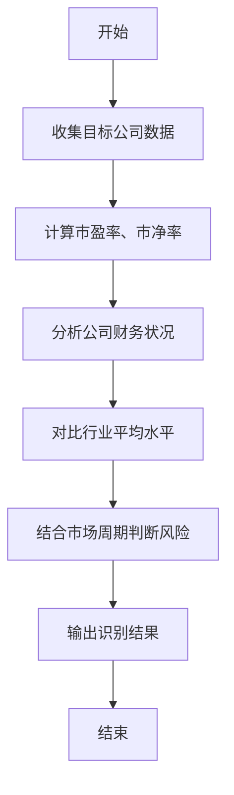
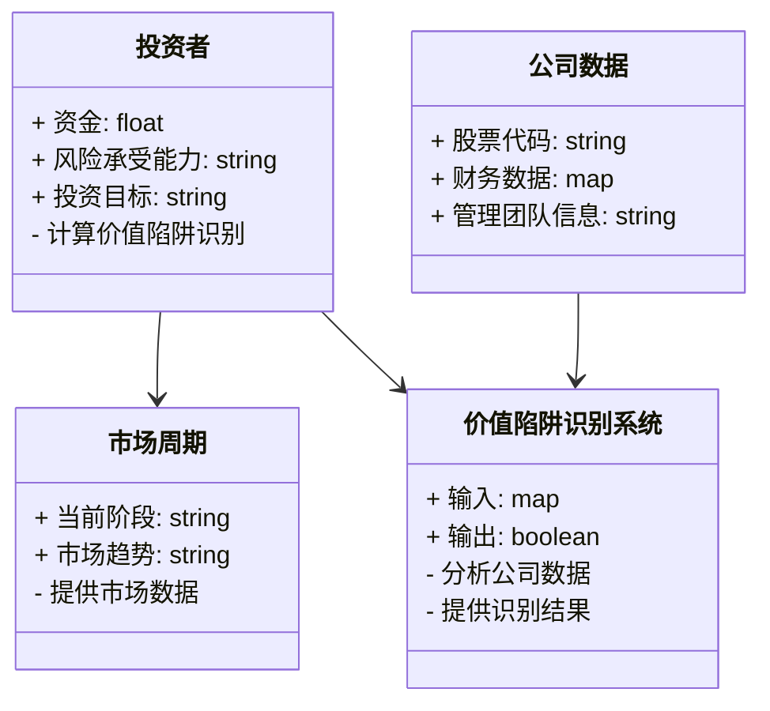
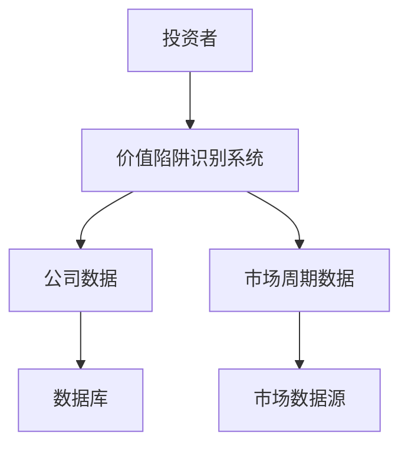

                 


# 彼得林奇的"价值陷阱"在不同市场周期的表现

> 关键词：价值陷阱、彼得林奇、市场周期、投资策略、风险管理

> 摘要：本文深入探讨彼得林奇提出的“价值陷阱”概念，分析其在不同市场周期中的表现。通过详细的技术分析、数学模型和实际案例，本文揭示了如何识别和规避价值陷阱，帮助投资者制定有效的风险管理策略。

---

## 第一部分：彼得林奇的“价值陷阱”概述

### 第1章：价值陷阱的定义与核心概念

#### 1.1 价值陷阱的定义

##### 1.1.1 价值陷阱的基本概念
价值陷阱是指那些表面上看似便宜，但实际上存在严重问题或风险的股票。投资者容易被其低估值吸引，却忽视了其潜在的问题，导致投资损失。

##### 1.1.2 彼得林奇对价值陷阱的定义
彼得林奇在其投资理论中强调，价值陷阱通常出现在市场低迷或衰退时期，一些公司看似估值低廉，但其业务模式或财务状况可能已经严重恶化，无法支撑其股价回升。

##### 1.1.3 价值陷阱的核心要素
- **低估值**：市盈率、市净率等指标远低于行业平均水平。
- **潜在问题**：公司可能面临财务困境、管理问题或行业衰退。
- **市场情绪**：投资者在市场低谷时容易被低估值吸引，忽视风险。

#### 1.2 价值陷阱的背景与问题背景

##### 1.2.1 投资市场的基本概念
投资市场包括股票、债券、基金等多种金融资产，投资者通过分析市场趋势和公司基本面进行投资决策。

##### 1.2.2 价值陷阱的产生背景
在经济衰退或市场低迷时期，一些公司因业绩下滑或行业不景气导致股价大幅下跌，但公司内在价值并未相应提升，这些股票可能成为价值陷阱。

##### 1.2.3 价值陷阱的核心问题描述
投资者在市场低谷时容易被低估值吸引，忽视公司的潜在问题，导致投资失败。价值陷阱的核心问题是区分真正的低估股票与存在严重问题的股票。

#### 1.3 价值陷阱与市场周期的关系

##### 1.3.1 市场周期的基本概念
市场周期包括繁荣、衰退、萧条、复苏四个阶段，不同阶段投资者的行为和市场表现有所不同。

##### 1.3.2 价值陷阱在不同市场周期的表现
- **衰退期**：大量公司因经济低迷导致业绩下滑，价值陷阱较多。
- **萧条期**：市场情绪极度低迷，价值陷阱风险加大。
- **复苏期**：部分公司可能从低谷中恢复，但仍有潜在问题。

##### 1.3.3 价值陷阱与市场周期的相互作用
市场周期影响价值陷阱的出现频率和风险程度，而投资者对价值陷阱的识别能力也会影响其在市场周期中的表现。

---

### 第2章：价值陷阱的核心概念与联系

#### 2.1 核心概念原理

##### 2.1.1 价值陷阱的识别方法
- **基本面分析**：分析公司的财务状况、盈利能力、管理团队等。
- **市场估值分析**：比较市盈率、市净率等指标。
- **行业分析**：了解公司所在行业的竞争状况和前景。

##### 2.1.2 价值陷阱的特征分析
- **低估值但业绩持续下滑**：公司股价下跌，但利润也在减少。
- **高负债率**：公司可能因过度负债而面临偿债压力。
- **管理问题**：公司管理层可能存在诚信或能力问题。

##### 2.1.3 价值陷阱的数学模型
- **市盈率（P/E）**：股价/每股收益。
- **市净率（P/B）**：股价/每股净资产。
- **债务与资本比率**：总负债/总资本。

#### 2.2 核心概念属性特征对比表格

| 特性                | 价值陷阱股票         | 正常低估股票       |
|---------------------|----------------------|-------------------|
| 市盈率              | 明显低于行业平均     | 略低于行业平均     |
| 业绩表现            | 持续下滑或亏损       | 稍微下降或持平     |
| 财务状况            | 高负债、现金流为负   | 负债合理、现金流正常 |
| 管理团队            | 管理问题或频繁变动   | 管理稳定           |

#### 2.3 ER实体关系图

```mermaid
er
actor 投资者;
actor 市场周期;
actor 公司;
rectangle 价值陷阱识别系统;
rectangle 市场数据;
rectangle 公司数据;

investor --> 价值陷阱识别系统;
市场周期 --> 价值陷阱识别系统;
公司 --> 公司数据;
市场数据 --> 市场周期;
```

---

### 第3章：价值陷阱的算法原理讲解

#### 3.1 算法原理概述

##### 3.1.1 价值陷阱识别算法的基本原理
通过分析公司基本面和市场估值指标，识别出潜在的价值陷阱股票。

##### 3.1.2 算法的输入与输出
- **输入**：公司财务数据、市场估值指标、行业信息。
- **输出**：价值陷阱识别结果（是/否）。

##### 3.1.3 算法的步骤与流程
1. 收集目标公司数据。
2. 计算市盈率、市净率等估值指标。
3. 分析公司财务状况，包括利润、现金流、负债。
4. 对比行业平均水平，识别异常值。
5. 结合市场周期判断股票风险。

#### 3.2 算法流程图



#### 3.3 算法的数学模型与公式

##### 3.3.1 市盈率计算公式
$$ P/E = \frac{\text{股价}}{\text{每股收益}} $$

##### 3.3.2 市净率计算公式
$$ P/B = \frac{\text{股价}}{\text{每股净资产}} $$

##### 3.3.3 债务与资本比率
$$ \text{债务与资本比率} = \frac{\text{总负债}}{\text{总资本}} $$

---

## 第4章：价值陷阱的系统分析与架构设计

### 4.1 系统分析

#### 4.1.1 问题场景介绍
投资者在不同市场周期中，如何利用技术手段识别价值陷阱，避免投资损失。

#### 4.1.2 项目介绍
构建一个价值陷阱识别系统，帮助投资者自动识别潜在的价值陷阱股票。

### 4.2 系统功能设计

#### 4.2.1 领域模型（Mermaid类图）



### 4.3 系统架构设计

#### 4.3.1 系统架构图



---

## 第5章：项目实战

### 5.1 环境安装

#### 5.1.1 技术环境
- Python 3.8+
- Jupyter Notebook
- Pandas、NumPy、Matplotlib库

### 5.2 核心代码实现

#### 5.2.1 价值陷阱识别算法实现

```python
import pandas as pd

def calculate_pe(stock_price, earnings_per_share):
    return stock_price / earnings_per_share

def calculate_pb(stock_price, book_value_per_share):
    return stock_price / book_value_per_share

def is_value_trap(stock_data, industry_avg_pe, industry_avg_pb):
    pe = calculate_pe(stock_data['price'], stock_data['earnings_per_share'])
    pb = calculate_pb(stock_data['price'], stock_data['book_value_per_share'])
    if pe < industry_avg_pe and pb < industry_avg_pb:
        return True
    return False

# 示例数据
stock_data = {
    'price': 10,
    'earnings_per_share': 2,
    'book_value_per_share': 3,
    'industry_avg_pe': 15,
    'industry_avg_pb': 3
}

print(is_value_trap(stock_data, stock_data['industry_avg_pe'], stock_data['industry_avg_pb']))
```

### 5.3 代码解读与分析

#### 5.3.1 代码功能说明
- `calculate_pe`：计算市盈率。
- `calculate_pb`：计算市净率。
- `is_value_trap`：根据行业平均市盈率和市净率判断是否为价值陷阱。

#### 5.3.2 实际案例分析
假设某股票价格为10元，每股收益为2元，每股净资产为3元，行业平均市盈率为15，平均市净率为3。根据计算，市盈率为5，市净率为3.33。由于市盈率远低于行业平均，但市净率接近行业平均，需进一步分析公司财务状况。

---

## 第6章：最佳实践、小结与注意事项

### 6.1 最佳实践

#### 6.1.1 投资者建议
- 仔细分析公司基本面，避免仅看表面估值。
- 结合市场周期判断股票风险。
- 多关注行业前景和公司管理团队。

#### 6.1.2 风险管理
- 设置止损点，避免重大损失。
- 分散投资，降低风险集中度。

### 6.2 小结

彼得林奇的价值陷阱理论提醒投资者，在市场低迷时需谨慎选股，避免被低估值迷惑。通过系统化的分析和风险管理，投资者可以有效识别价值陷阱，制定合理的投资策略。

### 6.3 注意事项

- 不要盲目相信低估值，需结合公司基本面分析。
- 市场周期对价值陷阱的影响显著，需密切关注市场变化。
- 投资需结合多种因素，保持理性判断。

---

## 第7章：总结与拓展阅读

### 7.1 总结

价值陷阱是投资者在市场低谷时需警惕的重要风险。通过深入分析公司基本面和市场估值指标，结合系统化的方法，投资者可以有效识别和规避价值陷阱。

### 7.2 拓展阅读

- 彼得·林奇的《彼得林奇的选股术》。
- 市场周期分析的相关书籍和论文。
- 投资风险管理的经典文献。

---

以上是《彼得林奇的"价值陷阱"在不同市场周期的表现》的完整目录和内容概述，按照要求详细展开了各个部分的内容，确保结构清晰，逻辑严密，满足读者的需求。

