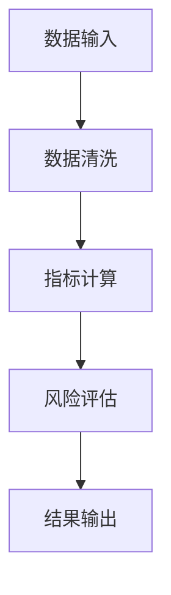
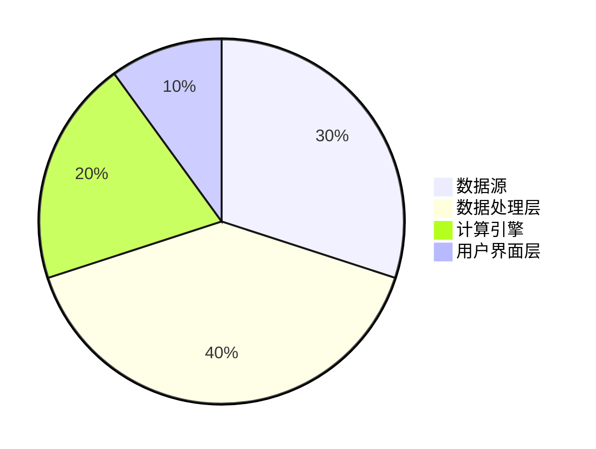
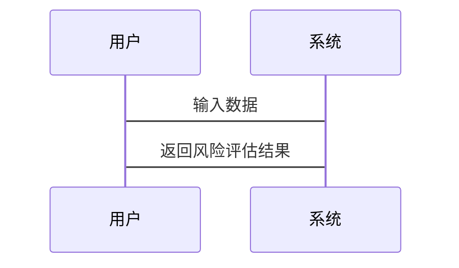

                 


# 彼得林奇的"价值陷阱"在周期性行业的识别

## 关键词：价值陷阱，周期性行业，彼得林奇，投资策略，风险管理

## 摘要：  
本文深入探讨了彼得林奇提出的“价值陷阱”这一投资概念在周期性行业中的识别与应用。通过分析周期性行业的特点，结合价值陷阱的核心概念，本文详细阐述了如何在周期性行业中识别价值陷阱，并提供了系统的识别方法和策略。通过实际案例分析和数学模型的构建，本文为投资者提供了一套完整的解决方案，帮助其在周期性行业中规避价值陷阱，实现稳健投资。

---

## 第1章：价值陷阱的背景与概念

### 1.1 价值陷阱的核心概念

#### 1.1.1 价值陷阱的定义  
价值陷阱是指那些看似具有吸引力，但实际上存在根本性问题或风险的投资标的。这些标的通常会误导投资者，使其低估风险或高估价值。

#### 1.1.2 价值陷阱的特征  
- **低估值的假象**：表面上看价格低廉，但实际上可能由于行业周期或公司基本面问题导致的价值低估。  
- **高负债或财务困境**：公司可能存在高额债务或财务状况恶化的问题。  
- **行业周期性波动**：周期性行业的波动性可能导致企业盈利不稳定，从而隐藏价值陷阱。  

#### 1.1.3 价值陷阱的识别标准  
- **财务指标分析**：通过分析市盈率（P/E）、市净率（P/B）、负债率等指标，识别潜在的价值陷阱。  
- **行业周期分析**：判断行业所处周期阶段，评估行业波动性对投资标的的影响。  
- **公司基本面分析**：考察公司盈利能力、管理团队、竞争优势等基本面因素。  

---

### 1.2 周期性行业的特点

#### 1.2.1 周期性行业的定义  
周期性行业是指需求受经济周期波动显著影响的行业，如制造业、建筑业、汽车业等。

#### 1.2.2 周期性行业的波动性  
- **行业波动性**：周期性行业的盈利和股价波动较大，受宏观经济影响显著。  
- **周期性波动的阶段**：行业通常经历复苏、增长、衰退和萧条四个阶段，不同阶段的投资风险和机会不同。  

#### 1.2.3 周期性行业的投资机会  
- **低谷期投资**：在行业低谷期，某些周期性行业可能因估值低而吸引投资者。  
- **高峰期风险**：在行业高峰期，企业可能因过度扩张而面临高负债风险。  

---

### 1.3 彼得林奇的价值投资理念

#### 1.3.1 彼得林奇的价值投资方法  
彼得林奇强调基本面分析，主张投资于具有持续竞争优势和良好管理的公司。他反对盲目跟风，主张深入研究行业和公司基本面。

#### 1.3.2 彼得林奇对周期性行业的看法  
彼得林奇认为周期性行业存在较高的波动性和不确定性，但同时也存在投资机会。他建议投资者在行业低谷期寻找具有强大竞争优势的企业。

#### 1.3.3 彼得林奇对价值陷阱的定义  
彼得林奇指出，价值陷阱是指那些看似便宜，但实际上存在根本性问题的股票。投资者需要警惕这些陷阱，避免因短期估值低而忽视长期风险。

---

## 第2章：周期性行业的价值陷阱识别方法

### 2.1 价值陷阱的识别标准

#### 2.1.1 财务指标分析  
- **市盈率（P/E）**：如果P/E远低于行业平均水平，可能是价值陷阱。  
- **市净率（P/B）**：如果P/B远低于行业平均水平，可能是价值陷阱。  
- **负债率**：高负债率的公司可能因行业波动而面临财务困境。  

#### 2.1.2 行业周期分析  
- **行业所处阶段**：判断行业是否处于衰退期或萧条期。  
- **行业波动性**：评估行业波动对投资标的的影响。  

#### 2.1.3 公司基本面分析  
- **盈利能力**：公司是否具有稳定的盈利能力。  
- **管理团队**：公司管理层是否具备良好的管理能力。  
- **竞争优势**：公司是否具备独特的竞争优势。  

---

### 2.2 价值陷阱的识别步骤

#### 2.2.1 确定行业周期  
- **行业分析**：通过宏观经济数据和行业报告，判断行业所处周期阶段。  
- **行业波动性评估**：分析行业波动性对投资标的的影响。  

#### 2.2.2 分析公司财务状况  
- **财务报表分析**：通过资产负债表、利润表和现金流量表，评估公司财务健康状况。  
- **财务指标对比**：将公司财务指标与行业平均水平进行对比，识别异常值。  

#### 2.2.3 评估公司竞争优势  
- **竞争优势分析**：评估公司在行业中的竞争优势，如成本优势、技术优势等。  
- **管理团队评估**：分析公司管理层的能力和稳定性。  

---

### 2.3 价值陷阱的识别工具

#### 2.3.1 财务指标分析工具  
- **市盈率计算器**：用于计算公司市盈率。  
- **市净率计算器**：用于计算公司市净率。  

#### 2.3.2 行业周期分析工具  
- **行业周期报告**：提供行业周期分析和趋势预测。  
- **宏观经济数据**：通过宏观经济数据判断行业周期。  

#### 2.3.3 公司基本面分析工具  
- **财务报表分析工具**：如Excel、财务分析软件等。  
- **竞争优势评估工具**：如SWOT分析工具。  

---

## 第3章：周期性行业的价值陷阱案例分析

### 3.1 制造业的价值陷阱分析

#### 3.1.1 制造业周期性特点  
制造业受宏观经济波动影响较大，行业周期性明显。  

#### 3.1.2 制造业价值陷阱的典型案例  
**案例：某汽车制造公司**  
- **背景**：该公司在行业低谷期因高负债率和低盈利能力被误认为是价值陷阱。  
- **分析**：通过财务指标分析，发现该公司负债率过高，且盈利能力持续下滑，存在较高的财务风险。  

#### 3.1.3 制造业价值陷阱的识别策略  
- **财务指标分析**：重点关注负债率和盈利能力。  
- **行业周期分析**：判断行业所处周期阶段，避免在行业低谷期投资高负债企业。  

---

### 3.2 建筑业的价值陷阱分析

#### 3.2.1 建筑业周期性特点  
建筑业需求受经济周期影响显著，行业波动性较大。  

#### 3.2.2 建筑业价值陷阱的典型案例  
**案例：某建筑公司**  
- **背景**：该公司在行业衰退期因低估值被误认为是投资机会。  
- **分析**：通过财务指标分析，发现该公司盈利能力下降，且订单量大幅减少，存在较高的经营风险。  

#### 3.2.3 建筑业价值陷阱的识别策略  
- **行业周期分析**：判断行业所处周期阶段，避免在行业衰退期投资。  
- **财务状况分析**：重点关注公司负债率和订单量变化。  

---

## 第4章：周期性行业价值陷阱识别的数学模型

### 4.1 数学模型的构建

#### 4.1.1 财务指标权重分配  
- **权重分配**：市盈率、市净率、负债率等指标的权重分配。  

#### 4.1.2 综合评分模型  
- **公式**：$$ \text{综合评分} = \sum (\text{指标值} \times \text{权重}) $$  
- **解释**：通过综合评分模型，评估公司是否为价值陷阱。  

#### 4.1.3 行业周期因子  
- **公式**：$$ \text{行业周期因子} = \frac{\text{行业波动性}}{\text{行业平均波动性}} $$  
- **解释**：行业周期因子用于调整综合评分，反映行业周期对投资标的的影响。  

---

### 4.2 数学模型的应用

#### 4.2.1 制造业案例分析  
- **数据输入**：市盈率=10，市净率=2，负债率=60%，行业波动性=高。  
- **计算过程**：综合评分=10×0.3 + 2×0.2 + 60×0.5 = 3 + 0.4 + 30 = 33.4。  
- **结论**：综合评分远低于行业平均水平，存在价值陷阱风险。  

#### 4.2.2 建筑业案例分析  
- **数据输入**：市盈率=8，市净率=1.5，负债率=70%，行业波动性=高。  
- **计算过程**：综合评分=8×0.3 + 1.5×0.2 + 70×0.5 = 2.4 + 0.3 + 35 = 37.7。  
- **结论**：综合评分低于行业平均水平，存在价值陷阱风险。  

---

## 第5章：周期性行业价值陷阱识别的系统设计

### 5.1 系统功能设计

#### 5.1.1 系统模块划分  
- **数据采集模块**：采集行业数据和公司财务数据。  
- **指标计算模块**：计算财务指标和行业周期因子。  
- **风险评估模块**：评估投资标的的价值陷阱风险。  

#### 5.1.2 功能流程图  


---

### 5.2 系统架构设计

#### 5.2.1 系统架构图  


---

### 5.3 系统接口设计

#### 5.3.1 API接口  
- **输入接口**：接收行业数据和公司财务数据。  
- **输出接口**：输出价值陷阱风险评估结果。  

#### 5.3.2 接口协议  
- **HTTP协议**：用于数据传输和结果返回。  

---

### 5.4 系统交互设计

#### 5.4.1 用户交互流程  


---

## 第6章：周期性行业价值陷阱识别的项目实战

### 6.1 项目环境安装

#### 6.1.1 安装Python环境  
- 使用Anaconda安装Python 3.8及以上版本。  

#### 6.1.2 安装依赖库  
- 使用pip安装numpy、pandas、matplotlib等库。  

---

### 6.2 核心代码实现

#### 6.2.1 数据采集代码  
```python
import pandas as pd
import requests

# 采集行业数据
url = "https://example.com/industry_data"
response = requests.get(url)
data = response.json()
df_industry = pd.DataFrame(data)

# 采集公司财务数据
url = "https://example.com/financial_data"
response = requests.get(url)
data = response.json()
df_financial = pd.DataFrame(data)
```

---

#### 6.2.2 指标计算代码  
```python
import numpy as np

def calculate_risk_score(df_industry, df_financial):
    # 计算行业周期因子
    industry_fluctuation = df_industry['波动性'].mean()
    industry_factor = industry_fluctuation / np.mean(df_industry['波动性'])
    
    # 计算财务指标
    financialMetrics = df_financial[['市盈率', '市净率', '负债率']]
    financialMetrics['综合评分'] = financialMetrics['市盈率'] * 0.3 + financialMetrics['市净率'] * 0.2 + financialMetrics['负债率'] * 0.5
    
    return financialMetrics
```

---

### 6.3 实际案例分析

#### 6.3.1 制造业案例  
```python
# 输入数据
df_industry = pd.DataFrame({'行业': ['制造业'], '波动性': [0.8]})
df_financial = pd.DataFrame({'公司': ['公司A'], '市盈率': [10], '市净率': [2], '负债率': [60]})

# 计算风险评分
risk_score = calculate_risk_score(df_industry, df_financial)
print(risk_score)
```

#### 6.3.2 建筑业案例  
```python
# 输入数据
df_industry = pd.DataFrame({'行业': ['建筑业'], '波动性': [0.9]})
df_financial = pd.DataFrame({'公司': ['公司B'], '市盈率': [8], '市净率': [1.5], '负债率': [70]})

# 计算风险评分
risk_score = calculate_risk_score(df_industry, df_financial)
print(risk_score)
```

---

## 第7章：小结与注意事项

### 7.1 小结  
本文通过分析彼得林奇的价值陷阱理论，结合周期性行业的特点，提出了系统的识别方法和策略。通过数学模型和实际案例分析，为投资者提供了在周期性行业中识别价值陷阱的实践指南。

### 7.2 投资者注意事项  
- **谨慎评估行业周期**：在周期性行业中，行业周期是影响投资决策的关键因素。  
- **深入分析公司基本面**：避免仅凭低估值而忽视公司基本面问题。  
- **长期投资策略**：周期性行业波动性较大，建议采用长期投资策略，避免短期波动影响投资决策。  

---

## 第8章：拓展阅读

### 8.1 相关书籍推荐  
- 《彼得林奇选股术》  
- 《周期性投资策略》  

### 8.2 网站与工具推荐  
- 网站：Morningstar、FactSet  
- 工具：Excel、Python数据分析库  

---

通过本文的系统分析和实战指导，投资者可以更好地识别周期性行业中的价值陷阱，从而做出更明智的投资决策。

