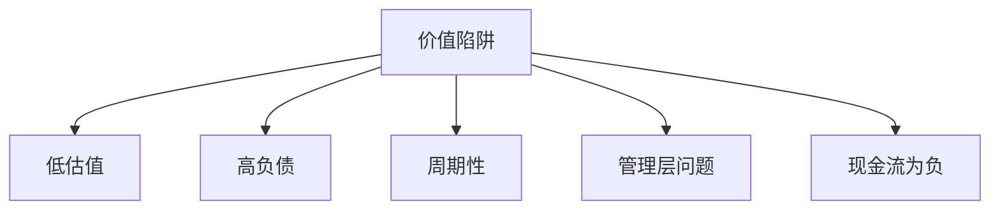
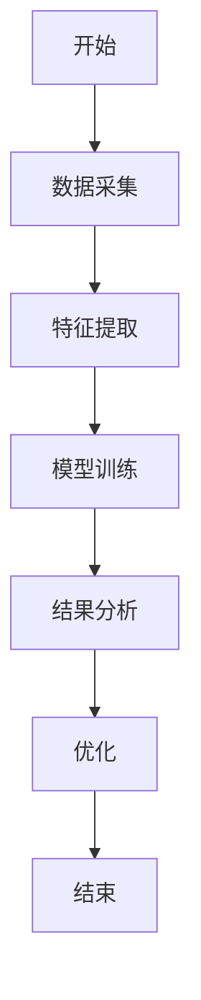
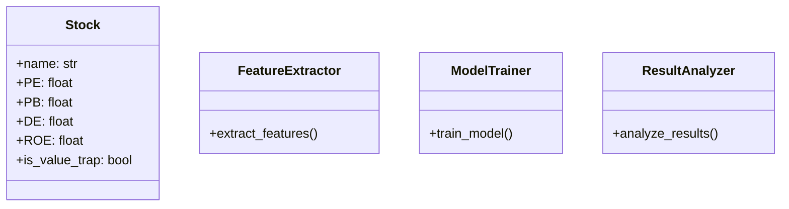
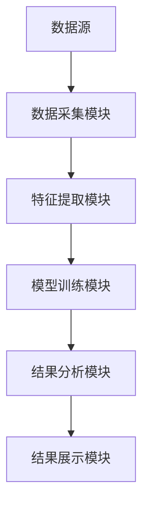

                 


# 彼得林奇的"价值陷阱"识别方法

> 关键词：价值陷阱，彼得林奇，投资策略，价值评估，风险管理

> 摘要：本文系统地介绍了彼得林奇提出的“价值陷阱”概念，详细分析了价值陷阱的特征、识别方法以及避免策略。通过理论与实践相结合，结合具体案例和数学模型，为投资者提供了一套科学的识别体系。

---

# 第一部分: 价值陷阱的背景与概念

## 第1章: 价值陷阱的背景与概念

### 1.1 价值投资的基本概念

#### 1.1.1 价值投资的定义与核心理念
价值投资是一种投资策略，主张通过分析企业的基本面，寻找市场价格低于其内在价值的股票进行投资。其核心理念是：市场先生会时不时地把价格打到低于内在价值的水平，这时候就是投资者出手的好时机。

#### 1.1.2 彼得·林奇的投资风格与成就
彼得·林奇是美国著名的投资经理人，被誉为“最伟大的股票投资者之一”。他在任职富达投资期间，管理的麦哲伦基金取得了高达37倍的回报率，年平均回报率达到13.5%，远超市场平均水平。他的投资理念以基本面分析为核心，强调对企业内在价值的深入研究。

#### 1.1.3 价值陷阱的定义与特征
价值陷阱是指那些看似便宜（市盈率、市净率等指标低于市场平均水平）但实际上存在严重问题的企业。这类企业表面上看像“便宜货”，但实际上可能隐藏着高负债、低利润率、管理层问题等致命缺陷，容易让投资者误判。

---

### 1.2 价值陷阱的常见类型

#### 1.2.1 低估值陷阱
- 表现：市盈率或市净率远低于行业平均水平。
- 特征：企业盈利能力持续下降，或行业前景黯淡。

#### 1.2.2 高负债陷阱
- 表现：资产负债率过高，财务杠杆过大。
- 特征：利息支出过高，偿债压力大。

#### 1.2.3 周期性陷阱
- 表现：企业业绩受经济周期影响较大，当前处于低谷期。
- 特征：行业需求不稳定，企业缺乏核心竞争力。

#### 1.2.4 管理层陷阱
- 表现：管理层素质低下，公司治理存在问题。
- 特征：关联交易频繁，内部腐败或管理混乱。

---

### 1.3 价值陷阱识别的重要性

#### 1.3.1 投资者误判的风险
- 误判价值陷阱可能导致本金损失。
- 低估值可能是企业价值持续下行的信号。

#### 1.3.2 价值陷阱对企业长期发展的负面影响
- 价值陷阱企业难以持续发展，可能面临破产风险。
- 投资者容易因短期价格波动而陷入长期亏损。

#### 1.3.3 正确识别价值陷阱的策略
- 重视企业基本面分析。
- 结合行业周期与企业财务指标综合判断。

---

## 第2章: 价值陷阱的核心概念与联系

### 2.1 价值陷阱的核心要素

#### 2.1.1 低估值的表象
- 低市盈率（P/E）：股价/每股收益。
- 低市净率（P/B）：股价/每股净资产。

#### 2.1.2 高风险的内在因素
- 高负债率（Debt-to-Equity Ratio）。
- 低利润率（Net Profit Margin）。

#### 2.1.3 不合理的财务指标
- 现金流为负（Free Cash Flow）。
- 存货周转率低（Inventory Turnover）。

---

### 2.2 价值陷阱与非价值陷阱的对比

#### 2.2.1 价值陷阱的属性特征对比表格

| 特性            | 价值陷阱              | 非价值陷阱            |
|-----------------|-----------------------|-----------------------|
| 市盈率          | 低于行业平均           | 接近或高于行业平均     |
| 负债率          | 高                   | 适中或低             |
| 净利润          | 持续下降或亏损        | 稳定增长             |
| 现金流          | 负或极少             | 正且充足             |
| 行业前景        | 不佳                 | 良好或增长           |

#### 2.2.2 价值陷阱与其他陷阱的实体关系图



---

## 第3章: 价值陷阱识别的算法原理

### 3.1 价值陷阱识别的算法流程

#### 3.1.1 数据采集与预处理
- 数据来源：股票的财务数据（如营业收入、净利润、资产负债率等）和市场数据（如市盈率、市净率等）。
- 数据清洗：处理缺失值、异常值。

#### 3.1.2 特征提取与选择
- 特征选择：选择与价值陷阱相关的指标，如市盈率、市净率、负债率等。
- 特征工程：标准化处理（如归一化）。

#### 3.1.3 模型训练与评估
- 模型选择：使用逻辑回归（Logistic Regression）或随机森林（Random Forest）进行分类。
- 数据集划分：训练集、验证集、测试集。

#### 3.1.4 结果分析与优化
- 模型调优：调整超参数（如逻辑回归的C值）。
- 评估指标：准确率（Accuracy）、召回率（Recall）、F1分数。

---

### 3.2 价值陷阱识别的数学模型

#### 3.2.1 市盈率模型
$$市盈率 = \frac{股价}{每股收益}$$
- 如果市盈率远低于行业平均水平，需警惕价值陷阱。

#### 3.2.2 市净率模型
$$市净率 = \frac{股价}{每股净资产}$$
- 同样，市净率过低可能意味着企业价值被低估，但也可能是企业资产质量差。

#### 3.2.3 净利润增长率模型
$$净利润增长率 = \frac{今年净利润 - 去年净利润}{去年净利润}$$
- 净利润持续下降的企业可能隐藏着价值陷阱。

---

### 3.3 算法流程图



---

### 3.4 算法实现代码

#### Python代码示例

```python
import pandas as pd
from sklearn.model_selection import train_test_split
from sklearn.linear_model import LogisticRegression
from sklearn.metrics import accuracy_score, recall_score, f1_score

# 数据加载与预处理
df = pd.read_csv('stock_data.csv')
df = df.dropna()

# 特征选择
features = ['PE', 'PB', 'DE', 'ROE']
X = df[features]
y = df['is_value_trap']  # 1表示价值陷阱，0表示非价值陷阱

# 数据标准化
from sklearn.preprocessing import StandardScaler
scaler = StandardScaler()
X_scaled = scaler.fit_transform(X)

# 划分数据集
X_train, X_test, y_train, y_test = train_test_split(X_scaled, y, test_size=0.2, random_state=42)

# 模型训练
model = LogisticRegression(max_iter=1000)
model.fit(X_train, y_train)

# 预测与评估
y_pred = model.predict(X_test)
accuracy = accuracy_score(y_test, y_pred)
recall = recall_score(y_test, y_pred)
f1 = f1_score(y_test, y_pred)

print(f"Accuracy: {accuracy}")
print(f"Recall: {recall}")
print(f"F1 Score: {f1}")
```

---

## 第4章: 价值陷阱识别的系统分析与架构设计

### 4.1 系统分析

#### 4.1.1 项目背景
- 为投资者提供一个自动化识别价值陷阱的系统。
- 帮助投资者快速筛选出潜在的风险企业。

#### 4.1.2 功能需求
- 数据采集模块：获取企业财务数据和市场数据。
- 特征提取模块：提取与价值陷阱相关的特征。
- 模型评估模块：使用机器学习模型进行分类。
- 结果展示模块：可视化分析结果。

---

### 4.2 系统架构设计

#### 4.2.1 领域模型类图



#### 4.2.2 系统架构图



---

## 第5章: 价值陷阱识别的项目实战

### 5.1 环境安装

#### 5.1.1 安装依赖
- Python 3.8+
- Pandas、Scikit-learn、Matplotlib

```bash
pip install pandas scikit-learn matplotlib
```

---

### 5.2 核心实现

#### 5.2.1 数据预处理

```python
import pandas as pd

# 加载数据
df = pd.read_csv('stock_data.csv')

# 删除缺失值
df = df.dropna()

# 标准化处理
from sklearn.preprocessing import StandardScaler
scaler = StandardScaler()
X_scaled = scaler.fit_transform(df[['PE', 'PB', 'DE', 'ROE']])
```

#### 5.2.2 模型训练

```python
from sklearn.linear_model import LogisticRegression

model = LogisticRegression(max_iter=1000)
model.fit(X_scaled, df['is_value_trap'])
```

#### 5.2.3 结果分析

```python
from sklearn.metrics import classification_report

y_pred = model.predict(X_scaled)
print(classification_report(df['is_value_trap'], y_pred))
```

---

## 第6章: 总结与最佳实践

### 6.1 总结

- 价值陷阱识别是一个复杂的系统工程。
- 通过算法和模型可以帮助投资者降低误判风险。
- 综合分析企业基本面和市场数据是关键。

### 6.2 最佳实践 tips

1. **数据来源**：选择可靠的数据源，如Yahoo Finance或FactSet。
2. **特征选择**：结合行业特点选择相关特征。
3. **模型优化**：尝试不同的算法（如随机森林、XGBoost）以提高准确率。
4. **持续监控**：定期更新模型和数据，适应市场变化。

---

### 6.3 注意事项

- 避免单一指标判断，需结合多个维度。
- 价值陷阱识别模型仅供参考，投资需谨慎。

---

### 6.4 拓展阅读

- 《彼得·林奇的股票投资策略》
- 《价值投资实战手册》

---

通过本文的系统介绍，投资者可以更好地理解和识别价值陷阱，避免在投资中陷入低效和亏损的困境。

