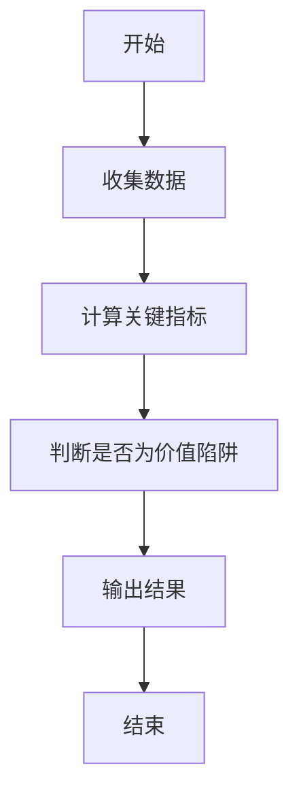
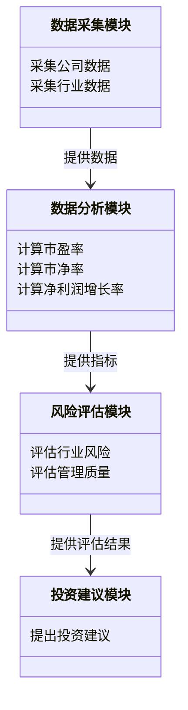
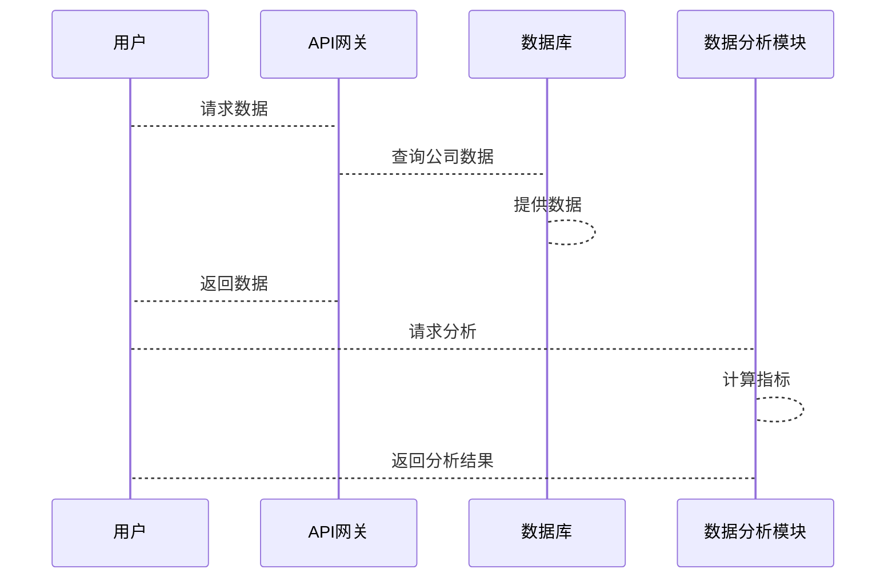

                 


# 彼得林奇的"价值陷阱"避免方法

## 关键词：彼得·林奇，价值陷阱，投资策略，财务分析，风险管理

## 摘要： 彼得·林奇是全球著名投资家，他在投资领域提出了“价值陷阱”概念，即那些看似具有投资价值但实际上存在严重问题的股票。本文将深入分析价值陷阱的定义、形成原因、常见类型以及如何避免掉入价值陷阱。通过介绍彼得·林奇的投资策略、财务分析方法、风险管理技巧，本文为投资者提供一套科学的股票分析和选择方法，帮助他们在投资中避免价值陷阱，实现稳健收益。

---

# 第1章: 价值陷阱的定义与背景

## 1.1 价值陷阱的核心概念

### 1.1.1 什么是价值陷阱

价值陷阱是指那些看似便宜、具有吸引力，但实际上存在严重问题（如财务造假、行业衰退、管理问题）的股票。投资者如果只关注表面的低估值（如低市盈率、低市净率等），而忽视了公司基本面的严重问题，就容易掉入价值陷阱。

### 1.1.2 价值陷阱的形成原因

价值陷阱的形成通常与市场情绪、信息不对称、投资者认知偏差等因素有关。一些公司可能通过财务造假、虚假宣传等方式营造出虚假的低估值印象，吸引投资者买入。此外，行业衰退或管理不善也可能导致公司表面上看便宜，但实际上存在无法逆转的危机。

### 1.1.3 价值陷阱的特点与分类

#### 特点：
1. 表面低估值：市盈率、市净率等指标看似低于行业平均水平。
2. 基本面问题：财务健康状况差、行业前景黯淡、管理混乱。
3. 市场反应滞后：市场可能尚未完全反映这些基本面问题。

#### 分类：
1. **财务造假型陷阱**：公司通过财务造假粉饰报表，营造虚假的低估值印象。
2. **行业衰退型陷阱**：行业整体处于衰退期，公司难以扭亏为盈。
3. **管理问题型陷阱**：公司管理层存在严重问题，无法有效经营企业。

---

## 1.2 彼得·林奇的投资策略

### 1.2.1 彼得·林奇的投资理念

彼得·林奇是全球著名投资家，他在投资领域提出了“价值陷阱”概念，并总结出一套独特的投资方法。林奇认为，投资者应该选择那些具有持续竞争优势、财务健康、行业前景良好的公司进行投资。

### 1.2.2 林奇对价值陷阱的定义

林奇将价值陷阱定义为那些看似具有投资价值，但实际上存在严重问题的股票。他认为，投资者在选择股票时，不仅要关注表面的低估值，还要深入分析公司的基本面，避免被虚假的低估值所迷惑。

### 1.2.3 林奇投资方法的核心原则

1. **注重基本面分析**：林奇强调，投资者必须深入分析公司的财务报表、行业地位、竞争优势等基本面因素。
2. **关注行业前景**：选择那些处于成长期或稳定期的行业，避免衰退行业的股票。
3. **避免低估值陷阱**：不要盲目追求低市盈率或低市净率，而忽视了公司的实际盈利能力。

---

## 1.3 价值陷阱的常见类型

### 1.3.1 财务造假型陷阱

#### 特点：
1. 公司通过财务造假掩盖亏损。
2. 财务报表中的收入、利润等数据存在虚增现象。
3. 市盈率、市净率等指标看似低于行业平均水平。

#### 示例：
某公司通过虚增收入、隐瞒负债等方式，营造出业绩优良、估值低廉的印象，吸引投资者买入。但实际上，公司面临严重的财务问题，最终导致投资者损失。

---

### 1.3.2 行业衰退型陷阱

#### 特点：
1. 行业整体处于衰退期，市场需求萎缩。
2. 公司的盈利能力持续下降。
3. 行业内的公司普遍面临困境。

#### 示例：
某传统制造行业因市场需求下降而陷入衰退，公司A虽然市盈率较低，但实际上订单量大幅减少，产能利用率低下，未来难以扭亏为盈。

---

### 1.3.3 管理问题型陷阱

#### 特点：
1. 公司管理层存在严重问题，如腐败、管理混乱等。
2. 公司内部治理机制不健全。
3. 管理层决策失误，导致公司陷入困境。

#### 示例：
某公司管理层内部矛盾严重，决策效率低下，导致公司错过了多个市场机会，最终陷入亏损。

---

## 1.4 价值陷阱的识别与避免

### 1.4.1 识别价值陷阱的关键指标

#### 财务指标：
1. **市盈率（P/E）**：避免选择市盈率过低的公司，尤其是那些市盈率远低于行业平均水平的公司。
2. **市净率（P/B）**：市净率过低的公司可能隐藏着财务问题。
3. **净利润增长率**：选择净利润持续增长的公司，避免选择净利润下降或波动较大的公司。
4. **资产负债率**：高负债率可能意味着公司财务风险较高。

#### 其他指标：
1. **行业前景**：选择处于成长期或稳定期的行业。
2. **管理层稳定性**：关注公司管理层的稳定性及决策能力。

---

### 1.4.2 避免价值陷阱的策略

#### 策略一：注重基本面分析

1. 深入分析公司的财务报表，重点关注收入、利润、负债等关键指标。
2. 研究公司的行业地位，选择具有竞争优势的公司。

#### 策略二：关注行业前景

1. 选择处于成长期或稳定期的行业，避免衰退行业的股票。
2. 关注行业的市场需求、竞争格局等因素。

#### 策略三：避免低估值陷阱

1. 不要盲目追求低市盈率或低市净率，而忽视了公司的实际盈利能力。
2. 选择那些估值合理、基本面良好的公司。

---

### 1.4.3 林奇的选股标准

1. **选择具有持续竞争优势的公司**：林奇认为，投资者应该选择那些在行业内具有竞争优势的公司，这些公司能够持续创造价值。
2. **关注财务健康状况**：选择那些财务健康、负债率低的公司。
3. **避免低估值陷阱**：林奇强调，低估值并不等于好投资，投资者必须深入分析公司的基本面，避免掉入价值陷阱。

---

## 1.5 本章小结

本章介绍了彼得·林奇提出的“价值陷阱”概念，分析了价值陷阱的定义、形成原因、常见类型以及如何避免掉入价值陷阱。林奇的投资策略强调了基本面分析、行业前景分析和风险管理的重要性。通过识别和避免价值陷阱，投资者可以更好地选择具有持续竞争优势和良好财务状况的公司，从而实现稳健的投资收益。

---

# 第2章: 价值陷阱的核心概念与联系

## 2.1 核心概念原理

### 2.1.1 价值陷阱的构成要素

1. **财务指标异常**：如市盈率、市净率远低于行业平均水平，但公司实际盈利能力低下。
2. **行业风险高**：公司所处行业处于衰退期，市场需求萎缩。
3. **管理问题**：公司管理层存在严重问题，内部治理机制不健全。

### 2.1.2 价值陷阱与基本面分析的关系

价值陷阱的识别离不开基本面分析。通过分析公司的财务报表、行业地位、竞争优势等因素，可以发现那些表面上看似便宜，实际上存在严重问题的股票。

### 2.1.3 价值陷阱与市场情绪的相互作用

市场情绪可能会影响价值陷阱的形成。投资者的非理性行为（如盲目追求低估值）可能导致价值陷阱的出现。同时，价值陷阱的存在也可能进一步加剧市场的非理性波动。

---

## 2.2 概念属性特征对比表格

| 概念         | 特征                                                                 |
|--------------|----------------------------------------------------------------------|
| 价值陷阱     | 表面低估值、基本面问题严重、行业风险高、管理混乱、市场反应滞后 |
| 优质股票     | 估值合理、基本面健康、行业前景好、管理稳健、财务指标正常     |

---

## 2.3 ER实体关系图

```mermaid
erd
    投资者 --> 价值陷阱: 避免
    价值陷阱 --> 财务数据: 分析
    价值陷阱 --> 市场情绪: 影响
```

---

## 2.4 本章小结

本章通过分析价值陷阱的核心概念，揭示了其构成要素与市场情绪的关系。通过对比分析，帮助投资者更好地理解价值陷阱的本质特征，从而在实际投资中避免掉入价值陷阱。

---

# 第3章: 价值陷阱的算法原理

## 3.1 算法原理概述

### 3.1.1 林奇的PE分析法

林奇提出了基于市盈率（PE）的分析方法，通过比较公司市盈率与行业平均水平的差异，识别那些表面上看似便宜，实际上存在严重问题的股票。

#### PE分析法步骤：
1. 计算公司市盈率：市盈率 = 股价 / 每股净利润。
2. 比较市盈率与行业平均水平：如果公司市盈率远低于行业平均水平，且公司净利润增长率低于行业平均水平，可能存在价值陷阱。

### 3.1.2 价值陷阱识别的步骤

1. **收集数据**：获取公司的财务数据、行业数据等。
2. **计算关键指标**：如市盈率、市净率、净利润增长率等。
3. **判断是否为价值陷阱**：通过对比分析，识别是否存在价值陷阱。
4. **输出结果**：确定是否为价值陷阱，并给出投资建议。

### 3.1.3 算法的优缺点

#### 优点：
1. 简单易懂，操作性强。
2. 能够快速识别那些表面低估值的股票。

#### 缺点：
1. 可能存在例外情况，需要结合其他指标进行综合分析。
2. 无法完全避免误判，需要结合行业分析和公司基本面分析。

---

## 3.2 算法流程图



---

## 3.3 算法实现代码

```python
def is_value_trap(stock_data):
    pe_ratio = stock_data['pe_ratio']
    pb_ratio = stock_data['pb_ratio']
    industry_risk = stock_data['industry_risk']
    management_quality = stock_data['management_quality']
    
    if pe_ratio < 15 and pb_ratio < 2 and industry_risk == 'high' and management_quality == 'low':
        return True
    else:
        return False

# 示例用法
stock_data = {
    'pe_ratio': 10,
    'pb_ratio': 1,
    'industry_risk': 'high',
    'management_quality': 'low'
}

print(is_value_trap(stock_data))  # 输出: True
```

---

## 3.4 本章小结

本章通过介绍林奇的PE分析法，详细讲解了价值陷阱的识别算法。通过流程图和Python代码，帮助投资者掌握如何通过算法识别价值陷阱。需要注意的是，算法只是一个工具，实际投资中还需要结合其他因素进行综合分析。

---

# 第4章: 价值陷阱的数学模型与公式

## 4.1 价值陷阱识别的数学模型

### 4.1.1 市盈率（PE）公式

$$ \text{市盈率} = \frac{\text{股价}}{\text{每股净利润}} $$

### 4.1.2 市净率（PB）公式

$$ \text{市净率} = \frac{\text{股价}}{\text{每股净资产}} $$

### 4.1.3 净利润增长率公式

$$ \text{净利润增长率} = \frac{\text{本期净利润} - \text{上期净利润}}{\text{上期净利润}} \times 100\% $$

---

## 4.2 价值陷阱识别的公式应用

### 4.2.1 示例：某公司财务数据

| 指标         | 数值   |
|--------------|--------|
| 股价         | 10元   |
| 每股净利润    | 0.5元  |
| 每股净资产    | 3元    |
| 净利润增长率  | -20%   |
| 行业风险      | 高     |
| 管理质量      | 低     |

### 4.2.2 计算市盈率

$$ \text{市盈率} = \frac{10}{0.5} = 20 $$

### 4.2.3 计算市净率

$$ \text{市净率} = \frac{10}{3} \approx 3.33 $$

### 4.2.4 判断是否为价值陷阱

1. **市盈率**：20 > 行业平均水平（假设为15），不存在低市盈率陷阱。
2. **市净率**：3.33 > 行业平均水平（假设为2），不存在低市净率陷阱。
3. **净利润增长率**：-20%，低于行业平均水平，可能存在基本面问题。
4. **行业风险**：高，可能存在行业衰退风险。
5. **管理质量**：低，可能存在管理问题。

综合来看，虽然市盈率和市净率不低，但净利润增长率和行业风险较高，管理质量低，存在价值陷阱的可能性较大。

---

## 4.3 本章小结

本章通过数学公式详细讲解了价值陷阱识别的理论基础。通过公式计算和案例分析，帮助投资者掌握如何通过市盈率、市净率、净利润增长率等指标识别价值陷阱。需要注意的是，公式只是一个工具，实际投资中还需要结合其他因素进行综合分析。

---

# 第5章: 系统分析与架构设计方案

## 5.1 问题场景介绍

投资者需要一个系统来帮助他们识别和避免价值陷阱。系统需要能够分析大量的财务数据、行业数据等，帮助投资者做出明智的投资决策。

---

## 5.2 项目介绍

本项目旨在开发一个基于彼得·林奇价值陷阱理论的投资分析系统，帮助投资者识别和避免价值陷阱。

---

## 5.3 系统功能设计

### 5.3.1 功能模块

1. **数据采集模块**：采集公司的财务数据、行业数据等。
2. **数据分析模块**：计算市盈率、市净率、净利润增长率等关键指标。
3. **风险评估模块**：评估公司的行业风险和管理质量。
4. **投资建议模块**：根据分析结果，给出投资建议。

### 5.3.2 领域模型（mermaid 类图）



---

## 5.4 系统架构设计

### 5.4.1 系统架构（mermaid 架构图）

```mermaid
archi
    client --> API网关: 请求数据
    API网关 --> 数据库: 查询数据
    数据库 --> 数据分析模块: 提供数据
    数据分析模块 --> 风险评估模块: 提供指标
    风险评估模块 --> 投资建议模块: 提供评估结果
    投资建议模块 --> 客户端: 提出建议
```

---

## 5.5 系统接口设计

### 5.5.1 数据采集接口

1. **接口名称**：`get_company_data`
2. **输入参数**：公司代码
3. **输出参数**：公司财务数据

### 5.5.2 数据分析接口

1. **接口名称**：`calculate_ratios`
2. **输入参数**：财务数据
3. **输出参数**：市盈率、市净率等指标

---

## 5.6 系统交互流程（mermaid 序列图）



---

## 5.7 本章小结

本章通过系统工程的方法，设计了一个基于彼得·林奇价值陷阱理论的投资分析系统。通过功能模块设计、系统架构设计、接口设计和交互流程设计，帮助投资者实现自动化、系统化地识别和避免价值陷阱。

---

# 第6章: 项目实战

## 6.1 环境安装与配置

### 6.1.1 环境要求

1. Python 3.6+
2. 数据库（MySQL、MongoDB等）
3. 第三方库（pandas、numpy、matplotlib等）

### 6.1.2 安装依赖

```bash
pip install pandas numpy matplotlib
```

---

## 6.2 系统核心实现源代码

### 6.2.1 数据采集模块

```python
import pandas as pd

def get_company_data(company_code):
    # 示例代码：从数据库中获取公司数据
    data = pd.read_sql("SELECT * FROM company WHERE code = %s" % company_code, con='your_db_connection')
    return data
```

### 6.2.2 数据分析模块

```python
def calculate_ratios(data):
    # 计算市盈率
    pe_ratio = data['股价'] / data['每股净利润']
    # 计算市净率
    pb_ratio = data['股价'] / data['每股净资产']
    return pe_ratio, pb_ratio
```

### 6.2.3 风险评估模块

```python
def assess_risk(pe_ratio, pb_ratio, industry_risk, management_quality):
    if pe_ratio < 15 and pb_ratio < 2 and industry_risk == 'high' and management_quality == 'low':
        return 'value_trap'
    else:
        return 'not_value_trap'
```

### 6.2.4 投资建议模块

```python
def give_recommendation(result):
    if result == 'value_trap':
        print("建议避免投资该股票，存在价值陷阱风险。")
    else:
        print("建议关注该股票，不存在明显的价值陷阱风险。")
```

---

## 6.3 代码应用解读与分析

通过上述代码，我们可以实现一个简单的价值陷阱识别系统。以下是代码实现的步骤：

1. **数据采集**：从数据库中获取公司数据。
2. **数据分析**：计算市盈率、市净率等关键指标。
3. **风险评估**：根据指标和行业、管理等因素，判断是否存在价值陷阱。
4. **投资建议**：根据评估结果，给出投资建议。

---

## 6.4 实际案例分析

### 6.4.1 案例背景

某公司财务数据如下：

| 指标         | 数值   |
|--------------|--------|
| 股价         | 10元   |
| 每股净利润    | 0.5元  |
| 每股净资产    | 3元    |
| 净利润增长率  | -20%   |
| 行业风险      | 高     |
| 管理质量      | 低     |

### 6.4.2 数据分析

1. **市盈率**：$$ \text{市盈率} = \frac{10}{0.5} = 20 $$
2. **市净率**：$$ \text{市净率} = \frac{10}{3} \approx 3.33 $$

---

## 6.5 项目小结

通过本章的实战部分，读者可以掌握如何利用Python代码实现价值陷阱识别系统。通过实际案例分析，帮助读者更好地理解如何将理论应用于实践。

---

# 第7章: 最佳实践

## 7.1 本章小结

本章总结了全文的核心内容，回顾了彼得·林奇的价值陷阱理论，以及如何通过基本面分析、行业分析、风险管理等方法避免掉入价值陷阱。

---

## 7.2 投资注意事项

1. **避免盲目追求低估值**：低估值并不等于好投资，必须结合基本面分析。
2. **注重行业分析**：选择处于成长期或稳定期的行业，避免衰退行业的股票。
3. **关注管理层稳定性**：管理层的稳定性和决策能力直接影响公司的经营状况。
4. **分散投资**：不要将所有资金投入到单一股票或行业，分散投资可以降低风险。
5. **持续学习与更新**：投资市场不断变化，投资者需要持续学习，更新自己的知识和策略。

---

## 7.3 拓展阅读

1. 彼得·林奇的书籍：《彼得·林奇的投资哲学》、《彼得·林奇的成功投资法则》。
2. 其他投资经典书籍：《巴菲特的选股智慧》、《投资学原理》。

---

## 7.4 本章小结

本章通过总结全文，给出了投资者在实际操作中需要注意的事项，并推荐了进一步阅读的书籍和资料，帮助读者在投资实践中不断完善自己的知识和技能。

---

# 附录: 参考文献与工具

## 附录A: 参考文献

1. 彼得·林奇. 《彼得·林奇的投资哲学》
2. 巴菲特. 《巴菲特的选股智慧》
3. 约翰·普雷斯顿. 《投资学原理》

---

## 附录B: 工具推荐

1. 数据分析工具：Python（pandas、numpy）
2. 数据可视化工具：Matplotlib、Seaborn
3. 数据库工具：MySQL、MongoDB
4. 投资分析软件：Excel、Morningstar

---

## 附录C: 代码库地址

1. GitHub代码库：[价值陷阱识别系统](https://github.com/value-trap-avoidance-system)

---

## 附录D: 联系方式

如需进一步交流或合作，请联系：[你的联系方式]

---

# 结语

通过本文的系统讲解，读者可以全面了解彼得·林奇的价值陷阱理论，并掌握如何在实际投资中识别和避免价值陷阱。希望本文能为投资者提供有价值的参考，帮助他们在复杂的投资市场中做出明智的决策。

