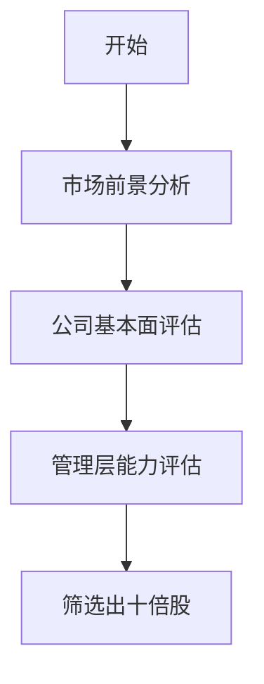
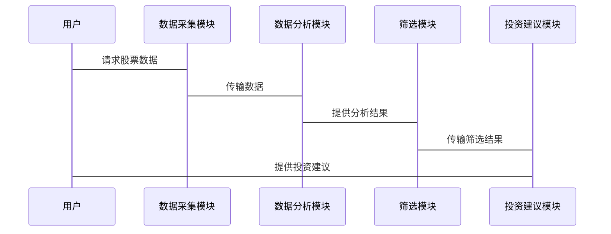

                 


# 彼得林奇的"十倍股"理论

## 关键词：
彼得林奇，十倍股，投资策略，股票筛选，市场分析

## 摘要：
彼得·林奇是美国著名投资专家，其十倍股理论强调寻找能够在一定时间内增长十倍的股票。本文将详细探讨十倍股的定义、筛选标准、形成机制以及实际应用案例，帮助读者理解如何在投资中应用这一理论。

---

# 第一部分: 彼得林奇的"十倍股"理论概述

## 第1章: 彼得林奇的投资理念

### 1.1 彼得林奇的投资哲学
#### 1.1.1 投资的长期性与耐心
彼得林奇强调长期投资的重要性，认为市场短期波动不可预测，但长期趋势可以通过基本面分析来把握。投资者需要具备耐心，等待有价值的公司成长。

#### 1.1.2 避免短期波动的影响
市场短期波动受多种因素影响，如宏观经济、政策变化等。林奇建议投资者忽略短期波动，专注于公司长期增长的潜力。

#### 1.1.3 价值投资的核心理念
价值投资的核心是寻找市场价格低于其内在价值的股票。林奇认为，内在价值可以通过对公司基本面的分析来估算，包括财务状况、盈利能力、行业地位等。

### 1.2 十倍股的定义与特征
#### 1.2.1 十倍股的定义
十倍股是指在一定时间内（通常为3-5年），股价能够增长十倍或更多的股票。这些股票通常具有强大的市场前景和竞争优势。

#### 1.2.2 十倍股的核心特征
- **高增长潜力**：公司收入和利润持续快速增长。
- **强大的市场地位**：公司在行业内具有领先地位。
- **良好的财务状况**：低债务、高利润率、稳定的现金流。
- **优秀的管理层**：管理层具备战略眼光和执行力。

#### 1.2.3 十倍股与普通股票的区别
| 特性 | 十倍股 | 普通股票 |
|------|--------|----------|
| 增长率 | 高     | 中低     |
| 市场地位 | 强     | 一般     |
| 财务状况 | 健康   | 较为稳定 |
| 投资回报 | 高     | 中等     |

### 1.3 十倍股的筛选标准
#### 1.3.1 市场前景分析
- 行业增长空间：选择处于高速成长期的行业，如科技、医疗等。
- 市场渗透率：公司产品或服务是否具有广阔的市场空间。

#### 1.3.2 公司基本面评估
- 收益能力：高净利率和稳定的收益增长。
- 财务健康状况：低负债率、高现金流。
- 资产状况：高资产周转率。

#### 1.3.3 管理层的重要性
- 管理层的愿景和战略是否清晰。
- 管理层的历史业绩和管理能力。

---

## 第2章: 十倍股的形成机制

### 2.1 十倍股的生命周期
#### 2.1.1 初期阶段: 小公司成长为大公司
十倍股通常从一个小公司开始，通过持续的创新和市场扩展，逐渐成长为行业巨头。

#### 2.1.2 成长阶段: 市场份额的快速扩张
在成长阶段，公司通过扩大市场份额、产品线扩展等方式，实现收入和利润的快速增长。

#### 2.1.3 成熟阶段: 稳定的收益与估值
进入成熟阶段后，公司增长放缓，但具备稳定的收益和较高的估值。

### 2.2 十倍股的驱动因素
#### 2.2.1 行业趋势的推动
行业趋势，如技术进步、政策支持、消费者需求变化等，是十倍股增长的重要驱动力。

#### 2.2.2 技术创新的助力
技术创新能够提升公司的竞争力，降低成本，提高产品附加值。

#### 2.2.3 管理层的战略决策
优秀的管理层能够制定正确的战略，抓住市场机遇，避免潜在风险。

### 2.3 十倍股的潜在风险
#### 2.3.1 市场周期的影响
市场周期波动可能会影响公司的业绩和股价。

#### 2.3.2 竞争压力的加剧
行业内竞争加剧可能导致公司市场份额流失。

#### 2.3.3 经济环境的变化
宏观经济环境的变化，如经济衰退、通货膨胀等，可能影响公司的经营状况。

---

## 第3章: 十倍股的筛选与评估

### 3.1 十倍股的筛选指标
#### 3.1.1 市盈率分析
市盈率（P/E）= 股价 / 每股收益。市盈率越低，可能意味着股价被低估。

#### 3.1.2 收益增长率评估
收益增长率 = (本年净利润 - 上年净利润) / 上年净利润 × 100%。高收益增长率是十倍股的重要特征。

#### 3.1.3 财务健康状况分析
- 负债率：负债率 = 总负债 / 总资产。低负债率表示财务风险较低。
- 现金流：健康的现金流表明公司有足够的资金支持业务发展。

### 3.2 十倍股的评估模型
#### 3.2.1 市场潜力评估模型
市场潜力 = 行业增长率 × 公司市场份额。市场潜力越大，公司增长空间越大。

#### 3.2.2 竞争优势评估模型
竞争优势 = 核心竞争力 × 市场地位。核心竞争力包括技术、成本优势等。

#### 3.2.3 管理层能力评估
管理层能力评估 = 过往业绩 × 管理战略。优秀的管理层能够带领公司持续增长。

### 3.3 十倍股的筛选流程图


---

## 第4章: 十倍股投资的数学模型与算法

### 4.1 十倍股筛选的数学模型
十倍股的筛选可以通过以下数学模型来实现：

$$
\text{筛选条件} = \begin{cases}
\text{市盈率} < 20 \\
\text{收益增长率} > 20\% \\
\text{负债率} < 50\% \\
\end{cases}
$$

### 4.2 十倍股预测的算法
使用线性回归模型预测公司未来收益：

$$
\text{预测收益} = a \times \text{历史收益} + b
$$

其中，a和b是通过历史数据回归得到的参数。

### 4.3 算法实现
以下是使用Python进行十倍股筛选的代码示例：

```python
import pandas as pd

# 加载股票数据
data = pd.read_csv('stock_data.csv')

# 筛选条件
screening_conditions = {
    '市盈率': data['市盈率'] < 20,
    '收益增长率': data['收益增长率'] > 20,
    '负债率': data['负债率'] < 50
}

# 筛选出十倍股
selected_stocks = data[screening_conditions['市盈率'] & 
                        screening_conditions['收益增长率'] & 
                        screening_conditions['负债率']]
```

---

## 第5章: 十倍股投资的系统分析

### 5.1 系统功能设计
系统功能包括：
- 数据采集：从金融数据库获取股票数据。
- 数据分析：计算市盈率、收益增长率等指标。
- 筛选十倍股：根据筛选条件筛选出潜在的十倍股。
- 投资建议：生成投资建议报告。

### 5.2 系统架构设计


### 5.3 系统交互设计


---

## 第6章: 十倍股投资的项目实战

### 6.1 环境安装
需要安装以下工具：
- Python
- Pandas
- Matplotlib
- 金融数据API（如Yahoo Finance）

### 6.2 数据收集
从Yahoo Finance获取股票数据，保存为CSV文件。

### 6.3 系统实现
实现股票筛选模块，包括数据加载、筛选条件设置和结果输出。

### 6.4 案例分析
以科技行业为例，筛选出具备十倍股潜力的公司。

### 6.5 数据可视化
使用Matplotlib绘制股票走势和筛选结果对比图。

---

## 第7章: 十倍股投资的最佳实践

### 7.1 小结
十倍股投资需要结合市场分析、公司基本面和管理层能力，通过科学的筛选模型和算法来实现。

### 7.2 注意事项
- 风险控制：分散投资，避免过度集中。
- 持续学习：市场变化快，需要不断更新知识和模型。
- 长期视角：耐心持有，避免短期波动的影响。

### 7.3 拓展阅读
建议阅读彼得·林奇的《选股的艺术》和《投资最重要的事情》等书籍，深入理解十倍股投资的精髓。

---

## 总结

彼得林奇的十倍股理论为投资者提供了寻找高增长股票的有效方法。通过科学的筛选模型和算法，结合市场分析和公司基本面评估，投资者可以在股票市场中找到具备十倍增长潜力的公司。然而，投资过程中需要注意风险控制和长期视角，避免短期波动的影响，实现稳健的投资回报。

