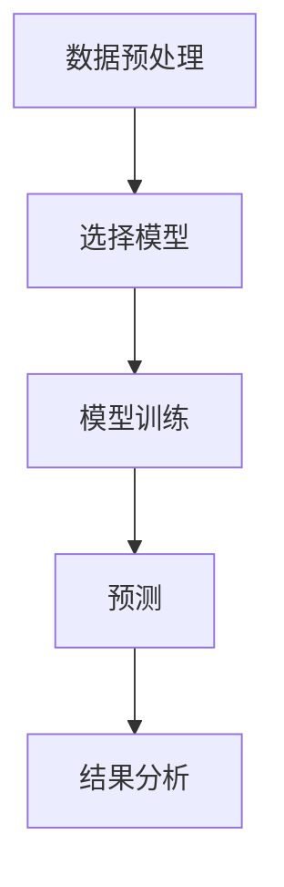
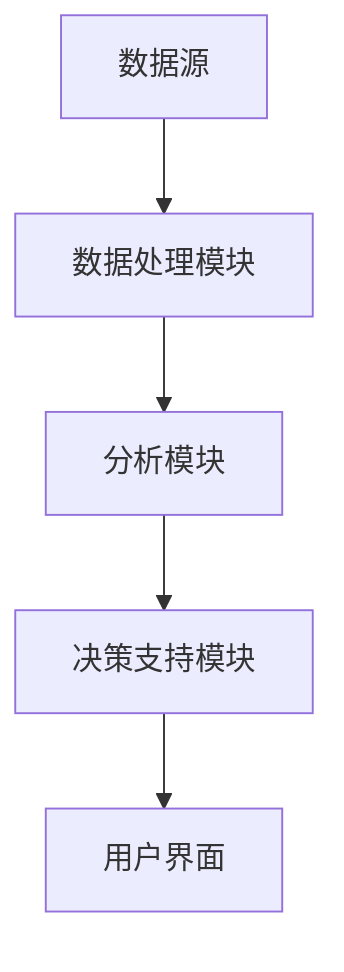

                 


# 彼得林奇的"反向思维"在央行政策解读中的应用

## 关键词：
彼得林奇，反向思维，央行政策，货币政策，政策解读，投资策略

## 摘要：
本文探讨了彼得林奇的反向思维在解读央行政策中的应用，通过分析框架、数学模型和实际案例，展示了如何利用这种逆向思维来预测政策效果和市场反应，为投资决策提供支持。

---

## 第1章：彼得林奇反向思维的概述

### 1.1 反向思维的定义与核心理念
反向思维是一种逆向投资策略，强调在市场低谷时买入，高点时卖出。其核心理念是逆市场情绪操作，寻找被低估的机会。

---

## 第2章：央行政策的基础知识

### 2.1 央行政策的定义与目标
央行政策旨在通过调节货币供应和利率，实现经济稳定和物价控制。目标包括维持低通胀和促进就业。

### 2.2 央行政策的主要工具
- **利率政策**：调整基准利率影响借贷成本。
- **货币供应量控制**：通过公开市场操作调节货币供给。
- **公开市场操作**：买卖政府债券影响市场流动性。

---

## 第3章：反向思维与央行政策解读的结合

### 3.1 反向思维在政策解读中的应用
反向思维帮助识别政策拐点，预测市场反应，提前布局投资策略。

### 3.2 央行政策解读的核心概念与联系
- **市场信号分析**：解读央行声明和经济指标。
- **政策效果评估**：预测政策对经济的影响。

---

## 第4章：反向思维的分析框架

### 4.1 分析框架的构建
- **数据收集**：宏观经济指标和央行声明。
- **模型选择**：时间序列分析和回归模型。
- **决策支持**：投资建议生成。

### 4.2 概念属性特征对比表格
| 概念       | 特性1 | 特性2 | 特性3 |
|------------|-------|-------|-------|
| 央行政策   | 目标性 | 工具性 | 影响性 |
| 反向思维   | 独立性 | 逆向性 | 预测性 |

### 4.3 ER实体关系图
```mermaid
er
  actor: 央行
  actor -[制定政策]-> policy
  policy -[影响]-> market
  market -[反馈]-> actor
```

---

## 第5章：反向思维在政策拐点识别中的应用

### 5.1 政策拐点识别的方法
- **市场信号分析**：利用利率和通胀数据预测拐点。
- **经济指标预测**：通过GDP增速判断政策方向。
- **政策信号判断**：解读央行行长的讲话和政策声明。

---

## 第6章：反向思维在政策效果预测中的应用

### 6.1 预测模型构建
- **时间序列分析**：使用ARIMA模型预测政策效果。
- **回归模型**：将政策变量与经济指标联系起来。

### 6.2 算法原理
#### 时间序列分析流程


#### Python代码实现
```python
import pandas as pd
from statsmodels.tsa.arima.model import ARIMA

# 数据预处理
data = pd.read_csv('policy_data.csv')
data_diff = data['GDP_growth'].diff().dropna()

# 模型训练
model = ARIMA(data_diff, order=(1,1,0))
model_fit = model.fit()

# 预测
forecast = model_fit.forecast(steps=5)
```

---

## 第7章：系统分析与架构设计

### 7.1 系统功能设计
- **数据处理模块**：清洗和转换数据。
- **分析模块**：应用模型进行预测。
- **决策支持模块**：生成投资建议。

### 7.2 系统架构图


---

## 第8章：项目实战

### 8.1 环境安装
安装所需的Python库，如pandas和statsmodels。

### 8.2 核心实现代码
```python
import statsmodels.api as sm

# 回归模型
data = pd.read_csv('policy_data.csv')
X = data['policy_variable']
y = data['economic_indicator']

# 模型训练
X = sm.add_constant(X)
model = sm.OLS(y, X).fit()
```

### 8.3 案例分析
以美联储政策为例，分析反向思维的应用，展示如何通过模型预测政策效果。

---

## 第9章：总结与展望

### 9.1 最佳实践 tips
- 结合多数据源进行分析。
- 定期更新模型，适应市场变化。

### 9.2 小结
反向思维为央行政策解读提供了新的视角，帮助投资者在逆市中发现机会。

### 9.3 注意事项
市场环境复杂，需谨慎应用反向思维。

### 9.4 拓展阅读
推荐相关书籍和文章，深入学习反向思维的应用。

---

通过以上结构，文章系统地探讨了彼得林奇的反向思维在央行政策解读中的应用，从理论到实践，为投资者提供了有价值的见解。

