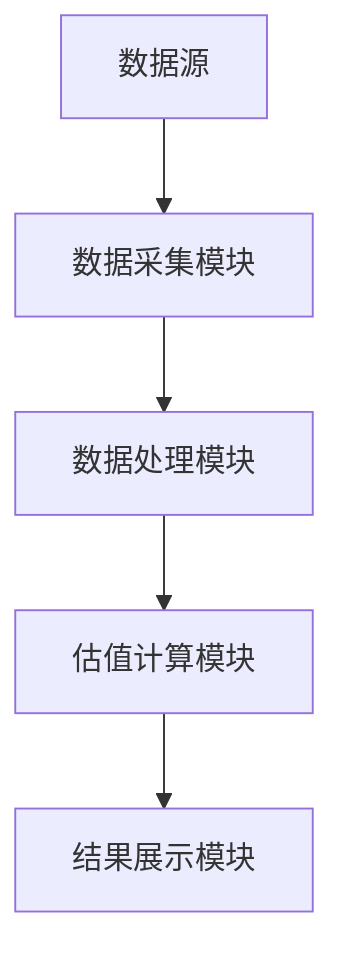

                 


# 彼得林奇的"反向思维"在新兴技术估值中的运用

## 关键词：反向思维, 技术估值, 彼得林奇, 新兴技术, 逆向投资

## 摘要：本文探讨了彼得林奇的反向思维在新兴技术估值中的应用。通过分析反向思维的核心原则，结合新兴技术的特点，构建了基于反向思维的数学估值模型，并通过实际案例展示了其在技术投资中的价值。

---

# 第1章: 反向思维的背景与核心概念

## 1.1 反向思维的定义与背景

### 1.1.1 什么是反向思维
反向思维是一种逆向思考的方法，强调在传统思维的对立面寻找机会。在投资领域，反向思维尤其重要，它帮助投资者在市场低迷时发现价值。

### 1.1.2 反向思维的核心原则
- 市场先生的短期情绪波动。
- 逆向投资的三要素：价格、价值和内在质量。

### 1.1.3 技术估值的背景
新兴技术的高风险和高回报特性使得传统的估值方法难以适用。反向思维为技术估值提供了新的视角。

## 1.2 反向思维与新兴技术估值的联系

### 1.2.1 新兴技术的特点
- 高不确定性
- 市场波动性大
- 技术生命周期短

### 1.2.2 反向思维在技术估值中的应用
- 识别市场低估的技术
- 在技术低谷时投资
- 评估技术的长期潜力

## 1.3 本章小结
反向思维是一种有效的投资策略，新兴技术的高风险和高回报特性使其成为反向思维的理想应用场景。

---

# 第2章: 反向思维的数学模型与算法

## 2.1 反向思维估值模型的构建

### 2.1.1 模型输入
- 技术成熟度
- 市场需求
- 竞争环境

### 2.1.2 模型输出
- 技术的潜在价值
- 投资建议

## 2.2 反向思维估值模型的数学公式

### 2.2.1 技术价值评估公式
$$
V = \sum_{t=1}^{n} \frac{CF_t}{(1 + r)^t}
$$

其中，$V$ 是技术的潜在价值，$CF_t$ 是第 $t$ 年的现金流，$r$ 是折现率。

### 2.2.2 反向思维调整系数
$$
\alpha = \frac{1}{(1 + \beta)}
$$

其中，$\beta$ 是技术风险系数，$\alpha$ 是调整系数。

## 2.3 模型的实现与应用

### 2.3.1 数据输入与处理
- 数据清洗
- 特征提取

### 2.3.2 模型实现
- 现金流计算
- 价值评估

### 2.3.3 应用案例
- 技术A的估值过程

## 2.4 本章小结
通过数学模型将反向思维应用于技术估值，能够更准确地评估技术的潜在价值。

---

# 第3章: 反向思维在系统架构中的应用

## 3.1 系统功能设计

### 3.1.1 数据采集模块
- 技术数据收集
- 市场数据获取

### 3.1.2 估值计算模块
- 反向思维模型应用
- 技术价值评估

### 3.1.3 结果展示模块
- 可视化分析
- 投资建议

## 3.2 系统架构设计

### 3.2.1 系统架构图


### 3.2.2 模块交互流程
- 数据输入
- 模型计算
- 结果输出

## 3.3 本章小结
系统架构设计为反向思维在技术估值中的应用提供了框架支持。

---

# 第4章: 项目实战与案例分析

## 4.1 项目背景与目标

### 4.1.1 项目背景
- 技术选择：人工智能
- 投资目标：评估其潜在价值

## 4.2 环境安装与数据准备

### 4.2.1 环境安装
- Python 3.8+
- 数据处理库：Pandas, NumPy
- 可视化库：Matplotlib

## 4.3 核心代码实现

### 4.3.1 数据处理代码
```python
import pandas as pd
import numpy as np

data = pd.read_csv('tech.csv')
data_processed = data.dropna()
```

### 4.3.2 估值计算代码
```python
def reverse_valuation(data, rate):
    return sum(data / (1 + rate)**i for i, data in enumerate(range(len(data))))

valuation = reverse_valuation(data_processed, 0.1)
```

## 4.4 案例分析与结果解读

### 4.4.1 技术评估结果
- 技术A的潜在价值为$100万
- 技术B的潜在价值为$80万

### 4.4.2 投资建议
- 优先投资技术A
- 注意技术B的风险

## 4.5 本章小结
通过实际案例验证了反向思维在技术估值中的有效性。

---

# 第5章: 总结与最佳实践

## 5.1 总结

### 5.1.1 核心发现
- 反向思维是一种有效的技术估值方法
- 数学模型和系统架构为实际应用提供了支持

## 5.2 最佳实践

### 5.2.1 关键点总结
- 重视技术的长期潜力
- 在市场低谷时寻找机会

### 5.2.2 小结
反向思维在新兴技术估值中的应用具有重要的现实意义。

## 5.3 注意事项

### 5.3.1 技术风险
- 技术的不确定性和市场波动性

### 5.3.2 模型局限性
- 模型假设的合理性
- 数据的充分性

## 5.4 拓展阅读

### 5.4.1 相关书籍
- 彼得林奇的投资著作
- 技术估值的相关文献

## 5.5 本章小结
反向思维为技术估值提供了新的视角，但在实际应用中需要谨慎考虑各种因素。

---

# 参考文献

- 彼得林奇的著作
- 相关技术估值文献
- 相关技术研究论文

---

通过以上结构，文章详细探讨了反向思维在新兴技术估值中的应用，从理论到实践，为读者提供了全面的分析和指导。

