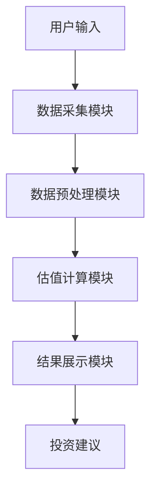

                 


# 彼得林奇的"反向思维"在新兴科技估值中的创新应用

## 关键词：反向思维，新兴科技，估值模型，彼得林奇，科技投资

## 摘要：  
本文探讨了彼得林奇的反向思维在新兴科技估值中的创新应用。通过分析反向思维的核心理念及其在科技投资中的独特价值，构建了一个基于反向思维的新兴科技估值模型，结合实际案例进行深入分析，展示了如何在科技行业的波动中利用反向思维实现精准估值。文章还详细介绍了模型的数学基础、系统架构和项目实现，为投资者提供了实用的工具和方法。

---

# 第一部分：反向思维与新兴科技估值的背景介绍

## 第1章：反向思维与新兴科技估值概述

### 1.1 反向思维的定义与特点

#### 1.1.1 反向思维的核心概念
反向思维是一种逆向思考的投资策略，强调在市场低迷时买入，在市场繁荣时卖出。其核心在于逆市场情绪操作，寻找市场低估或高估的标的。

#### 1.1.2 反向思维在投资中的作用
反向思维可以帮助投资者在市场非理性波动中发现投资机会，尤其是在新兴科技行业，其高波动性和不确定性为反向思维提供了丰富的应用场景。

#### 1.1.3 新兴科技行业的特点与估值挑战
新兴科技行业具有高增长、高风险的特点，其估值往往受到技术创新、市场渗透率和竞争格局的影响。传统的估值方法在新兴科技行业中的适用性有限，需要创新的估值工具和策略。

---

## 第2章：彼得林奇投资理念的创新应用

### 2.1 彼得林奇投资理念的核心

#### 2.1.1 彼得林奇的反向思维策略
彼得林奇强调长期投资和逆市场周期操作，主张在市场恐慌时寻找优质资产，在市场狂热时保持冷静。

#### 2.1.2 彼得林奇对科技行业的独特见解
彼得林奇认为科技行业的核心驱动力是技术创新和商业模式的变革，新兴科技公司的估值需要结合技术壁垒、市场地位和未来增长潜力。

#### 2.1.3 反向思维在科技估值中的创新点
将反向思维从传统投资领域延伸到科技行业的估值模型中，结合科技行业的特点，构建动态估值框架。

---

# 第二部分：反向思维在新兴科技估值中的核心概念与联系

## 第3章：反向思维与科技估值模型的构建

### 3.1 反向思维在科技估值中的模型构建

#### 3.1.1 反向思维驱动的估值模型框架
基于反向思维的新兴科技估值模型，以市场情绪、行业周期和公司基本面为输入，通过动态调整权重实现精准估值。

#### 3.1.2 模型的核心假设与参数设置
- 市场情绪指数：衡量市场的乐观或悲观程度
- 行业周期指标：反映行业所处的发展阶段
- 公司基本面因子：包括收入增长率、利润率、研发投入等

#### 3.1.3 模型的验证与优化
通过历史数据回测和实证分析，验证模型的有效性，并根据市场变化动态优化模型参数。

---

## 第4章：反向思维与科技行业周期的关联

### 4.1 科技行业的周期性分析

#### 4.1.1 科技行业的周期性特点
科技行业通常经历萌芽期、成长期、成熟期和衰退期，每个阶段的估值方法和投资策略有所不同。

#### 4.1.2 反向思维在行业周期中的应用
在行业低谷期寻找优质标的，在行业高峰期警惕潜在风险。

#### 4.1.3 不同周期阶段的估值策略
- 低谷期：注重基本面，寻找被低估的标的
- 成长期：关注高增长潜力，适当提高估值倍数
- 成熟期：以现金流为核心，注重分红和收益稳定性
- 衰退期：警惕行业风险，逐步退出或减仓

---

# 第三部分：算法原理讲解

## 第5章：反向思维驱动的估值算法

### 5.1 基于反向思维的估值模型算法

#### 5.1.1 模型的数学公式
$$ Valuation = \alpha \times Market\_Mood + \beta \times Industry\_Cycle + \gamma \times Company\_Fundamentals $$

其中：
- Market\_Mood 表示市场情绪指数
- Industry\_Cycle 表示行业周期指标
- Company\_Fundamentals 表示公司基本面因子
- α、β、γ 是模型的权重系数

#### 5.1.2 算法实现步骤
1. 数据采集：获取市场情绪指数、行业周期指标和公司基本面数据
2. 数据预处理：标准化和归一化处理
3. 模型计算：通过加权求和得到目标公司的估值
4. 结果分析：对比市场价，判断投资机会

#### 5.1.3 代码实现
```python
def reverse_thinking_valuation(market_mood, industry_cycle, company_fundamentals):
    alpha = 0.4
    beta = 0.3
    gamma = 0.3
    valuation = alpha * market_mood + beta * industry_cycle + gamma * company_fundamentals
    return valuation

# 示例数据
market_mood = 0.6  # 市场情绪指数
industry_cycle = 0.7  # 行业周期指标
company_fundamentals = 0.8  # 公司基本面因子

valuation = reverse_thinking_valuation(market_mood, industry_cycle, company_fundamentals)
print("估值结果:", valuation)
```

---

# 第四部分：系统分析与架构设计方案

## 第6章：反向思维估值系统的架构设计

### 6.1 系统功能设计

#### 6.1.1 系统功能模块
- 数据采集模块：获取市场情绪、行业周期和公司基本面数据
- 数据预处理模块：标准化和归一化处理
- 估值计算模块：基于反向思维的估值模型
- 结果展示模块：可视化估值结果和投资建议

#### 6.1.2 系统功能流程
1. 数据采集：通过API获取实时数据
2. 数据预处理：标准化和归一化
3. 估值计算：调用估值模型
4. 结果展示：可视化报告

### 6.2 系统架构设计

#### 6.2.1 系统架构图


---

# 第五部分：项目实战

## 第7章：反向思维估值模型的实战应用

### 7.1 项目环境安装

```bash
pip install numpy pandas matplotlib
```

### 7.2 核心代码实现

#### 7.2.1 数据预处理
```python
import pandas as pd
import numpy as np

def preprocess(data):
    # 标准化处理
    data = (data - data.mean()) / data.std()
    return data
```

#### 7.2.2 估值模型实现
```python
def reverse_valuation_model(data):
    market_mood = data['market_mood'].values
    industry_cycle = data['industry_cycle'].values
    company_fundamentals = data['company_fundamentals'].values

    alpha = 0.4
    beta = 0.3
    gamma = 0.3

    valuation = alpha * market_mood + beta * industry_cycle + gamma * company_fundamentals
    return valuation
```

### 7.3 案例分析

#### 7.3.1 案例背景
以某新兴科技公司为例，数据包括市场情绪、行业周期和公司基本面因子。

#### 7.3.2 数据分析与结果展示
```python
import matplotlib.pyplot as plt

valuation = reverse_valuation_model(data)
plt.plot(valuation)
plt.title('Valuation Trend')
plt.xlabel('Time')
plt.ylabel('Valuation')
plt.show()
```

---

# 第六部分：最佳实践与总结

## 第8章：反向思维在新兴科技估值中的最佳实践

### 8.1 小结
本文构建了一个基于反向思维的新兴科技估值模型，结合实际案例展示了其应用价值。

### 8.2 注意事项
- 数据质量对模型结果影响重大
- 模型需要动态优化
- 投资决策需要结合多因素分析

### 8.3 拓展阅读
推荐阅读彼得林奇的《投资的艺术》和《巴菲特的阴谋》。

---

# 结语

通过本文的分析，读者可以了解到反向思维在新兴科技估值中的创新应用，并掌握具体的实现方法。未来，随着科技行业的快速发展，反向思维的应用场景将更加广泛，值得进一步研究和探索。

