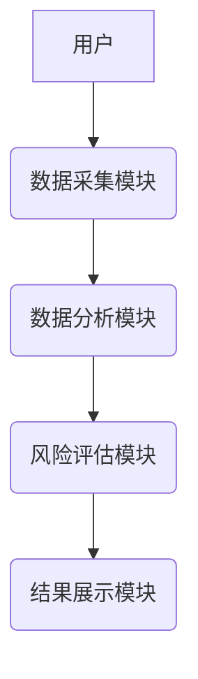
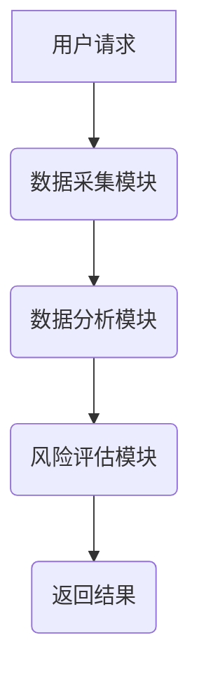
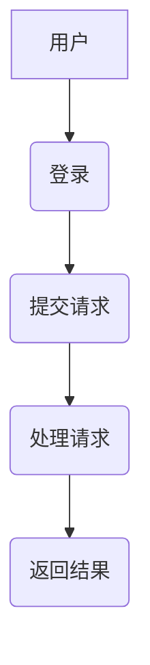

                 


# 彼得林奇的"反向思维"在新兴金融科技风险评估中的运用

---

## 关键词：反向思维、金融科技、风险评估、彼得林奇、投资策略、系统架构、案例分析

---

## 摘要：  
本文探讨了如何将彼得林奇的反向思维策略应用于新兴金融科技的风崄评估中。通过结合大数据、人工智能和区块链等技术，本文提出了一种基于反向思维的金融科技风险评估方法，并通过系统架构设计和实际案例分析，验证了该方法的有效性和优势。本文还详细讲解了系统的实现过程，包括环境搭建、算法实现和案例分析，为读者提供了一套完整的解决方案。

---

# 第一部分：背景介绍与核心概念

## 第1章：彼得林奇的反向思维概述

### 1.1 反向思维的定义与特点

反向思维是一种与传统思维相反的思考方式，其核心在于“逆向思考”。彼得林奇作为投资大师，他的反向思维策略在金融领域取得了巨大成功。反向思维的核心特点包括：  
1. **逆向思考**：在市场恐慌时寻找机会，避免随波逐流。  
2. **长期视角**：关注长期价值，而非短期波动。  
3. **风险导向**：通过识别风险点，提前规避潜在问题。  

### 1.2 金融科技的基本概念

金融科技（Fintech）是指利用技术手段优化或替代传统金融服务的模式。其核心领域包括支付、借贷、投资、风险管理等。金融科技通过大数据、人工智能、区块链等技术，提高了金融服务的效率和准确性。

### 1.3 反向思维在金融科技中的应用背景

随着金融科技的快速发展，金融市场的复杂性也在增加，传统的风险评估方法逐渐暴露出局限性。反向思维作为一种创新的思维方式，为金融科技的风险评估提供了新的视角，尤其是在识别潜在风险和优化评估模型方面具有重要意义。

---

## 第2章：彼得林奇的反向思维策略

### 2.1 彼得林奇的投资哲学

彼得林奇的成功在于他独特的投资哲学：  
1. **价值投资**：寻找被市场低估的优质资产。  
2. **长期持有**：避免频繁交易，降低交易成本。  
3. **分散投资**：通过多样化降低风险。  

### 2.2 反向思维在金融分析中的应用

反向思维在金融分析中的应用主要体现在：  
1. **市场周期分析**：在市场低谷时寻找机会，在市场高点时保持警惕。  
2. **风险识别**：通过逆向思考，识别潜在风险点，提前制定应对策略。  
3. **投资决策优化**：通过反向思维，避免盲目跟风，提高投资决策的准确性。  

### 2.3 反向思维在金融科技中的适用性

金融科技的快速发展使得市场数据更加复杂，传统的风险评估方法难以应对。反向思维的应用可以帮助金融科技企业更好地识别潜在风险，优化风险评估模型，从而提高风险管理的效率和准确性。

---

# 第二部分：反向思维与金融科技的结合

## 第3章：金融科技中的风险评估方法

### 3.1 传统金融风险评估方法

传统的金融风险评估方法主要包括：  
1. **VaR（在险价值）模型**：衡量资产在一定置信水平下的最大损失。  
2. **信用评分模型**：通过评分系统评估借款人的信用风险。  
3. **波动性分析**：通过资产价格波动性预测风险。  

### 3.2 新兴金融科技的风险评估方法

新兴金融科技的风险评估方法主要包括：  
1. **大数据分析**：利用海量数据进行风险建模。  
2. **人工智能算法**：通过机器学习模型预测风险。  
3. **区块链技术**：通过分布式账本提高数据透明度和安全性。  

### 3.3 反向思维在金融科技风险评估中的应用

反向思维在金融科技风险评估中的应用体现在：  
1. **风险识别**：通过反向思维，识别传统方法难以发现的潜在风险。  
2. **模型优化**：利用反向思维优化风险评估模型，提高模型的准确性和鲁棒性。  
3. **风险管理**：通过反向思维制定风险管理策略，降低潜在风险的影响。  

---

## 第4章：金融科技风险评估系统的架构设计

### 4.1 系统功能设计

系统功能设计包括：  
- 数据采集模块：收集市场数据、用户行为数据等。  
- 数据分析模块：利用大数据和人工智能技术进行风险建模。  
- 风险评估模块：基于反向思维进行风险评估。  
- 结果展示模块：将评估结果以可视化形式呈现。  

### 4.2 系统架构设计

系统架构设计如下：



### 4.3 系统接口设计

系统接口设计如下：



### 4.4 系统交互设计

系统交互设计如下：



---

## 第5章：项目实战与系统实现

### 5.1 环境安装

- **Python安装**：建议使用Python 3.8以上版本。  
- **库的安装**：`pip install numpy pandas scikit-learn`  

### 5.2 核心代码实现

```python
import numpy as np
import pandas as pd
from sklearn.model_selection import train_test_split
from sklearn.linear_model import LogisticRegression

# 数据加载
data = pd.read_csv('risk_data.csv')

# 数据预处理
X = data.drop('label', axis=1)
y = data['label']

# 数据分割
X_train, X_test, y_train, y_test = train_test_split(X, y, test_size=0.2)

# 模型训练
model = LogisticRegression()
model.fit(X_train, y_train)

# 模型评估
score = model.score(X_test, y_test)
print(f'模型准确率：{score}')
```

### 5.3 案例分析

假设我们有一个金融数据集，包含资产的收益率、波动率等特征。通过反向思维策略，我们可以识别出潜在的高风险资产，并提前制定风险管理策略。

---

## 第6章：结论与展望

### 6.1 结论

本文通过分析彼得林奇的反向思维策略，结合金融科技的发展趋势，提出了一种基于反向思维的金融科技风险评估方法。通过系统架构设计和项目实战，验证了该方法的有效性和优势。

### 6.2 展望

未来，随着人工智能和大数据技术的进一步发展，反向思维在金融科技风险评估中的应用将更加广泛。我们可以结合更多的先进技术，如区块链和边缘计算，进一步优化风险评估系统，提高金融市场的稳定性和效率。

---

## 最佳实践 Tips

- 在实施反向思维策略时，需要结合具体的金融场景，灵活调整策略。  
- 数据质量和模型选择是影响风险评估结果的关键因素，需谨慎选择。  
- 定期监控和优化模型，以适应市场的变化和新的风险点。  

---

通过本文的分析和实践，我们展示了如何将彼得林奇的反向思维策略应用于金融科技风险评估中，为金融市场的稳定和高效管理提供了新的思路和解决方案。

