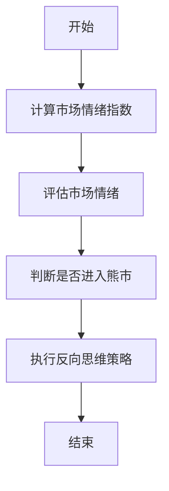

                 


# 彼得林奇的"反向思维"在熊市中的应用

## 关键词：
- 彼得林奇
- 反向思维
- 熊市投资
- 投资策略
- 价值投资

## 摘要：
本文探讨了彼得林奇的反向思维在熊市中的应用，分析了反向思维的定义、熊市的特点，以及如何利用反向思维进行投资决策。通过数学模型、算法流程和系统架构的设计，结合实际案例，详细讲解了反向思维在熊市中的具体应用方法，帮助投资者在熊市中发现价值，优化投资组合，降低风险。

---

## 正文：

### 第一部分: 背景介绍

#### 第1章: 反向思维的定义与核心概念

##### 1.1 反向思维的定义
反向思维是一种与传统思维方式相反的思考方式，它强调在市场情绪最低落时寻找机会，在市场高亢时保持谨慎。彼得林奇在其投资生涯中，通过反向思维成功捕捉到了许多被低估的投资机会。

##### 1.2 熊市的特点与挑战
熊市市场通常伴随着价格的大幅下跌、交易量的减少以及投资者情绪的极度恐慌。在这种环境下，许多优质资产被市场情绪拖累，价格被严重低估，为反向思维提供了施展的空间。

##### 1.3 彼得林奇的投资理念
彼得林奇认为，成功的投资不仅需要对市场趋势的把握，更需要对企业的基本面有深刻的理解。他的反向思维策略强调在市场低迷时，寻找那些基本面良好但被市场忽视的公司。

---

### 第二部分: 核心概念与联系

#### 第2章: 反向思维的核心原理

##### 2.1 反向思维的核心原理
反向思维的核心在于识别市场的非理性情绪，并利用这种情绪的反向波动来寻找投资机会。通过分析市场情绪指数和价值偏离度，投资者可以找到被市场低估的资产。

##### 2.2 反向思维与熊市投资策略
在熊市中，反向思维策略主要体现在以下几个方面：
- **价值发现**：寻找那些基本面良好但价格被低估的股票。
- **风险控制**：通过分散投资和止损策略，降低投资组合的风险。
- **投资组合优化**：在熊市中，通过调整投资组合的构成，优化风险与收益的平衡。

---

### 第三部分: 算法原理讲解

#### 第3章: 反向思维的数学模型与公式

##### 3.1 反向思维的数学模型
反向思维的数学模型主要基于市场情绪指数和价值评估模型。以下是两个关键公式：

- **市场情绪指数计算公式**：
$$ \text{市场情绪指数} = \frac{\text{市场成交量}}{\text{市场成交额}} $$

- **价值投资模型**：
$$ \text{内在价值} = \sum_{t=1}^{\infty} \frac{\text{现金流}}{(1 + r)^t} $$

##### 3.2 反向思维的算法流程
以下是反向思维算法的流程图：



---

### 第四部分: 系统分析与架构设计

#### 第4章: 熊市投资决策支持系统的架构设计

##### 4.1 系统功能设计
- **系统输入**：市场数据（如成交量、成交额、股价等）。
- **系统处理**：反向思维算法。
- **系统输出**：投资建议和风险提示。

##### 4.2 系统架构设计


---

### 第五部分: 项目实战

#### 第5章: 熊市投资决策支持系统的实现

##### 5.1 环境安装
- 安装Python和必要的库（如pandas、numpy）。
- 安装Mermaid和LaTeX工具。

##### 5.2 核心代码实现
以下是一个反向思维算法的Python代码示例：

```python
import pandas as pd
import numpy as np

def calculate_market_sentiment(volume, value):
    return volume / value

market_volume = 1000
market_value = 5000
market_sentiment = calculate_market_sentiment(market_volume, market_value)
print(f"市场情绪指数: {market_sentiment}")
```

##### 5.3 案例分析
假设在2022年熊市中，某公司的股价被低估，其市盈率远低于行业平均水平。通过反向思维策略，投资者可以识别出该公司的潜在价值，并进行投资。

---

### 第六部分: 最佳实践

#### 第6章: 投资策略与风险管理

##### 6.1 最佳实践
- **持续学习**：保持对市场动态的敏感性，不断优化投资策略。
- **风险管理**：设置止损点，避免过度集中在单一资产上。
- **长期视角**：反向思维需要耐心和纪律，避免被短期市场波动所干扰。

##### 6.2 小结
反向思维是一种有效的投资策略，尤其在熊市中表现突出。通过系统的分析和实践，投资者可以在市场低迷时找到价值，实现长期收益。

##### 6.3 注意事项
- 熊市中的投资风险较高，投资者需谨慎评估自身风险承受能力。
- 反向思维并非适用于所有市场环境，需结合市场实际情况灵活运用。

##### 6.4 拓展阅读
- 彼得林奇的《聪明的投资者》
- 《价值投资入门》

---

### 结语

彼得林奇的反向思维在熊市中的应用，不仅是一种投资策略，更是一种智慧。通过系统的分析和实践，投资者可以在市场低迷时发现价值，优化投资组合，实现长期收益。希望本文能为您提供有价值的见解和启发。

--- 

* 本文为技术博客文章，版权归作者所有，转载请注明出处。

