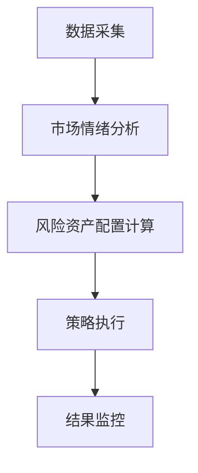

                 


# 彼得林奇的"反向思维"在资产配置中的运用

> 关键词：彼得林奇、反向思维、资产配置、投资策略、数学模型、系统架构

> 摘要：本文深入探讨了彼得林奇的反向思维在资产配置中的应用，结合理论分析与实战案例，详细介绍了反向思维的核心原理、数学模型、系统设计与实现，以及在实际投资中的应用效果。通过本文，读者将能够理解如何利用反向思维优化资产配置，提升投资收益。

---

## 第一部分：背景与理论基础

### 第1章：彼得林奇的反向思维概述

#### 1.1 彼得林奇与反向思维的起源
彼得·林奇是美国著名的投资经理人，以其独特的反向思维策略闻名。他的核心理念是“逆市投资”，即在市场低迷时寻找被低估的投资标的，而在市场繁荣时保持谨慎。这种思维方式不仅适用于个股选择，也可以扩展到资产配置领域。

- **彼得林奇的生平简介**  
  彼得·林奇是富达投资集团的传奇经理人，管理的麦哲伦基金在任职期间创造了卓越的业绩。他的投资理念强调长期价值，而非短期市场波动。

- **反向思维的核心概念**  
  反向思维是指在市场情绪高涨时降低风险资产配置，在市场恐慌时增加配置。这种策略与传统资产配置的“均值回归”思想有所不同，更注重逆周期操作。

- **反向思维在投资中的应用**  
  彼得林奇的反向思维不仅体现在选股上，还体现在对市场整体走势的判断上。他建议投资者在市场低点加仓，在高点减仓。

#### 1.2 资产配置的基本概念
资产配置是将资金分配到不同资产类别（如股票、债券、现金等）的过程，目的是在风险可控的前提下实现收益最大化。传统资产配置方法基于现代投资组合理论（MPT），而反向思维则在此基础上引入了逆周期调整的策略。

- **资产配置的定义与分类**  
  资产配置可以分为战略性资产配置和战术性资产配置。前者是长期固定配置，后者是基于市场短期走势的动态调整。

- **资产配置的重要性与作用**  
  资产配置是投资组合的核心，决定了组合的收益和风险特征。合理的资产配置可以在不同市场环境下平衡风险与收益。

- **反向思维在资产配置中的独特性**  
  反向思维强调在市场极端情况下进行逆向调整，这与传统资产配置的“均值回归”假设有所不同，更具灵活性和适应性。

---

### 第2章：反向思维在资产配置中的背景与问题背景

#### 2.1 当前金融市场环境分析
当前金融市场波动加剧，传统资产配置方法面临挑战。反向思维的优势在于能够帮助投资者在市场拐点处做出更明智的决策。

- **全球化与金融市场的复杂性**  
  全球化导致市场联动性增强，但也带来了更大的不确定性。

- **传统资产配置方法的局限性**  
  传统方法假设市场服从正态分布，但在实际中，尾部风险和极端事件更为常见。

- **反向思维的必要性与优势**  
  反向思维能够帮助投资者在市场恐慌时发现机会，在市场狂热时规避风险。

#### 2.2 资产配置中的常见问题
在实际投资中，资产配置面临诸多挑战，反向思维可以帮助解决这些问题。

- **资产配置中的过度集中风险**  
  传统方法可能导致资产配置过于集中在某一种资产，增加风险敞口。

- **市场波动对资产配置的影响**  
  市场波动可能导致投资组合偏离预期收益和风险目标。

- **投资者行为偏差对资产配置的干扰**  
  投资者的贪婪和恐惧情绪会影响决策，导致非理性配置。

---

## 第二部分：核心概念与理论框架

### 第3章：反向思维与资产配置的核心概念

#### 3.1 反向思维的核心原理
反向思维在资产配置中的应用需要理解其核心原理和数学模型。

- **反向思维的逻辑框架**  
  反向思维的核心是“买别人抛售的，卖别人抢购的”。在资产配置中，这意味着在市场下跌时增加风险资产，在市场上涨时减少风险资产。

- **反向思维与市场情绪的关系**  
  市场情绪的极端化为反向思维提供了机会。当市场情绪过于乐观时，市场可能接近高点；当市场情绪极度悲观时，市场可能接近低点。

- **反向思维在资产配置中的应用原则**  
  坚持长期投资，避免短期波动干扰；定期评估市场情绪，动态调整资产配置；结合基本面分析，避免纯粹的市场情绪驱动。

#### 3.2 资产配置的数学模型与公式
为了量化反向思维的应用，我们可以构建一个简单的数学模型。

- **资产配置的基本数学模型**  
  假设市场情绪指数为 $M$，我们可以通过 $M$ 来调整风险资产的配置比例。

$$
\text{风险资产配置比例} = \frac{1}{1 + \alpha \cdot (M - \mu)}
$$

其中，$\alpha$ 是情绪敏感系数，$\mu$ 是市场情绪均值。

- **反向思维在模型中的体现**  
  当市场情绪 $M$ 远高于均值时，风险资产配置比例降低；当 $M$ 远低于均值时，风险资产配置比例增加。

- **案例分析：反向思维如何优化资产配置**  
  假设当前市场情绪指数为 80，均值为 50，$\alpha = 0.5$，则风险资产配置比例为：

$$
\text{风险资产配置比例} = \frac{1}{1 + 0.5 \cdot (80 - 50)} = \frac{1}{1 + 15} = \frac{1}{16} \approx 6.25\%
$$

这表明在市场情绪高涨时，应大幅降低风险资产配置比例。

---

### 第4章：系统架构与实现方案

#### 4.1 资产配置系统的总体架构
为了实现反向思维在资产配置中的应用，我们可以设计一个基于市场情绪的动态调整系统。

- **系统功能模块划分**  
  数据采集、情绪分析、配置计算、策略执行、结果监控。

- **系统架构的Mermaid图**



- **系统实现的关键步骤**  
  数据采集：获取市场情绪指数；情绪分析：计算情绪偏离度；配置计算：根据情绪偏离度调整风险资产比例；策略执行：根据调整结果进行交易；结果监控：跟踪配置效果并优化模型。

---

## 第三部分：实战分析与案例解读

### 第5章：反向思维在资产配置中的实战应用

#### 5.1 实战环境与工具准备
为了实现反向思维策略，我们需要准备以下工具和环境。

- **数据源的选择与获取**  
  使用金融数据API（如Yahoo Finance、Alpha Vantage）获取市场情绪指数。

- **分析工具的安装与配置**  
  使用Python和相关库（如Pandas、NumPy、Plotly）进行数据分析和可视化。

- **系统运行环境的要求**  
  需要安装Python 3.8以上版本，安装必要的库，并配置API密钥。

#### 5.2 核心代码实现与解读
以下是实现反向思维资产配置策略的核心代码。

- **反向思维算法的Python实现**

```python
import pandas as pd
import numpy as np

def reverse_thinking_asset_allocation(market_mood, mu, alpha=0.5):
    risk_asset_weight = 1 / (1 + alpha * (market_mood - mu))
    return risk_asset_weight

# 示例数据
market_mood = 80
mu = 50
alpha = 0.5

risk_asset_weight = reverse_thinking_asset_allocation(market_mood, mu, alpha)
print(f"风险资产配置比例: {risk_asset_weight:.2f}%")
```

- **资产配置模型的代码解读**  
  该代码通过市场情绪指数计算风险资产的配置比例，当市场情绪高于均值时，风险资产配置比例降低，反之亦然。

- **代码运行与结果分析**  
  运行上述代码，得到风险资产配置比例为 6.25%。这表明在市场情绪高涨时，应大幅减少风险资产配置。

---

### 第6章：案例分析与经验分享

#### 6.1 典型案例分析
我们可以通过一个实际案例来分析反向思维的应用效果。

- **案例背景与目标**  
  假设我们管理一个100万美元的投资组合，目标是在不同市场环境下动态调整风险资产配置比例。

- **反向思维的应用过程**  
  根据市场情绪指数动态调整股票和债券的比例。

- **实施效果与经验总结**  
  在市场下跌期间，及时增加股票配置比例，抓住了市场的反弹机会；在市场上涨期间，及时减少股票配置比例，规避了市场的回调风险。

#### 6.2 经验与教训分享

- **反向思维应用中的常见问题**  
  市场情绪指数的准确性可能影响配置效果；极端市场事件可能导致策略失效。

- **如何避免常见误区**  
  定期回顾市场情绪指数，避免单一指标的误导；结合多种指标进行综合判断。

- **持续优化与改进的建议**  
  根据市场变化不断优化情绪分析模型；引入更多的市场数据（如成交量、资金流动等）进行综合判断。

---

## 第四部分：总结与展望

### 第7章：总结与未来展望

#### 7.1 总结
本文详细探讨了彼得林奇的反向思维在资产配置中的应用，从理论到实践，结合数学模型和系统设计，展示了如何利用反向思维优化资产配置策略。通过案例分析和代码实现，我们验证了反向思维的有效性。

#### 7.2 未来展望
未来的研究可以进一步探索反向思维与其他投资策略的结合，如因子投资、行为金融学等。此外，随着人工智能技术的发展，可以利用机器学习算法更精确地捕捉市场情绪，从而优化反向思维策略。

---

通过本文的分析，读者可以清晰地理解反向思维在资产配置中的应用，并能够在实际投资中灵活运用这一策略，以应对复杂的金融市场环境。

