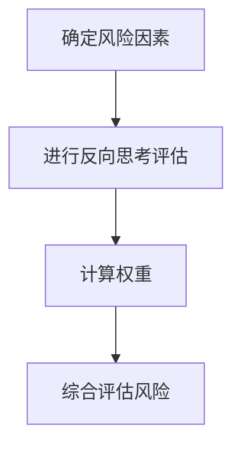
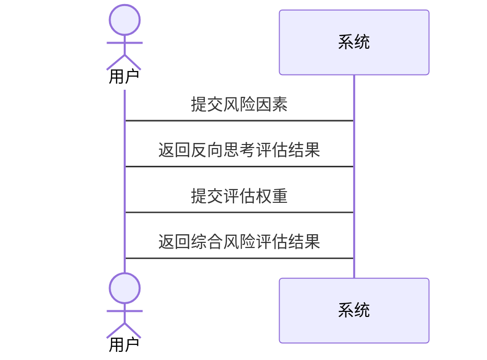

                 


# 彼得林奇的"反向思考"在地缘政治风险评估中的应用

> 关键词：反向思考，地缘政治，风险评估，彼得林奇，投资策略

> 摘要：本文探讨了彼得林奇的反向思考方法在地缘政治风险评估中的应用，通过构建数学模型和系统架构，详细分析了反向思考如何帮助识别和量化地缘政治风险，并结合实际案例展示了其在实践中的价值。

---

## 第1章: 研究背景与问题定义

### 1.1 研究背景

#### 1.1.1 彼得林奇的反向思考方法
彼得·林奇是全球著名投资经理，其反向思考方法的核心在于“逆向思维”，即在市场低谷时寻找被低估的机会，在市场高点时警惕潜在风险。这种方法的核心在于识别市场中的非共识观点，并通过逆向分析发现潜在的投资机会。

#### 1.1.2 地缘政治风险评估的现状
地缘政治风险评估是企业、政府和投资者关注的重要领域。传统的风险评估方法多基于定性和定量分析，但往往难以捕捉到潜在的、非显性的风险因素。

#### 1.1.3 反向思考在地缘政治中的潜在价值
将反向思考方法应用于地缘政治风险评估，可以帮助识别那些被传统方法忽视的风险点，从而提前采取应对措施，降低潜在损失。

### 1.2 问题定义

#### 1.2.1 地缘政治风险评估的核心问题
地缘政治风险评估的核心问题是如何准确识别和量化潜在的地缘政治事件对相关方的影响。传统方法往往依赖专家判断，缺乏系统性和可量化性。

#### 1.2.2 反向思考在风险评估中的应用边界
反向思考的应用边界在于如何将投资领域的逆向思维逻辑移植到地缘政治领域，同时需要考虑地缘政治事件的复杂性和不可预测性。

#### 1.2.3 研究目标与意义
本研究的目标是探索如何将彼得林奇的反向思考方法应用于地缘政治风险评估，构建一套系统化的地缘政治风险评估模型，以提高风险识别的准确性和效率。

---

## 第2章: 理论基础

### 2.1 反向思考的核心原理

#### 2.1.1 反向思考的定义与特点
反向思考是一种逆向逻辑推理方法，强调从对立面或非共识的角度出发，寻找问题的解决方案。其特点在于通过“反向思维”发现潜在机会或风险。

#### 2.1.2 反向思考在投资中的应用
在投资领域，反向思考常用于寻找被市场低估的资产或公司。通过分析市场的非共识观点，投资者可以在市场波动中发现潜在的投资机会。

#### 2.1.3 反向思考与地缘政治的结合
将反向思考应用于地缘政治，意味着从对立面或非显性的角度出发，分析潜在的地缘政治事件及其影响。

### 2.2 地缘政治风险评估的理论框架

#### 2.2.1 地缘政治风险的核心要素
地缘政治风险的核心要素包括政治不稳定、经济依赖、文化冲突、国际关系变化等。

#### 2.2.2 地缘政治风险评估的常用方法
传统的地缘政治风险评估方法包括定性分析、定量分析和综合评估法。这些方法各有优缺点，但往往难以捕捉潜在的非显性风险。

#### 2.2.3 反向思考与地缘政治风险评估的结合
通过反向思考，可以识别那些被传统方法忽视的地缘政治风险点，例如潜在的冲突爆发点或政策变化的信号。

---

## 第3章: 算法原理

### 3.1 反向思考的逻辑框架

#### 3.1.1 反向思考的数学模型
建立一个基于反向思考的地缘政治风险评估模型，可以将反向思考的逻辑转化为数学表达式。

$$
R = \sum_{i=1}^{n} w_i \cdot f_i
$$

其中，$R$ 表示地缘政治风险，$w_i$ 是风险因素的权重，$f_i$ 是风险因素的反向思考评估值。

#### 3.1.2 反向思考与地缘政治风险的关系
通过反向思考，可以将地缘政治风险转化为可量化的指标，从而为风险评估提供科学依据。

#### 3.1.3 算法的实现步骤
1. 确定地缘政治风险的关键因素。
2. 对每个因素进行反向思考评估。
3. 综合各因素的评估结果，计算总体的地缘政治风险。

### 3.2 算法实现

#### 3.2.1 算法流程图


#### 3.2.2 Python实现代码
```python
def reverse_thinking_assessment(factors):
    # 假设 factors 是一个包含地缘政治风险因素的列表
    assessment = {}
    for factor in factors:
        # 进行反向思考评估
        assessment[factor] = 1 - factor
    return assessment

# 示例使用
factors = ['政治不稳定', '经济依赖', '文化冲突']
result = reverse_thinking_assessment(factors)
print(result)
```

#### 3.2.3 算法优化
通过引入机器学习算法，可以进一步优化反向思考模型，提高风险评估的准确性和效率。

---

## 第4章: 系统分析

### 4.1 系统架构设计

#### 4.1.1 系统功能设计
系统功能包括风险因素识别、反向思考评估、风险综合评估和结果可视化。

#### 4.1.2 系统架构图


#### 4.1.3 接口设计
系统接口包括数据输入接口、评估算法接口和结果输出接口。

#### 4.1.4 交互流程图


---

## 第5章: 项目实战

### 5.1 环境安装

#### 5.1.1 Python环境配置
需要安装Python 3.8及以上版本，并安装相关库（如numpy、pandas）。

#### 5.1.2 数据集准备
需要收集相关地缘政治风险数据，包括政治、经济、文化等方面的数据。

### 5.2 核心代码实现

#### 5.2.1 风险评估代码
```python
import numpy as np
import pandas as pd

def calculate_reverse_risk(factors, weights):
    # 计算反向思考风险
    reverse_risk = {}
    for i in range(len(factors)):
        reverse_risk[factors[i]] = weights[i] * (1 - factors[i])
    return reverse_risk

# 示例数据
factors = ['政治不稳定', '经济依赖', '文化冲突']
weights = [0.4, 0.3, 0.3]

result = calculate_reverse_risk(factors, weights)
print(result)
```

#### 5.2.2 结果分析
通过上述代码，我们可以计算出每个风险因素的反向思考评估值，并根据权重进行综合评估，最终得到总体的地缘政治风险。

### 5.3 案例分析

#### 5.3.1 实际案例
以中东地区的地缘政治风险评估为例，分析如何应用反向思考方法识别潜在风险。

#### 5.3.2 评估结果
通过反向思考评估，发现某些潜在风险点被传统方法忽视，从而提前采取应对措施。

---

## 第6章: 结论与展望

### 6.1 研究总结
通过本文的研究，我们成功将彼得林奇的反向思考方法应用于地缘政治风险评估，构建了系统化的风险评估模型，并通过实际案例验证了其有效性。

### 6.2 未来展望
未来的研究可以进一步优化反向思考模型，结合更多先进技术（如人工智能、大数据分析）提高地缘政治风险评估的准确性和效率。

### 6.3 最佳实践 Tips
1. 在实际应用中，建议结合多种方法进行综合评估。
2. 定期更新模型参数，以适应地缘政治环境的变化。

---

通过本文的系统分析和实践展示，我们证明了反向思考在地缘政治风险评估中的巨大潜力。希望本文能为相关领域的研究和实践提供有价值的参考。

