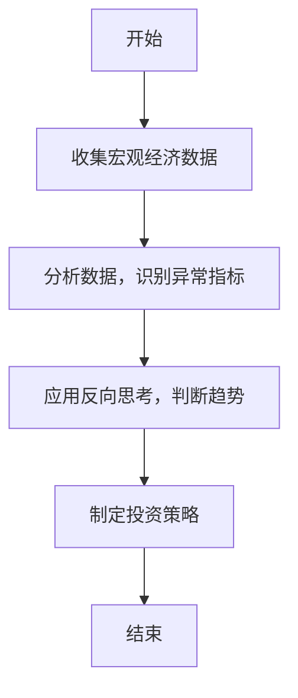
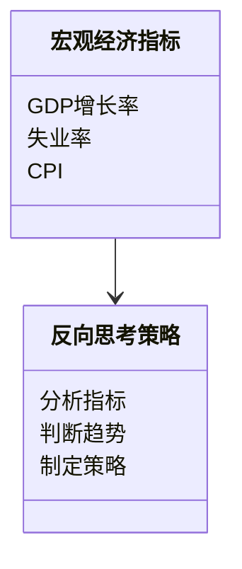
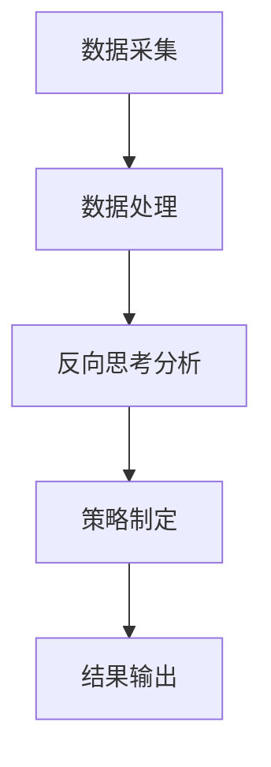
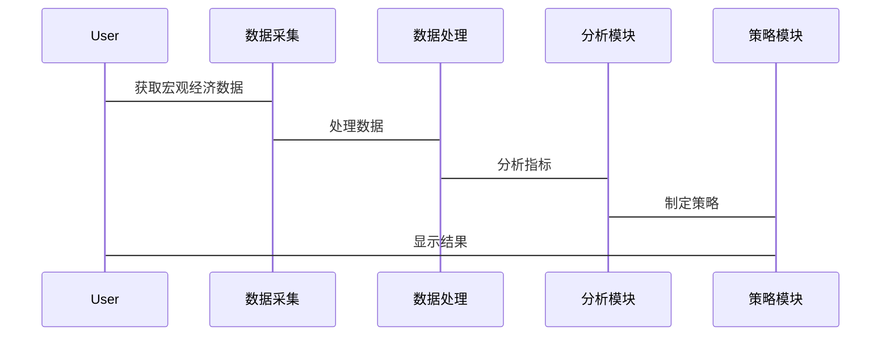

                 


# 彼得林奇的"反向思考"在宏观经济分析中的应用

## 关键词：
彼得林奇，反向思考，宏观经济分析，投资策略，经济预测

## 摘要：
本文探讨了彼得林奇的“反向思考”方法在宏观经济分析中的应用。通过分析宏观经济指标和市场趋势，结合实际案例，展示了如何利用反向思考策略进行投资决策，帮助投资者在复杂经济环境中捕捉机会。

---

# 引言：反向思考与宏观经济分析的结合

## 背景介绍

### 核心概念
- **反向思考**：从相反方向考虑问题，寻找市场忽视的机会。
- **宏观经济分析**：研究整体经济状况，包括GDP、失业率、CPI等指标。

### 问题背景
传统宏观经济分析依赖于市场趋势和主流观点，但忽视了逆向思维的重要性。反向思考可以帮助投资者在市场低谷时发现机会，在市场高点时保持警惕。

### 问题解决
通过反向思考，投资者可以在经济衰退中发现低估资产，在经济繁荣中识别潜在风险。

### 边界与外延
反向思考适用于宏观经济分析，但需结合具体经济指标和市场环境，避免盲目应用。

### 概念结构
- **核心要素**：GDP、失业率、CPI、利率。
- **关系图**：宏观经济指标相互影响，反向思考帮助识别指标间的关系变化。

---

## 核心概念与联系

### 反向思考的原理
反向思考通过分析市场行为的反面，寻找非共识性机会。例如，在市场恐慌时寻找被低估的资产。

### 对比表格
| 宏观经济指标 | 正向思考 | 反向思考 |
|--------------|----------|----------|
| GDP增长率    | 经济增长 | 经济放缓 |
| 失业率        | 就业改善 | 就业恶化 |
| CPI           | 通胀上升 | 通胀下降 |

### ER实体关系图
```mermaid
er
    entity 宏观经济指标 {
        GDP增长率
        失业率
        CPI
    }
    entity 反向思考策略 {
        经济指标分析
        投资决策
    }
    relationship 反向思考策略与宏观经济指标之间的关系
```

---

## 算法原理讲解

### 算法流程图


### 数学模型
- 经济趋势预测公式：
  $$ P = \sum_{i=1}^{n} (1 - \frac{GDP_i}{GDP_{avg}}) $$
  其中，\( GDP_i \) 为某一期的GDP，\( GDP_{avg} \) 为平均GDP。
- 失业率与经济周期关系：
  $$ U = \alpha \cdot G + \beta $$

### 代码实现
```python
def reverse_think_analysis(economic_data):
    # 经济指标分析
    gdp_growth = economic_data['gdp_growth']
    unemployment_rate = economic_data['unemployment_rate']
    inflation = economic_data['inflation']
    
    # 识别异常指标
    abnormal_indices = []
    if gdp_growth < -2:
        abnormal_indices.append('GDP负增长')
    if unemployment_rate > 8:
        abnormal_indices.append('高失业率')
    if inflation < 1:
        abnormal_indices.append('低通胀率')
    
    return abnormal_indices

# 示例数据
economic_data = {
    'gdp_growth': -3,
    'unemployment_rate': 9,
    'inflation': 0.5
}

result = reverse_think_analysis(economic_data)
print("异常指标：", result)
```

---

## 系统分析与架构设计

### 领域模型类图


### 系统架构图


### 接口设计
- 数据接口：提供宏观经济指标数据。
- 分析接口：接收指标数据，返回异常指标列表。
- 输出接口：显示分析结果和投资策略。

### 交互序列图


---

## 项目实战

### 环境安装
- 安装Python和必要的库，如Pandas、Matplotlib。

### 核心实现代码
```python
import pandas as pd
import matplotlib.pyplot as plt

def analyze_macro_data(data):
    # 数据分析
    growth_rates = data['gdp_growth']
    unemployment = data['unemployment_rate']
    
    # 反向思考分析
    warning_flags = []
    if growth_rates < -2:
        warning_flags.append('经济衰退风险')
    if unemployment > 8:
        warning_flags.append('就业市场恶化')
    
    # 可视化
    plt.plot(data['years'], growth_rates, label='GDP增长率')
    plt.title('GDP增长率趋势')
    plt.xlabel('年份')
    plt.ylabel('增长率')
    plt.legend()
    plt.show()
    
    return warning_flags

# 示例数据
data = {
    'years': [2018, 2019, 2020, 2021, 2022],
    'gdp_growth': [2.5, 1.2, -3, 4, -1],
    'unemployment_rate': [4.5, 5.0, 8.5, 6.2, 9.1]
}

result = analyze_macro_data(data)
print("警告标志：", result)
```

### 案例分析
2020年新冠疫情对全球经济的影响，使用反向思考识别GDP负增长和高失业率，提前制定投资策略，避免损失。

---

## 最佳实践与总结

### 小结
反向思考通过分析宏观经济指标的反面，帮助投资者识别潜在机会和风险，是一种有效的投资策略。

### 注意事项
- 需结合具体经济环境，避免机械应用。
- 定期更新分析模型，适应经济变化。

### 拓展阅读
- 彼得林奇的《选股的艺术》
- 宏观经济分析的经典文献

---

# 结论

通过系统地应用彼得林奇的反向思考方法，投资者可以在宏观经济分析中发现非共识性机会，制定更有效的投资策略。结合数学模型和实际案例，本文详细展示了反向思考的应用过程和优势。

