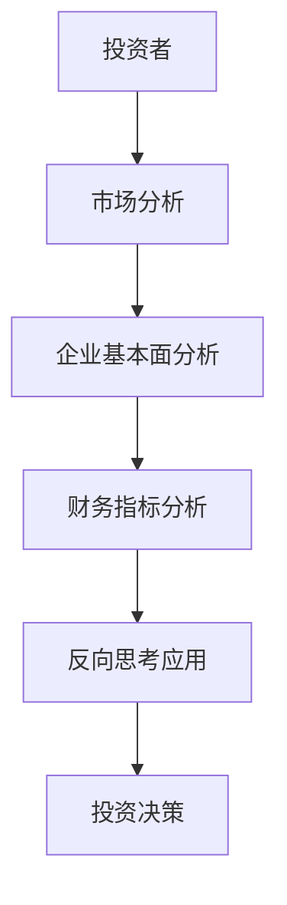
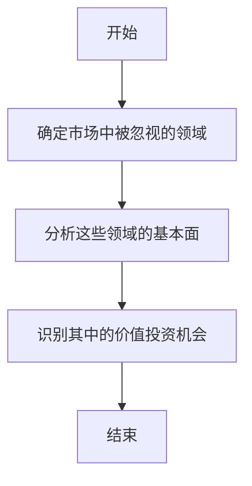

                 


# 彼得林奇的"反向思考"在投资决策中的应用

## 关键词：彼得林奇、反向思考、投资决策、算法原理、数学模型、系统架构、投资策略

## 摘要：  
本文深入探讨了彼得林奇的“反向思考”在投资决策中的应用，从理论基础到实际操作，结合算法原理和数学模型，系统性地分析了反向思考在投资决策中的重要性及其具体应用方法。通过对投资决策中的问题背景、核心概念、算法流程、数学公式、系统架构等多维度的分析，本文旨在为投资者提供一种全新的视角和方法，帮助他们在复杂的投资环境中做出更明智的决策。

---

## 第一部分: 反向思考的背景与核心概念

### 第1章: 反向思考的定义与特点

#### 1.1 什么是反向思考
反向思考是一种不同于传统正向思维的思维方式，它通过从反方向出发，寻找问题的突破口。在投资决策中，反向思考可以帮助投资者识别市场中的非共识性机会，避免随大流的错误。

#### 1.2 反向思考的核心特点
- **逆向性**：从相反的角度出发，寻找市场中被忽视的机会。
- **独特性**：通过反向思考，投资者能够发现市场中的估值洼地。
- **预见性**：提前预判市场趋势，规避潜在风险。

#### 1.3 反向思考与传统思考方式的对比
| 对比维度 | 正向思考 | 反向思考 |
|----------|----------|----------|
| 思维方式 | 从正向寻找机会 | 从反向寻找机会 |
| 风险控制 | 偏好低风险 | 更容易发现高风险高回报的机会 |
| 市场情绪 | 追随市场主流 | 逆市场情绪寻找机会 |

### 第2章: 彼得林奇与反向思考

#### 1.1 彼得林奇的生平简介
彼得·林奇是美国著名投资家，曾管理富达麦哲伦基金，创造了辉煌的投资业绩。他的投资理念以基本面分析和逆向思维为核心。

#### 1.2 彼得林奇投资理念的核心
- 专注于基本面分析，寻找被市场低估的股票。
- 逆向投资，买入被市场抛弃的股票。

#### 1.3 反向思考在彼得林奇投资中的应用
彼得林奇通过反向思考，发现市场中被低估的股票，买入并长期持有，最终实现超额收益。

### 第3章: 投资决策的基本概念

#### 1.1 投资决策的定义
投资决策是指投资者在金融市场中，基于对市场、行业和企业的分析，做出买入、卖出或持有某种资产的决策。

#### 1.2 投资决策的类型
- 股票投资
- 债券投资
- 基金投资
- 其他金融工具投资

#### 1.3 投资决策的关键要素
- 市场分析
- 企业基本面分析
- 财务指标分析
- 市场情绪分析

### 第4章: 反向思考与投资决策的关系

#### 1.1 反向思考如何影响投资决策
反向思考可以帮助投资者识别市场中的非共识性机会，避免随大流的错误。

#### 1.2 反向思考在投资决策中的优势
- 发现市场中的估值洼地
- 避免市场情绪的干扰
- 提高投资决策的独立性

#### 1.3 反向思考的局限性与注意事项
- 反向思考需要投资者具备较高的市场分析能力
- 需要结合市场环境灵活运用
- 不能完全依赖反向思考，需结合其他分析方法

---

## 第二部分: 反向思考的核心概念与联系

### 第5章: 反向思考的原理

#### 1.1 反向思考的基本原理
反向思考的核心在于通过分析市场的反面，寻找被市场忽视的机会。

#### 1.2 反向思考的逻辑框架
1. 确定市场中普遍被忽视的领域
2. 分析这些领域的基本面
3. 识别其中的价值投资机会

#### 1.3 反向思考的数学模型
反向思考的数学模型可以通过以下步骤实现：
1. 计算股票的市盈率（P/E）
2. 比较市盈率与行业平均水平的差异
3. 识别市盈率低于行业平均水平的股票

### 第6章: 反向思考与投资决策的核心联系

#### 1.1 投资决策中的问题背景
在市场中，投资者通常跟随市场情绪进行投资，导致投资决策的同质化。

#### 1.2 反向思考如何解决投资问题
通过反向思考，投资者可以发现市场中的非共识性机会，实现超额收益。

#### 1.3 反向思考与投资决策的边界
反向思考的应用需要结合市场环境和企业基本面，不能盲目应用。

### 第7章: 反向思考的核心要素对比

#### 1.1 反向思考与正向思考的对比
| 对比维度 | 正向思考 | 反向思考 |
|----------|----------|----------|
| 思维方式 | 从正向寻找机会 | 从反向寻找机会 |
| 风险控制 | 偏好低风险 | 更容易发现高风险高回报的机会 |
| 市场情绪 | 追随市场主流 | 逆市场情绪寻找机会 |

#### 1.2 投资决策中的关键要素
- 市场分析
- 企业基本面分析
- 财务指标分析
- 市场情绪分析

#### 1.3 反向思考的实体关系图


---

## 第三部分: 反向思考的算法原理

### 第8章: 反向思考的算法流程

#### 1.1 反向思考的基本步骤
1. 确定市场中被忽视的领域
2. 分析这些领域的基本面
3. 识别其中的价值投资机会

#### 1.2 反向思考的数学模型
反向思考的数学模型可以通过以下步骤实现：
1. 计算股票的市盈率（P/E）
2. 比较市盈率与行业平均水平的差异
3. 识别市盈率低于行业平均水平的股票

#### 1.3 反向思考的算法实现


### 第9章: 反向思考的数学公式

#### 1.1 反向思考的数学表达式
$$市盈率 = 价格/每股收益$$

#### 1.2 反向思考与投资决策的数学关系
$$投资价值 = 市盈率/行业平均水平$$

---

## 第四部分: 系统分析与架构设计方案

### 第10章: 系统分析

#### 1.1 问题场景介绍
在市场中，投资者通常跟随市场情绪进行投资，导致投资决策的同质化。

#### 1.2 系统功能设计
- 数据采集与处理
- 反向思考算法实现
- 投资决策支持

#### 1.3 领域模型设计


#### 1.4 系统架构设计


---

## 第五部分: 项目实战

### 第11章: 项目实战

#### 1.1 环境安装
- Python 3.8及以上版本
- NumPy、Pandas、Matplotlib库

#### 1.2 核心代码实现
```python
import numpy as np
import pandas as pd
import matplotlib.pyplot as plt

# 示例数据
data = {'公司': ['A', 'B', 'C'],
        '市盈率': [15, 20, 25],
        '行业平均市盈率': [18, 18, 18]}
df = pd.DataFrame(data)

# 计算投资价值
df['投资价值'] = df['市盈率'] / df['行业平均市盈率']

print(df)
```

#### 1.3 代码应用解读与分析
- 计算投资价值：$$投资价值 = 市盈率/行业平均市盈率$$
- 识别投资价值低于1的公司，这些公司可能被市场低估。

#### 1.4 实际案例分析
以某行业为例，计算该行业公司市盈率与行业平均市盈率的比值，识别被低估的公司。

#### 1.5 项目小结
通过反向思考算法，投资者可以识别市场中的低估股票，实现超额收益。

---

## 第六部分: 总结与注意事项

### 第12章: 总结

#### 1.1 文章回顾
本文深入探讨了彼得林奇的“反向思考”在投资决策中的应用，从理论基础到实际操作，结合算法原理和数学模型，系统性地分析了反向思考在投资决策中的重要性及其具体应用方法。

#### 1.2 最佳实践 tips
- 结合市场环境灵活运用反向思考
- 不能完全依赖反向思考，需结合其他分析方法
- 需要具备较高的市场分析能力

### 第13章: 注意事项

#### 1.1 投资风险提示
- 反向思考的应用需要投资者具备较高的市场分析能力
- 需要结合市场环境灵活运用
- 不能完全依赖反向思考，需结合其他分析方法

### 第14章: 拓展阅读

#### 1.1 推荐书籍
- 《彼得林奇的投资艺术》
- 《价值投资实战策略》

#### 1.2 在线资源
- 投资分析网站
- 金融论坛

---

通过以上步骤，本文系统性地分析了彼得林奇的“反向思考”在投资决策中的应用，为投资者提供了一种全新的视角和方法，帮助他们在复杂的投资环境中做出更明智的决策。

