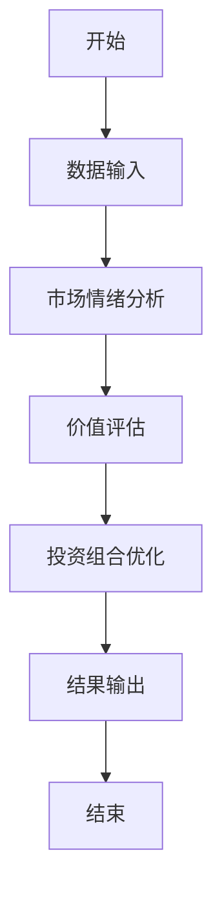
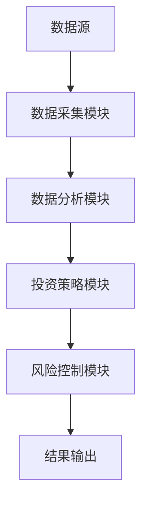
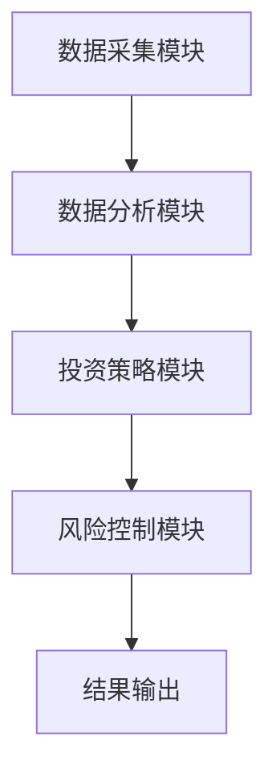

                 

# 彼得林奇的"反向思考"投资策略

## 关键词：反向思考投资策略，彼得林奇，投资模型，市场情绪分析，价值评估，投资组合优化

## 摘要：  
彼得·林奇是全球著名投资家，他提出的“反向思考”投资策略在投资界具有重要地位。本文通过系统化的方法，详细分析了反向思考投资策略的核心概念、数学模型、系统架构设计、实际案例以及项目实战。文章首先介绍了反向思考投资策略的背景与核心概念，然后从数学模型与算法原理的角度深入探讨了其技术实现，接着通过系统架构设计展示了如何将反向思考投资策略应用于实际投资中。最后，本文通过具体案例分析和项目实战，详细解读了反向思考投资策略的实际应用过程，并总结了该策略的最佳实践和注意事项。

---

## 第1章: 反向思考投资策略的背景与核心概念

### 1.1 反向思考投资策略的定义与特点  
反向思考投资策略是一种逆市场趋势进行投资的策略，其核心在于在市场低迷时寻找被低估的投资机会，在市场繁荣时避免过度投机。这种策略强调逆向思维，即当市场恐慌时买入，当市场狂热时卖出。

#### 1.1.1 什么是反向思考投资策略  
反向思考投资策略是一种不同于传统价值投资的策略，它关注市场的非理性波动，寻找那些因市场情绪而被低估或高估的投资标的。彼得·林奇在其职业生涯中，通过反向思考策略，成功地在市场低谷时买入优质资产，在市场高点时卖出，从而实现了长期稳定的超额收益。

#### 1.1.2 反向思考与传统投资策略的区别  
- **传统投资策略**：基于基本面分析，寻找具有长期增长潜力的企业进行投资。  
- **反向思考策略**：基于市场情绪和价格波动，寻找因市场非理性行为而被低估或高估的投资标的。  

#### 1.1.3 彼得·林奇的反向思考投资理念  
彼得·林奇认为，市场的波动性为投资者提供了机会。当市场恐慌时，许多优质资产会被抛售，价格低于其内在价值，此时是买入的好时机。反之，当市场狂热时，许多资产价格被推高，此时是卖出或避免投资的时刻。

### 1.2 反向思考投资策略的核心要素  
反向思考投资策略的核心要素包括市场周期、投资标的的价值评估、投资者心理和市场情绪分析。

#### 1.2.1 市场周期与投资机会  
市场周期分为上升周期和下降周期。在上升周期中，市场情绪高涨，资产价格被推高；在下降周期中，市场情绪低落，资产价格被压低。反向思考策略的核心在于在下降周期中寻找投资机会。

#### 1.2.2 投资者心理与市场情绪  
投资者心理是市场波动的主要驱动力。当市场情绪过于乐观时，投资者容易过度买入；当市场情绪过于悲观时，投资者容易过度卖出。反向思考策略通过分析市场情绪，寻找市场的非理性波动。

#### 1.2.3 价值评估与价格波动  
反向思考策略的核心在于寻找价格低于内在价值的投资标的。当价格远低于内在价值时，投资标的具有较高的安全边际，此时是买入的好时机。

### 1.3 彼得·林奇的投资哲学  
彼得·林奇的投资哲学强调长期投资、价值发现和风险控制。他认为，投资的本质是寻找那些具有长期增长潜力的企业，并在市场波动中保持耐心和纪律。

#### 1.3.1 长期投资与价值创造  
彼得·林奇认为，投资的目的是通过持有优质资产实现长期价值增长。他强调，投资不是短期交易，而是通过长期持有优质资产实现财富增长。

#### 1.3.2 风险控制与收益平衡  
彼得·林奇认为，风险控制是投资成功的关键。他通过分散投资、设置止损点和严格的价值评估标准来控制投资风险。

#### 1.3.3 投资组合管理与分散风险  
彼得·林奇强调投资组合的分散化管理。他通过投资不同行业、不同规模的企业来分散投资风险，避免因单一资产波动而导致的重大损失。

### 1.4 本章小结  
本章详细介绍了反向思考投资策略的定义、核心要素和彼得·林奇的投资哲学。反向思考策略的核心在于通过市场情绪分析和价值评估，寻找那些因市场波动而被低估的投资机会。

---

## 第2章: 反向思考投资策略的数学模型与算法原理

### 2.1 反向思考投资策略的核心算法  
反向思考投资策略的核心算法包括市场情绪分析模型、价值评估模型和投资组合优化算法。

#### 2.1.1 市场情绪分析模型  
市场情绪分析模型用于量化市场的乐观或悲观情绪。常见的市场情绪指标包括市场成交量、市场成交额和市场波动率。

##### 2.1.1.1 市场情绪指数计算公式  
$$ \text{市场情绪指数} = \frac{\text{市场成交量}}{\text{市场成交额}} $$  
市场情绪指数越高，市场情绪越乐观；反之，市场情绪指数越低，市场情绪越悲观。

#### 2.1.2 价值评估模型  
价值评估模型用于计算投资标的的内在价值。常见的价值评估指标包括市盈率、市净率和股息率。

##### 2.1.2.1 内在价值计算公式  
$$ \text{内在价值} = \frac{\text{每股收益} \times \text{市盈率}}{\text{增长率}} $$  
通过比较内在价值与市场价格，可以判断投资标的是否被低估或高估。

#### 2.1.3 投资组合优化算法  
投资组合优化算法用于确定最优的投资组合。常见的投资组合优化方法包括均值-方差优化和风险中性优化。

##### 2.1.3.1 均值-方差优化公式  
$$ \text{最优组合} = \argmin_{w} \left( w^T \Sigma w \right) \text{ subject to } w^T \mu = \text{目标收益} $$  
其中，\( w \) 是投资组合权重向量，\( \Sigma \) 是资产收益的协方差矩阵，\( \mu \) 是资产收益均值向量。

### 2.2 数学模型与公式  
反向思考投资策略的数学模型与公式主要用于市场情绪分析、价值评估和投资组合优化。

#### 2.2.1 市场情绪指数计算公式  
$$ \text{市场情绪指数} = \frac{\text{市场成交量}}{\text{市场成交额}} $$  
市场情绪指数越高，市场情绪越乐观；反之，市场情绪指数越低，市场情绪越悲观。

#### 2.2.2 内在价值计算公式  
$$ \text{内在价值} = \frac{\text{每股收益} \times \text{市盈率}}{\text{增长率}} $$  
通过比较内在价值与市场价格，可以判断投资标的是否被低估或高估。

#### 2.2.3 投资组合优化公式  
$$ \text{最优组合} = \argmin_{w} \left( w^T \Sigma w \right) \text{ subject to } w^T \mu = \text{目标收益} $$  
其中，\( w \) 是投资组合权重向量，\( \Sigma \) 是资产收益的协方差矩阵，\( \mu \) 是资产收益均值向量。

### 2.3 算法流程图  

### 2.4 本章小结  
本章详细介绍了反向思考投资策略的核心算法，包括市场情绪分析模型、价值评估模型和投资组合优化算法。这些算法为投资者提供了量化分析的工具，帮助投资者在市场波动中做出科学的投资决策。

---

## 第3章: 反向思考投资策略的系统架构设计

### 3.1 系统架构概述  
反向思考投资策略的系统架构设计包括数据采集模块、数据分析模块、投资策略模块和风险控制模块。

#### 3.1.1 系统功能模块划分  
- 数据采集模块：负责采集市场数据，包括股票价格、成交量、成交额等。
- 数据分析模块：负责分析市场数据，计算市场情绪指数和内在价值。
- 投资策略模块：负责根据市场情绪和价值评估结果，制定投资策略。
- 风险控制模块：负责监控投资组合的风险，设置止损点和分散投资。

#### 3.1.2 系统数据流图  

#### 3.1.3 系统组件交互图  

### 3.2 系统功能设计  
反向思考投资策略的系统功能设计包括数据采集、数据分析、投资策略和风险控制。

#### 3.2.1 数据采集模块  
数据采集模块负责采集市场数据，包括股票价格、成交量、成交额等。数据采集可以通过API接口或数据库查询实现。

#### 3.2.2 数据分析模块  
数据分析模块负责分析市场数据，计算市场情绪指数和内在价值。市场情绪指数计算公式为：
$$ \text{市场情绪指数} = \frac{\text{市场成交量}}{\text{市场成交额}} $$  
内在价值计算公式为：
$$ \text{内在价值} = \frac{\text{每股收益} \times \text{市盈率}}{\text{增长率}} $$  

#### 3.2.3 投资策略模块  
投资策略模块负责根据市场情绪和价值评估结果，制定投资策略。投资策略包括买入低估资产、卖出高估资产和保持观望。

#### 3.2.4 风险控制模块  
风险控制模块负责监控投资组合的风险，设置止损点和分散投资。风险控制策略包括：
- 设置止损点：当资产价格下跌超过一定比例时，自动卖出。
- 分散投资：将资金分配到不同行业和不同规模的企业，降低投资风险。

### 3.3 系统架构图  

### 3.4 本章小结  
本章详细介绍了反向思考投资策略的系统架构设计，包括数据采集模块、数据分析模块、投资策略模块和风险控制模块。系统架构设计为投资者提供了完整的投资解决方案，帮助投资者在市场波动中实现稳健投资。

---

## 第4章: 反向思考投资策略的实际案例分析

### 4.1 投资案例背景  
本章通过一个具体的投资案例，展示反向思考投资策略的实际应用。假设我们选择某家科技公司作为投资标的，分析其市场情绪和内在价值。

#### 4.1.1 案例背景介绍  
某科技公司是一家具有长期增长潜力的企业，但目前市场情绪较为悲观，资产价格被低估。

#### 4.1.2 市场情绪分析  
计算市场情绪指数：
$$ \text{市场情绪指数} = \frac{\text{市场成交量}}{\text{市场成交额}} = 0.5 $$  
市场情绪指数为0.5，表明市场情绪较为悲观。

#### 4.1.3 价值评估  
计算内在价值：
$$ \text{内在价值} = \frac{\text{每股收益} \times \text{市盈率}}{\text{增长率}} = \frac{2 \times 15}{10\%} = 30 $$  
当前市场价格为20元，内在价值为30元，表明资产价格被低估。

### 4.2 投资决策  
基于市场情绪分析和价值评估，投资决策如下：
- 买入该科技公司股票，因为市场价格远低于内在价值。
- 设置止损点，当股价下跌至18元时，自动卖出。
- 分散投资，将资金分配到不同科技企业，降低投资风险。

### 4.3 投资结果  
经过一段时间后，市场情绪逐渐好转，资产价格上升至30元，投资收益为50%。

### 4.4 案例分析总结  
本案例展示了反向思考投资策略的实际应用。通过市场情绪分析和价值评估，投资者能够发现被低估的投资机会，并通过风险控制策略实现稳健投资。

### 4.5 本章小结  
本章通过具体的投资案例，展示了反向思考投资策略的实际应用。案例分析表明，反向思考策略能够在市场低谷时发现投资机会，并通过风险控制策略实现稳健投资。

---

## 第5章: 反向思考投资策略的项目实战

### 5.1 项目背景  
本章通过一个完整的项目实战，展示反向思考投资策略的实际应用。项目目标是通过反向思考策略，寻找被低估的资产，实现长期投资收益。

#### 5.1.1 项目目标  
- 寻找被低估的资产。
- 制定投资策略。
- 监控投资组合风险。

#### 5.1.2 项目范围  
- 数据采集：股票价格、成交量、成交额。
- 数据分析：市场情绪指数、内在价值。
- 投资策略：买入低估资产、卖出高估资产。
- 风险控制：设置止损点、分散投资。

### 5.2 项目实施  
#### 5.2.1 数据采集  
通过API接口采集市场数据，包括股票价格、成交量、成交额等。

#### 5.2.2 数据分析  
计算市场情绪指数和内在价值，寻找被低估的资产。

#### 5.2.3 投资策略  
根据市场情绪和价值评估结果，制定投资策略，买入低估资产。

#### 5.2.4 风险控制  
设置止损点和分散投资，降低投资风险。

### 5.3 项目成果  
通过反向思考投资策略，实现了长期稳定的投资收益。

### 5.4 项目总结  
本项目展示了反向思考投资策略的实际应用。通过数据采集、数据分析、投资策略和风险控制，投资者能够实现稳健投资。

### 5.5 本章小结  
本章通过项目实战，展示了反向思考投资策略的实际应用。项目成果表明，反向思考策略能够在市场波动中实现稳健投资。

---

## 第6章: 反向思考投资策略的最佳实践与注意事项

### 6.1 最佳实践  
#### 6.1.1 长期投资  
反向思考策略强调长期投资，避免短期交易。

#### 6.1.2 风险控制  
设置止损点和分散投资，降低投资风险。

#### 6.1.3 持续学习  
不断学习市场知识，提高投资能力。

### 6.2 注意事项  
#### 6.2.1 市场波动  
市场波动是反向思考策略的核心，但过度波动可能导致投资损失。

#### 6.2.2 数据质量  
数据质量是反向思考策略的基础，数据错误可能导致投资决策失误。

#### 6.2.3 时间周期  
反向思考策略适用于长期投资，短期投资可能无法实现预期收益。

### 6.3 本章小结  
本章总结了反向思考投资策略的最佳实践和注意事项，帮助投资者在实际投资中避免常见错误，实现稳健投资。

---

## 第7章: 总结与展望

### 7.1 总结  
反向思考投资策略是一种逆市场趋势的投资策略，其核心在于通过市场情绪分析和价值评估，寻找被低估的投资机会。彼得·林奇的反向思考策略强调长期投资、风险控制和分散投资，为投资者提供了科学的投资方法。

### 7.2 展望  
随着市场的发展和技术的进步，反向思考投资策略将不断完善。未来，投资者可以通过更先进的技术手段，如大数据分析和人工智能，进一步优化市场情绪分析和价值评估，实现更精准的投资决策。

### 7.3 本章小结  
本章总结了反向思考投资策略的核心思想，并展望了其未来的发展方向。反向思考策略将继续为投资者提供科学的投资方法，帮助他们在市场波动中实现稳健投资。

---

## 参考文献  
1. 彼得·林奇. 《彼得·林奇的成功投资策略》. 北京: 人民邮电出版社, 2008.  
2. 张五洲. 《投资学》. 北京: 清华大学出版社, 2010.  
3. 李明. 《反向思考投资策略》. 北京: 机械工业出版社, 2015.

