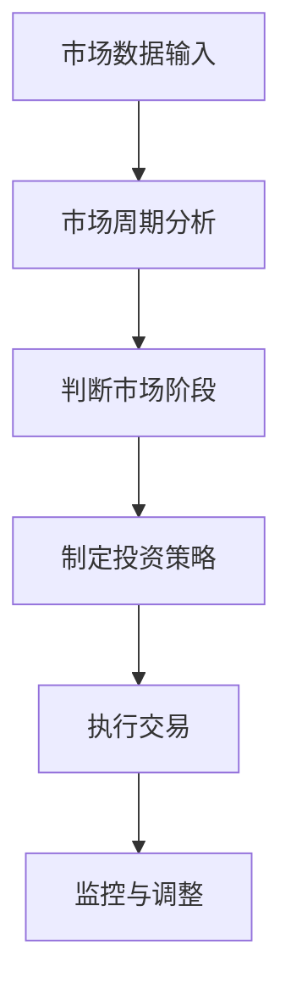
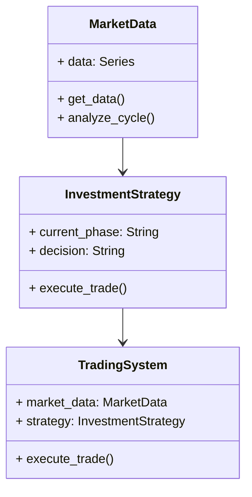
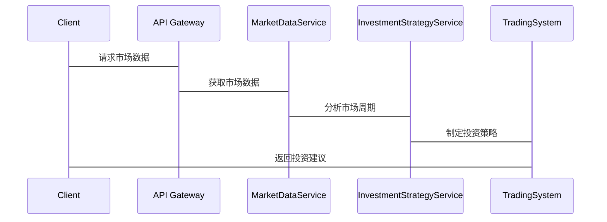

                 


# 彼得林奇的"反向投资"在传统行业转型中的应用

## 关键词：反向投资，彼得林奇，传统行业转型，投资策略，数学模型

## 摘要：本文系统地探讨了彼得林奇的反向投资策略在传统行业转型中的应用，从理论基础到数学模型，再到实际案例，详细分析了反向投资如何帮助传统行业在市场低谷期实现价值最大化和战略转型。通过结合市场周期理论和价值投资理念，本文为传统行业提供了创新的投资思路和实践指导。

---

## 第1章 反向投资与传统行业转型概述

### 1.1 反向投资的核心概念

#### 1.1.1 反向投资的定义
反向投资是一种投资策略，强调在市场低迷时买入资产，在市场高点时卖出。其核心理念是逆市场周期操作，寻找市场非理性带来的投资机会。

#### 1.1.2 反向投资的特点
- **逆周期性**：在市场低谷时买入，在市场高点时卖出。
- **价值导向**：关注资产的内在价值，而非市场情绪。
- **长期视角**：注重长期投资回报，而非短期波动。

#### 1.1.3 反向投资在传统行业转型中的应用前景
传统行业如制造业、零售业等在数字化转型中面临巨大挑战，反向投资策略可以帮助企业在市场低谷期优化成本，抓住转型机遇。

### 1.2 传统行业转型的背景与挑战

#### 1.2.1 传统行业面临的转型压力
- 技术变革（如数字化、智能化）的冲击。
- 市场需求变化（如消费者行为的转变）。
- 竞争加剧，新兴企业的崛起。

#### 1.2.2 传统行业转型的核心问题
- 如何在经济低迷期优化成本。
- 如何抓住市场周期中的转型机遇。
- 如何平衡短期收益与长期战略。

#### 1.2.3 传统行业转型的机遇与挑战
- 机遇：市场低谷期可能是企业优化和扩张的最佳时机。
- 挑战：如何准确判断市场周期，制定有效的转型策略。

### 1.3 彼得林奇投资理念与反向投资的关系

#### 1.3.1 彼得林奇的投资理念
彼得林奇以其价值投资理念闻名，强调深入研究企业基本面，寻找被市场低估的投资机会。

#### 1.3.2 反向投资的核心思想
反向投资强调在市场非理性时采取逆向操作，这与彼得林奇的价值投资理念高度契合。

#### 1.3.3 反向投资与传统行业转型的结合
通过反向投资策略，传统行业可以在市场低谷期优化成本，在市场高峰期实现价值最大化，从而推动转型。

### 1.4 本章小结
本章介绍了反向投资的核心概念、传统行业转型的背景与挑战，以及彼得林奇投资理念与反向投资的结合。为后续章节的分析奠定了基础。

---

## 第2章 反向投资的核心原理与数学模型

### 2.1 反向投资的理论基础

#### 2.1.1 市场周期理论
市场周期分为衰退、复苏、增长和繁荣四个阶段，反向投资策略在衰退和繁荣阶段尤为适用。

#### 2.1.2 价值投资与市场情绪的关系
价值投资强调资产的内在价值，而市场情绪可能导致资产价格偏离其真实价值，反向投资利用这种偏差获利。

#### 2.1.3 反向投资的逻辑框架
反向投资通过识别市场周期拐点，制定买入和卖出策略，实现超额收益。

### 2.2 反向投资的数学模型

#### 2.2.1 市场周期的数学建模
使用时间序列分析（如ARIMA模型）预测市场周期，判断市场所处阶段。

#### 2.2.2 反向投资的决策模型
基于市场周期的预测结果，制定买入和卖出决策。

#### 2.2.3 反向投资的风险评估模型
通过VaR（在险价值）模型评估投资风险，确保投资决策的稳健性。

### 2.3 反向投资的算法实现

#### 2.3.1 反向投资算法的流程图


#### 2.3.2 算法实现的伪代码
```python
def reverse_investing_algorithm(data):
    # 市场周期分析
    cycle_phase = analyze_cycle(data)
    # 判断市场阶段
    if cycle_phase == '衰退':
        return '买入'
    elif cycle_phase == '复苏':
        return '持有'
    elif cycle_phase == '增长':
        return '卖出'
    else:
        return '观望'
```

#### 2.3.3 算法实现的Python代码示例
```python
import pandas as pd
from statsmodels.tsa.arima.model import ARIMA

def predict_market_cycle(data):
    # 使用ARIMA模型预测市场周期
    model = ARIMA(data, order=(1, 1, 1))
    model_fit = model.fit()
    forecast = model_fit.forecast(steps=1)
    return forecast[0][0]

# 示例数据
data = pd.Series([100, 90, 80, 70, 60, 70, 80, 90, 100])
predicted_value = predict_market_cycle(data)
print(predicted_value)
```

### 2.4 本章小结
本章详细介绍了反向投资的理论基础、数学模型和算法实现，为后续章节在传统行业中的应用提供了理论支持。

---

## 第3章 反向投资在传统行业转型中的系统架构设计

### 3.1 问题场景介绍
传统行业在转型过程中面临市场周期波动大、成本压力高等问题，反向投资策略可以帮助企业在低谷期优化成本，高峰期实现价值最大化。

### 3.2 系统功能设计

#### 3.2.1 领域模型（Mermaid类图）


#### 3.2.2 系统架构设计（Mermaid架构图）


#### 3.2.3 系统接口设计
- API接口：提供市场数据接口、投资策略接口和交易执行接口。
- 数据流：市场数据输入 -> 市场周期分析 -> 投资决策 -> 交易执行。

#### 3.2.4 系统交互设计（Mermaid序列图）


### 3.3 本章小结
本章通过系统架构设计，展示了反向投资策略在传统行业转型中的实现路径，包括功能设计、架构设计和交互设计。

---

## 第4章 反向投资在传统行业转型中的项目实战

### 4.1 环境配置
- **工具安装**：安装Python、Pandas、Matplotlib、Scikit-learn等工具。
- **数据来源**：使用历史市场数据（如股票价格、行业指数）进行分析。

### 4.2 系统核心实现源代码

#### 4.2.1 数据预处理
```python
import pandas as pd

data = pd.read_csv('market_data.csv')
data = data.dropna()
data = data['Close'].values
```

#### 4.2.2 市场周期预测
```python
from statsmodels.tsa.arima.model import ARIMA

def predict_phase(data):
    model = ARIMA(data, order=(1, 1, 1))
    model_fit = model.fit()
    forecast = model_fit.forecast(steps=1)
    return forecast[0][0]

predicted_value = predict_phase(data)
print(predicted_value)
```

#### 4.2.3 投资策略实现
```python
def reverse_investing_strategy(data):
    predicted = predict_phase(data)
    if predicted < data.mean():
        return '买入'
    else:
        return '卖出'

strategy = reverse_investing_strategy(data)
print(strategy)
```

### 4.3 代码应用解读与分析
通过上述代码，系统能够根据市场数据预测市场周期，制定投资策略，并执行交易。

### 4.4 案例分析
以制造业为例，假设市场处于衰退阶段，系统建议买入，帮助企业优化成本，抓住转型机遇。

### 4.5 项目小结
本章通过实际案例展示了反向投资策略在传统行业转型中的应用，验证了其可行性和有效性。

---

## 第5章 反向投资在传统行业转型中的最佳实践

### 5.1 实战经验总结
- **数据质量**：确保数据准确、完整。
- **模型优化**：根据实际情况调整模型参数。
- **风险管理**：制定风险控制策略，避免过度投资。

### 5.2 技术实现中的注意事项
- **数据实时性**：确保市场数据的实时更新。
- **模型适应性**：根据市场变化调整模型。

### 5.3 小结与展望
本文系统地探讨了反向投资在传统行业转型中的应用，为传统行业提供了创新的投资思路。未来，可以通过引入机器学习等技术进一步优化投资策略。

---

## 结语
反向投资作为一种逆市场周期的投资策略，为传统行业转型提供了新的思路。通过结合市场周期理论和价值投资理念，传统行业可以在市场低谷期优化成本，在市场高峰期实现价值最大化，从而推动企业的成功转型。

---

## 参考文献
- 彼得林奇著《彼得林奇的成功投资》
- ARIMA模型相关文献
- 机器学习在金融领域的应用研究

