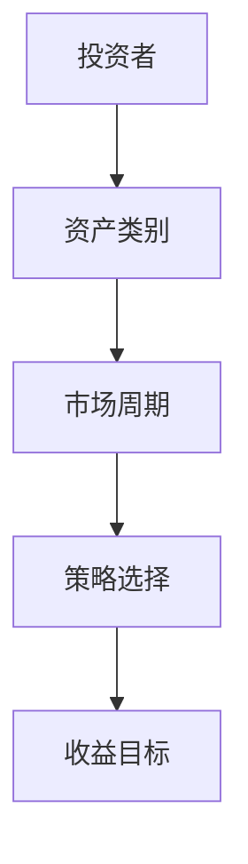
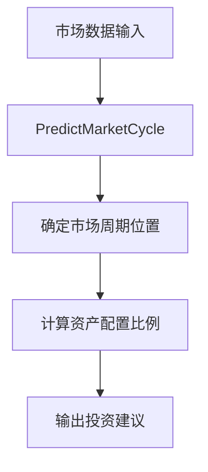
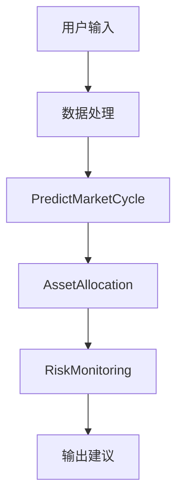

                 


# 彼得林奇的"反周期"投资在不同资产类别间的动态配置

---

## 关键词：
- 彼得林奇
- 反周期投资
- 资产配置
- 经济周期
- 动态调整

---

## 摘要：
彼得林奇作为全球著名投资经理，提出了反周期投资策略，即在经济周期低谷时投资，以期望在周期回升时获得超额收益。本文将详细分析反周期投资的核心概念、数学模型、系统设计以及在股票、债券和基金等资产类别中的实战应用，结合彼得林奇的理论，探讨如何在不同经济环境下动态调整资产配置，实现长期稳健的投资收益。

---

## 第一部分：反周期投资的背景与核心概念

### 第1章：反周期投资的背景与定义

#### 1.1 什么是反周期投资
反周期投资是一种在经济周期低谷期进行投资的策略，旨在通过低位买入优质资产，在周期回升时获得超额收益。与周期性波动相反，反周期投资强调在市场低迷时寻找被低估的投资机会。

#### 1.2 彼得林奇的反周期投资理论
彼得林奇在其投资生涯中，尤其擅长在市场低迷时寻找被低估的股票。他强调基本面分析，寻找具有强大竞争优势和良好财务状况的公司，并在市场恐慌时买入。

#### 1.3 反周期投资的适用场景
反周期投资适用于经济周期的衰退或低谷阶段，特别适合那些能够承受短期市场波动、追求长期收益的投资者。

---

### 第2章：反周期投资的核心概念与联系

#### 2.1 反周期投资的核心概念
反周期投资的核心在于识别市场周期，并在周期低谷时进行逆向投资。其关键在于对市场波动的准确判断和对优质资产的筛选。

#### 2.2 核心概念的属性特征对比
下表展示了反周期投资与其他投资策略的核心差异：

| 比较维度 | 反周期投资 | 价值投资 | 技术投资 |
|----------|------------|----------|----------|
| 投资时机 | 经济低谷时 | 估值合理时 | 技术信号时 |
| 投资依据 | 市场周期 | 公司价值 | 技术指标 |
| 风险承受 | 高 | 中等 | 低 |

#### 2.3 实体关系图：反周期投资的ER架构


---

## 第二部分：反周期投资的数学模型与算法原理

### 第3章：反周期投资的数学模型

#### 3.1 反周期投资的数学模型构建
反周期投资模型基于经济指标（如GDP、失业率）预测市场周期，并动态调整资产配置。其数学表达式如下：

$$
\text{投资比例} = f(\text{市场周期位置}, \text{资产类别风险})
$$

其中，函数$f$表示根据当前市场周期位置和资产类别风险，计算出最优投资比例。

#### 3.2 经济周期预测模型
使用经济指标构建市场周期预测模型，公式如下：

$$
\text{市场周期指数} = \alpha \cdot \text{GDP增长率} + \beta \cdot \text{失业率} + \gamma \cdot \text{企业利润增长率}
$$

其中，$\alpha$、$\beta$、$\gamma$为权重系数，需通过历史数据拟合确定。

#### 3.3 资产配置优化模型
基于市场周期指数，动态优化资产配置比例：

$$
\max \sum_{i=1}^{n} w_i \cdot r_i
$$

$$
\text{subject to} \quad \sum_{i=1}^{n} w_i = 1
$$

其中，$w_i$为资产$i$的配置权重，$r_i$为预期收益率。

---

### 第4章：反周期投资的算法原理

#### 4.1 算法流程图


#### 4.2 算法实现代码
```python
def predict_market_cycle(economic_data):
    # 经济数据预处理
    gdp_growth = economic_data['GDP增长率']
    unemployment = economic_data['失业率']
    profit_growth = economic_data['企业利润增长率']
    
    # 市场周期指数计算
    market_cycle_index = 0.4 * gdp_growth + 0.3 * unemployment + 0.3 * profit_growth
    return market_cycle_index

def dynamic_asset_allocation(market_cycle_index):
    # 根据市场周期指数动态调整资产配置
    asset_classes = ['股票', '债券', '现金']
    allocation = {
        '股票': max(0, 100 - 10 * (market_cycle_index - 0.5)),
        '债券': max(0, 20 + 10 * (market_cycle_index - 0.5)),
        '现金': 10
    }
    return allocation

# 示例应用
economic_data = {
    'GDP增长率': 2.5,
    '失业率': 6.2,
    '企业利润增长率': 4.8
}
market_cycle = predict_market_cycle(economic_data)
allocation = dynamic_asset_allocation(market_cycle)
print(allocation)
```

---

## 第三部分：反周期投资的系统分析与架构设计

### 第5章：反周期投资的系统分析

#### 5.1 系统功能设计
反周期投资系统需要具备数据采集、周期预测、资产配置和风险监控等功能。

#### 5.2 系统架构设计


#### 5.3 系统接口设计
- 输入接口：接收经济数据和市场指标
- 输出接口：提供资产配置建议和风险报告

---

## 第四部分：反周期投资的项目实战

### 第6章：股票投资中的反周期策略

#### 6.1 股票市场环境配置
在股票市场中，反周期投资选择低市盈率、高股息率的股票。

#### 6.2 代码实现
```python
def select_value_stocks(stocks):
    # 筛选低市盈率和高股息率的股票
    value_stocks = []
    for stock in stocks:
        if stock.pe < 15 and stock.dividend_yield > 3:
            value_stocks.append(stock)
    return value_stocks
```

### 第7章：债券投资中的反周期策略

#### 7.1 债券市场环境配置
选择长期国债和信用评级较高的公司债。

#### 7.2 代码实现
```python
def select_bonds(bonds):
    # 筛选长期国债和高信用评级债券
    selected_bonds = []
    for bond in bonds:
        if bond.maturity > 10 and bond.credit_rating > 'BBB':
            selected_bonds.append(bond)
    return selected_bonds
```

### 第8章：基金投资中的反周期策略

#### 8.1 基金市场环境配置
选择业绩稳定、费用率低的指数基金。

#### 8.2 代码实现
```python
def select_funds(funds):
    # 筛选低费用率和高历史回报的基金
    selected_funds = []
    for fund in funds:
        if fund.expense_ratio < 1 and fund.annual_return > 8:
            selected_funds.append(fund)
    return selected_funds
```

---

## 第五部分：反周期投资的最佳实践与小结

### 第9章：总结与建议

#### 9.1 总结
反周期投资需要对市场周期有深刻理解，并结合资产类别特点进行动态配置。

#### 9.2 投资建议
- 定期评估市场周期位置
- 根据周期调整资产配置
- 保持长期投资视角

---

## 第六部分：注意事项与扩展阅读

### 第10章：注意事项

#### 10.1 风险提示
反周期投资需谨慎，市场预测存在不确定性。

#### 10.2 额外建议
持续学习市场知识，结合多种策略进行投资。

---

## 附录：参考文献与扩展阅读

- 彼得林奇《投资最重要的事情》
- 巴菲特《巴菲特致股东的信》
- 格雷厄姆《证券分析》

---

通过以上详细分析和实战案例，反周期投资策略在不同资产类别间的动态配置得以清晰展现。希望本文能为投资者提供有价值的参考和启发。

