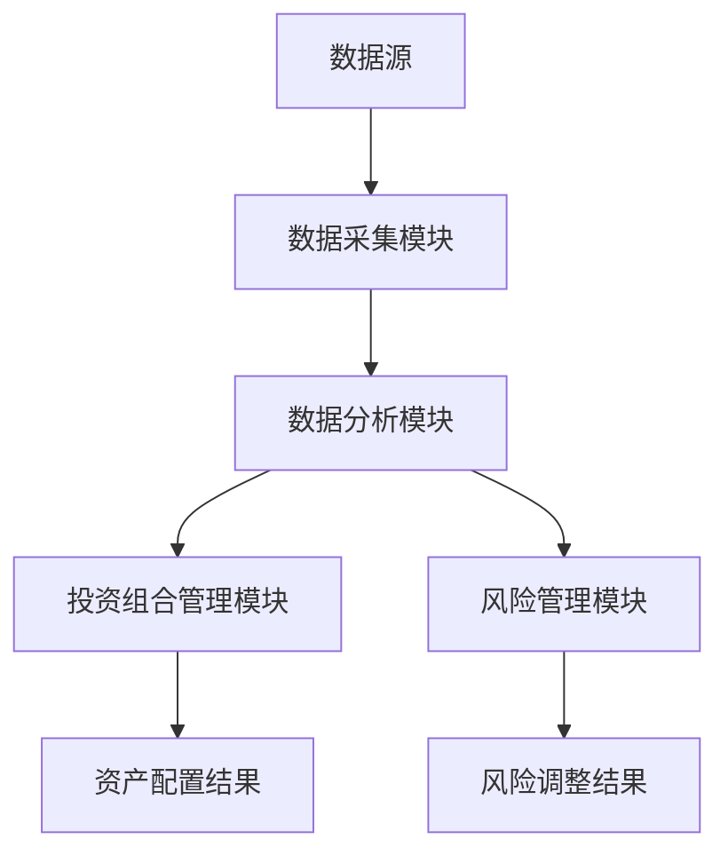

                 


# 彼得林奇的"反周期"投资在不同资产类别间的轮动

> 关键词：反周期投资，资产类别轮动，彼得·林奇，经济周期，投资策略

> 摘要：本文深入探讨了彼得·林奇的反周期投资理念，并分析了其在股票、债券和商品等不同资产类别间的轮动策略。通过系统的理论分析和实际案例，本文详细解释了如何在不同经济周期下进行资产配置，以实现长期稳定的收益。

---

## 第一部分：反周期投资的背景与概念

### 第1章：反周期投资的背景与概念

#### 1.1 投资周期的基本概念

##### 1.1.1 投资周期的定义与分类

投资周期是指资产价格在市场中波动的过程，通常分为四个阶段：复苏、繁荣、衰退和萧条。每个阶段的特点和资产表现有所不同。

- **复苏阶段**：经济开始复苏，企业盈利逐步恢复，股票市场逐渐上升。
- **繁荣阶段**：经济 overheating，市场参与者情绪高涨，资产价格达到高位。
- **衰退阶段**：经济出现下滑，企业盈利下降，资产价格开始下跌。
- **萧条阶段**：经济处于低谷，市场参与者情绪低迷，资产价格继续下跌。

##### 1.1.2 经济周期与市场周期的关系

经济周期是市场周期的驱动力。经济周期的波动直接影响市场的供需关系和资产价格。例如，在经济衰退期间，债券通常表现优于股票，因为债券的风险较低，而股票市场可能大幅下跌。

##### 1.1.3 反周期投资的定义与特点

反周期投资是指在经济周期的不同阶段，根据市场环境的变化调整资产配置的投资策略。其特点是灵活、适应性强，能够在不同市场环境下捕捉收益、降低风险。

---

#### 1.2 彼得·林奇的投资理念

##### 1.2.1 彼得·林奇的投资风格概述

彼得·林奇是美国著名的投资经理人，以其成功的投资策略和对市场的深刻理解而闻名。他强调长期投资和价值发现，反对短期市场波动的干扰。

##### 1.2.2 林奇对反周期投资的贡献

林奇在反周期投资方面的贡献主要体现在他对资产类别轮动的深入研究。他主张根据经济周期的变化，将资金在股票、债券和其他资产之间进行切换，以规避风险并抓住收益机会。

##### 1.2.3 林奇投资策略的核心思想

林奇认为，成功的投资需要结合市场环境和资产特性。在经济衰退时，债券和黄金等防御性资产是较好的选择；而在经济复苏时，股票和房地产等风险资产则更具投资价值。

---

## 第二部分：反周期投资的核心原理

### 第2章：反周期投资的核心原理

#### 2.1 反周期投资的理论基础

##### 2.1.1 资产价格波动与周期性分析

资产价格的波动与经济周期密切相关。例如，在经济衰退时，债券价格通常会上涨，因为债券的收益率相对于风险较高的资产更具吸引力。

##### 2.1.2 市场情绪与投资者行为分析

市场情绪是影响资产价格的重要因素。在繁荣时期，投资者情绪高涨，可能导致资产价格泡沫；而在衰退时期，投资者情绪低落，可能导致资产价格被低估。

##### 2.1.3 经济指标与市场周期的关系

通过分析经济指标（如GDP增长率、失业率、通胀率等），投资者可以更好地判断经济周期所处的阶段，并据此调整资产配置。

---

#### 2.2 反周期投资的核心策略

##### 2.2.1 资产类别轮动的基本原理

资产类别轮动是指根据市场环境的变化，将资金从表现不佳的资产转移到表现较好的资产。例如，在经济衰退时，债券的表现通常优于股票。

##### 2.2.2 不同经济周期下的资产配置策略

- **复苏阶段**：增加股票和房地产配置，减少债券配置。
- **繁荣阶段**：保持股票和房地产配置，同时适度持有现金以应对潜在回调。
- **衰退阶段**：增加债券和黄金配置，减少股票配置。
- **萧条阶段**：继续持有债券和黄金，等待市场复苏。

##### 2.2.3 反周期投资的数学模型与公式

反周期投资的数学模型可以通过以下公式表示：

$$
\text{资产配置权重} = f(\text{经济指标}, \text{市场情绪}, \text{时间因素})
$$

其中，函数 \( f \) 是根据经济周期和市场环境调整的权重分配函数。

---

## 第三部分：资产类别轮动策略

### 第3章：资产类别轮动策略

#### 3.1 股票、债券与商品市场的轮动

##### 3.1.1 股票市场的周期性分析

股票市场的波动性较大，通常在经济周期的繁荣和衰退阶段波动最为剧烈。在复苏和繁荣阶段，股票市场表现较好；在衰退和萧条阶段，股票市场表现较差。

##### 3.1.2 债券市场的周期性分析

债券市场的波动性相对较小，通常在经济衰退阶段表现较好，因为债券的风险较低，且收益率相对稳定。

##### 3.1.3 商品市场的周期性分析

商品市场的波动性较大，通常在通胀上升时表现较好。黄金等贵金属在经济衰退和萧条阶段通常表现较好，而工业金属和农产品的表现则与经济周期密切相关。

#### 3.2 不同经济周期下的资产轮动策略

##### 3.2.1 经济衰退期的资产配置

在经济衰退期，建议增加债券和黄金的配置，减少股票和房地产的配置。

##### 3.2.2 经济复苏期的资产配置

在经济复苏期，建议增加股票和房地产的配置，减少债券和黄金的配置。

##### 3.2.3 经济过热期的资产配置

在经济过热期，建议保持适度的股票和房地产配置，同时持有现金以应对潜在的市场回调。

##### 3.2.4 经济滞胀期的资产配置

在经济滞胀期，建议增加商品（如黄金和石油）的配置，同时减少债券和股票的配置。

---

## 第四部分：系统架构与算法实现

### 第4章：系统架构与算法实现

#### 4.1 系统架构设计

##### 4.1.1 系统功能模块划分

- 数据采集模块：负责采集经济指标和市场数据。
- 数据分析模块：负责分析市场数据并生成资产轮动策略。
- 投资组合管理模块：负责根据分析结果调整资产配置。
- 风险管理模块：负责监控投资组合的风险并进行调整。

##### 4.1.2 系统数据流图



##### 4.1.3 系统架构的Mermaid图


#### 4.2 算法原理与实现

##### 4.2.1 资产轮动算法的数学模型

$$
\text{资产权重} = \frac{\text{资产类别得分}}{\sum \text{资产类别得分}}
$$

其中，资产类别得分是根据经济指标和市场情绪计算得出的。

##### 4.2.2 算法的Python实现代码

```python
import numpy as np

def calculate_asset_weights(economic_indicators, market_sentiment):
    # 计算资产类别得分
    stock_score = economic_indicators['GDP_growth'] * 0.4 + market_sentiment['stock_market_sentiment'] * 0.6
    bond_score = economic_indicators['inflation_rate'] * 0.3 + market_sentiment['bond_market_sentiment'] * 0.7
    commodity_score = economic_indicators['commodity_prices'] * 0.5 + market_sentiment['commodity_market_sentiment'] * 0.5

    # 计算资产权重
    total_score = stock_score + bond_score + commodity_score
    stock_weight = stock_score / total_score
    bond_weight = bond_score / total_score
    commodity_weight = commodity_score / total_score

    return {
        'stock_weight': stock_weight,
        'bond_weight': bond_weight,
        'commodity_weight': commodity_weight
    }

# 示例数据
economic_indicators = {
    'GDP_growth': 2.5,
    'inflation_rate': 1.2,
    'commodity_prices': 0.8
}

market_sentiment = {
    'stock_market_sentiment': 0.7,
    'bond_market_sentiment': 0.6,
    'commodity_market_sentiment': 0.5
}

# 计算资产权重
weights = calculate_asset_weights(economic_indicators, market_sentiment)

print(weights)
```

##### 4.2.3 算法的优化与调整

通过回测和实证分析，可以不断优化资产轮动算法的参数和模型，以提高其在实际投资中的表现。

---

## 第五部分：项目实战与案例分析

### 第5章：项目实战与案例分析

#### 5.1 实战环境搭建

##### 5.1.1 数据收集与处理

需要收集历史经济指标和市场数据，包括GDP增长率、通胀率、股票指数、债券收益率等。

##### 5.1.2 数据分析工具的安装与配置

推荐使用Python的Pandas、NumPy和Matplotlib等库进行数据分析和可视化。

##### 5.1.3 系统开发环境的搭建

需要安装Python编程环境、数据分析库和可视化工具。

#### 5.2 核心算法实现

##### 5.2.1 资产轮动策略的代码

```python
import pandas as pd
import numpy as np

def backtest AssetRoumingStrategy(start_date, end_date):
    # 数据加载
    data = pd.read_csv('market_data.csv')
    
    # 筛选时间范围
    data = data[(data['date'] >= start_date) & (data['date'] <= end_date)]
    
    # 计算资产轮动策略
    economic_indicators = get_economic_indicators(data)
    market_sentiment = get_market_sentiment(data)
    
    asset_weights = calculate_asset_weights(economic_indicators, market_sentiment)
    
    # 计算投资组合收益
    portfolio_returns = calculate_portfolio_returns(data, asset_weights)
    
    return portfolio_returns

# 示例回测
start_date = '2020-01-01'
end_date = '2022-12-31'
returns = backtest_AssetRoumingStrategy(start_date, end_date)
print(returns)
```

---

## 第六部分：总结与展望

### 第6章：总结与展望

#### 6.1 投资策略的核心思想

反周期投资的核心思想是根据经济周期的变化，灵活调整资产配置，以实现长期稳定的收益。

#### 6.2 项目总结与经验分享

通过实际案例分析，我们可以看到反周期投资在不同经济周期下的有效性。然而，实际操作中需要考虑更多的因素，如市场流动性、政策变化等。

#### 6.3 未来研究方向

未来的研究可以进一步优化资产轮动算法，引入更多经济指标和市场情绪指标，提高策略的准确性和稳定性。

#### 6.4 最佳实践 tips

- 定期回顾和调整资产配置。
- 保持对经济指标和市场情绪的关注。
- 避免过度依赖单一资产类别。

---

通过以上分析和实践，我们可以更好地理解彼得·林奇的反周期投资理念，并将其应用于实际投资中，以实现长期稳定的收益。

