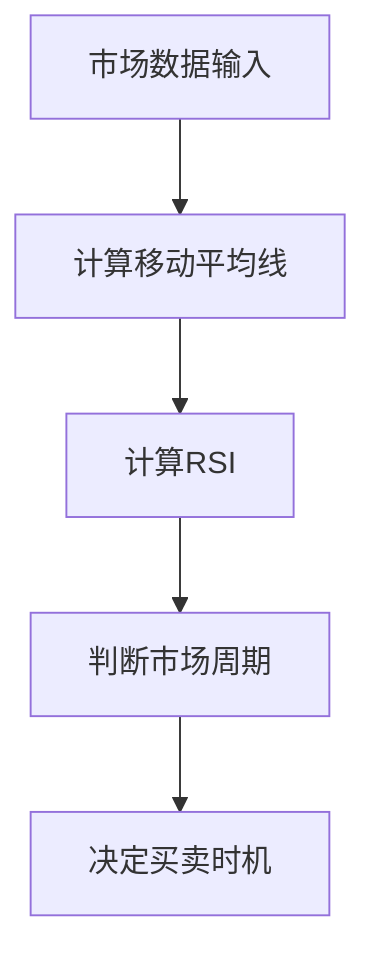
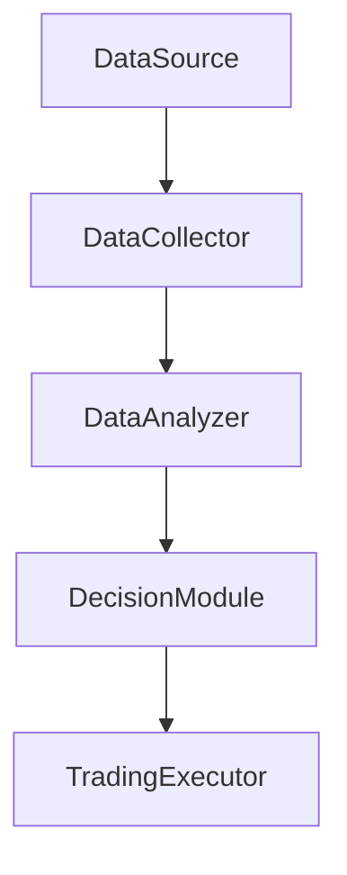

                 


---

# 彼得林奇的"反周期"投资在加密货币市场的应用

## 关键词：反周期投资，彼得林奇，加密货币，投资策略，市场波动

## 摘要：  
本文探讨了彼得林奇的反周期投资策略在加密货币市场中的应用。通过分析加密货币市场的波动性与周期性，结合反周期投资的核心算法，构建了一个基于反周期策略的投资系统。文章详细阐述了系统的实现过程，并通过实际案例分析，展示了该策略在加密货币市场中的应用效果和优化方向。

---

# 第1章：彼得林奇反周期投资理念概述

## 1.1 反周期投资的定义与特点  
反周期投资是一种投资策略，旨在通过识别市场周期性波动，抓住市场低谷期买入、高峰期卖出的机会，从而在市场波动中获得超额收益。彼得林奇以其成功的投资实践，将反周期投资策略推向了极致。  

**特点：**  
1. **逆向思维：** 在市场恐慌时买入，市场疯狂时卖出。  
2. **长期视角：** 侧重于市场的长期周期性变化，而非短期波动。  
3. **风险控制：** 通过识别市场拐点，降低投资风险。  

---

## 1.2 彼得林奇投资策略的核心要素  
彼得林奇的投资策略强调对市场周期的精准判断和对投资标的深度研究。其核心要素包括：  
1. **基本面分析：** 通过研究企业的基本面，寻找被市场低估的投资标的。  
2. **市场情绪分析：** 利用市场情绪的变化，判断市场的买卖时机。  
3. **分散投资：** 通过分散投资降低风险，同时抓住多个市场的周期性机会。  

---

## 1.3 加密货币市场的特点与挑战  
加密货币市场相较于传统金融市场，具有以下特点：  
1. **高波动性：** 价格波动剧烈，市场周期更短。  
2. **去中心化：** 交易不受传统金融机构的控制，市场参与者广泛。  
3. **技术创新驱动：** 市场波动与技术创新密切相关。  

**挑战：**  
1. 市场信息不透明，参与者情绪波动大。  
2. 市场周期难以精准判断，波动性高，投资风险大。  

---

# 第2章：加密货币市场的波动性与周期性

## 2.1 加密货币市场的周期性分析  
加密货币市场的周期性主要体现在价格波动上，通常表现为：  
1. **牛市周期：** 市场情绪高涨，价格快速上升。  
2. **熊市周期：** 市场情绪低落，价格持续下跌。  
3. **震荡周期：** 市场在牛市和熊市之间频繁切换。  

**周期性指标：**  
- **价格波动率：** 通过计算价格波动的标准差，判断市场的活跃程度。  
- **市场情绪指数：** 利用社交媒体、新闻等数据，计算市场情绪的量化指标。  

---

## 2.2 市场波动性对投资策略的影响  
市场波动性对反周期投资策略的影响主要体现在：  
1. **高波动性增加了市场的不确定性，提高了投资难度。  
2. **波动性高的市场更容易出现短期价格偏差，为反周期投资提供了机会。  

**案例：**  
2017年比特币价格的暴涨暴跌就是一个典型例子。在价格暴跌后，市场进入熊市周期，此时是反周期投资的买入机会。  

---

## 2.3 加密货币市场的参与者与生态  
加密货币市场的参与者包括：  
1. **机构投资者：** 传统金融机构和大型企业开始布局加密货币市场。  
2. **散户投资者：** 大量个人投资者参与交易，推动市场波动。  
3. **技术开发者：** 市场的创新和技术进步推动市场周期性变化。  

---

# 第3章：反周期投资策略的数学模型与算法

## 3.1 反周期投资的数学模型  
反周期投资的核心是通过数学模型判断市场的周期性变化，从而确定买卖时机。常见的数学模型包括：  
1. **移动平均线（MA）：** 通过计算一定时间内的价格平均值，判断市场的趋势方向。  
2. **相对强弱指数（RSI）：** 通过计算价格变动的强度，判断市场的超买或超卖状态。  
3. **波动率模型：** 通过分析价格波动的标准差，判断市场的活跃程度。  

**公式：**  
- **移动平均线公式：**  
  $$ MA_n = \frac{1}{n} \sum_{i=1}^{n} p_i $$  
  其中，$p_i$ 是第i个价格，$n$ 是计算的天数。  

- **相对强弱指数公式：**  
  $$ RSI = \frac{100}{1 + \frac{A}{B}} $$  
  其中，$A$ 是上涨幅度的平均值，$B$ 是下跌幅度的平均值。  

---

## 3.2 市场周期判断的指标体系  
为了更准确地判断市场周期，可以结合多个指标进行综合分析：  
1. **价格与移动平均线的关系：**  
   - 当价格低于移动平均线时，市场可能处于熊市周期。  
2. **RSI指标：**  
   - RSI < 30，市场可能处于超卖状态，即将进入牛市周期。  
   - RSI > 70，市场可能处于超买状态，即将进入熊市周期。  

---

## 3.3 投资时机选择的优化算法  
为了优化投资时机的选择，可以采用动态调整的策略。例如：  
1. **动态移动平均线：** 根据市场的波动性动态调整移动平均线的计算天数。  
2. **多指标结合：** 综合考虑多个指标，如价格、RSI、波动率等，进行投资决策。  

**流程图：**  


---

# 第4章：反周期投资策略的系统架构设计

## 4.1 系统功能模块划分  
反周期投资系统的功能模块包括：  
1. **数据采集模块：** 采集加密货币市场的实时数据。  
2. **数据分析模块：** 对数据进行处理和分析，计算各种指标。  
3. **决策模块：** 根据分析结果，判断市场周期，决定买卖时机。  
4. **执行模块：** 执行交易指令。  

---

## 4.2 数据流与系统交互设计  
数据流从数据源（如加密货币交易所）流入系统，经过数据采集模块处理后，进入数据分析模块，计算各种指标，最终由决策模块判断交易时机，并将指令传递给执行模块。  

**数据流图：**  


---

## 4.3 系统架构的可扩展性分析  
系统架构采用模块化设计，各模块之间具有良好的可扩展性。例如，数据分析模块可以添加新的指标，执行模块可以支持更多交易平台。  

---

# 第5章：加密货币市场的反周期投资策略实现

## 5.1 数据采集与处理  
数据采集是反周期投资策略实现的基础。常用的加密货币数据源包括：  
1. **加密货币交易所API：** 如CoinMarketCap、Coinbase等。  
2. **区块链浏览器：** 如Etherscan、BscScan等。  

**数据采集流程：**  
1. 通过API获取实时价格数据。  
2. 数据清洗与预处理，去除异常数据。  

---

## 5.2 算法实现与优化  
基于反周期投资策略的算法实现，包括：  
1. **计算移动平均线和RSI指标。**  
2. **判断市场周期，决定买卖时机。**  

**Python代码示例：**  
```python
import pandas as pd
import numpy as np

# 计算移动平均线
def calculate_ma(data, window):
    return data['price'].rolling(window).mean()

# 计算RSI
def calculate_rsi(data, window):
    delta = data['price'].diff()
    up = delta.where(delta > 0, 0)
    down = delta.where(delta < 0, 0)
    rs = up.rolling(window).mean() / down.rolling(window).mean()
    return 100 - 100 / (1 + rs)

# 判断买卖时机
def decide_trade(data, ma, rsi):
    if data['price'] < ma:
        return 'buy'
    elif rsi > 70:
        return 'sell'
    else:
        return 'hold'
```

---

## 5.3 投资组合管理与风险控制  
为了降低风险，可以采用以下策略：  
1. **分散投资：** 将资金分配到不同的加密货币中。  
2. **风险限额：** 设定每笔交易的风险承受上限。  
3. **止盈止损：** 设置止损点和止盈点，控制亏损和收益。  

---

# 第6章：实际案例分析与策略优化

## 6.1 典型案例分析  
以比特币为例，分析反周期投资策略在实际操作中的表现。  

**案例分析：**  
- 2018年比特币价格暴跌，市场进入熊市周期，反周期策略建议买入。  
- 2019年市场逐渐复苏，策略建议卖出。  

---

## 6.2 策略优化与经验总结  
根据实际案例的分析结果，优化反周期投资策略：  
1. **增加市场情绪分析：** 结合社交媒体和新闻数据，更准确判断市场周期。  
2. **动态调整参数：** 根据市场变化，动态调整移动平均线的窗口大小。  

---

# 第7章：系统实现与代码解读

## 7.1 系统环境安装与配置  
系统实现需要以下环境：  
1. **Python编程语言：** 版本3.8以上。  
2. **数据采集库：** 如requests、pandas。  
3. **数据可视化库：** 如matplotlib、seaborn。  

---

## 7.2 核心算法代码实现  
核心算法包括数据采集、指标计算和交易决策。  

**完整代码示例：**  
```python
import requests
import pandas as pd
import matplotlib.pyplot as plt

# 数据采集
def get_btc_price():
    url = 'https://api.example.com/btc_price'
    response = requests.get(url)
    data = response.json()
    return data

# 数据处理
def process_data(data):
    df = pd.DataFrame(data)
    df['ma20'] = df['price'].rolling(20).mean()
    df['rsi'] = calculate_rsi(df, 14)
    return df

# 可视化
def visualize_data(df):
    plt.plot(df['price'], label='Price')
    plt.plot(df['ma20'], label='MA20')
    plt.xlabel('Time')
    plt.ylabel('Price')
    plt.legend()
    plt.show()

# 策略执行
def execute_strategy(df):
    trades = []
    for i in range(len(df)):
        if df.iloc[i]['price'] < df.iloc[i]['ma20']:
            trades.append('buy')
        elif df.iloc[i]['rsi'] > 70:
            trades.append('sell')
        else:
            trades.append('hold')
    return trades

# 主函数
def main():
    data = get_btc_price()
    df = process_data(data)
    visualize_data(df)
    trades = execute_strategy(df)
    print(trades)

if __name__ == '__main__':
    main()
```

---

# 第8章：最佳实践与注意事项

## 8.1 投资策略的适用场景  
反周期投资策略适用于市场波动性较高的环境，但在市场趋势不明朗时可能表现不佳。  

## 8.2 风险控制与投资纪律  
1. **严格执行交易纪律：** 不要感情用事，严格按照策略执行。  
2. **保持充足的资金流动性：** 避免因市场波动而被迫平仓。  

## 8.3 持续学习与策略优化  
市场环境不断变化，需要持续学习和优化投资策略，以适应新的市场情况。  

---

# 结语  
彼得林奇的反周期投资策略在加密货币市场中具有重要的应用价值。通过结合市场波动性与周期性分析，利用数学模型和算法优化投资决策，可以在高波动性市场中抓住投资机会，实现超额收益。然而，加密货币市场的高风险也需要投资者具备较高的风险意识和策略优化能力。

---

**关键词：反周期投资，彼得林奇，加密货币，投资策略，市场波动**

