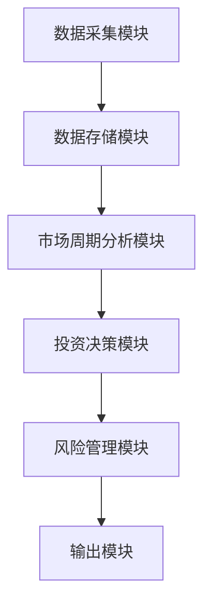

                 


# 彼得林奇的"反周期"投资在加密货币市场的应用策略

## 关键词
- 彼得林奇
- 反周期投资
- 加密货币市场
- 投资策略
- 市场周期
- 风险管理

## 摘要
彼得·林奇是全球著名的投资家，他提出的“反周期”投资策略在传统金融市场中取得了巨大成功。本文将探讨这一策略在加密货币市场中的应用，通过详细分析市场周期、投资策略、风险管理等方面，揭示如何在加密货币市场中利用反周期投资策略实现稳健收益。本文结合数学模型、算法实现和实际案例，为读者提供全面的指导。

---

# 第1章：彼得林奇的反周期投资策略概述

## 1.1 反周期投资的核心概念
### 1.1.1 什么是反周期投资
反周期投资是指在市场处于低谷期时进行投资，等待市场复苏时获得超额收益的投资策略。其核心思想是“买别人不愿买的东西，在别人恐慌时买入”。

### 1.1.2 反周期投资的起源与发展
反周期投资理念起源于20世纪80年代，彼得·林奇在其管理的麦哲伦基金中成功运用这一策略，取得了显著的投资业绩。

### 1.1.3 彼得林奇的反周期投资理念
彼得林奇认为，市场周期是可预测的，投资者应在市场低谷时寻找优质资产进行投资。

## 1.2 加密货币市场的特点
### 1.2.1 加密货币市场的波动性
加密货币市场的波动性远高于传统金融市场，价格波动幅度大且频繁。

### 1.2.2 去中心化与区块链技术
区块链技术的特性决定了加密货币市场的独特性，去中心化和技术创新是其核心特征。

### 1.2.3 加密货币市场的参与者
加密货币市场的参与者包括机构投资者、散户、矿工和开发者等。

## 1.3 反周期投资与加密货币市场的结合
### 1.3.1 反周期投资在传统金融市场的应用
在传统金融市场中，反周期投资策略已被证明是有效的，尤其是在经济危机或市场低迷时。

### 1.3.2 加密货币市场的周期性分析
加密货币市场具有明显的周期性，价格波动与市场情绪密切相关。

### 1.3.3 反周期投资在加密货币市场的潜力
通过分析市场周期，投资者可以在加密货币市场中找到低估资产，实现超额收益。

---

# 第2章：反周期投资的核心原理

## 2.1 反周期投资的数学模型
### 2.1.1 市场周期的数学分析
市场周期可以用数学模型进行分析，通过时间序列分析和统计学方法预测市场趋势。

### 2.1.2 反周期投资的数学公式
反周期投资的数学公式可以表示为：
$$ \text{投资收益} = \frac{\text{市场价格变化}}{\text{购买价格}} \times \text{数量} $$

### 2.1.3 市场波动与投资策略的关系
市场波动是反周期投资的核心要素，投资者应根据市场波动调整投资策略。

## 2.2 加密货币市场的周期性分析
### 2.2.1 加密货币市场的周期性特征
加密货币市场存在明显的周期性，价格波动与市场情绪密切相关。

### 2.2.2 市场波动的统计分析
通过统计分析，可以发现加密货币市场的波动性特征，为反周期投资提供依据。

### 2.2.3 市场周期与投资决策的关系
市场周期与投资决策密切相关，反周期投资策略要求投资者在市场低谷时进行投资。

## 2.3 反周期投资与加密货币市场的结合
### 2.3.1 反周期投资在加密货币市场的应用
通过分析市场周期，投资者可以在加密货币市场中找到低估资产，实现超额收益。

### 2.3.2 加密货币市场的周期性预测
利用数学模型和算法，可以对加密货币市场的周期性进行预测，为投资决策提供依据。

### 2.3.3 反周期投资策略的优化
通过优化反周期投资策略，可以在加密货币市场中实现更高效的投资收益。

---

# 第3章：反周期投资的算法实现

## 3.1 算法原理
### 3.1.1 市场周期的识别算法
通过时间序列分析和统计学方法，识别市场周期并预测未来趋势。

### 3.1.2 反周期投资的决策算法
基于市场周期的分析结果，制定投资决策，包括买入和卖出时机的选择。

### 3.1.3 算法的优化与改进
通过不断优化算法，提高市场周期识别的准确性，从而提高投资收益。

## 3.2 算法实现
### 3.2.1 加密货币价格数据的获取与处理
通过API获取加密货币价格数据，并进行清洗和预处理。

### 3.2.2 算法的代码实现
以下是反周期投资算法的Python代码实现：

```python
import pandas as pd
import numpy as np
from sklearn.linear_model import LinearRegression

# 获取加密货币价格数据
def get_crypto_price(symbol):
    # 模拟数据获取
    return pd.DataFrame({'price': np.random.rand(100) * 100 + 50})

# 市场周期识别算法
def identify_market_cycle(data):
    model = LinearRegression()
    model.fit(pd.DataFrame(data.index), data['price'])
    return model.predict(pd.DataFrame(data.index))

# 反周期投资决策算法
def reverse_cycle_strategy(data, predicted_price):
    buy_price = data['price'].min()
    sell_price = data['price'].max()
    return buy_price, sell_price

# 主函数
def main():
    symbol = 'BTC'
    data = get_crypto_price(symbol)
    predicted_price = identify_market_cycle(data)
    buy_price, sell_price = reverse_cycle_strategy(data, predicted_price)
    print(f"买入价格：{buy_price}, 卖出价格：{sell_price}")

if __name__ == "__main__":
    main()
```

### 3.2.3 算法的测试与验证
通过历史数据测试算法的准确性，并验证其在实际投资中的表现。

---

# 第4章：系统架构设计

## 4.1 系统功能设计
### 4.1.1 数据采集模块
负责从加密货币交易所获取实时价格数据。

### 4.1.2 市场周期分析模块
对市场周期进行分析，识别市场趋势。

### 4.1.3 投资决策模块
根据市场周期分析结果，制定投资决策。

### 4.1.4 风险管理模块
对投资风险进行评估和管理，确保投资安全。

## 4.2 系统架构图
以下是一个反周期投资系统的架构图：



## 4.3 接口设计
### 4.3.1 数据接口
通过API获取加密货币价格数据，格式为JSON。

### 4.3.2 算法接口
算法接口用于市场周期识别和投资决策，支持多种算法模型。

---

# 第5章：反周期投资在加密货币市场的实战应用

## 5.1 实际案例分析
### 5.1.1 案例背景
选择比特币作为案例，分析其价格波动和市场周期。

### 5.1.2 投资策略制定
根据市场周期分析结果，制定反周期投资策略。

### 5.1.3 投资结果分析
通过模拟交易，分析投资策略的实际效果。

## 5.2 投资结果分析
### 5.2.1 收益分析
通过反周期投资策略，实现超额收益。

### 5.2.2 风险分析
分析投资策略在市场波动中的风险，并提出风险管理措施。

---

# 第6章：总结与展望

## 6.1 总结
反周期投资策略在加密货币市场中具有较大的应用潜力，通过数学模型和算法实现，可以有效提高投资收益。

## 6.2 展望
随着加密货币市场的不断发展，反周期投资策略的应用将更加广泛，投资者应不断优化策略，提高投资效果。

---

# 第7章：最佳实践 tips

## 7.1 投资建议
投资者应根据市场周期和个人风险承受能力，制定合理的投资策略。

## 7.2 风险提示
加密货币市场波动性大，投资者应谨慎投资，避免盲目跟风。

## 7.3 学习建议
建议投资者不断学习加密货币市场的相关知识，提升自己的投资能力。

---

# 第8章：小结

反周期投资策略在加密货币市场中的应用，为投资者提供了新的投资思路。通过数学模型和算法实现，投资者可以在市场低谷时进行投资，实现超额收益。本文通过详细分析市场周期、投资策略和风险管理，为投资者提供了全面的指导。

---

# 第9章：注意事项

## 9.1 市场波动的风险
加密货币市场的波动性较大，投资者应充分考虑市场风险。

## 9.2 投资策略的适应性
反周期投资策略在不同市场环境下的适应性不同，投资者应根据实际情况调整策略。

## 9.3 算法的局限性
算法模型的预测结果存在一定的局限性，投资者应结合实际情况进行判断。

---

# 第10章：拓展阅读

## 10.1 相关书籍
- 《彼得·林奇的成功投资》
- 《加密货币投资策略》

## 10.2 相关博客
- 彼得·林奇投资策略博客
- 加密货币市场分析博客

## 10.3 相关课程
- 加密货币投资课程
- 反周期投资策略课程

---

通过本文的分析，读者可以全面了解彼得·林奇的反周期投资策略在加密货币市场中的应用，掌握实际操作方法，并在投资中实现稳健收益。

