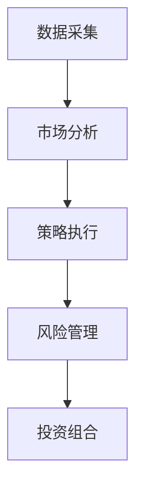

                 


# 彼得林奇的"反周期"投资在新兴与成熟市场间的配置策略

## 关键词：反周期投资、彼得·林奇、新兴市场、成熟市场、资产配置、投资策略

## 摘要：
彼得·林奇的反周期投资策略是一种基于经济周期波动的投资方法，旨在通过在新兴市场和成熟市场之间动态调整资产配置，捕捉周期性变化中的投资机会。本文深入分析了反周期投资的理论基础、策略实施、系统架构及实战案例，为投资者提供了一套在不同市场环境下优化投资组合的有效方法。

---

## 第一部分：引言

### 1.1 投资市场的周期性
- **经济周期的基本概念**：经济周期通常分为四个阶段：衰退、复苏、过热和滞胀。投资者需识别这些阶段以制定相应策略。
- **市场波动的周期性**：市场波动与经济周期密切相关，投资者应关注市场的周期性变化。

### 1.2 反周期投资的定义
- **反周期投资**：与经济周期相反，投资策略根据周期阶段调整资产配置，以在不同阶段中获利。

### 1.3 彼得·林奇的贡献
- **彼得·林奇的投资理念**：注重基本面分析，寻找被低估的股票，在市场低谷时投资，高点时退出。

---

## 第二部分：新兴市场与成熟市场的特点

### 2.1 新兴市场的定义与特征
- **定义**：新兴市场指经济快速发展、市场机制逐步完善的国家，如中国、印度。
- **经济特征**：高增长潜力，但波动性大，基础设施不完善。
- **投资机会与风险**：高增长带来机会，但政策和市场风险较高。

### 2.2 成熟市场的定义与特征
- **定义**：经济发达、市场机制完善的国家，如美国、日本。
- **经济特征**：增长稳定，市场波动较小，但创新能力强。
- **投资机会与风险**：稳定收益，但竞争激烈，机会较少。

---

## 第三部分：反周期投资的理论基础

### 3.1 经济周期理论
- **经济周期的阶段**：衰退、复苏、过热、滞胀。
- **市场波动与投资机会**：在衰退期投资新兴市场，在过热期转向成熟市场。

### 3.2 市场情绪与投资者行为
- **市场情绪的影响**：情绪波动导致市场低估或高估。
- **投资者行为的周期性**：在繁荣期过于乐观，在衰退期过于悲观。

---

## 第四部分：反周期投资策略的核心要素

### 4.1 资产配置策略
- **动态调整**：根据市场周期阶段，动态调整资产配置比例。
- **资产类别选择**：在衰退期增加防御性资产，如债券；在复苏期增加股票。

### 4.2 选股策略
- **基本面分析**：选择财务健康、估值合理的公司。
- **行业选择**：在新兴市场选择高增长行业，在成熟市场选择防守性行业。

---

## 第五部分：系统分析与架构设计

### 5.1 投资决策系统架构
- **数据采集模块**：收集宏观经济指标、市场数据。
- **市场分析模块**：识别经济周期阶段。
- **策略执行模块**：动态调整资产配置。
- **风险管理模块**：监控并控制投资风险。

### 5.2 系统架构图


### 5.3 算法原理
- **动态资产配置模型**：
  $$ \text{配置比例} = \text{周期阶段权重} \times \text{市场风险溢价} $$
- **市场阶段判断**：基于GDP增长率、失业率等指标判断经济周期阶段。

---

## 第六部分：项目实战

### 6.1 环境配置
- **工具选择**：使用Python进行数据处理和回测。
- **数据来源**：获取历史经济数据和市场数据。

### 6.2 核心代码实现
```python
import numpy as np
import pandas as pd

def get_economic_phase(gdp_growth, unemployment_rate):
    if gdp_growth < -2 and unemployment_rate > 8:
        return '衰退'
    elif gdp_growth < 2 and unemployment_rate < 6:
        return '复苏'
    elif gdp_growth > 4 and unemployment_rate < 5:
        return '过热'
    else:
        return '滞胀'

# 示例数据
gdp_growth = -1.5
unemployment_rate = 7.5
phase = get_economic_phase(gdp_growth, unemployment_rate)
print(f"当前经济阶段：{phase}")
```

### 6.3 实战案例分析
- **案例1**：2008年金融危机期间，配置防御性资产。
- **案例2**：2020年疫情后，配置新兴市场股票。

---

## 第七部分：总结与展望

### 7.1 总结
- **理论总结**：反周期投资通过动态调整资产配置，在不同市场阶段获取超额收益。
- **策略总结**：新兴市场适合衰退期和复苏期，成熟市场适合过热期和滞胀期。

### 7.2 展望
- **未来研究**：结合机器学习优化周期判断模型。
- **投资建议**：投资者应根据自身风险承受能力，灵活调整投资策略。

---

通过以上分析，彼得·林奇的反周期投资策略为投资者在新兴与成熟市场间配置资产提供了有效指导。投资者需结合市场周期、资产配置和风险管理，制定适合自己的投资策略。

