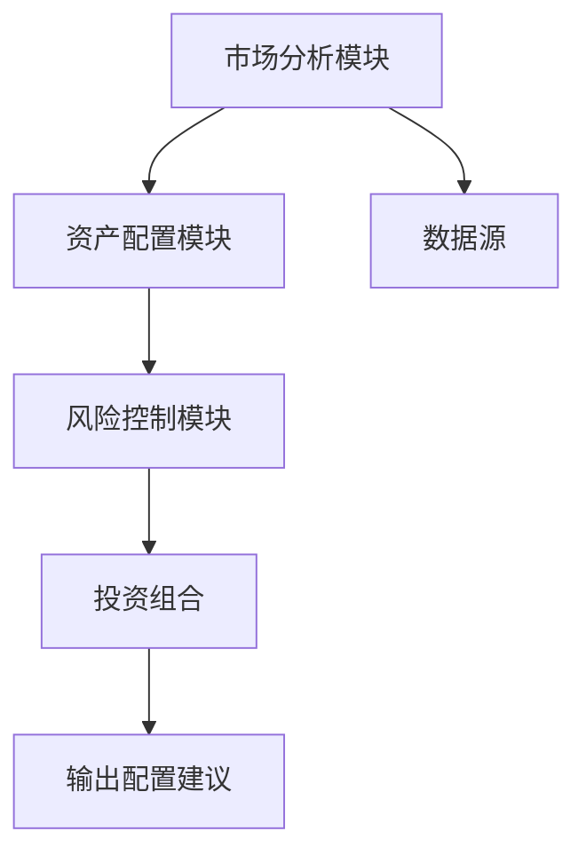

                 


# 彼得林奇的"反周期"投资在新兴市场与发达市场间的配置

## 关键词：彼得林奇，反周期投资，新兴市场，发达市场，资产配置，投资策略，市场周期

## 摘要：本文深入探讨了彼得·林奇的反周期投资策略在新兴市场与发达市场间的配置。通过分析市场周期、资产配置、投资组合优化等核心概念，结合实际案例，为投资者提供科学的投资策略和实践指导。

---

## 第一部分：背景介绍

### 第1章：反周期投资的定义与核心概念

#### 1.1 反周期投资的定义
- **什么是反周期投资**：反周期投资是指在市场周期性波动中，投资者逆市场趋势进行投资，以在市场低谷时买入、在市场高点时卖出的投资策略。
- **核心特征**：逆向思维、长期视角、风险控制。
- **与传统投资的区别**：传统投资通常跟随市场趋势，而反周期投资则在市场低谷时寻找机会。

#### 1.2 彼得·林奇的投资理念
- **生平简介**：彼得·林奇是美国著名投资经理，以管理富达麦哲伦基金而闻名，其投资哲学强调基本面分析和长期持有。
- **投资哲学**：林奇主张投资于具备良好管理、竞争优势和增长潜力的公司，尤其在市场低迷时寻找被低估的投资标的。
- **对市场的独特见解**：市场波动性提供投资机会，投资者应关注长期价值而非短期波动。

#### 1.3 新兴市场与发达市场的差异
- **新兴市场特点**：增长速度快、波动性大、风险较高，但潜在回报也较高。
- **发达市场特点**：市场成熟、波动性较小、风险相对较低，但增长潜力有限。
- **相互影响**：全球经济一体化使得新兴市场与发达市场相互关联，市场波动往往联动。

---

### 第2章：反周期投资的理论基础

#### 2.1 市场周期理论
- **经济周期的四个阶段**：衰退、复苏、繁荣、萧条。
- **金融市场的波动规律**：市场在周期性波动中呈现涨跌交替，反周期投资利用市场的低谷期。
- **市场周期与投资策略的关系**：在不同周期阶段，投资策略应相应调整。

#### 2.2 资产配置理论
- **资产配置的基本原理**：将资金分配到不同资产类别（股票、债券、现金等）以分散风险。
- **不同市场环境下资产配置的调整**：新兴市场波动大，应适当调整资产比例；发达市场相对稳定，可维持较高比例。
- **资产配置与风险控制的关系**：合理配置可降低整体风险，提高投资收益。

#### 2.3 投资组合理论
- **基本概念**：通过多样化投资降低非系统性风险，提高收益。
- **构建有效投资组合的方法**：考虑相关性、风险承受能力和投资目标。
- **动态调整策略**：定期审视并根据市场变化调整投资组合。

---

## 第二部分：核心概念与联系

### 第3章：反周期投资的核心策略

#### 3.1 市场周期分析
- **如何识别市场周期**：通过经济指标（GDP增长率、失业率）和市场指标（PE、PB）判断市场所处阶段。
- **不同阶段的投资策略**：衰退期增加防御性资产，复苏期布局周期性股票，繁荣期谨慎操作，萧条期积极买入低估资产。
- **风险与机会**：低谷期风险较高，但潜在回报也大。

#### 3.2 资产配置策略
- **新兴市场与发达市场的配置比例**：根据市场周期动态调整，通常在新兴市场低迷时增加配置，发达市场过热时减少。
- **动态调整策略**：定期评估市场环境，及时调整配置比例。
- **风险控制**：设置止损点，避免过度集中投资。

#### 3.3 投资组合优化策略
- **优化方法**：使用现代投资组合理论（MPT）进行优化，考虑风险、收益和相关性。
- **动态调整**：根据市场变化和投资目标，持续优化组合结构。
- **案例分析**：假设在新兴市场低迷时，增加对蓝筹股的投资，同时减少高估值的成长股。

---

## 第三部分：算法与系统设计

### 第4章：投资管理系统设计

#### 4.1 问题场景介绍
- **目标**：设计一个能够根据市场周期自动调整资产配置的投资管理系统。
- **用户需求**：投资者希望在新兴市场与发达市场间动态配置资产，利用反周期投资策略实现收益最大化。

#### 4.2 系统功能设计
- **市场分析模块**：实时监测市场指标，判断市场所处周期阶段。
- **资产配置模块**：根据市场周期和投资目标，动态调整新兴市场与发达市场的配置比例。
- **风险控制模块**：设置止损点和风险预警机制，确保投资安全。

#### 4.3 系统架构设计
- **模块化设计**：市场分析、资产配置、风险控制各模块独立开发，便于维护和扩展。
- **接口设计**：提供API接口，方便与其他金融数据源和交易平台对接。
- **交互设计**：用户友好的界面，方便投资者实时查看配置比例和市场分析结果。

---

## 第四部分：项目实战

### 第5章：投资策略实战案例

#### 5.1 环境配置
- **工具选择**：使用Python进行数据分析，利用Pandas、NumPy处理市场数据。
- **数据源**：获取新兴市场和发达市场的历史数据，包括指数、个股等。
- **开发环境**：安装Python、Jupyter Notebook，配置数据接口。

#### 5.2 核心代码实现
```python
import pandas as pd
import numpy as np

# 示例数据：新兴市场指数与发达市场指数
emerging_data = pd.DataFrame({'date': ['2020-01', '2020-02', '2020-03', '2020-04'],
                                'index': [100, 105, 98, 110]})
developed_data = pd.DataFrame({'date': ['2020-01', '2020-02', '2020-03', '2020-04'],
                                'index': [150, 155, 152, 160]})

# 反周期投资策略函数
def reverse_cycle_strategy(emerging, developed):
    # 计算相对表现
    relative_performance = developed['index'] / emerging['index']
    # 判断市场周期阶段
    if relative_performance.mean() > 1.2:
        return '减少发达市场配置'
    elif relative_performance.mean() < 0.8:
        return '增加新兴市场配置'
    else:
        return '保持当前配置'

# 应用策略
strategy = reverse_cycle_strategy(emerging_data, developed_data)
print(strategy)
```

#### 5.3 案例分析
- **市场环境**：假设新兴市场经历一段时间的调整，指数处于低点，而发达市场指数处于高位。
- **策略应用**：系统识别相对表现下降，建议增加新兴市场配置，减少发达市场投资。
- **结果分析**：新兴市场随后反弹，投资者获得超额收益。

#### 5.4 小结
- **策略有效性**：通过动态调整资产配置，投资者能够在市场低谷时抓住机会，在市场高点时降低风险。
- **注意事项**：实际操作中需考虑更多因素，如流动性、政策变化等。
- **拓展阅读**：建议进一步学习现代投资组合理论和风险管理技术，以提升投资策略的科学性。

---

## 第五部分：最佳实践与小结

### 第6章：投资策略总结

#### 6.1 最佳实践
- **持续学习**：关注市场动态，更新投资策略。
- **风险管理**：设置止损点，定期评估投资组合。
- **分散投资**：避免过度集中，降低风险。

#### 6.2 小结
- **核心观点**：彼得·林奇的反周期投资策略强调在市场低谷时布局，新兴市场与发达市场的动态配置能够优化资产组合，提升整体收益。
- **未来展望**：随着全球化深入，跨市场投资将越来越重要，投资者需灵活调整策略以应对复杂多变的市场环境。

---

## 第七部分：系统架构图



---

## 第八部分：总结

彼得·林奇的反周期投资策略为投资者提供了在新兴市场与发达市场间配置资产的有效方法。通过科学的市场分析、动态的资产配置和严格的风险控制，投资者能够在不同市场环境下实现收益最大化。本文通过理论分析、系统设计和实际案例，为投资者提供了全面的指导和启示。未来，随着市场的变化，投资者需不断优化策略，以应对新的挑战和机遇。

--- 

**（完）**

