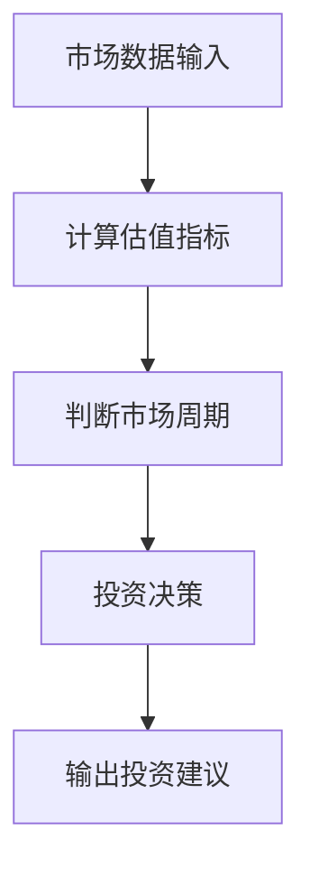
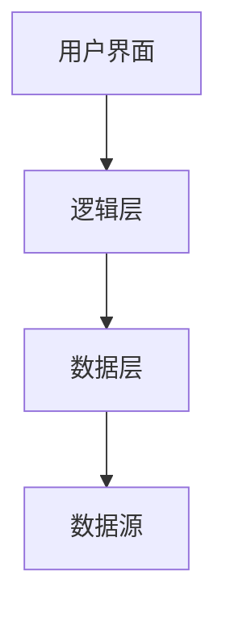

                 


# 彼得林奇的"反周期"投资心理建设

> 关键词：反周期投资，彼得·林奇，投资心理，市场波动，价值投资

> 摘要：本文深入探讨了彼得·林奇的反周期投资策略及其背后的心理建设。通过分析市场周期、投资者心理以及林奇的选股标准，结合实际案例，为投资者提供在市场低谷期寻找机会的心理指导和实战策略。

---

## 第一部分：反周期投资概述

### 第1章：反周期投资的背景与概念

#### 1.1 投资周期的基本概念
投资周期是指经济和市场在一定时间内经历的兴衰循环。经济周期通常分为四个阶段：繁荣、衰退、萧条和复苏。市场的波动与经济周期密切相关，投资者需要理解这些周期性变化，以做出明智的投资决策。

- **经济周期的定义与特征**
  - 繁荣阶段：经济增长迅速，企业盈利增加，股价上涨。
  - 萧条阶段：经济活动停滞，企业盈利下降，股价下跌。
  - 复苏阶段：经济开始复苏，企业盈利逐步恢复，股价企稳回升。

- **市场周期与投资的关系**
  - 在繁荣阶段，市场往往被高估，投资者需要警惕风险。
  - 在萧条阶段，市场通常被低估，投资者有机会以更低的价格买入优质资产。

#### 1.2 彼得·林奇与反周期投资
彼得·林奇是美国著名投资经理人，以其在富达投资管理公司的成功投资业绩闻名。他的投资哲学强调长期价值，注重基本面分析，并在市场低谷时寻找被低估的股票。

- **彼得·林奇的投资哲学**
  - 长期投资：林奇认为，投资的目的是长期获取企业成长的收益，而非短期市场波动。
  - 价值投资：他注重企业的基本面，寻找那些具有强大竞争优势、合理估值的公司。

- **反周期投资的核心理念**
  - 在市场低谷时买入，市场高峰期卖出。
  - 利用市场的恐慌和非理性，寻找被低估的投资机会。

### 第2章：反周期投资的核心概念与原理

#### 2.1 市场周期的波动性分析
市场的波动性是反周期投资的核心关注点。通过分析市场的波动性，投资者可以更好地识别投资机会和风险。

- **经济周期对股市的影响**
  - 在经济衰退期间，股市通常会经历大幅调整，许多优质股票会被市场低估。
  - 在经济复苏期间，股市逐渐回升，优质股票的价值逐步恢复。

- **市场情绪与投资者行为**
  - 在市场高点，投资者通常表现出过度乐观，容易被市场情绪左右。
  - 在市场低谷，投资者往往陷入恐慌，导致非理性决策。

- **反周期投资的时机选择**
  - 在市场底部附近，寻找那些具有长期竞争优势的企业进行投资。
  - 避免在市场高点投资，尤其是在市场情绪高涨时。

#### 2.2 投资者心理与反周期策略
投资者的心理是影响投资决策的重要因素。在反周期投资中，理解并管理投资者心理是成功的关键。

- **投资者心理的周期性变化**
  - 在市场繁荣阶段，投资者容易产生贪婪情绪，追求高收益。
  - 在市场低谷阶段，投资者容易陷入恐慌，导致抛售行为。

- **反周期投资中的心理应对策略**
  - 建立长期投资框架，避免短期波动的干扰。
  - 保持理性，避免被市场情绪左右。

- **彼得·林奇如何利用市场恐慌寻找机会**
  - 林奇在市场恐慌时，通过基本面分析，寻找那些被市场低估的优质股票。
  - 他强调，恐慌性抛售通常会导致股票价格低于其内在价值。

#### 2.3 反周期投资的核心原理
反周期投资的核心原理在于利用市场的非理性波动，寻找被低估的投资机会。

- **市场低估与价值投资**
  - 在市场低谷时，许多优质股票的价格低于其内在价值，为投资者提供了买入的机会。
  - 价值投资的核心在于寻找那些具有长期竞争优势、估值合理的公司。

- **风险与收益的逆向关系**
  - 在市场低谷时，风险相对较低，收益潜力较大。
  - 在市场高点时，风险较高，收益潜力较小。

- **彼得·林奇的选股标准**
  - 公司基本面良好，具有长期竞争优势。
  - 估值合理，价格低于内在价值。
  - 行业前景良好，公司在行业中具有领先地位。

---

## 第二部分：反周期投资的心理建设

### 第3章：投资者心理与市场周期的关系

#### 3.1 投资者心理的周期性特征
投资者的心理在市场周期中表现出明显的周期性特征。理解这些特征，有助于投资者更好地管理心理，做出理性的投资决策。

- **市场的繁荣阶段**
  - 投资者通常表现出过度乐观，容易被市场情绪左右，追求高收益。
  - 这种心理可能导致投资者忽视风险，做出不理性的投资决策。

- **市场的衰退阶段**
  - 投资者通常表现出恐慌情绪，容易产生抛售行为。
  - 这种心理可能导致投资者错过市场低谷时的投资机会。

- **彼得·林奇的应对策略**
  - 保持冷静，避免被市场情绪左右。
  - 利用市场的恐慌，寻找被低估的投资机会。

#### 3.2 心理韧性与反周期投资
心理韧性是反周期投资成功的关键因素之一。在市场波动中，保持心理韧性，有助于投资者做出理性的投资决策。

- **心理韧性对投资决策的影响**
  - 在市场低谷时，心理韧性强的投资者能够保持冷静，抓住投资机会。
  - 在市场高点时，心理韧性强的投资者能够避免贪婪，避免过度投资。

- **彼得·林奇如何保持心理韧性**
  - 他通过长期投资和价值投资，将市场的波动视为投资机会。
  - 他强调，市场的波动是暂时的，优质公司的长期价值是不变的。

### 第4章：克服贪婪与恐惧的投资心理

#### 4.1 投资中的贪婪与恐惧
贪婪和恐惧是投资者心理中的两大主要情绪，对投资决策有着重要影响。

- **贪婪的陷阱**
  - 在市场繁荣阶段，投资者容易产生贪婪情绪，追求高收益。
  - 这种情绪可能导致投资者忽视风险，做出不理性的投资决策。

- **恐惧的代价**
  - 在市场低谷阶段，投资者容易产生恐惧情绪，导致抛售行为。
  - 这种情绪可能导致投资者错过市场低谷时的投资机会。

- **彼得·林奇的应对策略**
  - 他强调，投资者需要克服贪婪和恐惧，保持理性的投资心态。
  - 他通过长期投资和价值投资，将市场的波动视为投资机会。

#### 4.2 反周期投资中的心理调适
在反周期投资中，心理调适是成功的关键。投资者需要学会如何在市场波动中保持冷静，抓住投资机会。

- **建立理性的投资框架**
  - 投资者需要建立长期的投资框架，避免被短期市场波动干扰。
  - 通过基本面分析，寻找那些具有长期竞争优势、估值合理的公司。

- **避免情绪化决策的方法**
  - 投资者需要学会控制情绪，避免被市场情绪左右。
  - 通过制定明确的投资计划，避免情绪化决策。

- **彼得·林奇的“三步走”心理调适法**
  - 第一步：了解市场的周期性，认识到市场的波动是暂时的。
  - 第二步：建立长期投资框架，避免短期波动的干扰。
  - 第三步：通过基本面分析，寻找那些被市场低估的优质股票。

---

## 第三部分：反周期投资的实战策略

### 第5章：识别反周期投资机会

#### 5.1 市场底部的识别方法
识别市场底部是反周期投资的关键。通过分析市场的估值指标和行业趋势，投资者可以更好地识别市场底部。

- **技术分析与市场底部识别**
  - 技术分析是通过分析股票价格和成交量的变化，寻找市场的底部信号。
  - 常用的技术指标包括移动平均线、相对强弱指数（RSI）等。

- **基本面分析与市场估值**
  - 通过分析公司的财务数据和行业趋势，评估市场的整体估值。
  - 寻找那些具有长期竞争优势、估值合理的公司。

- **彼得·林奇的市场估值指标**
  - 他通过分析市盈率、市净率等估值指标，寻找那些被市场低估的股票。
  - 他强调，市场估值指标是判断市场底部的重要依据。

#### 5.2 寻找被低估的股票
寻找被低估的股票是反周期投资的核心策略。通过基本面分析和估值指标，投资者可以找到那些具有长期竞争优势、估值合理的公司。

- **估值指标的计算与应用**
  - 市盈率（P/E）：股价与每股收益的比率。
  - 市净率（P/B）：股价与每股净资产的比率。
  - 市销率（P/S）：股价与每股收入的比率。

- **行业分析与个股选择**
  - 投资者需要分析行业趋势，选择那些具有长期增长潜力的行业。
  - 在行业内，选择那些具有竞争优势、估值合理的公司。

- **彼得·林奇的选股标准**
  - 公司基本面良好，具有长期竞争优势。
  - 估值合理，价格低于内在价值。
  - 行业前景良好，公司在行业中具有领先地位。

### 第6章：反周期投资的风险管理

#### 6.1 风险控制的必要性
在反周期投资中，风险管理是成功的关键。投资者需要通过合理的风险控制，避免重大损失。

- **投资组合的风险分散**
  - 通过分散投资，降低投资组合的整体风险。
  - 避免将所有资金投入到单一行业或资产中。

- **仓位管理与资金分配**
  - 根据市场的波动性和投资目标，合理分配资金。
  - 在市场低谷时，适当增加仓位；在市场高点时，适当减少仓位。

- **彼得·林奇的风险管理策略**
  - 他通过长期投资和价值投资，降低短期市场波动的风险。
  - 他强调，投资者需要根据市场情况，灵活调整投资策略。

#### 6.2 反周期投资中的止损与止盈
止损和止盈是风险管理的重要工具。在反周期投资中，合理设置止损和止盈，有助于保护资金，锁定收益。

- **设置止损的重要性**
  - 在市场波动较大时，设置止损可以避免重大损失。
  - 止损点通常设在低于买入价格的一定比例，如5%或10%。

- **止盈策略的制定与执行**
  - 在市场上涨时，设置止盈可以锁定收益。
  - 止盈点通常设在高于买入价格的一定比例，如10%或20%。

---

## 第四部分：系统分析与架构设计方案

### 第7章：反周期投资的系统分析

#### 7.1 问题场景介绍
在市场波动中，投资者需要建立一个科学的投资系统，以指导投资决策。反周期投资系统可以帮助投资者在市场低谷时寻找机会，在市场高点时避免风险。

#### 7.2 系统功能设计
反周期投资系统需要具备以下功能：
- 市场周期分析：分析市场周期，识别投资机会。
- 估值指标计算：计算股票的估值指标，判断市场底部。
- 投资组合管理：管理投资组合，分散风险。
- 风险控制：设置止损和止盈，保护资金。

#### 7.3 系统架构设计
反周期投资系统的架构设计如下：
- 数据层：收集市场数据和公司基本面数据。
- 逻辑层：分析市场周期，计算估值指标，判断投资机会。
- 用户界面层：提供直观的投资决策支持。

#### 7.4 系统接口设计
反周期投资系统需要与多个数据源接口对接，包括股票价格、公司财务数据等。

#### 7.5 系统交互设计
反周期投资系统的交互设计如下：
- 用户输入投资目标和风险偏好。
- 系统分析市场周期，判断投资机会。
- 系统提供投资建议，包括买入和卖出信号。

---

## 第五部分：项目实战

### 第8章：环境安装与系统核心实现

#### 8.1 环境安装
投资者需要安装以下工具：
- 财务数据平台：如 Yahoo Finance、Morningstar。
- 技术分析工具：如 TradingView、MetaTrader。
- 投资组合管理工具：如 Portfolio Manager。

#### 8.2 核心实现源代码
以下是反周期投资系统的核心实现代码：
```python
import pandas as pd
import numpy as np
import yfinance as yf

# 下载股票数据
def download_data(ticker, start_date, end_date):
    data = yf.download(ticker, start=start_date, end=end_date)
    return data

# 计算估值指标
def calculate_valuation_indicators(data):
    val_indicators = {}
    val_indicators['PE'] = data['Close'] / data['Earnings Per Share']
    val_indicators['PB'] = data['Close'] / data['Book Value Per Share']
    val_indicators['PS'] = data['Close'] / data['Revenue Per Share']
    return val_indicators

# 判断市场周期
def determine_market_cycle(val_indicators):
    if val_indicators['PE'] < 15 and val_indicators['PB'] < 2 and val_indicators['PS'] < 1:
        return '底部'
    elif val_indicators['PE'] > 25 or val_indicators['PB'] > 3 or val_indicators['PS'] > 1.5:
        return '顶部'
    else:
        return '震荡'

# 投资决策
def investment_decision(ticker, start_date, end_date):
    data = download_data(ticker, start_date, end_date)
    val_indicators = calculate_valuation_indicators(data)
    market_cycle = determine_market_cycle(val_indicators)
    if market_cycle == '底部':
        return '买入'
    elif market_cycle == '顶部':
        return '卖出'
    else:
        return '观望'

# 示例应用
ticker = 'AAPL'
start_date = '2020-01-01'
end_date = '2023-12-31'
decision = investment_decision(ticker, start_date, end_date)
print(f'投资决策：{decision}')
```

### 第9章：案例分析与详细解读

#### 9.1 实际案例分析
以苹果公司（AAPL）为例，分析反周期投资策略的应用。

- **市场周期分析**
  - 在2020年新冠疫情爆发期间，苹果公司的股价经历了大幅下跌。
  - 通过估值指标分析，发现苹果公司的PE和PB均处于合理区间，具备投资价值。

- **投资决策**
  - 在市场底部时，投资决策系统建议买入苹果公司股票。
  - 在市场回升时，投资决策系统建议逐步卖出。

- **收益分析**
  - 通过反周期投资策略，投资者在市场底部买入苹果公司股票，获得了较高的收益。

#### 9.2 技术分析与实战应用
通过技术分析，投资者可以更好地识别市场底部和投资机会。

- **技术指标分析**
  - 使用移动平均线和相对强弱指数（RSI）分析股票价格走势。
  - 在市场底部时，股票价格通常会跌破长期均线，并且RSI显示超卖信号。

- **实战应用**
  - 在2020年3月，苹果公司的股价跌破长期均线，并且RSI显示超卖信号。
  - 投资决策系统建议买入苹果公司股票。
  - 在随后的市场回升中，苹果公司股价逐步上涨，投资者获得了较高的收益。

### 第10章：项目小结

#### 10.1 项目总结
反周期投资系统通过市场周期分析、估值指标计算和投资组合管理，帮助投资者在市场低谷时寻找机会，在市场高点时避免风险。

#### 10.2 项目成果
- 投资者能够更好地识别市场底部，抓住投资机会。
- 投资者能够通过系统化的投资策略，降低投资风险，提高投资收益。

---

## 第六部分：最佳实践 tips

### 第11章：投资建议与注意事项

#### 11.1 投资建议
- 长期投资，避免短期市场波动的干扰。
- 价值投资，寻找那些具有长期竞争优势、估值合理的公司。
- 保持冷静，避免被市场情绪左右。

#### 11.2 注意事项
- 风险控制是投资成功的关键，投资者需要合理设置止损和止盈。
- 投资者需要根据市场情况，灵活调整投资策略。
- 投资者需要持续学习，不断优化自己的投资知识和技能。

### 第12章：小结与展望

#### 12.1 小结
反周期投资是一种有效的投资策略，通过在市场低谷时寻找机会，在市场高点时避免风险，帮助投资者实现长期收益。

#### 12.2 展望
随着市场的不断发展，反周期投资策略将不断完善。投资者需要根据市场变化，灵活调整自己的投资策略，以应对各种市场波动。

---

## 第七部分：拓展阅读

### 第13章：推荐书籍与资源

#### 13.1 推荐书籍
- 《彼得·林奇的成功投资》
- 《价值投资：从入门到精通》
- 《投资的智慧》

#### 13.2 推荐资源
- 彼得·林奇的投资演讲和采访
- 市场分析工具和平台
- 投资组合管理软件

---

## 附录：数学公式与算法模型

### 附录A：估值指标的计算公式

#### 1. 市盈率（PE）
$$ PE = \frac{\text{股价}}{\text{每股收益}} $$

#### 2. 市净率（PB）
$$ PB = \frac{\text{股价}}{\text{每股净资产}} $$

#### 3. 市销率（PS）
$$ PS = \frac{\text{股价}}{\text{每股收入}} $$

### 附录B：投资决策算法流程图



### 附录C：系统架构图



---

## 结语

反周期投资是一种需要长期学习和实践的投资策略。通过本文的分析，投资者可以更好地理解反周期投资的核心理念，掌握投资心理建设的方法，从而在市场波动中抓住投资机会，实现长期收益。投资不仅是技术的较量，更是心理的博弈。希望本文能够为投资者提供有价值的参考和启示。

