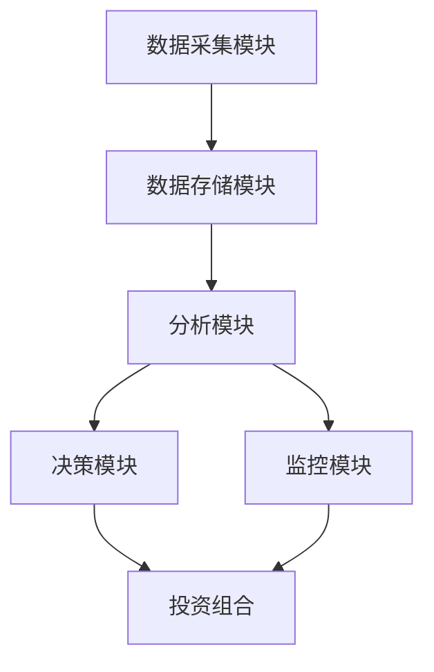

                 


# 彼得林奇的"反周期"投资时机选择

## 关键词：反周期投资，彼得·林奇，投资策略，市场周期，价值投资

## 摘要：反周期投资是一种在市场低谷期寻找投资机会，避开高峰期的投资策略。本文基于彼得·林奇的投资哲学，详细分析反周期投资的核心概念、数学模型、系统架构，并通过实战案例和最佳实践，帮助投资者掌握反周期投资的时机选择。

---

## 第一部分: 反周期投资的背景与概念

### 第1章: 反周期投资的基本概念

#### 1.1 什么是反周期投资

反周期投资是指在经济周期波动中，选择与整体经济走势相反的时机进行投资。这种策略的核心在于利用市场周期的波动，在市场低估时买入，在高估时卖出。反周期投资与传统投资策略不同，它更注重逆市操作，强调在市场低谷期寻找机会。

#### 1.2 反周期投资的必要性

在当前市场环境下，经济波动加剧，传统投资策略在市场高峰期往往表现不佳，而在市场低谷期则可能错过重要的投资机会。反周期投资能够帮助投资者在市场低点发现被低估的资产，从而在市场复苏时获得超额收益。此外，反周期投资能够分散风险，减少市场波动对投资组合的影响。

#### 1.3 彼得林奇投资策略的核心思想

彼得·林奇是全球著名投资专家，他的策略强调长期投资和基本面分析。他认为，市场波动为投资者提供了低价买入优质资产的机会。反周期投资与彼得林奇的策略相结合，强调在市场低点买入，高点卖出，最大化投资收益。

---

## 第二部分: 反周期投资的核心概念与联系

### 第2章: 反周期投资的原理与模型

#### 2.1 市场周期的波动规律

经济周期包括衰退、复苏、繁荣和萧条四个阶段。反周期投资关注在衰退和萧条阶段寻找投资机会，而在繁荣阶段减少投资。通过分析历史市场数据，可以发现反周期投资往往能够在市场底部发现价值。

#### 2.2 反周期投资的数学模型

反周期投资模型通常基于市盈率、市净率等估值指标，结合宏观经济指标进行分析。例如，当市场整体市盈率低于历史平均水平时，可能是买入的好时机。

#### 2.3 反周期投资的核心要素

- 市场情绪分析：通过投资者情绪指标（如恐慌指数）判断市场是否处于低谷。
- 估值指标：市盈率、市净率等，用于判断资产是否被低估。
- 行业选择：选择在经济衰退期表现相对稳定的行业，如公用事业、医疗等。

---

## 第三部分: 反周期投资的算法与数学模型

### 第3章: 彼得林奇选股算法的数学解析

#### 3.1 彼得林奇选股算法概述

彼得林奇的选股算法注重公司的基本面分析，包括盈利能力、成长性、财务健康状况等。他倾向于投资那些具有稳定增长且估值合理的公司。

#### 3.2 算法的数学模型

彼得林奇的选股模型可以表示为：
$$
\text{投资价值} = \frac{\text{公司未来现金流的现值}}{\text{当前股价}}
$$
当投资价值大于1时，说明公司股票被低估，适合买入。

#### 3.3 算法的优缺点与适用场景

优点：
- 着重基本面分析，减少市场情绪干扰。
- 在市场低谷时能够发现被低估的资产。

缺点：
- 需要大量时间和资源进行深入分析。
- 在市场高峰期可能错过部分投资机会。

---

## 第四部分: 反周期投资的系统架构与实现

### 第4章: 反周期投资的系统架构设计

#### 4.1 系统功能设计

系统功能包括数据采集、分析模块、决策模块和监控模块。数据采集模块负责获取市场数据，分析模块进行估值和风险评估，决策模块基于分析结果制定投资策略，监控模块实时跟踪市场变化并调整投资组合。

#### 4.2 系统架构图

使用Mermaid绘制系统架构图：



#### 4.3 系统接口设计

接口包括数据接口、分析接口和决策接口。数据接口从第三方数据源获取市场数据，分析接口调用估值模型进行分析，决策接口根据分析结果生成投资建议。

---

## 第五部分: 项目实战

### 第5章: 反周期投资的实战分析

#### 5.1 环境安装

需要安装Python、Pandas、Matplotlib等库，用于数据处理和可视化。

#### 5.2 核心实现源代码

以下是反周期投资模型的Python代码示例：

```python
import pandas as pd
import matplotlib.pyplot as plt

# 数据获取
data = pd.read_csv('market_data.csv')

# 计算市盈率
data['PE'] = data['Price'] / data['Earnings']

# 绘制市盈率分布图
data['PE'].hist(bins=20)
plt.title('市盈率分布图')
plt.show()
```

#### 5.3 案例分析

以2020年新冠疫情为例，市场在疫情初期出现大幅下跌，许多优质股票被低估。反周期投资者可以选择此时买入，待市场复苏时卖出，获得超额收益。

---

## 第六部分: 最佳实践与总结

### 第6章: 反周期投资的最佳实践

#### 6.1 小结

反周期投资的核心在于识别市场周期，抓住低谷期的投资机会。彼得林奇的策略结合了基本面分析，帮助投资者在市场低谷时发现价值。

#### 6.2 注意事项

- 风险控制：避免过度杠杆，分散投资。
- 信息获取：及时获取市场数据和信息，保持敏感性。
- 持续学习：市场变化快，需不断更新知识和策略。

#### 6.3 拓展阅读

推荐书籍：《彼得林奇的投资艺术》、《价值投资入门》。

---

通过以上结构，我们可以看到反周期投资是一种有效的投资策略，能够帮助投资者在市场波动中抓住机会，实现长期的财富增长。彼得林奇的投资哲学为反周期投资提供了坚实的基础，而系统的分析和实战案例则进一步验证了这一策略的有效性。希望本文能够为投资者提供有价值的参考和启示。

