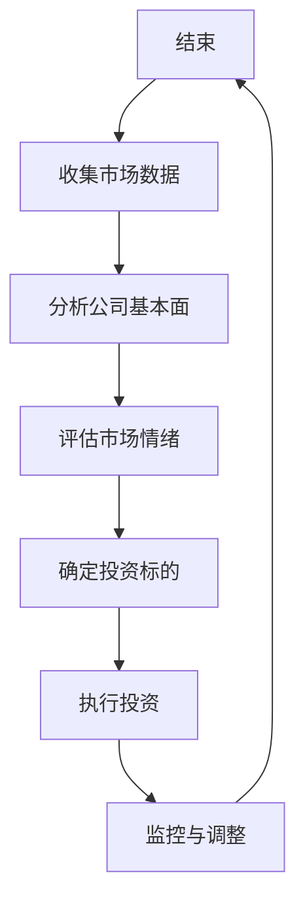

                 


# 《彼得林奇的"墓地投资法"》

## 关键词：彼得林奇，墓地投资法，价值投资，逆向思维，投资策略，股票分析

## 摘要：彼得·林奇的墓地投资法是一种基于价值投资和逆向思维的投资策略，强调在市场低谷时投资被低估的股票。本文详细阐述了该方法的背景、理论基础、系统架构、实战应用及注意事项，帮助投资者掌握这一独特的投资策略。

---

## 第一部分：投资基础与彼得林奇简介

### 第1章：投资的基本概念

#### 1.1 投资的定义与历史发展
- 1.1.1 投资的定义：投资是通过购买资产以期获得未来收益的行为，包括股票、债券等多种形式。
- 1.1.2 投资的历史演变：从早期的实物投资到现代的多元化投资策略，投资领域不断扩展。
- 1.1.3 投资的基本原理：风险与收益的权衡，资产配置的重要性。

#### 1.2 彼得·林奇的生平与成就
- 1.2.1 彼得·林奇的背景介绍：作为富达投资的传奇经理人，林奇以卓越的投资业绩闻名。
- 1.2.2 林奇的投资风格与理念：价值投资、长期持有、逆向思维。
- 1.2.3 林奇的代表作品与影响：《彼得·林奇的投资哲学》等书籍，影响了无数投资者。

## 第二部分：墓地投资法的核心概念

### 第2章：墓地投资法的定义与特点

#### 2.1 墓地投资法的定义
- 墓地投资法是指在市场低迷、投资者情绪低落时，投资那些被市场遗弃的股票，寻找价值低估的机会。

#### 2.2 墓地投资法的特点
- **逆向思维**：在市场恐慌时买入，理性分析取代情绪主导。
- **价值导向**：关注基本面，寻找具有长期潜力的公司。
- **长期持有**：耐心等待市场回归理性，实现价值重估。

#### 2.3 墓地投资法与其他投资方法的区别
- 对比分析：与趋势投资、技术分析、股息投资的区别。

## 第三部分：墓地投资法的核心原理

### 第3章：墓地投资法的理论基础

#### 3.1 价值投资理论
- 根本原理：购买低于内在价值的资产，长期持有。
- 林奇的贡献：强调深入分析公司基本面，寻找安全边际。

#### 3.2 逆向思维的应用
- 市场情绪与投资决策：利用市场的非理性恐慌，寻找低估资产。

#### 3.3 市场情绪与投资决策
- 如何识别市场情绪：通过指标如恐慌指数、市场成交量等。

## 第四部分：墓地投资法的系统分析与架构设计

### 第4章：系统架构

#### 4.1 投资决策的流程图


#### 4.2 投资模型的构建
- 数据收集：获取财务报表、行业分析等。
- 模型设计：基于价值指标（如市盈率、市净率）筛选股票。
- 模型优化：通过历史数据验证，调整筛选标准。

## 第五部分：项目实战

### 第5章：实际案例分析

#### 5.1 实战环境与工具安装
- 使用Python和Pandas进行数据处理。
- 安装必要的库：pandas、numpy、scipy。

#### 5.2 核心代码实现
```python
import pandas as pd
import numpy as np

# 示例：计算市盈率
def calculate_pe_ratio(df):
    df['PE_Ratio'] = df['股价'] / df['每股收益']
    return df

# 示例：筛选低于市场平均市盈率的股票
df = pd.read_csv('stock_data.csv')
df = calculate_pe_ratio(df)
mean_pe = df['PE_Ratio'].mean()
df_filtered = df[df['PE_Ratio'] < mean_pe]
```

#### 5.3 案例分析与解读
- 案例选择：选取某行业低迷时期的股票，分析其是否符合墓地投资法的标准。
- 投资决策：基于模型筛选出目标股票，制定投资计划。

## 第六部分：总结与最佳实践

### 第6章：总结

#### 6.1 小结
- 墓地投资法是一种有效的长期投资策略，需要耐心和深入的基本面分析。

#### 6.2 注意事项
- 风险控制：分散投资，避免过度集中。
- 信息更新：及时跟踪公司动态，调整投资策略。

#### 6.3 未来展望
- 结合新技术，如大数据分析，优化投资模型。
- 持续学习，适应市场变化。

---

通过以上目录，我们可以系统地了解彼得林奇的墓地投资法，从理论到实践，帮助投资者在复杂多变的市场中找到稳定的投资策略。

