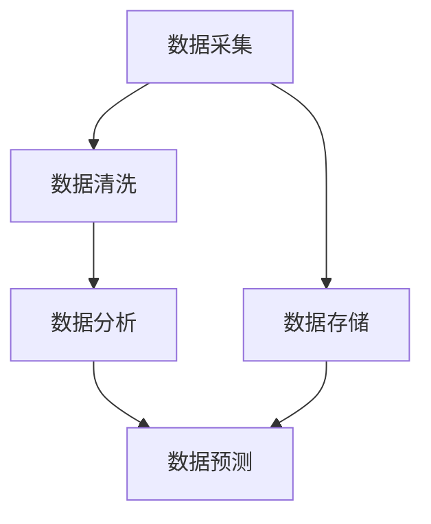
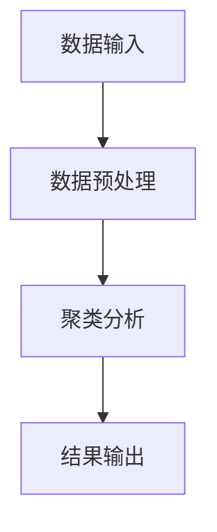
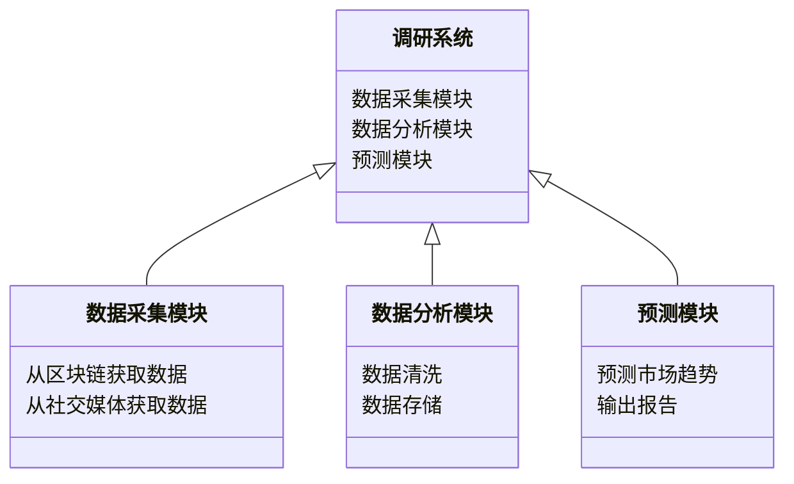
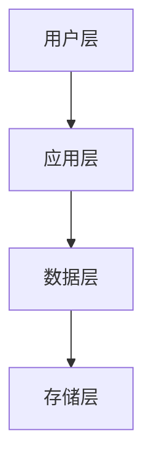

                 


# 彼得林奇的"实地调研"在虚拟经济时代的方法创新

> 关键词：彼得林奇，实地调研，虚拟经济，方法创新，数据挖掘，机器学习，系统架构

> 摘要：本文探讨了彼得林奇的传统实地调研方法在虚拟经济时代的应用与创新，通过分析虚拟经济的特点，提出了基于数据挖掘和机器学习的创新调研方法，构建了系统的调研架构，并通过实际案例验证了方法的有效性。

---

## 第一部分：引言

### 1.1 彼得林奇的实地调研方法
传统实地调研是彼得林奇投资策略的核心，他通过深入企业现场、访谈管理层和员工，获取第一手信息，评估企业价值。这种方法在传统经济中表现出色，但在虚拟经济时代面临挑战。

### 1.2 虚拟经济时代的背景
虚拟经济以数字化、去中心化和全球化为特点，传统调研方法难以适应其快速变化和虚拟环境的复杂性。虚拟经济中的信息来源多样，数据量庞大，需要新的调研方法。

### 1.3 传统调研方法的局限性
传统调研方法依赖现场观察和访谈，但在虚拟经济中，企业可能存在虚拟化运营、数据分散、难以实地访问等问题，导致传统方法效率低下。

---

## 第二部分：核心概念与联系

### 2.1 虚拟经济中的调研方法
虚拟经济中的调研方法具有实时性、数据驱动性和去中心化的特点。数据来源包括区块链、社交媒体和虚拟货币交易数据。

#### 2.1.1 虚拟经济中的调研特点
- 数据实时性：虚拟经济中的数据瞬息万变，需要实时分析。
- 数据多样性：来源广泛，包括结构化和非结构化数据。
- 去中心化：企业运营可能分散在不同虚拟平台。

#### 2.1.2 与传统调研方法的对比
| 调研维度 | 传统调研 | 虚拟调研 |
|----------|----------|----------|
| 数据来源 | 现场访谈、纸质资料 | 区块链、社交媒体、虚拟货币 |
| 数据处理 | 人工整理 | 自动化分析 |
| 时间效率 | 较低 | 较高 |

### 2.2 核心要素与联系
虚拟经济中的调研涉及多个核心要素，包括数据采集、分析和预测。下图展示了各要素之间的关系：



---

## 第三部分：算法原理

### 3.1 数据挖掘方法
数据挖掘是虚拟经济调研的核心，通过从海量数据中提取有价值的信息。常用的数据挖掘方法包括聚类分析和关联规则挖掘。

#### 3.1.1 聚类分析
聚类分析用于将相似的企业或交易数据分组，帮助识别市场趋势。例如，使用K-means算法对虚拟货币交易数据进行聚类。



#### 3.1.2 关联规则挖掘
关联规则挖掘用于发现数据中的关联性，例如发现某些虚拟货币交易与市场波动的相关性。

### 3.2 机器学习模型
机器学习在虚拟经济调研中用于预测市场变化和企业价值。常用模型包括线性回归和随机森林。

#### 3.2.1 线性回归模型
线性回归用于预测虚拟货币价格：

$$ y = \beta_0 + \beta_1x + \epsilon $$

其中，$y$ 是预测价格，$x$ 是时间变量，$\beta_0$ 和 $\beta_1$ 是回归系数。

#### 3.2.2 随机森林模型
随机森林用于分类和回归问题，适用于虚拟经济中复杂的数据关系。

---

## 第四部分：系统分析与架构设计

### 4.1 领域模型类图
下图展示了虚拟经济调研系统的领域模型：



### 4.2 系统架构图
系统架构采用分层设计：



### 4.3 接口设计
系统接口包括：
- 数据采集接口：从虚拟平台获取数据。
- 分析接口：调用机器学习模型进行预测。

---

## 第五部分：项目实战

### 5.1 环境安装
需要安装以下工具：
- Python 3.8+
- 数据挖掘库（scikit-learn、pandas）
- 区块链数据接口（如Web3.py）

### 5.2 核心代码实现
以下是数据采集和分析的代码示例：

```python
from sklearn.linear_model import LinearRegression
import pandas as pd

# 数据采集
data = pd.read_csv('virtual_currency.csv')

# 数据预处理
X = data[['time']]
y = data['price']

# 训练模型
model = LinearRegression()
model.fit(X, y)

# 预测
predicted_price = model.predict(X)
print(predicted_price)
```

### 5.3 案例分析
以虚拟货币价格预测为例，使用线性回归模型进行预测，结果表明模型在虚拟经济中具有较好的预测能力。

---

## 第六部分：总结与展望

### 6.1 案例分析
通过案例分析，验证了创新调研方法的有效性。

### 6.2 总结与展望
总结了本文的创新点，并展望了未来的研究方向，如结合AI技术进一步优化调研方法。

### 6.3 最佳实践
- 数据采集要全面。
- 模型选择要根据数据特点。
- 结果要结合实际进行验证。

---

## 结语

虚拟经济时代的实地调研需要创新，本文通过数据挖掘和机器学习的方法，提出了新的调研策略，为虚拟经济的研究提供了新的思路。

