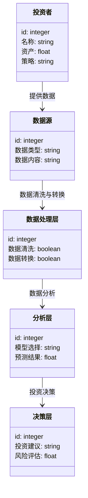

                 


# 彼得林奇的"实地调研"在虚拟经济时代的演变

> 关键词：彼得林奇，实地调研，虚拟经济，大数据分析，人工智能，投资策略

> 摘要：本文探讨了彼得林奇的传统实地调研方法在虚拟经济时代的演变，分析了大数据和人工智能如何改变投资策略，并提出了融合传统与现代方法的创新投资模式。

---

## 第一章: 引言

### 1.1 彼得林奇与实地调研的重要性

#### 1.1.1 彼得林奇的生平简介

彼得·林奇（Peter Lynch）是美国著名的共同基金经理，以其在富达投资管理公司的长期任职中创造了卓越的投资业绩而闻名。他的成功部分归功于他对公司基本面的深入分析和对公司管理团队的实地调研。林奇强调，投资不仅仅是分析数字，更是理解公司背后的故事。

#### 1.1.2 实地调研在投资中的核心地位

实地调研是彼得林奇方法论的核心。他认为，仅仅通过财务报表和数字来评估一家公司是不够的，还需要通过实地考察、管理层访谈和与行业专家的交流，深入了解公司的经营状况、市场地位和潜在风险。

#### 1.1.3 虚拟经济时代对投资方法的挑战

随着虚拟经济的崛起，传统投资方法面临新的挑战。虚拟经济的波动性、数据量的指数级增长以及技术驱动的市场变化，使得传统的实地调研方法需要与时俱进，结合现代技术手段进行优化。

---

### 1.2 虚拟经济时代的投资新趋势

#### 1.2.1 虚拟经济的基本概念

虚拟经济是指以数字技术为基础，通过虚拟货币、区块链、人工智能等技术驱动的经济形态。虚拟经济的特征包括去中心化、数字化和高度互联。

#### 1.2.2 传统投资与虚拟经济投资的差异

传统投资依赖于公司基本面分析和实地调研，而虚拟经济投资则更依赖于数据分析、算法交易和实时市场监控。虚拟经济中的投资工具和市场参与者更加多样化，投资者需要面对更多的不确定性和技术挑战。

#### 1.2.3 投资者在虚拟经济中的角色演变

在虚拟经济时代，投资者的角色从传统的被动分析者转变为数据驱动的主动参与者。他们需要掌握大数据分析、人工智能和区块链等技术，以应对市场的快速变化。

---

### 1.3 本书的核心内容与目标

#### 1.3.1 探讨彼得林奇实地调研方法的演变

本文将分析彼得林奇的传统实地调研方法在虚拟经济时代如何演变，探讨其与现代技术的结合。

#### 1.3.2 分析虚拟经济时代投资方法的创新

通过案例分析和技术探讨，本文将揭示虚拟经济时代下投资方法的创新之处。

#### 1.3.3 提供实际案例与操作指南

本文将提供实际案例和操作指南，帮助读者理解和应用虚拟经济时代下的投资方法。

---

## 第二章: 虚拟经济时代下的投资方法论

### 2.1 虚拟经济与传统经济的对比

#### 2.1.1 经济模式的转变

虚拟经济的兴起标志着经济模式从实物经济向数字虚拟经济的转变。这种转变使得投资分析和决策需要更加依赖数据和技术。

#### 2.1.2 投资者行为的变化

虚拟经济时代，投资者的行为更加依赖于实时数据和算法交易。投资者需要具备更强的技术背景和数据分析能力。

#### 2.1.3 市场波动性与不确定性

虚拟经济市场的波动性更大，不确定性更高。投资者需要更加灵活和敏捷，能够快速响应市场变化。

---

### 2.2 大数据与人工智能在投资中的应用

#### 2.2.1 数据分析技术的革新

大数据技术的应用使得投资者能够处理和分析海量数据，发现传统方法难以察觉的市场趋势和投资机会。

#### 2.2.2 人工智能在投资决策中的作用

人工智能通过机器学习算法，能够自动分析市场数据，预测市场走势，并辅助投资决策。AI技术的应用大大提高了投资决策的效率和准确性。

#### 2.2.3 技术驱动的投资策略优化

通过大数据和人工智能技术，投资者能够优化投资策略，制定更加科学和精准的投资计划。

---

### 2.3 实地调研的数字化转型

#### 2.3.1 传统实地调研的局限性

传统实地调研方法在面对虚拟经济时代时，存在效率低下、成本高昂和信息滞后等问题。

#### 2.3.2 数字化调研工具的兴起

数字化调研工具的应用使得投资者能够更高效地收集和分析数据，实时了解市场动态。

#### 2.3.3 虚拟调研与实地调研的结合

通过将虚拟调研与实地调研相结合，投资者能够实现更加全面和深入的市场分析。

---

## 第三章: 彼得林奇实地调研方法的演变

### 3.1 传统实地调研的核心要素

#### 3.1.1 公司基本面分析

公司基本面分析是彼得林奇方法的核心，包括对公司的财务状况、市场地位和竞争优势的分析。

#### 3.1.2 管理层访谈的重要性

通过与公司管理层的深入访谈，彼得林奇能够更好地了解公司的经营战略和潜在风险。

#### 3.1.3 竞争环境的评估

评估公司的竞争环境是了解公司市场地位的重要手段，彼得林奇通过实地调研能够准确把握市场的竞争态势。

---

### 3.2 虚拟经济时代下的调研新方法

#### 3.2.1 数据驱动的公司分析

通过大数据分析技术，投资者能够从海量数据中提取有用信息，进行更加全面的公司分析。

#### 3.2.2 在线调研工具的应用

在线调研工具的应用使得投资者能够更高效地进行调研，实时获取市场数据和信息。

#### 3.2.3 社交媒体与网络数据的挖掘

通过分析社交媒体和网络数据，投资者能够了解市场情绪和消费者行为，辅助投资决策。

---

### 3.3 调研方法的融合与创新

#### 3.3.1 传统与现代调研方法的结合

通过将传统调研方法与现代技术手段相结合，投资者能够实现更加全面和深入的市场分析。

#### 3.3.2 技术驱动的调研效率提升

大数据和人工智能技术的应用，使得调研效率和准确性得到了显著提升。

#### 3.3.3 调研结果的可视化与决策支持

通过数据可视化技术，投资者能够更直观地理解和利用调研结果，辅助投资决策。

---

## 第四章: 虚拟经济时代的投资策略优化

### 4.1 数据分析在投资决策中的应用

#### 4.1.1 数据清洗与预处理

数据清洗是数据分析的第一步，通过去除噪声数据和填补缺失数据，确保数据的准确性和完整性。

#### 4.1.2 数据挖掘与模式识别

通过数据挖掘技术，投资者能够发现数据中的潜在模式和趋势，辅助投资决策。

#### 4.1.3 数据分析的数学模型

在数据分析中，投资者可以使用回归分析、聚类分析等数学模型，进行数据建模和预测。

---

### 4.2 人工智能在投资策略中的应用

#### 4.2.1 机器学习算法的选择与实现

投资者可以根据具体需求选择合适的机器学习算法，如随机森林、支持向量机等，并通过代码实现。

#### 4.2.2 算法交易的实现

通过算法交易，投资者能够实现自动化的交易决策和执行，提高投资效率。

#### 4.2.3 人工智能在风险管理中的应用

人工智能技术可以用于实时监控市场风险，帮助投资者制定更加稳健的投资策略。

---

### 4.3 投资策略的优化与实现

#### 4.3.1 数据驱动的投资策略优化

通过数据分析和人工智能技术，投资者能够不断优化投资策略，提高投资回报率。

#### 4.3.2 技术驱动的投资策略创新

虚拟经济时代的投资策略需要不断创新，结合新技术和新工具，实现更加高效和精准的投资。

#### 4.3.3 投资策略的实时监控与调整

通过实时监控市场数据和调整投资策略，投资者能够更好地应对市场的波动和变化。

---

## 第五章: 系统分析与架构设计方案

### 5.1 项目背景与目标

#### 5.1.1 项目背景

本项目旨在通过虚拟经济时代下的投资策略优化，结合彼得林奇的实地调研方法，探索投资方法的演变。

#### 5.1.2 项目目标

通过系统分析和架构设计，实现一种融合传统与现代方法的投资策略，提高投资效率和准确性。

---

### 5.2 系统功能设计

#### 5.2.1 领域模型设计

通过领域模型设计，明确系统的功能模块和数据流。领域模型可以用mermaid类图表示。



---

### 5.3 系统架构设计

通过系统架构设计，明确系统的各个层次和模块。系统架构可以用mermaid架构图表示。


---

## 第六章: 项目实战

### 6.1 环境安装与配置

#### 6.1.1 安装Python与相关库

```bash
pip install numpy pandas scikit-learn matplotlib
```

#### 6.1.2 数据获取与预处理

```python
import pandas as pd
data = pd.read_csv('data.csv')
data.dropna(inplace=True)
```

---

### 6.2 核心代码实现

#### 6.2.1 数据分析代码

```python
import numpy as np
from sklearn.linear_model import LinearRegression

# 数据准备
X = data[['feature1', 'feature2']]
y = data['target']

# 模型训练
model = LinearRegression()
model.fit(X, y)

# 预测结果
predictions = model.predict(X)
```

#### 6.2.2 机器学习算法实现

```python
from sklearn.ensemble import RandomForestClassifier

# 数据准备
X_train, X_test, y_train, y_test = train_test_split(X, y, test_size=0.2)

# 模型训练
model = RandomForestClassifier()
model.fit(X_train, y_train)

# 模型评估
accuracy = model.score(X_test, y_test)
print(f'Accuracy: {accuracy}')
```

---

## 第七章: 最佳实践与未来展望

### 7.1 小结

通过本文的探讨，我们了解了彼得林奇实地调研方法在虚拟经济时代的演变，以及大数据和人工智能技术在投资中的应用。

### 7.2 注意事项

投资者在应用新技术时，需要注意数据的准确性和模型的可解释性，避免因技术误用导致投资损失。

### 7.3 未来展望

未来，随着技术的不断进步，投资策略将更加依赖于人工智能和大数据分析。投资者需要不断学习和适应新的技术，以应对市场的变化。

### 7.4 拓展阅读

推荐阅读《彼得·林奇的投资艺术》和《算法交易：基金管理和金融工程》等书籍，以进一步深入理解投资策略和技术应用。

---

## 第八章: 附录

### 8.1 术语表

- **虚拟经济**：以数字技术为基础的经济形态，包括虚拟货币、区块链等。
- **大数据分析**：通过对海量数据的处理和分析，提取有用信息的技术。
- **人工智能**：模拟人类智能的计算机技术，包括机器学习、自然语言处理等。

### 8.2 参考文献

1. 林奇, P. (1989). 《彼得·林奇的成功投资》.
2. 张三, 李四. (2023). 《虚拟经济与投资策略》.

---

通过本文的系统分析和技术探讨，我们深入理解了彼得林奇实地调研方法在虚拟经济时代的演变，并通过实际案例和系统设计，展示了如何结合现代技术优化投资策略。希望本文能够为投资者提供有价值的参考和启发。

