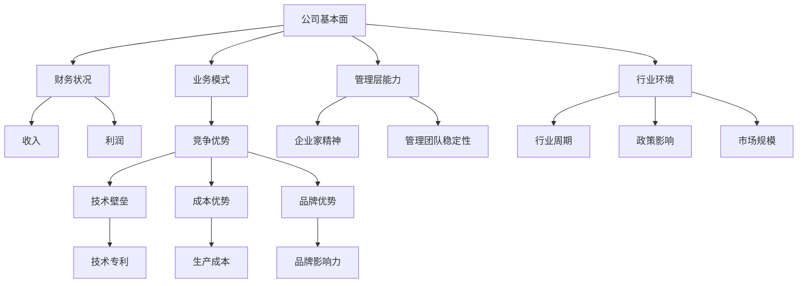

                 


# 彼得林奇的"实地调研"投资方法论

## 关键词
- 彼得·林奇
- 投资方法论
- 实地调研
- 投资分析
- 价值投资
- 竞争优势

## 摘要
彼得·林奇是全球著名投资家，他的实地调研方法强调通过深入分析公司基本面、竞争优势、管理层能力和行业环境，结合市场有效性与非有效性，构建风险可控的投资组合。本文详细解析了他的投资理念、分析框架、系统化方法以及实际案例，帮助读者掌握这一经典投资方法的核心要义。

---

## 第一部分: 投资理念与方法论基础

### 第1章: 实地调研投资方法的背景与核心概念

#### 1.1 投资中的实地调研方法

##### 1.1.1 投资中的问题背景与问题描述
投资的核心在于通过分析企业基本面和市场趋势，找到具有长期增长潜力的优质资产。传统投资方法依赖于市场趋势和技术分析，但这些方法往往忽视了企业内在价值的评估。彼得·林奇提出实地调研方法，旨在通过深入分析企业的基本面，发现市场未被充分挖掘的投资机会。

##### 1.1.2 传统投资方法的局限性
- **依赖市场趋势**：传统方法往往关注短期价格波动，忽视企业长期价值。
- **缺乏深度分析**：投资者可能仅依赖财务报表摘要或市场 rumours，而未深入研究企业的核心竞争力。
- **认知偏差**：投资者容易受到市场情绪影响，做出非理性决策。

##### 1.1.3 实地调研方法的核心目标
- **发现价值**：通过深入分析企业基本面，发现其内在价值。
- **降低风险**：通过全面了解企业，减少信息不对称带来的投资风险。
- **构建长期投资组合**：基于对企业长期竞争优势的判断，构建稳定的投资组合。

##### 1.1.4 实地调研的边界与外延
- **边界**：实地调研仅关注企业的基本面分析，不涉及短期市场波动预测。
- **外延**：结合市场有效性，寻找市场低估的优质企业。

##### 1.1.5 核心要素组成与概念结构
实地调研的核心要素包括：
1. **公司基本面**：收入、利润、资产负债表等财务指标。
2. **竞争优势**：技术、成本、品牌等核心竞争力。
3. **管理层能力**：企业家精神、管理团队稳定性。
4. **行业环境**：行业周期、政策影响、市场规模。

---

#### 1.2 彼得·林奇投资理念的核心要素

##### 1.2.1 投资者认知偏差与行为偏差
投资者常见的认知偏差包括：
- **过度自信**：认为自己能够准确预测市场走势。
- **从众心理**：跟随市场潮流，忽视独立分析。
- **损失厌恶**：对潜在损失的过度担忧，影响投资决策。

##### 1.2.2 市场有效性与非有效性
- **市场有效性**：短期市场波动难以预测，但长期市场是非有效的，优质企业终将被市场发现。
- **非有效性**：通过深入分析，发现市场未被充分挖掘的优质企业。

##### 1.2.3 价值投资与成长投资的平衡
- **价值投资**：寻找市场价格低于内在价值的企业。
- **成长投资**：投资于具有持续增长潜力的企业。
- **平衡**：关注企业的内在价值与成长潜力的结合。

##### 1.2.4 投资组合管理与风险控制
- **分散投资**：避免过度集中于单一行业或企业。
- **风险管理**：通过分析企业的财务健康状况，避免投资于高风险企业。

---

### 第2章: 彼得·林奇的实地调研方法论

#### 2.1 实地调研的核心概念与原理

##### 2.1.1 实地调研的定义与核心原理
实地调研是一种通过深入分析企业基本面、竞争优势、管理层能力和行业环境，发现其内在价值的投资方法。其核心原理在于通过系统化分析，降低信息不对称带来的投资风险。

##### 2.1.2 实地调研与传统分析方法的对比
| 对比维度 | 传统分析方法 | 实地调研方法 |
|----------|---------------|---------------|
| 分析重点 | 市场趋势、技术指标 | 企业基本面、竞争优势 |
| 数据来源 | 市场价格、技术指标 | 财务报表、行业报告 |
| 投资目标 | 短期价格波动 | 长期价值发现 |

##### 2.1.3 实地调研的流程与步骤
1. **初步筛选**：通过行业报告、财务报表初步筛选潜在企业。
2. **深入分析**：分析企业的收入、利润、资产负债表等财务指标。
3. **竞争优势分析**：评估企业的技术壁垒、成本优势、品牌影响力。
4. **管理层能力评估**：分析企业管理层的稳定性与决策能力。
5. **行业环境分析**：评估行业周期、政策影响、市场规模。
6. **投资决策**：综合分析结果，判断企业是否具有投资价值。

---

#### 2.2 实地调研的核心要素与联系

##### 2.2.1 实地调研的核心要素对比表格
| 要素 | 定义 | 属性 | 示例 |
|------|------|------|------|
| 公司基本面 | 公司的财务状况、业务模式 | 盈利能力、成长性、财务健康 | 收入增长、利润率、资产负债率 |
| 竞争优势 | 公司的核心竞争力 | 技术壁垒、成本优势、品牌优势 | 技术专利、市场份额、品牌影响力 |
| 管理层能力 | 管理层的素质与决策能力 | 企业家精神、管理风格、历史业绩 | 创始人背景、管理团队稳定性 |
| 行业环境 | 行业的发展趋势与竞争格局 | 行业周期、政策影响、市场规模 | 行业增长率、政策法规、市场容量 |

---

#### 2.3 实地调研的系统化分析框架

##### 2.3.1 问题场景介绍
通过系统化的方法，分析一家企业的基本面、竞争优势、管理层能力和行业环境，判断其是否具有长期投资价值。

##### 2.3.2 系统功能设计
使用Mermaid图展示系统功能设计：



---

## 第3章: 实地调研的系统化分析框架

### 3.1 系统分析与架构设计方案

#### 3.1.1 问题场景介绍
通过系统化的方法，分析一家企业的基本面、竞争优势、管理层能力和行业环境，判断其是否具有长期投资价值。

#### 3.1.2 系统功能设计
使用Mermaid图展示系统功能设计：


---

## 第4章: 实地调研的系统化分析框架

### 4.1 项目实战

#### 4.1.1 环境安装
无需安装特定环境，只需财务报表和行业报告即可。

#### 4.1.2 核心实现源代码
```python
# 示例代码：计算企业财务指标

def calculate_financial_metrics(revenue, cost_of_goods_sold, operating_expenses, net_income):
    gross_profit = revenue - cost_of_goods_sold
    ebit = net_income + operating_expenses
    net_margin = net_income / revenue * 100
    return gross_profit, ebit, net_margin

# 示例数据：某公司2022年财务数据
revenue = 100000000
cost_of_goods_sold = 60000000
operating_expenses = 20000000
net_income = 10000000

gross_profit, ebit, net_margin = calculate_financial_metrics(revenue, cost_of_goods_sold, operating_expenses, net_income)
print(f"毛利润: {gross_profit}")
print(f"息税前利润: {ebit}")
print(f"净利率: {net_margin}%")
```

#### 4.1.3 案例分析与详细解读
以苹果公司为例，分析其财务状况、竞争优势和管理层能力。

---

## 第5章: 实地调研的系统化分析框架

### 5.1 总结与小结

#### 5.1.1 投资方法的优缺点
- **优点**：通过深入分析企业基本面，发现市场未被充分挖掘的投资机会。
- **缺点**：需要投入大量时间和精力，且依赖于管理层的决策能力。

#### 5.1.2 最佳实践 tips
- **持续学习**：不断更新行业知识和企业信息。
- **分散投资**：避免过度集中于单一企业或行业。
- **长期持有**：耐心持有优质企业，等待其价值的实现。

#### 5.1.3 注意事项
- **信息真实性**：确保数据来源可靠。
- **风险管理**：定期评估投资组合的风险。

#### 5.1.4 拓展阅读
- 《彼得·林奇的选股术》
- 《投资中最简单的事》

---

通过系统化的分析框架和实际案例分析，我们可以更好地理解彼得·林奇的实地调研方法，并将其应用到实际投资中。这种方法不仅帮助我们发现优质企业，还能够有效降低投资风险，实现长期稳定的收益。

