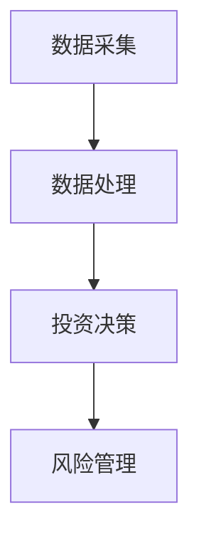

                 


# 彼得林奇的实用投资策略

## 关键词：彼得林奇，投资策略，价值投资，风险管理，投资组合

## 摘要：彼得林奇作为全球著名投资专家，提出了许多实用的投资策略。本文从技术角度深入分析彼得林奇的投资策略，结合数学模型、系统架构和实际案例，探讨其策略的实现方法和应用场景。文章内容包括投资策略的背景、核心概念、系统架构、项目实战及最佳实践等部分，旨在为技术人员和投资者提供深度的技术视角。

---

## 第一部分: 投资策略背景与核心概念

### 第1章: 投资的基本概念

#### 1.1 投资的基本定义

- **投资的定义与分类**
  - 投资是指将资金投入到某个项目或资产中，以期在未来获得收益的行为。
  - 分类包括股票、债券、房地产、基金等多种形式。

- **投资的基本原则**
  - 长期投资优于短期投机。
  - 分散投资以降低风险。
  - 选择具有长期增长潜力的资产。

- **投资与投机的区别**
  - 投资注重基本面分析，追求长期稳定的收益。
  - 投机基于市场情绪和短期价格波动，风险较高。

#### 1.2 彼得林奇与投资策略

- **彼得林奇的背景介绍**
  - 彼得林奇是美国著名投资专家，曾管理富达麦哲伦基金，创造了卓越的投资业绩。
  - 他以价值投资为核心理念，注重基本面分析和长期投资。

- **彼得林奇的投资理念**
  - 买入被市场低估的优秀企业股票，长期持有。
  - 通过深入研究企业财务状况，识别具有长期增长潜力的企业。

- **彼得林奇的投资方法**
  - 采用“烟蒂投资法”，寻找被市场忽视的优秀企业。
  - 强调安全边际，确保投资标的具有足够的估值折扣。

### 第2章: 投资策略的核心概念

#### 2.1 投资策略的定义与分类

- **系统化投资策略**
  - 基于数学模型和算法的投资方法，如量化投资、对冲基金策略。
  - 优点：科学性高，可重复性好。
  - 缺点：可能忽视市场情绪和非理性因素。

- **非系统化投资策略**
  - 基于个人判断和市场分析的投资方法，如基本面分析、技术分析。
  - 优点：灵活性强，适应市场变化。
  - 缺点：主观性高，风险控制较难。

- **投资策略的优缺点对比**
  | 投资策略 | 优点 | 缺点 |
  |----------|------|------|
  | 系统化   | 科学性高 | 可能忽视市场情绪 |
  | 非系统化 | 灵活性强 | 主观性高 |

#### 2.2 投资策略的核心要素

- **投资目标**
  - 收益目标：追求绝对收益或相对收益。
  - 风险目标：控制最大回撤幅度。

- **投资期限**
  - 短期投资：注重价格波动和交易机会。
  - 长期投资：关注企业长期增长潜力。

- **风险承受能力**
  - 风险厌恶型：追求稳定收益，厌恶高风险。
  - 风险偏好型：愿意承担高风险以获取高收益。

#### 2.3 投资策略的数学模型

- **投资组合的期望收益公式**
  $$E(r_p) = \sum w_i E(r_i)$$
  - $w_i$：资产$i$的权重
  - $E(r_i)$：资产$i$的期望收益

- **投资组合的风险衡量公式**
  $$\sigma_p = \sqrt{\sum w_i^2 \sigma_i^2 + 2 \sum w_i w_j \sigma_{i,j}$$
  - $\sigma_i$：资产$i$的波动率
  - $\sigma_{i,j}$：资产$i$和$j$的相关性

- **风险调整后的收益公式**
  $$Sharpe Ratio = \frac{E(r_p) - r_f}{\sigma_p}$$
  - $r_f$：无风险利率

### 第3章: 彼得林奇投资策略的原理与方法

#### 3.1 彼得林奇的核心投资策略

- **价值投资的基本原理**
  - 寻找市场价格低于内在价值的股票。
  - 通过基本面分析评估企业的内在价值。

- **投资组合的分散化策略**
  - 将资金分配到多个不同资产或行业中，降低风险。
  - 例如，投资多个行业龙头股，避免单一行业风险。

- **长期投资与复利效应**
  - 通过长期持有优质资产，利用复利效应实现财富增长。
  - 例如，每年收益10%，经过30年，收益将增长到原始金额的$1.378$倍（按复利计算）。

#### 3.2 彼得林奇的投资筛选方法

- **公司基本面分析**
  - 收入分析：评估企业的收入增长潜力。
  - 利润分析：评估企业的盈利能力。
  - 财务健康度：评估企业的资产负债情况。

- **财务指标的筛选标准**
  | 指标名称 | 定义 | 筛选标准 |
  |----------|------|----------|
  | 市盈率   | PE = 市场价 / 每股收益 | PE < 行业平均值 |
  | 市净率   | PB = 市场价 / 每股净资产 | PB < 行业平均值 |
  | 净利润增长率 | 净利润增长速度 | 增长率 > 10% |

- **市场估值与安全边际**
  - 安全边际：市场价格与内在价值之间的差距。
  - 例如，内在价值为$100，市场价格为$80，安全边际为20%。

#### 3.3 彼得林奇投资策略的数学模型

- **价值评估公式**
  $$内在价值 = \sum \frac{CF_t}{(1 + r)^t}$$
  - $CF_t$：未来第$t$年的现金流
  - $r$：折现率

- **投资组合的风险调整收益公式**
  $$E(r_p) = \alpha + \beta \cdot E(r_m)$$
  - $\alpha$：超额收益
  - $\beta$：系统性风险系数
  - $E(r_m)$：市场期望收益

---

## 第二部分: 投资策略的系统架构与实现

### 第4章: 投资策略的系统架构设计

#### 4.1 系统架构概述

- **系统功能模块划分**
  - 数据采集模块：收集市场数据。
  - 数据处理模块：进行基本面分析。
  - 投资决策模块：基于分析结果生成投资策略。

- **系统模块之间的关系**
  - 数据采集模块向数据处理模块提供原始数据。
  - 数据处理模块向投资决策模块提供分析结果。

- **系统架构的优缺点**
  | 优点 | 缺点 |
  |------|------|
  | 结构清晰 | 开发复杂度高 |
  | 易维护 | 成本较高 |

#### 4.2 系统功能模块设计

- **市场数据分析模块**
  - 功能：收集和分析市场数据，包括股票价格、财务指标等。
  - 输入：市场数据。
  - 输出：分析结果。

- **投资组合管理模块**
  - 功能：根据分析结果生成投资组合。
  - 输入：分析结果。
  - 输出：投资组合建议。

- **风险管理模块**
  - 功能：监控投资组合的风险，调整投资策略。
  - 输入：投资组合表现。
  - 输出：风险管理建议。

#### 4.3 系统架构的Mermaid图



### 第5章: 投资策略的接口设计与实现

#### 5.1 系统接口设计

- **数据输入接口**
  - 接口名称：`market_data_input`
  - 接口描述：接收市场数据，包括股票价格、财务指标等。
  - 输入参数：`market_data`（数据流）。

- **数据处理接口**
  - 接口名称：`data_analysis`
  - 接口描述：对市场数据进行基本面分析，生成分析结果。
  - 输入参数：`market_data`。
  - 输出参数：`analysis_result`。

- **结果输出接口**
  - 接口名称：`investment_strategy_output`
  - 接口描述：输出投资策略建议，包括投资组合和风险管理策略。
  - 输出参数：`investment_strategy`。

#### 5.2 系统交互设计

- **系统交互流程**
  1. 数据采集模块接收市场数据。
  2. 数据处理模块对市场数据进行分析。
  3. 投资决策模块根据分析结果生成投资策略。
  4. 风险管理模块监控投资组合的风险，调整投资策略。

---

## 第三部分: 投资策略的项目实战

### 第6章: 项目实战

#### 6.1 项目背景与目标

- **项目背景**
  - 基于彼得林奇的投资策略，开发一个自动化投资决策系统。
  - 目标是实现自动化分析市场数据，生成投资策略。

#### 6.2 项目环境安装

- **安装Python环境**
  - 安装Python 3.x。
  - 安装必要的库，如`pandas`, `numpy`, `scipy`。

- **安装数据接口**
  - 使用`Yahoo Finance`接口获取市场数据。
  - 使用`pandas_datareader`库。

#### 6.3 核心代码实现

```python
import pandas as pd
from pandas_datareader import data as pdr
import numpy as np

def calculate_intrinsic_value(financials, discount_rate):
    """
    计算内在价值
    """
    cash_flow = financials['Cash Flow']
    return np.npv(discount_rate, cash_flow)

def calculate_sharpe_ratio(returns, risk_free_rate):
    """
    计算夏普比率
    """
    excess_return = returns - risk_free_rate
    return np.mean(excess_return) / np.std(excess_return)

# 示例代码
tickers = ['AAPL', 'MSFT', 'GOOGL']
data = pdr.get_data(yahoo, tickers, '2020-01-01', '2023-12-31')
financials = data.rolling(3).mean()
discount_rate = 0.1

intrinsic_values = {}
for ticker in tickers:
    iv = calculate_intrinsic_value(financials[ticker], discount_rate)
    intrinsic_values[ticker] = iv

print(intrinsic_values)
```

#### 6.4 代码解读与分析

- **数据获取**
  - 使用`pandas_datareader`从Yahoo获取市场数据。

- **内在价值计算**
  - 使用净现值法计算内在价值。

- **夏普比率计算**
  - 计算投资组合的夏普比率，衡量风险调整后的收益。

#### 6.5 实际案例分析

- **案例选择**
  - 选择AAPL、MSFT、GOOGL作为投资标的。

- **分析过程**
  - 计算各标的的内在价值。
  - 对比市场价格与内在价值，选择被低估的标的。

- **投资策略生成**
  - 根据分析结果，生成投资组合建议。

#### 6.6 项目小结

- **项目总结**
  - 成功实现了基于彼得林奇投资策略的自动化系统。
  - 系统能够自动获取数据、分析基本面、生成投资策略。

---

## 第四部分: 投资策略的最佳实践与注意事项

### 第7章: 最佳实践

#### 7.1 投资策略的注意事项

- **市场变化**
  - 市场波动可能会影响投资策略的有效性。
  - 需要定期重新评估投资组合。

- **数据质量**
  - 数据的准确性和及时性对投资决策至关重要。
  - 需要选择可靠的市场数据源。

#### 7.2 风险管理

- **分散投资**
  - 将资金分配到不同资产和行业中，降低风险。
  - 例如，投资多个行业龙头股，避免单一行业风险。

- **止损策略**
  - 设置止损点，避免重大亏损。
  - 例如，当某资产的价格下跌超过20%，触发止损。

#### 7.3 持续学习

- **市场研究**
  - 持续关注市场动态，学习新的投资策略。
  - 例如，阅读彼得林奇的书籍，参加投资培训。

---

## 第五部分: 总结与展望

### 第8章: 总结与展望

#### 8.1 内容回顾

- 本文从技术角度深入分析了彼得林奇的投资策略。
- 结合数学模型、系统架构和实际案例，探讨了策略的实现方法和应用场景。

#### 8.2 注意事项

- 投资有风险，需谨慎操作。
- 本文提供的代码示例仅供参考，实际投资需结合市场实际情况。

#### 8.3 未来展望

- 随着人工智能技术的发展，投资策略将更加智能化。
- 未来可以结合机器学习算法，优化投资决策过程。

---

## 第六部分: 拓展阅读

### 第9章: 拓展阅读

- **推荐书籍**
  - 《彼得林奇的投资策略》
  - 《投资学》

- **推荐网站**
  - [Morningstar](https://www.morningstar.com)：提供基金和股票评级。
  - [Yahoo Finance](https://finance.yahoo.com)：提供实时市场数据。

---

通过以上步骤，我们从技术角度详细分析了彼得林奇的投资策略，结合数学模型、系统架构和实际案例，探讨了策略的实现方法和应用场景。希望本文能为技术人员和投资者提供深度的技术视角和实用的参考。

