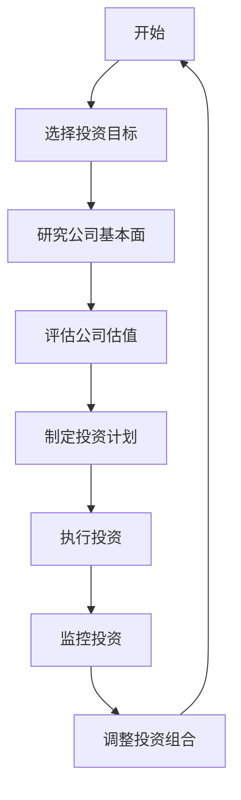
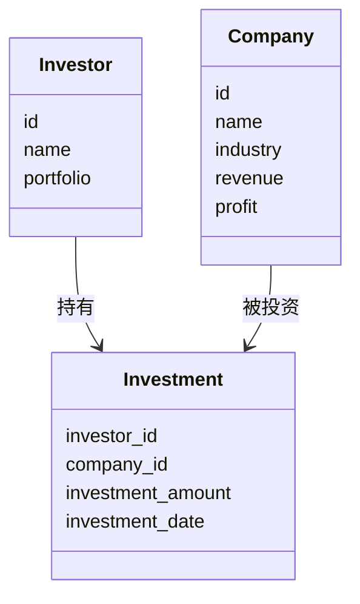

                 


# 彼得林奇的"家庭作业"投资法

> 关键词：彼得林奇，家庭作业投资法，投资策略，风险管理，系统化投资

> 摘要：本文深入探讨了彼得林奇的“家庭作业”投资法，从其背景、核心概念、算法原理、系统架构到实际案例分析，全面解析了这一投资方法的精髓。通过系统化的方法和详细的分析，本文为投资者提供了从理论到实践的完整指导。

---

## 第一部分：彼得林奇“家庭作业”投资法的背景与基础

### 第1章：家庭作业投资法的概述

#### 1.1 投资法的背景与意义

##### 1.1.1 投资领域的传统方法与挑战
在传统投资方法中，投资者往往依赖市场情绪、短期波动或复杂的金融模型进行决策。这种方法常常导致投资失误，尤其是在市场剧烈波动时。传统方法的不足在于其缺乏系统性、可重复性和可验证性，导致投资者难以长期稳定地获得超额收益。

##### 1.1.2 家庭作业投资法的提出与目标
彼得林奇提出的“家庭作业投资法”是一种系统化、可重复的投资方法，旨在通过深入研究和分析，找到具有长期增长潜力的公司，并长期持有。这种方法强调投资的纪律性和系统性，避免情绪化决策。

##### 1.1.3 家庭作业投资法的核心要素与边界
家庭作业投资法的核心要素包括：
- **系统化研究**：通过深入分析公司的基本面，寻找具有长期增长潜力的企业。
- **长期持有**：避免频繁交易，减少交易成本和税收负担。
- **纪律性**：严格按照研究和分析结果进行投资，避免情绪干扰。

其边界包括：
- 不投资于自己无法理解的行业或公司。
- 不进行短期投机，避免因市场波动而亏损。

#### 1.2 家庭作业投资法的核心概念

##### 1.2.1 投资法的核心概念与定义
家庭作业投资法的核心概念包括：
- **长期增长**：寻找具有持续增长潜力的公司。
- **基本面分析**：通过财务报表、行业地位等因素评估公司的价值。
- **分散投资**：通过投资于多个优质公司分散风险。

##### 1.2.2 核心概念的属性特征对比
以下是核心概念的属性特征对比表：

| 核心概念       | 属性特征               |
|----------------|------------------------|
| 长期增长       | 时间跨度长，注重公司未来发展潜力 |
| 基本面分析     | 依赖财务数据，行业地位，管理层能力 |
| 分散投资       | 投资于多个公司，降低单一投资风险 |

##### 1.2.3 实体关系图（ER图）分析

```mermaid
erDiagram
    company {
        key id : integer
        name : string
        industry : string
        revenue : float
        profit : float
        management : string
    }
    investor {
        id : integer
        name : string
        portfolio : string
    }
    investment_relationship {
        investor_id : integer
        company_id : integer
        investment_amount : float
        investment_date : date
    }
    company --> investment_relationship : 持有
    investor --> investment_relationship : 投资
```

---

### 第2章：彼得林奇投资理念的深度解析

#### 2.1 彼得林奇的投资哲学

##### 2.1.1 长期投资与价值投资的核心理念
彼得林奇强调长期投资和价值投资。他认为，市场的短期波动并不影响公司的长期价值，投资者应关注公司的基本面，寻找被市场低估的公司。

##### 2.1.2 彼得林奇的成功投资案例分析
以可口可乐为例，彼得林奇通过对其商业模式、财务状况和管理层能力的深入分析，发现其具有长期增长潜力，并长期持有，最终获得了丰厚的回报。

##### 2.1.3 彼得林奇的投资策略与风险管理
彼得林奇的投资策略包括：
- **分散投资**：通过投资于多个公司分散风险。
- **长期持有**：避免频繁交易，减少交易成本。
- **持续学习**：不断学习和更新对公司和行业的理解。

---

## 第二部分：家庭作业投资法的核心策略与方法

### 第3章：家庭作业投资法的核心策略

#### 3.1 投资策略的制定与实施

##### 3.1.1 投资目标的设定与分解
设定明确的投资目标，例如年化收益10%以上，并将其分解为可执行的步骤。

##### 3.1.2 投资策略的制定原则
- **长期性**：关注公司长期增长潜力。
- **纪律性**：严格按照研究结果进行投资。
- **分散性**：投资于多个行业和公司。

##### 3.1.3 策略实施的步骤与方法
1. **研究公司基本面**：分析公司的财务报表、行业地位、管理层能力。
2. **评估公司估值**：通过市盈率、市净率等指标评估公司是否被低估。
3. **制定投资计划**：根据研究结果制定投资计划，包括投资金额和时间。

#### 3.2 家庭作业投资法的数学模型与公式

##### 3.2.1 投资回报率的计算公式
$$ ROI = \frac{\text{投资收益}}{\text{初始投资}} \times 100\% $$

##### 3.2.2 风险评估的数学模型
$$ \text{风险} = \text{波动率} \times \text{市场相关性} $$

##### 3.2.3 投资组合优化的数学公式
$$ \text{投资组合收益} = \sum_{i=1}^{n} w_i \times r_i $$

其中：
- \( w_i \) 是第 \( i \) 个资产的权重。
- \( r_i \) 是第 \( i \) 个资产的预期收益。

---

### 第4章：家庭作业投资法的算法原理

#### 4.1 投资决策算法的流程图



#### 4.2 投资组合优化的数学模型

##### 4.2.1 投资组合优化的数学公式
$$ \text{Minimize } \sum_{i=1}^{n} w_i^2 \times \text{波动率}_i^2 $$
$$ \text{Subject to } \sum_{i=1}^{n} w_i = 1 $$

##### 4.2.2 投资组合优化的实现代码
```python
import numpy as np
import pandas as pd

def optimize_portfolio(returns):
    n = len(returns.columns)
    covariance_matrix = returns.cov()
    eigenvalues, eigenvectors = np.linalg.eigh(covariance_matrix)
    min_variance_weights = eigenvectors[:, 0] / eigenvectors[:, 0].sum()
    return min_variance_weights
```

---

## 第三部分：家庭作业投资法的风险管理与心理分析

### 第5章：风险管理与控制

#### 5.1 投资风险的识别与评估

##### 5.1.1 风险的分类与特征
- **市场风险**：市场波动带来的风险。
- **公司风险**：公司自身经营带来的风险。
- **流动性风险**：资产难以变现的风险。

##### 5.1.2 风险评估的方法与工具
- **VaR模型**：Value at Risk，衡量投资组合在给定置信水平下的最大损失。
- **压力测试**：模拟极端市场环境下的投资组合表现。

##### 5.1.3 风险控制的策略与措施
- **分散投资**：通过投资于多个公司和行业降低风险。
- **设置止损**：在投资组合中设定止损点，避免过度亏损。

#### 5.2 投资者心理与行为分析

##### 5.2.1 投资者心理偏差
- **过度自信**：投资者往往高估自己的能力。
- **从众心理**：跟随市场情绪进行投资。

##### 5.2.2 心理因素对投资决策的影响
投资者的心理偏差可能导致非理性的投资决策，例如在市场高点买入或低点卖出。

---

### 第6章：家庭作业投资法的系统架构设计

#### 6.1 系统功能设计

##### 6.1.1 领域模型（Mermaid类图）



#### 6.2 系统架构设计

##### 6.2.1 系统架构（Mermaid架构图）


---

## 第四部分：家庭作业投资法的实战与总结

### 第7章：家庭作业投资法的实战应用

#### 7.1 项目环境安装与配置

##### 7.1.1 环境安装
安装必要的Python库，例如Pandas、NumPy、Matplotlib等。

##### 7.1.2 系统核心实现源代码
```python
import pandas as pd
import numpy as np

def calculate_return(prices):
    returns = prices.pct_change().dropna()
    return returns

def calculate_risk(returns):
    variance = returns.var()
    std_deviation = returns.std()
    return variance, std_deviation
```

#### 7.2 项目核心实现与分析

##### 7.2.1 投资组合优化的代码实现
```python
import numpy as np

def optimize_portfolio(returns):
    n = len(returns.columns)
    covariance_matrix = returns.cov()
    eigenvalues, eigenvectors = np.linalg.eigh(covariance_matrix)
    min_variance_weights = eigenvectors[:, 0] / eigenvectors[:, 0].sum()
    return min_variance_weights
```

---

### 第8章：总结与展望

#### 8.1 本文总结
家庭作业投资法是一种系统化、可重复的投资方法，通过深入研究公司基本面，寻找具有长期增长潜力的公司，并长期持有，避免频繁交易和情绪化决策。

#### 8.2 未来展望
随着人工智能和大数据技术的发展，家庭作业投资法可以进一步优化，通过算法和模型的结合，提高投资决策的准确性和效率。

---

### 小结与注意事项

#### 小结
家庭作业投资法的核心在于系统化和纪律性，投资者应通过深入研究和分析，制定科学的投资策略，并严格按照策略执行。

#### 注意事项
- **避免情绪化决策**：市场波动和情绪干扰可能导致非理性决策。
- **持续学习**：市场环境不断变化，投资者需要不断学习和更新知识。
- **分散投资**：避免将所有资金投资于单一公司或行业。

---

### 最佳实践 Tips

1. **制定投资计划**：根据研究结果制定详细的投资计划，并严格按照计划执行。
2. **定期回顾与调整**：定期回顾投资组合的表现，并根据市场变化进行适当调整。
3. **保持纪律性**：避免因市场波动或情绪影响而改变投资策略。

---

### 参考文献与拓展阅读

1. 彼得林奇《彼得林奇的成功投资法则》
2. 哈里·马科维茨《投资组合选择》
3. 约翰·里德利·霍夫曼《系统化投资》

---

通过本文的详细讲解，读者可以全面了解彼得林奇的“家庭作业”投资法，并将其应用于实际投资中，实现长期稳定的收益。

